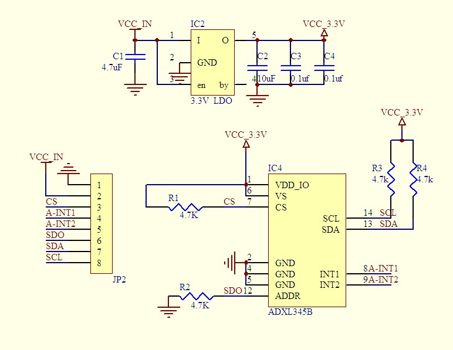
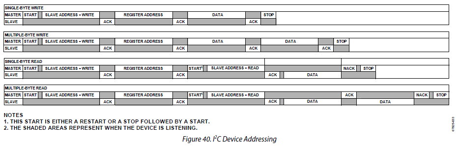

# ADXL345 Digital Accelerometer Revisited  

## References

*   ADXL345.pdf
*   GY-291-schematic.jpg

## Assignment

ADXL345 data sheet 와 GY-291 Schematic을 이미 살펴보았습니다.  앞선 실험에서는 SPI관점을 중점적으로 살펴 보았습니다.  이번에는 I2C 통신과 관련된 통신관련 정보들을 중심으로 살펴보겠습니다.

### I2C in Data sheet

*   **ADXL345.pdf 18page I2C** 을 읽고 다음의 질문에 답하세요.

    *   I2C 모드로 동작시키기 위해서는 /CS Pin을 어떻게 처리해야 하나요?

        .

    *   사용 가능한 통신 속도는 얼마인가요?

        .

    *   ALT ADDRESS Pin의 상태에 따라서 2가지 Slave Address 를 갖을 수 있습니다.

        *   ALT ADDRESS PIN 이 GND와 연결되면 Address 는?
        *   ALT ADDRESS PIN 이 VDD와 연결되면 Address 는?

    *   통신 속도가 100KHz라면 최대 변환 속도는 얼마로 설정해야 하나요?

        .

* **ADXL345.pdf 7page PIN CONFIGURATION AND FUNCTION DESCRIPTIONS**과 **GY-291-schematic**를 살펴보고 다음과 같이 XMC와 연결할 수 있습니다.  다음의 질문에 답하세요.

  

  | ADXL345   | JP2      | I2C  | XMC4500    |
  | --------- | -------- | ---- | ---------- |
  | GND       | 1 GND    | X    | GND        |
  | LDO Input | 2 VCC_IN | X    | 5V or 3.3V |
  | CS        | 3 CS     | X    |            |
  | INT1      | 4 INT1   | X    |            |
  | INT2      | 5 INT2   | X    |            |
  | ADDR      | 6 SDO    | X    |            |
  | SDA       | 7 SDA    | SDA  | P 5.2      |
  | SCL       | 8 SCL    | SCL  | P 5.0      |

  *   CS를 연결하지 않으면 어떤 일이 발생하나요?

      .

  *   SDO는 연결하지 않았습니다.  그러면 어떤 일이 발생하게 되는 것인가요?

      .

  *   SCL과 SDA는 R3과 R4를 통해서 Pull-up 되어 있습니다.  그러면 여기에 연결되는 다른 노드들은 어떻게 설정하여야 하나요?

      .

* **ADXL345.pdf 18page I2C** 의 Figure40을 보고 다음의 질문에 답하세요.

  

  *   SLAVE ADDRESS가 0x53 번지라고 가정합시다.  

  *   **[Single-Byte Write]** REGISTER ADDRESS, 0x1E 번지에 0x02 라는 DATA를 쓴다면, Master Node 에서는 다음과 같은 정보들을 전송해야 합니다.

      | SLAVE ADDR. + /W       | REG. ADD | DATA | STOP |
      | ---------------------- | -------- | ---- | ---- |
      | 0xA6 (0x53<<1 + 0x00 ) | 0x1E     | 0x02 | TRUE |

      *   Single-Byte Write 동작을 수행시키려면 I2cMasterSlave 예제코드를 어떻게 활용하면 될까요?

          . TxData[ ]

          . TxDataSize

          . MasterTxEnable

  *   [Single-Byte Read]** REGISTER ADDRESS, 0x1E 번지의 DATA를 읽어들이고자 한다면, 

      *   Master Node 에서는 다음과 같은 정보들을 전송하고

      | SLAVE ADDR. + /W       | REG. ADD | DATA | STOP  |
      | ---------------------- | -------- | ---- | ----- |
      | 0xA6 (0x53<<1 + 0x00 ) | 0x1E     | 0x02 | FALSE |

      *   그 후 Master Node 에서는 다음과 같은 정보들을 전송해야 합니다.

      | SLAVE ADDR. + R        | REG. ADD | NACK | STOP |
      | ---------------------- | -------- | ---- | ---- |
      | 0xA7 (0x53<<1 + 0x01 ) | 0x1E     | TRUE | TRUE |

      *   Single-Byte Read 동작을 수행시키려면 I2cMasterSlave 예제코드를 어떻게 활용하면 될까요?

          . TxData[ ]

          . TxDataSize

          . RxDataSize

          . MasterTransEnable

          . RxData[ ]

*   **Page 23 의 REGISTER MAP** 과 같이 여러개의 Register를 가지고 있습니다.  

    *   이 Register를 접근하여 원하는 값을 읽고 쓸 수 있습니다.  (상세한 Register의 설명은 Manual을 참고하세요.)  SPI 통신을 사용해서 해당 Register를 읽고 쓰는 예를 설명하도록 하겠습니다. 

    

    ​

    *   만약 0x00 번지를 읽으면 DEVID 값을 얻을 수 있습니다.  이를 위해서는 Single-Byte Read 동작을 수행애햐 합니다.  아래와 같이 값을 설정하고 Transfer 동작을 수행하면 RxData[0] 에 Device ID 값이 수신됨을 확인할 수 있습니다.

    | Data       | Field         | Value | Description |
    | ---------- | ------------- | ----- | ----------- |
    | TxData[0]  | REG. Addr.    | 0x00  | -           |
    | TxDataSize |               | 1     |             |
    | RxDataSize |               | 1     |             |
    | RxData[0]  | Received Data | 0xE5  | Device ID   |

      ​

    *   만약 0x1E 번지에 Data를 쓰면 X-axis offset 값을 조정할 수 있습니다.   이를 위해서 Single-Byte Write 동작을 수행해야 합니다. 

    | Data       | Field      | Value | Description |
    | ---------- | ---------- | ----- | ----------- |
    | TxData[0]  | REG. Addr. | 0x1E  | -           |
    | TxData[1]  | OFSX       | 0x02  |             |
    | RxDataSize |            | 2     |             |

      ​

    *   만약 0x1E 번지를 읽으면 조금 전에 저장한 X-axis offset 값을 얻을 수 있습니다.  

    | Data       | Field         | Value | Description |
    | ---------- | ------------- | ----- | ----------- |
    | TxData[0]  | REG. Addr.    | 0x1E  | -           |
    | TxDataSize |               | 1     |             |
    | RxDataSize |               | 1     |             |
    | RxData[0]  | Received Data | 0x02  |             |

        ​   

### Exploring Digital Accelerometer

*   ADXL345는 정말 많은 기능이 있습니다.  가장 기본적으로 2g 범위의 자료를 10bit의 분해능으로 읽어들이는 기본 기능을 중심으로 분석해 보겠습니다.
*   /src/I2C_MasterSlave.zip 파일을 import 합니다.
*   PIN Configuration을 참고하여 ADXL345 와 XMC4500을 연결합니다.
*   Page 23의 REGISTER MAP을 참고하여 다음의 명령어들을 I2C통신으로 보내고 그 의미를 분석해 봅니다.

**[STEP 0]** DEVID 읽어보기

*   다음의 정보를 넣고 Master transfer를 실행시켜 봅니다.  그리고 MasterDataRx[]의 값을 확인하고 의미를 생각해 보세요.

    | Variables       | Data |
    | --------------- | ---- |
    | MasterDataTx[0] | 0x00 |
    | TxDataSize      | 1    |
    | RxDataSize      | 1    |
    | MasterDataRx[0] | ?    |

    ​

**[STEP 1]** BW_RATE 읽어보기

*   다음의 정보를 넣고 Master transfer를 실행시켜 봅니다.  그리고 MasterDataRx[]의 값을 확인하고 의미를 생각해 보세요. (Page 14 Table 7 참고, Page 25 Register 0x2C 참고)

    | Variables       | Data |
    | --------------- | ---- |
    | MasterDataTx[0] | 0x2C |
    | TxDataSize      | 1    |
    | RxDataSize      | 1    |
    | MasterDataRx[0] | ?    |

**[STEP 2]** BW_RATE 변경해 보기

*   Output Data Rate를 200Hz로 변경하고자 합니다.  Rate Code를 어떻게 선정해야 하나요?

*   MasterDataTx[]에 다음의 정보를 넣고 Master transmit를 실행시켜 봅니다.  (Page 14 Table 7 참고, Page 25 Register 0x2C 참고)

    | Variables       | Data |
    | --------------- | ---- |
    | MasterDataTx[0] | 0x2C |
    | MasterDataTx[1] | ?    |
    | TxDataSize      | 2    |

​

**[STEP 3]** POWER_CTL  Measure 활성화 하기

*   POWER_CTL의 Measure Bit (Bit3)을 Set 하여 Stand-by mode에서 Measure mode로 전환 시킨다.(Page 25 Register 0x2D 참고)

    | Variables       | Data |
    | --------------- | ---- |
    | MasterDataTx[0] | 0x2D |
    | MasterDataTx[1] | ?    |
    | TxDataSize      | 2    |

​

**[STEP 4]** DATAX0 읽어보기

*   X-axis data 0를 읽는다.

    | Variables       | Data |
    | --------------- | ---- |
    | MasterDataTx[0] | 0x32 |
    | TxDataSize      | 1    |
    | RxDataSize      | 1    |
    | MasterDataRx[0] | ?    |

**[STEP 5]** DATAX1 읽어보기

*   X-axis data 1를 읽는다.  STEP4 에서 읽은 DATAX0와 연과지어 그 의미를 이해한다.

    | Variables       | Data |
    | --------------- | ---- |
    | MasterDataTx[0] | 0x33 |
    | TxDataSize      | 1    |
    | RxDataSize      | 1    |
    | MasterDataRx[0] | ?    |

**[STEP 6]** ADXL345의 기울기를 바꿔 가면서 STEP4, 5를 반복해 본다.

**[STEP 7]** 0x34, 0x35 번지값으로 바꿔 STEP4,5를 반복해 Y-axis data 를 측정해 본다.

**[STEP 8]** 0x36, 0x37 번지값으로 바꿔 STEP4,5를 반복해 Z-axis data 를 측정해 본다.

