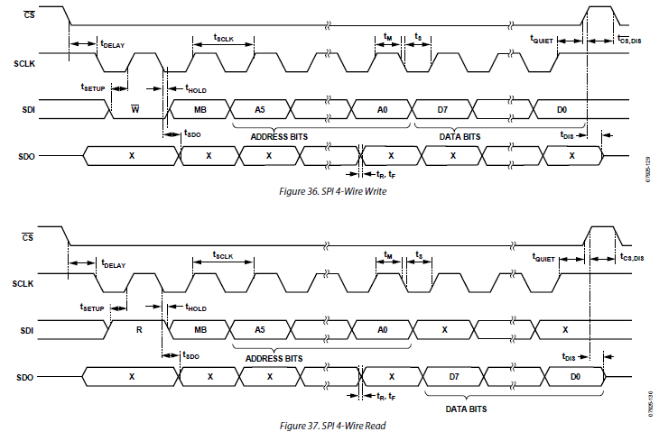

# ADXL345 Digital Accelerometer  

## References

*   ADXL345.pdf
*   GY-291-schematic.jpg

## Assignment

### Basics in Data sheet

ADXL345는 단순한 센서가 아닙니다.  MEMS(Microelectromechanical systems) 기술로 만들어진 반도체 센서와 디지털 로직이 하나의 칩으로 집약된 센서 모듈입니다.  아래의 그림과 같이 여러 기능 블럭으로 구성되어 있습니다.

*   **ADXL345.pdf 1page FEATURES와 GENERAL DESCRIPTION**을 읽고 다음의 질문에 답하세요.

    *   몇축 센서 인가요?
    *   최대 분해능은?
    *   최대 측정 가능한 가속도의 범위는?
    *   센서의 디지탈 출력은 몇 bit 인가요?
    *   이용 가능한 통신 방식은?
    *   Activity and inactivity sensing이란 어떤 기능일까요?
    *   Tap sensing 이란 어떤 기능일까요?
    *   Free-fall sensing 이란 어떤 기능일까요?
    *   32-level FIFO를 가지고 있다고 합니다.  이 기능은 왜 필요할까요?

*   **ADXL345.pdf 4page SPECIFICATIONS**를 읽고 다음의 질문에 답하세요.

    *   -2g ~ +2g 의 범위를 센싱하는 경우 OUTPUT RESOLUTION은 얼마인가요?
    *   -2g ~ +2g 의 범위를 센싱하는 경우 Sensitivity Deviation (mg/LSB) 는 얼마인가요?  이 값은 어떻게 계산된 것일까요?
    *   POWER SUPPLY 의 동작 전압은 얼마인가요?  그리고 허용 가능한 최대 전압은 얼마인가요?
    *   SUPPLY Current는 얼마인가요?  ODR(Output Data Rate)에 따라 다르게 나타나는 이유는 무엇일까요?

*   **ADXL345.pdf 7page PIN CONFIGURATION AND FUNCTION DESCRIPTIONS**과 **GY-291-schematic**를 살펴보고 다음의 빈칸을 채워서 완성해 보세요.  SPI통신 관점에서 각각은 어떤 용도인가요?  그리고 XMC4500을 Master Node로 사용하고자 한다면 각각 어떤 Pin에 할당해야 하나요?

    

    | ADXL345   | JP2      | SPI     | XMC4500    |
    | --------- | -------- | ------- | ---------- |
    | GND       | 1 GND    | X       | GND        |
    | LDO Input | 2 VCC_IN | X       | 5V or 3.3V |
    | ?         | 3 CS     | ? SPI - | ? P        |
    | ?         | 4 INT1   | X       |            |
    | ?         | 5 INT2   | X       |            |
    | ?         | 6 SDO    | ? SPI - | ? P        |
    | ?         | 7 SDA    | ? SPI - | ? P        |
    | ?         | 8 SCL    | ? SPI - | ? P        |

*   **ADXL345.pdf 13page POWER SEQUENCING** 의 두번째 문단, "After Vs is applied, ..."을 읽고 다음의 질문에 답하세요.

    *   전원이 공급되기 시작하면 디바이스는 어떤 모드로 동작하게 되는가?
    *   어떻게 하면 measurement 모드로 동작시킬 수 있는가?
    *   어떤 모드에서 디바이스를 설정하는 것이 좋은가?

*   **ADXL345.pdf 15-16page SERIAL COMMUNICATION** 을 읽고 다음의 질문에 답하세요.

    *   I2C 통신으로 동작 시키려면 /CS 신호를 어떻게 처리해야 하나요?  SPI 통신으로 동작 시키려면 어떻게 처리해야 하나요?  

    *   GY-291 Board 에서  /CS 신호는 어떻게 처리되어 있나요?  그러면 아무것도 연결하지 않은 상태에서는 I2C 통신, SPI 통신 중 어떤 방식으로 동작하게 되나요?

    *   SCLK 신호를 기준으로 다음의 XMC App 의 Clock 설정 중 어떤 것과 매칭이 되나요?

        *   Low if inactive, transmit on rising clock edge, receive on falling clock edge
        *   Low if inactive, transmit on falling clock edge, receive on rising clock edge
        *   High if inactive, transmit on rising clock edge, receive on falling clock edge
        *   High if inactive, transmit on falling clock edge, receive on rising clock edge

    *   1000KHz의 SPI 통신을 한다면 Output data rate 는 얼마로 설정하는 것이 바람직 한가요? 이 data rate 는 어떻게 설정할 수 있나요?

        ​

    

*   **Page 23 의 REGISTER MAP** 과 같이 여러개의 Register를 가지고 있습니다.  

    *   이 Register를 접근하여 원하는 값을 읽고 쓸 수 있습니다.  (상세한 Register의 설명은 Manual을 참고하세요.)  SPI 통신을 사용해서 해당 Register를 읽고 쓰는 예를 설명하도록 하겠습니다. 

    

    ​

    *   만약 0x00 번지를 읽으면 DEVID 값을 얻을 수 있습니다.  

    | TxData    | Field   | Value | Value | RxData    |
    | --------- | ------- | ----- | ----- | --------- |
    |           | READ    | 0x80  |       |           |
    |           | MB      | 0x00  |       |           |
    |           | Address | 0x00  |       |           |
    | TxData[0] |         | 0x80  | XX    | RxData[0] |
    | TxData[1] |         | XX    | 0xE5  | RxData[1] |

      ​

    *   만약 0x1E 번지에 Data를 쓰면 X-axis offset 값을 조정할 수 있습니다.  

        | TxData    | Field   | Value | Value | RxData    |
        | --------- | ------- | ----- | ----- | --------- |
        |           | WRITE   | 0x00  |       |           |
        |           | MB      | 0x00  |       |           |
        |           | Address | 0x1E  |       |           |
        | TxData[0] |         | 0x1E  | XX    | RxData[0] |
        | TxData[1] |         | 0x04  | XX    | RxData[1] |

        ​

    *   만약 0x1E 번지를 읽으면 조금 전에 저장한 X-axis offset 값을 얻을 수 있습니다.  

        | TxData    | Field   | Value | Value | RxData    |
        | --------- | ------- | ----- | ----- | --------- |
        |           | READ    | 0x80  |       |           |
        |           | MB      | 0x00  |       |           |
        |           | Address | 0x1E  |       |           |
        | TxData[0] |         | 0x9E  | XX    | RxData[0] |
        | TxData[1] |         | XX    | 0x04  | RxData[1] |

        ​   

### Exploring Digital Accelerometer

*   ADXL345는 정말 많은 기능이 있습니다.  가장 기본적으로 2g 범위의 자료를 10bit의 분해능으로 읽어들이는 기본 기능을 중심으로 분석해 보겠습니다.
*   /src/SPI_MasterSlave.zip 파일을 import 합니다.
*   PIN Configuration을 참고하여 ADXL345 와 XMC4500을 연결합니다.
*   Page 23의 REGISTER MAP을 참고하여 다음의 명령어들을 SPI통신으로 보내고 그 의미를 분석해 봅니다.

**[STEP 0]** DEVID 읽어보기

*   MasterDataTx[]에 다음의 정보를 넣고 Master transfer를 실행시켜 봅니다.  그리고 MasterDataRx[]의 값을 확인하고 의미를 생각해 보세요.

    | Variables       | Data                            |
    | --------------- | ------------------------------- |
    | MasterDataTx[0] | 0x80 = 0x80(Read) + 0x00(DEVID) |
    | MasterDataTx[1] | XX                              |
    | MasterDataRx[0] | ?                               |
    | MasterDataTx[1] | ?                               |

    ​

**[STEP 1]** BW_RATE 읽어보기

*   MasterDataTx[]에 다음의 정보를 넣고 Master transfer를 실행시켜 봅니다.  그리고 MasterDataRx[]의 값을 확인하고 의미를 생각해 보세요. (Page 14 Table 7 참고, Page 25 Register 0x2C 참고)

    | Variables       | Data                              |
    | --------------- | --------------------------------- |
    | MasterDataTx[0] | 0xAC = 0x80(Read) + 0x2C(BW_RATE) |
    | MasterDataTx[1] | XX                                |
    | MasterDataRx[0] | ?                                 |
    | MasterDataRx[1] | ?                                 |

    ​

**[STEP 2]** BW_RATE 변경해 보기

*   Output Data Rate를 800Hz로 변경하고자 합니다.  Rate Code를 어떻게 선정해야 하나요?

*   MasterDataTx[]에 다음의 정보를 넣고 Master transfer를 실행시켜 봅니다.  (Page 14 Table 7 참고, Page 25 Register 0x2C 참고)

    | Variables       | Data                               |
    | --------------- | ---------------------------------- |
    | MasterDataTx[0] | 0x2C = 0x00(Write) + 0x2C(BW_RATE) |
    | MasterDataTx[1] | ?                                  |
    | MasterDataRx[0] | XX                                 |
    | MasterDataRx[1] | XX                                 |

**[STEP 3]** POWER_CTL  Measure 활성화 하기

*   POWER_CTL의 Measure Bit (Bit3)을 Set 하여 Stand-by mode에서 Measure mode로 전환 시킨다.(Page 25 Register 0x2D 참고)

    | Variables       | Data                                 |
    | --------------- | ------------------------------------ |
    | MasterDataTx[0] | 0x2D = 0x00(Write) + 0x2D(POWER_CTL) |
    | MasterDataTx[1] | 0x08                                 |
    | MasterDataRx[0] | XX                                   |
    | MasterDataRx[1] | XX                                   |

    ​

**[STEP 4]** DATAX0 읽어보기

*   X-axis data 0를 읽는다.

    | Variables       | Data                             |
    | --------------- | -------------------------------- |
    | MasterDataTx[0] | 0xB2 = 0x80(Read) + 0x32(DATAX0) |
    | MasterDataTx[1] | XX                               |
    | MasterDataRx[0] | ?                                |
    | MasterDataRx[1] | ?                                |

    ​

**[STEP 5]** DATAX1 읽어보기

*   X-axis data 1를 읽는다.  STEP4 에서 읽은 DATAX0와 연과지어 그 의미를 이해한다.

    | Variables       | Data                             |
    | --------------- | -------------------------------- |
    | MasterDataTx[0] | 0xB3 = 0x80(Read) + 0x33(DATAX1) |
    | MasterDataTx[1] | XX                               |
    | MasterDataRx[0] | ?                                |
    | MasterDataRx[1] | ?                                |

    ​

**[STEP 6]** ADXL345의 기울기를 바꿔 가면서 STEP4, 5를 반복해 본다.

**[STEP 7]** 0x34, 0x35 번지값으로 바꿔 STEP4,5를 반복해 Y-axis data 를 측정해 본다.

**[STEP 8]** 0x36, 0x37 번지값으로 바꿔 STEP4,5를 반복해 Z-axis data 를 측정해 본다.

