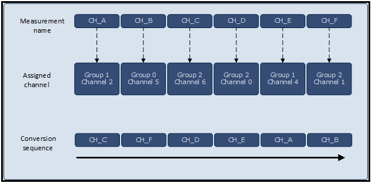

# ADC Basic

## 목적
* ADC의 동작 원리를 이해하고 XMC4500의 ADC 기본 동작 방법을 습득한다.

## 참고자료

* [XMC4500 Reference Manual v1.5 2014-04]
    - xmc4500_rm_v1.5_2014_04.pdf
* [XMC4500 Data Sheet v1.4 2016-01]
    - Infineon-XMC4500-DS-v01.04-EN.pdf
* [ADC MEASUREMENT] (DAVE APP on-line help)

## ADC 동작원리

임베디드 시스템을 둘러싼 세계는 대체로 아날로그이며, 온도, 소리, 가속도 등의 센서는 거의 아날로그 출력을 하게된다. 그러나 마이크로 컨트롤러는 이러한 아날로그 신호를 디지털 형식으로 사용할 수 있도록 변환해야 한다. 이 역할을 하는 것이 바로 Analog-to-Digital Converter (ADC) 이다. ADC는 미리 결정된 정확도로 아날로그 신호를 디지털 표현으로 변환한다. 이와 같이 변환된 디지털 정보를 가지고, 마이크로 컨트롤러를 사용하여 아날로그 입력 값을 기반으로이 정보를 처리하거나 분석 할 수 있다.

ADC는 디지털 출력이 아날로그 입력에 비례하는 전자 회로다. 효과적으로 입력 전압을 "측정"하고 크기에 비례 한 이진 출력 수를 제공한다. 아날로그 입력 신호는 오디오 및 비디오, 의료 또는 기후 변수, 산업적으로 생성 된 신호와 같은 다양한 종류가 존재한다. 온도와 같이 매우 천천히 변화하는 신호가 있다. 소리 나 진동과 같은 것들은 주파수 범위가 수십 킬로 헤르츠까지인 주기적인 신호이다. 비디오 나 레이더와 같은 것들은 주파수가 매우 높습니다. 이와 같이 아날로그 신호들은 매우 다른 신호 특성을 가지고 있으며, 이러한 다양한 애플리케이션에 최적화 된 특성을 갖는 다양한 유형의 ADC가 개발되어 있다.


일반적인 ADC 모듈의 하드웨어 구조는 그림과 같다. 한개의 ADC 를 가지고 있고 여러개의 아날로그 입력 채널을 변환하기 위하여 아날로그 MUX를 사용하고 있다. ADC는 고정밀의 아날로그 회로로 구성이 되며 CPU와 인터페이스 하기 위하여 복잡한 구조를 내부적으로 갖게 된다. 여러 채널을 변환하기 위하여 복수개의 ADC를 사용하는 것 보다는 한개의 ADC를 채택하고 아날로그 MUX를 활용하는 것이 훨씬 더 경제적이기 때문이다.

CPU와의 인터페이스를 포함하여 ADC 변환 과정을 순차적으로 살펴보면 다음과 같다.

1. 입력채널 선택
    * 여러 입력 신호 채널 가운데 Input Select를 활용하여 선택
2. ADC 변환 시작
    * CPU 에서 ADC 변환 시작 명령
    * Clock Input과 원하는 Resolution에 따라 일정 시간 소요
    * 변환시 외부에서 공급하는 기준 전압(Voltage Reference) 활용
3. ADC 변환 완료
    * 변환이 완료되면 CPU에 완료 이벤트 발생
4. 디지탈 값 읽기
    * 결과 레지스터 값을 읽어들임

이상적인 경우라면 위와 같은 과정이 매우 짧은 순간에 일어나고, 디지털로 변환하는 값도 높은 정밀도를 갖을 수 있다면 좋겠지만 현실의 세계에서는 변환 시간과 정밀도를 고려하여야 한다.

### 양자화, 범위, 분해능

* 양자화  
  일반적으로 ADC의 아날로그 입력( $$V_{i}$$ )과 디지탈 출력($$D$$)과의 상관관계는 다음의 식과 같이 표현할 수 있다. 여기서 $$V_r$$ 은 레퍼런스 전압을 의미하고, $$n$$은 디지털 출력의 비트수 이다.
  디지털 출력은 이진수로 표현할 수 있는 정수이고, 만약 $$n$$ 비트 정수라면 그 범위는 $$0$$ 부터 $$(2^n -1)$$ 까지이다. ADC는 아날로그 위의 식에 따라 아날로그 입력값을 반올림, 혹은 버림 등의 과정을 거쳐서 디지털 값으로 양자화 변환된다.
  $$
  D=\frac{V_i}{V_r} \times {2^n}
  $$
  만약에 $$V_r$$의 범위의 아날로그 입력 신호를 ADC 한다면 다음의 그림과 같은 변환관계를 갖게된다.


* 범위  
  ADC에서 변환할 수 있는 아날로그 입력값에는 허용되는 범위가 있다. 이 허용 범위내의 아날로그 입력만이 유효하며, 만약 이 값의 범위를 벋어나는 입력이 인가되는 경우에는 전기적으로 허용되는 범위내에서는 포화된 값(0 혹은 $$(2^n -1)$$)을 갖게되고, 전기적인 허용범위를 넘어서는 경우에는 복구할 수 없는 회로 손상을 입게 되므로 주의하여야 한다.

* 분해능  
  ADC는 아날로그 값을 가장 가까운 디지털 값으로 근사화 시키는 과정으로 생각할 수 있다. 근사화 시키는 과정이므로 얼마나 정밀하게 아날로그 값을 근사하는 것인지가 중요한 지표이다. 이것을 위하여 분해능이라는 지표를 다음과 같이 정의하고 있다.
  $$
  resolution = \frac{V_r}{2^n} 
  $$
  이 분해능이란 디지털 1비트의 정보가 아날로그 전압으로 얼마만큼을 나타내는지를 의미하는 것이다.  고정밀도의 분해능을 얻고자 한다면 입력 범위를 나타내는 $$V_r$$ 값이 작던지, 디지털로 변환하는 비트수 $$n$$이 크면 된다. 대부분의 경우 $$V_r$$ 은 3.3V 혹은 5V 의 값으로 고정되어 있으므로 높은 정밀도를 얻기 위해서는 비트수를 높여야 한다. 예를 들어 5V 범위의 신호를 가정하였을 경우 8-bit 의 경우 약 0.02V(0.4%) 의 분해능을, 10-bit 의 경우 0.005V(0.1%)의 분해능을 갖게 된다.

## DAVE APP (ADC_MEASUREMENT)
ADC_MEASUREMENT APP을 사용하여 여러개의 아날로그 입력 신호를 측정할 수 있다. 이 APP은 XMC4500의 Versatile Analog to Digital Converter(VADC) 모듈의 "background request source" 을 활용하여 다음과 같은 기능을 제공한다.

* 선형적인 시퀀스로 구성된 아날로그 입력들을 측정
* 하드웨어나 소프트웨어로 측정의 시작 시기를 조정
* 모든 측정이 끝나거나 각각의 측정이 끝났을 때 인터럽트 혹은 이벤트 발생

### ADC 측정 시퀀스

사용자가 Measurement Table 을 구성하고 각 채널을 하드웨어 핀에 할당하면, 이 APP이 내부적으로 사용자의 설정정보로 VADC 내부의 Group 과 Channel을 할당하게 된다.

예를 들어 사용자가 CH_A, CH_B, CH_C, CH_D, CH_E, CH_F로 6개의 채널을 설정하고 입력 핀을 설정하면 ADC_MEASUREMENT APP이 다음과 같이 GROUP과 CHANNEL을 설정한다.(이 값은 경우에 따라 바뀌게 된다)
> CH_A: GROUP-1, CHANNEL-2
> CH_B: GROUP-0, CHANNEL-5
> CH_C: GROUP-2, CHANNEL-6
> CH_D: GROUP-2, CHANNEL-0
> CH_E: GROUP-1, CHANNEL-4
> CH_F: GROUP-2, CHANNEL-1



이와 같이 생성된 시퀀스를 사용하여 변환을 수행할 때 사용자가 입력한 순서와는 다르게 VADC 내부의 우선순위에 따라서 변환하게 된다. GROUP 숫자가 높을 수록 먼저 변환하고, 같은 GROUP 내에서는 CHANNEL 숫자가 높을 수록 먼저 변환된다. 이 APP은 시퀀스내의 목록들에 대한 변환만을 보장할 뿐 순서들은 보장하지 못한다. 만약 변환의 순서를 명시적으로 조정하여야 할 경우에는 ADC_MEASUREMENT_ADV APP 을 사용하여야 한다.

### ADC 측정 start mode

ADC 측정을 시작하기 위하여 이 APP은 다음의 4가지 모드를 제공한다.

* Hardware Trigger Single Shot Mode
* Hardware Trigger Continuous Mode
* Software Start Single Shot Mode
* Software Start Continuous Mode

Software Start 모드를 사용하려면 Software 내에서 ADC_MEASUREMENT_StartConvertion( ) 함수의 호출이 필요하다.

Hardware Trigger 모드로 설정하기 위해서는 외부의 trigger 신호가 필요하다. 이 trigger 신호는 다른 APP, 예를 들어 PWM, EVENT_GENERATOR 등,의 event가 필요하다.

Single Shot 모드와 Continuous 모드는 Trigger/Start 이후 한번만 변환할 것인지 아니면 연속적으로 변환할 것인지를 결정하는 것이다.


### XMC4500 의 중요 특징

XMC4500 VADC 의 중요한 특징은 중급편의 ADC_MEASUREMENT_ADV를 참고하도록 하자.
VADC는 내부적으로 여러 채널의 변환방법에 대한 관리를 위하여 복잡한 메카니즘을 가지고 있다. (Queue, Scan, Background) 하나의 VADC는 4개의 개별적인 AD 변환기를 가지고 있고 이것을 GROUP이라 칭한다. 최대 12 bit, 2MSample/S의 속도로 변환 할 수 있다. 뿐만 아니라 신호의 필터링, 누적, 한계값 검출 등의 부가적인 기능도 제공하여 사용자의 편의를 제공하고 있다.

### 아키텍쳐(Architecture)


그림은 ADC_MEASUREMENT APP의 내부적인 소프트웨어 구조를 나타낸 것이다. 그림에서 보이는 바와 같이 이 APP은 VADC 하드웨어를 사용하고 있으며, GLOBAL_ADC APP과 CLOCK APP에 의존하고 있다. 구체적으로는 VADC의 Background request source 를 사용하여 변환을 수행하게 된다.

* Signals

| Signal Name                            | Input/Output | Availability | Description              |
| -------------------------------------- | ------------ | ------------ | ------------------------ |
| event_background_source                | Output       | Always       | NVIC에 연결되어 APP에서 인터럽트 발생 |
| event_result_channel_x                 | Output       | Conditional  | 각 채널별로 이벤트 발생            |
| trigger_input                          | Input        | Always       | AD 변환을 위한 trigger 입력     |
| gating_input                           | Input        | Always       | AD 변환을 위한 gating 입력      |
| Background_connection_to_global_signal | Input        | Always       | 특정 VADC 모듈과 연결           |

### 설정(Configuration)


* Measurement Settings: Number of measurements
    * 1 to 26
    * 아날로그 입력 채널의 개수
    * 실제로는 하드웨어 핀 수의 제한으로 각기 다름
* Measurement Settings: Trigger edge selection
    * 트리거 종류와 에지의 타입을 결정
    * Software Start 의 경우 No External Trigger 선택
* Measurement Settings: Enable continuous conversion
    * continuous 변환(다른 말로는 autoscan) 모드 활성화
* Measurement Settings: Start conversion after initialization
    * 초기화 후 가능한 한 빠른 시간 내에 변환 시작
* Conversion class Settings: Conversion mode
    * 12/10/8 Bit Conversion: 각각 해당하는 분해능으로 변환
    * 10 Bit Fast Conversion: result 레지스터에 저장되어 있는 값과 입력채널의 값을 비교하여 대소 판정(경계값 확인을 빨리하고자 하는 용도 등으로 활용)
* Conversion class Settings: Desired sample time [nsec]
    * 0.0 ~ 8000.0
    * 입력 채널의 값을 샘플링하는 기간
* Conversion class Settings: Actual sample time [nsec]
* Conversion class Settings: Total conversion time [nsec]


* Measurement Table: Measurement names
    * 사용자가 설정하는 채널의 이름
* Measurement Table: Expose pin
    * 명시적으로 GPIO 핀을 보이게 함
    * 다른 APP 과 핀을 공유할 때 활용
* Measurement Table: Result event
    * 해당 채널의 변환을 마쳤을 때 event 발생


* Interrupt Settings: Enable end of measurements interrupt
    * 모든 변환을 마쳤을 때 인터럽트 발생
* Interrupt Settings: Interrupt handler name
    * 인터럽트 callback 함수의 이름
* Interrupt Settings: End of measurements interrupt
    * *NVIC 에서 설명*


설정을 모두 마치고 나면 그림과 같이 사용되는 리소스들을 정리하여 확인할 수 있다.

### 자료구조

ADC_MEASUREMENT 관련 설정 정보를 관리하기 위하여 `ADC_MEASUREMENT_t` 자료형을 사용하고 있다.  이 구조체에는 Channel, Mux, Interrupt Configuration 과 관련된 정보들을 담고 있고, 의존성이 있는 VADC의 연결 정보등을 담고 있다.

```
/**
 * Structure to configure ADC_MEASUREMENT APP.
 */
typedef struct ADC_MEASUREMENT
{
  const ADC_MEASUREMENT_CHANNEL_ARRAY_t *const array; 		 /**< This holds ADC_MEASUREMENT_Channel_HandleArray*/

  const XMC_VADC_BACKGROUND_CONFIG_t *const backgnd_config_handle; /**< This holds the LLD Background Scan Init Structure*/

  const XMC_VADC_GLOBAL_CLASS_t *const iclass_config_handle;  /**< This holds the adc global ICLASS 0 configuration*/

  GLOBAL_ADC_t *const global_handle; 						 /**< This hold the ADC Global APP handle*/

  const ADC_MEASUREMENT_ISR_t *const req_src_intr_handle; 	 /**< This has the NVIC configuration structure*/

  ADC_MEASUREMENT_MUX_CONFIG_t mux_config; /**< This hold the pointer to the function that does mux configuration.*/

  ADC_MEASUREMENT_STATUS_t init_state; 	  /**< Holds information regarding the APP initialization */

  const XMC_VADC_SR_t srv_req_node; 	  /**< Service Request Line selected*/

  const bool start_conversion; 			  /**< This indicates whether to start at initialization of the APP*/
} ADC_MEASUREMENT_t;
```

### 메쏘드(Method)
* ADC_MEASUREMENT APP 을 초기화하고, 변환을 시작한다.

    `ADC_MEASUREMENT_STATUS_t ADC_MEASUREMENT_Init(ADC_MEASUREMENT_t *const handle_ptr);`

    `void ADC_MEASUREMENT_StartConversion(ADC_MEASUREMENT_t *const handle_ptr);`

* 해당 채널의 변환 결과를 읽어들인다.

    `XMC_VADC_RESULT_SIZE_t ADC_MEASUREMENT_GetResult(ADC_MEASUREMENT_CHANNEL_t *const handle_ptr);`
    : 결과 레지스터의 값만 읽어들인다.  
    `uint32_t ADC_MEASUREMENT_GetDetailedResult(ADC_MEASUREMENT_CHANNEL_t *const handle_ptr);`
    : 변환과 관련된 모든 정보를 읽어들인다. (자세한 정보는 on-line help 참고)

### 사용예

* ADC_MEASUREMENT App의 Label 명이 dhADC_MEASUREMENT_0 이고, 이 App을 시작하려면 ADC_MEASUREMENT_StartConversion( ) API를 호출한다.

```
ADC_MEASUREMENT_StartConversion(&dhADC_MEASUREMENT_0);
```

* ADC_MEASUREMENT App의 measurement name 이 Channel_A이고, 이 App 을 사용하여 ADC 변환 값을 읽어들이려면  ADC_MEASUREMENT_GetResult( ) API를 호출한다.

```
uint32_t channel_a;
channel_a = ADC_MEASUREMENT_GetResult(&ADC_MEASUREMENT_Channel_A);
```


## 실습프로젝트

* Lab ADC Basic

## 요약
