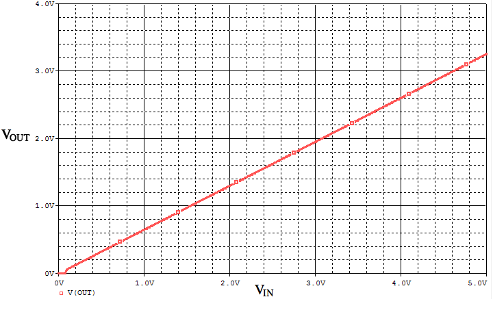

# Analog Signal Interface Circuit

## Objective

* Analog회로와 인터페이스 시 생길 수 있는 문제들을 이해
* Analog회로에서 사용하는 인터페이스 회로 학습

## Reference

## 아날로그 입력 회로

### 아날로그 입력 회로 설계시 고려사항

* 노이즈 제거

  신호를 샘플링 하기 전 고주파 노이즈를 할 수 있다.  즉 저역 필터를 갖는다.  그리고 필터의 차단 주파수를 조정할 수 있다.

- 증폭

  신호의 전압이 MCU가 처리 할 수 있는 전압 범위(0~3.3V)로 조정할 수 있다. 0.1 ~ 10 의 조정 가능한 Gain을 갖는다.

### 아날로그 입력 회로 설명

* OP-Amp 의 선택
  * 공급 가능한 전압(Biasing 전압)이 5V 혹은 3.3V 이고, 출력 전압이 0~3.3V 이어야 하므로, **Rail-to-rail** 특성을 갖는 **Single-supply** OP-Amp 를 사용한다.

  * MCP 6004: 바이어싱 전압을 3.3V로 하여 사용

    

- 전압분배회로(A)
  - 출력 전압의 크기를 감소시킨다.
  - $$ V_{1} = \frac{R_{2}}{R_{1}+R_{2}} \times V_{In} $$

- Non-inverting amplifier(B)
  - 출력 전압의 크기를 조정한다.
  - $$ V_{2} = (1+\frac{R_{3}}{R_{4}}) \times V_{1}$$
- Low pass filter(C)
  - 고주파수 노이즈를 제거한다.
  - $$ V_{Out} = \frac{1}{R_{5}C_1s + 1} \times V_{2}$$
- 위의 아날로그 입력 회로는 다음과 같은 특성을 지닌다.

    - Gain = $$ \frac{R_{2}}{R_{1}+R_{2}} \times (1+\frac{R_{3}}{R_{4}})$$
    - cutoff frequency =  $$\frac{1}{2\pi R_{5}C_1} [Hz]$$
  - 아날로그 입력 회로를 위의 그림과 같이 설계 시 다음의 특성을 지닌다.
      - Gain : 0.652
          - 0 ~ 5V 전압 범위에서 XMC4500 ADC의 전압 범위인 0 ~ 3.3V로 전환
      - cutoff frequency : 10k Hz
          - 10k Hz 이상의 노이즈 제거

### 아날로그 입력 회로 시뮬레이션

* 입력 전압에 따라 다음과 같은 출력을 가진다.

- 위와 같이 회로 설계 시 다음과 같은 주파수 특성을 갖는다.

### 아날로그 입력 회로 튜닝

- 다음의 조합표와 같이 Gain 값을 튜닝할 수 있다.

| R2 [Ohm] | R4 [Ohm] | Gain |
| -------- | -------- | ---- |
| 1.2k     | 47k      | 0.1  |
| 5.1k     | 12k      | 0.5  |
| None     | 3k       | 5    |
| None     | 1k       | 10   |

- 다음의 조합표를 사용하여 차단 주파수를 튜닝 할 수 있다.

| R5 [Ohm] | cutoff frequency [Hz] |
| -------- | --------------------- |
| 33k      | 5k                    |
| 15k      | 10k                   |
| 3.3k     | 50k                   |
| 1.5k     | 100k                  |

## 아날로그 출력

### 아날로그 출력 회로 설계 시 고려사항

* 출력 신호 전압 범위

  실제 시스템이 사용하는 전압 범위로 조정한다.

### 아날로그 출력 회로 설명

- Non-inverting amplifier 회로를 사용하여 출력전압 범위 조정
- MCP6004 Basing 전압 : 5V
  - 입력 전압의 전압범위를출력 시스템의 전압 범위를 0~5V로 디자인
- 위의 회로는 다음과 같은 특성을 지닌다.
  - $$ V_{OUT} = (1 + \frac{R_2}{R_3})V_{IN} $$
  - Gain : $$1 + \frac{R_2}{R_3} $$
- 위의 회로와 같이 아날로그 출력 회로를 디자인 시 다음과 같은 특성을 지닌다.
  - Gain  :  2
    - XMC4500 DAC 전압 0.3V ~ 2.5V를 0.6V ~ 5V로 전환

### 아날로그 출력 회로 튜닝

| R2 [Ohm] | Gain                  |
| -------- | --------------------- |
| 13k      | 1.3(출력 전압 : 0 ~ 3.3V) |

