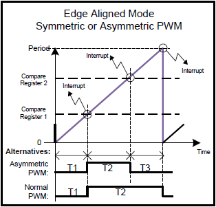
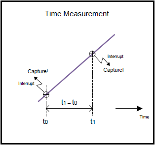

# CCU8 Slice Config

## 목적
* Capture & Compare Unit 의 동작원리를 이해하고 CCU8_SLICE_CONFIG APP 활용방법을 익힌다.

## 참고자료

* [XMC4500 Reference Manual v1.5 2014-04]
    - xmc4500_rm_v1.5_2014_04.pdf
* [XMC4500 Data Sheet v1.4 2016-01]
    - Infineon-XMC4500-DS-v01.04-EN.pdf
* [CCU8_SLICE_CONFIG] (DAVE APP on-line help)

## Input Capture & Output Compare 란?

## DAVE APP (CCU8_SLICE_CONFIG)

### 개략(Overview)
CCU8_SLICE_CONFIG APP은 주변 장치 설정 앱이다. 이 APP은 CCU8 또는 관련된 하위 모듈을 설정한다. 이 APP은 관련된 설정 데이터와 초기화 함수만을 생성한다. 설정과 다른 APP 간의 연결을 GUI 환경에서 하고 초기화 함수를 생성하므로 XMC 라이브러리를 사용한 초기화 과정을 쉽게 할 수 있다. 주변장치 설정 APP은 자원사용과 신호 연결을 효과적으로 제공하기 때문에 다른 APP과 결합해서 사용 할 수 있다.

CCU8_SLICE_CONFIG APP은 신호 모니터링/컨디셔닝 또는 PWM 신호 생성을 위한 다목적 타이머 유닛인 CAPCOM8을 설정한다. CAPCOM8은 타이머 슬라이스 4개로 구성되며 모두 같은 구조를 지닌다. CCU8_SLICE_CONFIG APP을 사용하여  CAPCOM8 기능 대부분을 설정할 수 있다.

CCU8_SLICE_CONFIG APP은 CCU8 주변 장치를 사용하여 다음의 기능들을 제공한다.

* Compare 모드와 Capture 모드로 사용할 수 있으며 관련된 파라미터 값들을 설정 할 수 있다.
* PWM 신호를 생성 할 수 있다.
* PWM 유닛을 초기화 후 시작하거나 일정 시간 후에 시작 할 수 있다.
* PWM을 Single-Shot 모드 또는 Continuous 모드로 사용 할 수 있다.
* 커널과 동기화하여 다수의 타이머를 시작 할 수 있다.
* PWM 신호를 Edge aligned 모드 또는 Center aligned 모드로 생성 할 수있다.
* 대칭/비대칭 PWM을 생성 할 수 있다.
* 채널 1,2의 passive 상태를 선택 할 수 있으며, 출력 상태도 설정 할 수 있다. Select the passive and level state of channel 1 and 2 outputs
* 외부 이벤트를 최대 3개까지 입력가능하며 외부 이벤트를 통해 다음의 기능들을 구현 할 수 있다.
    - Start
    - Stop
    - Direction
    - Gating
    - Count
    - Load
    - Modulation
    - Override(Level)
    - Override(Edge)
    - Capture reg. 0&1
    - Capture reg. 2&3
    - Trap
* 주기 일치 또는 비교 일치 이벤트를 사용하여 인터럽트 서비스 루틴을 생성 할 수 있다.
* 주기 안에 dither를 생성 할 수 있다.
* CCU8를 다중채널 모드를 사용 할 수 있다.
* CCU8 하나의 슬라이스로 PWM 신호를 최대 4개까지 만들 수 있다.
* 데드타임을 생성할 수 있다.
* 타이머 슬라이스들을 연결하여 더 큰 타이머를 만들 수 있다. 따라서 다음과 같은 타이머 구성도 가능하다.
    - 64비트 타이머 한개
    - 48비트 타이머 한개와 16비트 타이머 한 개
    - 32비트 타이머 두개
    - 32비트 타이머 한개와 16비트 타이머 두개








### 아키텍쳐(Architecture)


위의 그림은 CCU8_SLICE_CONFIG APP의 내부 소프트웨어 아키텍처를 나타낸 것이다. 이 APP은 GLOBAL_CCU8, CLOCK APP에 의존적이다.

| Signal Name         | Input/Output | Availability    | Description                            |
|---------------------|--------------|-----------------|----------------------------------------|
| event_period_match  | Output       | Unconditionally | 주기일치 이벤트 또는 원매치 이벤트     |
| event_ch1_cmp_match | Output       | Unconditionally | 채널1 비교 일치 이벤트 신호            |
| event_ch2_cmp_match | Output       | Unconditionally | 채널2 비교 일치 이벤트 신호            |
| event_in0           | Output       | Unconditionally | 외부 이벤트0 신호                      |
| event_in1           | Output       | Unconditionally | 외부 이벤트1 신호                      |
| event_in2           | Output       | Unconditionally | 외부 이벤트2 신호                      |
| st                  | Output       | Unconditionally | 타이머 상태 신호                       |
| st1                 | Output       | Unconditionally | 채널1 상태 신호                        |
| st2                 | Output       | Unconditionally | 채널2 상태 신호                        |
| out0                | Output       | Unconditionally | 채널1 출력 신호                        |
| out1                | Output       | Unconditionally | 채널1 출력 반전 신호                   |
| out2                | Output       | Unconditionally | 채널2 출력 신호                        |
| out3                | Output       | Unconditionally | 채널2 출력 반전 신호                   |
| link_out            | Output       | Unconditionally | _타이머 이어붙이기 모드 출력신호_      |
| in0                 | Input        | Unconditionally | 외부 이벤트 기능 트리거를 위한 신호    |
| in1                 | Input        | Unconditionally | 외부 이벤트 기능 트리거를 위한 신호    |
| in2                 | Input        | Unconditionally | 외부 이벤트 기능 트리거를 위한 신호    |
| mcss                | Input        | Unconditionally | _다중채널 shadow transfer 트리거 신호_ |
| mci0                | Input        | Unconditionally | 다중채널 모드 입력0 신호               |
| mci1                | Input        | Unconditionally | 다중채널 모드 입력1 신호               |
| mci2                | Input        | Unconditionally | 다중채널 모드 입력2 신호               |
| mci3                | Input        | Unconditionally | 다중채널 모드 입력3 신호               |
| link_in             | Input        | Unconditionally | _타이머 이어붙이기 모드 입력신호_      |

### 설정(Configuration)


* Start during initialization
    - Enable시, 초기화 후 CCU8 모듈을 시작한다.
* Operation mode
    - Compare Mode : 타이머 슬라이스를 비교 모드로 사용한다.
    - Capture Mode : 타이머 슬라이스를 캡처 모드로 사용한다.
* Prescaler mode
    - Normal Mode : 프리스케일러를 Normal 모드로 운용한다.
    - Floating Mode : 프리스케일러를 Floating 모드로 운용한다.
* Prescaler intial value
    - 클럭 분주 값을 설정한다.
    - [1 2 4 8 16 32 64 128 256 512 1024 2048 4096 8192 16384 32768] 중 선택
* Tick resolution[ns]
    - CCU8 슬라이스의 실제 주파수를 나타낸다.
* Floating prescaler maximum value
    - 프리스케일러의 최대값을 설정한다.
    - [1 2 4 8 16 32 64 128 256 512 1024 2048 4096 8192 16384 32768] 중 선택
```
* Multi-channel control
  - Disabled :
  - Applied on compare channel 1 :
  - Applied on compare channel 2 :
  - Applied on both compare channels :
```


* Capture Mode: Enable same capture event
    - Enable시, CC0capt1 이벤트를 사용해서 CC4yC0V/CC4yC1V/CC4yC2V/CC4yC3V에 캡처한 데이터를 저장한다.
* Capture Mode: Enable extended capture mode
    - Enable시, Extended 캡처 모드로 사용한다.
    - Disable시, Normal 캡처 모드로 사용한다.
* Capture Mode: Ignore full flags rules
    - Enable 시, 캡처 기능이 full flag rules을 따른다.
* Capture Mode: Maximum count value
    - 타이머 주기 값을 설정 할 수 있다.
    - [0 ~ 65535]
* Capture Mode: Tiemr clear control
    - Never cleared : 캡처 값을 자동으로 클리어하지 않는다.
    - Cleared on capture into reg 2 and 3 (trigger1) : CC4yC2V, CC4yC3V 레지스터에 캡처값이 쓰이면 타이머가 클리어된다.
    - Cleared on capture into reg 0 and 1 (trigger0) : CC4yC0V, CC4yC1V 레지스터에 캡처값이 쓰이면 타이머가 클리어된다.
    - Always in a capture event : 캡처 이벤트가 발생 할 때마다 타이머가 클리어 된다.


* Compare Mode: Counting mode
    - Edge Aligned : 카운터 모드를 Edge Aligned 모드로 선택한다.
    - Center Aligned : 카운터 모드를 Center Aligned 모드로 선택한다.
* Compare Mode: Single-shot mode
    - Enable 시, Edge Aligned 모드에서는 주기 값에 도달 시 타이머가 정지한다. Center Aligned 모드에서는 타이머 값이 0까지 카운트 다운 했을 때 타이머가 정지한다.
* Compare Mode: Enable asymmetric output
    - Enable 시, PWM을 비대칭모드로 출력 할 수 있다. 비교 채널1번은 PWM 신호 상태를 Set하고 비교채널 2번은 PWM 신호 상태를 Clear한다.
* Compare Mode: Timer period value
    - 타이머 주기 값을 설정
    - [0 ~ 65535]
* Compare Mode: Timer compare channel1 value
    - 타이머 비교 채널1번 값 설정
    - [0 ~ 65535]
* Compare Mode: Timer compare channel2 value
    - 타이머 비교 채널2번 값 설정
    - [0 ~ 65535]
* Compare Mode: Status output
    - Compare channel 1 : 비교 채널1번에 따라 CC8ySTy 상태 신호가 출력된다.
    - Compare channel 2 : 비교 채널2번에 따라 CC8ySTy 상태 신호가 출력된다.
    - Compare channel 1 AND 2 : 비교 채널 1번, 2번 조건 모두를 충족해야 CC8ySTy 상태 신호가 출력된다.
    - Compare channel 1 OR 2 : 비교 채널 1번 조건 또는 비교 채널 2번 조건이 충족하면 CC8ySTy 상태 신호가 출력된다.
* Compare Mode: Output 0 connected to
    - ST1 : ST1 신호를 CCU8x.OUTy0 출력 신호로 선택한다.
    - Inverted ST1 : 반전된 ST1 신호를 CCU8x.OUTy0 출력 신호로 선택한다.
* Compare Mode: Output 0 Passive level
    - Low : CCU8x.OUTy0의 Passive level을 Low로 설정한다.
    - Hgih : CCU8x.OUTy0의 Passive level을 High로 설정한다.
* Compare Mode: Output 1 connected to
    - ST1 : ST1 신호를 CCU8x.OUTy1 출력 신호로 선택한다.
    - Inverted ST1 : 반전된 ST1 신호를 CCU8x.OUTy1 출력 신호로 선택한다.
* Compare Mode: Output 1 Passive level
    - Low : CCU8x.OUTy1의 Passive level을 Low로 설정한다.
    - Hgih : CCU8x.OUTy1의 Passive level을 High로 설정한다.
* Compare Mode: Output 2 connected to
    - ST2 : ST2 신호를 CCU8x.OUTy2 출력 신호로 선택한다.
    - Inverted ST2 : 반전된 ST2 신호를 CCU8x.OUTy2 출력 신호로 선택한다.
* Compare Mode: Output 2 Passive level
    - Low : CCU8x.OUTy2의 Passive level을 Low로 설정한다.
    - Hgih : CCU8x.OUTy2의 Passive level을 High로 설정한다.
* Compare Mode: Output 3 connected to
    - ST2 : ST2 신호를 CCU8x.OUTy3 출력 신호로 선택한다.
    - Inverted ST3 : 반전된 ST2 신호를 CCU8x.OUTy3 출력 신호로 선택한다.
* Compare Mode: Output 3 Passive level
    - Low : CCU8x.OUTy3의 Passive level을 Low로 설정한다.
    - Hgih : CCU8x.OUTy3의 Passive level을 High로 설정한다.
* Compare Mode: Dither compare value
    - Dither is disable : Dither 기능을 사용하지 않는다.
    - Period is increased by 1 cycle : 주기를 1 사이클 증가시킨다.
    - Compare match is delayed by 1 cycle : 비교 일치를 1 사이클 딜레이한다.
    - Period is increased by 1 cycle and compare match is delayed by 1 cycle : 주기를 1사이클 증가시키고 비교 일치를 1 사이클 딜레이한다.
* Compare Mode: Dither compare value
    - Dither compare 레지스터 값을 나타낸다.
    - [0 ~ 15]
* Compare Mode: Dead time clock divider
    - 데드타임을 만들기 위한 클럭의 프리스케일러를 설정
    - [1 2 4 8]
* Compare Mode: Enable compare channel1 dead time
    - Enable 시, 비교 채널 1번의 데드타임을 사용한다.
* Compare Mode: Channel1 rising (passive to active) dead time
    - passive에서 active 전환 시 데드타임으로 사용할 클럭 사이클 값을 설정한다.
    - [0 ~ 255]
* Compare Mode: Channel1 falling (active to passive) dead time
    - active에서 passive 전환 시 데드타임으로 사용할 클럭 사이클 값을 설정한다.
    - [0 ~ 255]
* Compare Mode: Enable compare channel2 dead time
    - Enable 시, 비교 채널 2번의 데드타임을 사용한다.
* Compare Mode: Channel2 rising (passive to active) dead time
    - passive에서 active 전환 시 데드타임으로 사용할 클럭 사이클 값을 설정한다.
    - [0 ~ 255]
* Comapre Mode : Channel2 falling (active to passive) dead time
    - active에서 passive 전환 시 데드타임으로 사용할 클럭 사이클 값을 설정한다.
    - [0 ~ 255]


* Enable shadow transfer on clear
    - Enable 시, 타이머 값을 클리어 시 shadow transfer 기능이 사용된다.
* Enable multi-channel shadow transfer using MCSS input
    - Enable 시, mcss 입력에 따라 shadow transfer 기능이 사용된다.


* Input Event Configuration: Event selection
    - Event0 : Event0 신호에 대한 설정을 할 수 있다.
    - Event1 : Event1 신호에 대한 설정을 할 수 있다.
    - Event2 : Event2 신호에 대한 설정을 할 수 있다.
* Input Event Configuration: Edge selection
    - No action : 이벤트를 트리거 하지 않는다.
    - Signal active on rising edge : 상승 엣지에서 이벤트를 트리거한다.
    - Signal active on falling edge : 하강 엣지에서 이벤트를 트리거한다.
    - Signal active on both edges : 상승 엣지, 하강 엣지 양쪽 모두에서 이벤트를 트리거한다.
* Input Event Configuration: Level selection
    - Active on high level : 입력 이벤트 신호가 High 상태 일 때 트리거한다.
    - Active on low level : 입력 이벤트 신호가 Low 상태 일 때 트리거한다.
* Input Event Configuration: Low pass filter configuration
    - LPF is disabled : Low pass filter를 사용하지 않는다.
    - 3 clock cycles of fCCU8 : CCU8 3clock 동안 입력 이벤트 신호가 일정해야 이벤트를 트리거한다.
    - 5 clock cycles of fCCU8 : CCU8 5clock 동안 입력 이벤트 신호가 일정해야 이벤트를 트리거한다.
    - 7 clock cycles of fCCU8 : CCU8 7clock 동안 입력 이벤트 신호가 일정해야 이벤트를 트리거한다.
* Function Configuration: Start function
    - Disabled : 외부 입력 이벤트를 사용하여 타이머를 시작하지 않는다.
    - Triggered by Event 0 : Event0 신호를 사용하여 시작기능을 트리거한다.
    - Triggered by Event 1 : Event1 신호를 사용하여 시작기능을 트리거한다.
    - Triggered by Event 2 : Event2 신호를 사용하여 시작기능을 트리거한다.
* Function Configuration: Start function mode
    - Start timer : 시작 기능이 트리거되면 타이머를 시작한다.
    - Clear and Start timer : 시작 기능이 트리거되면 타이머 값을 클리어하고 시작한다.
* Function Configuration: Stop function
    - Disabled : 외부 입력 이벤트를 사용하여 타이머를 정지하지 않는다.
    - Triggered by Event 0 : Event0 신호를 사용하여 정지 기능을 트리거한다.
    - Triggered by Event 1 : Event1 신호를 사용하여 정지 기능을 트리거한다.
    - Triggered by Event 2 : Event2 신호를 사용하여 정지 기능을 트리거한다.
* Function Configuration: Stop function mode
    - Stop timer : 정지 기능이 트리거되면 타이머를 정지한다.
    - Clear timer : 정지 기능이 트리거되면 타이머 값을 클리어한다.
    - Clear and Stop timer : 정지 기능이 트리거되면 타이머 값을 클리어하고 정지한다..
* Function Configuration: Count function
    - Disabled : 외부 입력 이벤트를 사용하여 타이머를 카운트 하지 않는다.
    - Triggered by Event 0 : Event0 신호를 카운트한다.
    - Triggered by Event 1 : Event1 신호를 카운트한다.
    - Triggered by Event 2 : Event2 신호를 카운트한다.
* Function Configuration: Count direction control function
    - Disabled : 카운트 방향 신호로 외부 입력 이벤트 신호를 사용하지 않는다.
    - Triggered by Event 0 : Event0 신호를 카운팅 방향 신호로 사용한다.
    - Triggered by Event 1 : Event1 신호를 카운팅 방향 신호로 사용한다.
    - Triggered by Event 2 : Event2 신호를 카운팅 방향 신호로 사용한다.
* Function Configuration: Capture 0 function
    - Disabled : 외부 입력 이벤트를 사용하여 타이머 값을 캡처하지 않는다.
    - Triggered by Event 0 : Event0 신호에 따라 타이머 값을 캡처레지스터0 또는 1에 저장한다.
    - Triggered by Event 1 : Event1 신호에 따라 타이머 값을 캡처레지스터0 또는 1에 저장한다.
    - Triggered by Event 2 : Event2 신호에 따라 타이머 값을 캡처레지스터0 또는 1에 저장한다.
* Function Configuration: Catpure 1 function
    - Disabled : 외부 입력 이벤트를 사용하여 타이머 값을 캡처하지 않는다.
    - Triggered by Event 0 : Event0 신호에 따라 타이머 값을 캡처레지스터2 또는 3에 저장한다.
    - Triggered by Event 1 : Event1 신호에 따라 타이머 값을 캡처레지스터2 또는 3에 저장한다.
    - Triggered by Event 2 : Event2 신호에 따라 타이머 값을 캡처레지스터2 또는 3에 저장한다.
* Function Configuration: Gate function
    - Disabled : 외부 입력 이벤트를 사용하여 게이트 하지 않는다.
    - Triggered by Event 0 : Event0 신호를 타이머 게이트 신호로 사용한다.
    - Triggered by Event 1 : Event1 신호를 타이머 게이트 신호로 사용한다.
    - Triggered by Event 2 : Event2 신호를 타이머 게이트 신호로 사용한다.
* Function Configuration: Load function
    - Disabled : 외부 입력 이벤트를 사용하여 비교 레지스터 값을 읽지 않는다.
    - Triggered by Event 0 : Event0 신호에 따라 비교 레지스터 값을 읽는다.
    - Triggered by Event 1 : Event1 신호를 따라 비교 레지스터 값을 읽는다.
    - Triggered by Event 2 : Event2 신호를 따라 비교 레지스터 값을 읽는다.
* Function Configuration: Trap function
    - Disabled : 외부 입력 이벤트에 따라 트랩 상태로 만들지 않는다.
    - Triggered by Event 2 : Event2 신호를 트랩 상태 트리거 신호로 사용한다.
* Function Configuration: Enable trap during initialization
    - Enable 시, 초기화 후 트랩을 활성화한다.
* Function Configuration: Apply TRAP to output 0
    - Enable 시, 트랩신호를 CCU8x.OUTy0 신호로 출력한다.
* Function Configuration: Apply TRAP to output 1
    - Enable 시, 트랩신호를 CCU8x.OUTy1 신호로 출력한다.
* Function Configuration: Apply TRAP to output 2
    - Enable 시, 트랩신호를 CCU8x.OUTy2 신호로 출력한다.
* Function Configuration: Apply TRAP to output 3
    - Enable 시, 트랩신호를 CCU8x.OUTy3 신호로 출력한다.
* Function Configuration: Exit TRAP state mode   
    - Automatic :
    - Automatic synchronous with PWM
    - Software
    - Software synchronous with PWM
* Function Configuration: Modulation function
    - Disabled : 외부 이벤트를 사용하여 변조기능을 사용하지 않는다.
    - Triggered by Event 0 : Event0 신호를 타이머 게이트 신호로 사용한다.
    - Triggered by Event 1 : Event1 신호를 타이머 게이트 신호로 사용한다.
    - Triggered by Event 2 : Event2 신호를 타이머 게이트 신호로 사용한다.
* Function Configuration: Modulation function channel selection
* Function Configuration: Modulation function mode
* Function Configuration: Enable modulation synchronous with PWM
* Function Configuration: Override trigger function
* Function Configuration: Override value function


* Time Events: Period match while counting up
    - 카운팅 업 모드 중 주기일치 상태 일 때 이벤트를 발생시킨다.
* Time Events: One match while counting down
    - 카운팅 다운 모드 중 _원매치_ 상황 일 때 이벤트를 발생시킨다.
* Time Events: Compare match 1 while counting up
    - 카운팅 업 모드 중 타이머 값이 비교 채널 1번의 값과 일치하면 이벤트를 발생시킨다.
* Time Events: Compare match 1 while counting down
    - 카운팅 다운 모드 중 타이머 값이 비교 채널 1번의 값과 일치하면 이벤트를 발생시킨다.
* Time Events: Compare match 2 while counting up
    - 카운팅 업 모드 중 타이머 값이 비교 채널 2번의 값과 일치하면 이벤트를 발생시킨다.
* Time Events: Compare match 2 while counting down
    - 카운팅 다운 모드 중 타이머 값이 비교 채널 2번의 값과 일치하면 이벤트를 발생시킨다.

### 자료구조
CCU8 관련 기본적인 설정 정보는 비교 모드와 캡처 모드에 따라 다른 구조체를 사용하여 관리된다. 비교모드의 경우 XMC_CCU8_SLICE_COMPARE_CONFIG 구조체가 활용되고 캡처 모드의 경우 XMC_CCU8_SLICE_CAPTURE_CONFIG 구조체가 활용된다. 그리고 각 구조체는 XMC_CCU8_SLICE_COMPARE_CONFIG_t, XMC_CCU8_SLICE_CAPTURE_CONFIG_t 자료형으로 사용된다. 또한, 이벤트와 데드타임 관련 설정은 다른 구조체로 관리된다. 이벤트는 XMC_CCU8_SLICE_EVENT_CONFIG 구조체를 활용하며, XMC_CCU8_SLICE_EVENT_CONFIG_t자료형을 사용한다. 데드타임은 XMC_CCU8_SLICE_DEAD_TIME_CONFIG 구조체를 활용하며, XMC_CCU8_SLICE_DEAD_TIME_CONFIG_t 자료형이 사용된다.
```
typedef struct XMC_CCU8_SLICE_COMPARE_CONFIG
{
  union
  {
    struct
    {
      uint32_t timer_mode : 1;         /**< Edge aligned or Centre Aligned.
                                            Accepts enum :: XMC_CCU8_SLICE_TIMER_COUNT_MODE_t */
      uint32_t monoshot : 1;           /**< Single shot or Continuous mode .
                                            Accepts enum :: XMC_CCU8_SLICE_TIMER_REPEAT_MODE_t */
      uint32_t shadow_xfer_clear : 1; /**< Should PR and CR shadow xfer happen when timer is cleared? */
      uint32_t : 10;
      uint32_t dither_timer_period: 1; /**< Can the period of the timer dither? */
      uint32_t dither_duty_cycle : 1;  /**< Can the compare match of the timer dither? */
      uint32_t : 1;
      uint32_t prescaler_mode: 1;      /**< Normal or floating prescaler mode.
                                            Accepts enum :: XMC_CCU8_SLICE_PRESCALER_MODE_t */
      uint32_t : 8;
      uint32_t mcm_ch1_enable : 1;     /**< Multi-Channel mode for compare channel 1 enable? */
      uint32_t mcm_ch2_enable : 1;     /**< Multi-Channel mode for compare channel 2 enable? */
      uint32_t : 2;
      uint32_t slice_status : 2;       /**< Which of the two channels drives the slice status output.
	                                          Accepts enum :: XMC_CCU8_SLICE_STATUS_t*/
      uint32_t : 1;
    };
    uint32_t tc;
  };
  union
  {
    struct
    {
      uint32_t passive_level_out0 : 1; /**< ST and OUT passive levels Configuration for OUT0.
	                                          Accepts enum :: XMC_CCU8_SLICE_OUTPUT_PASSIVE_LEVEL_t */
      uint32_t passive_level_out1 : 1; /**< ST and OUT passive levels Configuration for OUT1.
	                                          Accepts enum :: XMC_CCU8_SLICE_OUTPUT_PASSIVE_LEVEL_t */
      uint32_t passive_level_out2 : 1; /**< ST and OUT passive levels Configuration for OUT2.
	                                          Accepts enum :: XMC_CCU8_SLICE_OUTPUT_PASSIVE_LEVEL_t */
      uint32_t passive_level_out3 : 1; /**< ST and OUT passive levels Configuration for OUT3.
	                                          Accepts enum :: XMC_CCU8_SLICE_OUTPUT_PASSIVE_LEVEL_t */
      uint32_t : 28;
    };
    uint32_t psl;
  };
  union
  {
    struct
    {
      uint32_t asymmetric_pwm : 1;     /**< Should the PWM be a function of the 2 compare channels
                                            rather than period value? */
 */                                         
      uint32_t invert_out0 : 1;        /**< Should inverted ST of Channel-1 be connected to OUT0? */
      uint32_t invert_out1 : 1;        /**< Should inverted ST of Channel-1 be connected to OUT1? */
      uint32_t invert_out2 : 1;        /**< Should inverted ST of Channel-2 be connected to OUT2? */
      uint32_t invert_out3 : 1;        /**< Should inverted ST of Channel-2 be connected to OUT3? */
      uint32_t : 27;

    };
    uint32_t chc;
  };
  uint32_t prescaler_initval : 4;      /**< Initial prescaler divider value
                                            Accepts enum :: XMC_CCU8_SLICE_PRESCALER_t */
  uint32_t float_limit : 4;            /**< The max value which the prescaler divider can increment to.
                                            Range : [0 to 15] */
  uint32_t dither_limit : 4;           /**< The value that determines the spreading of dithering
                                            Range : [0 to 15] */
  uint32_t timer_concatenation : 1;    /**< Enables the concatenation of the timer if true*/
} XMC_CCU8_SLICE_COMPARE_CONFIG_t;

typedef struct XMC_CCU8_SLICE_CAPTURE_CONFIG
{
  union
  {
    struct
    {
      uint32_t : 4;
      uint32_t fifo_enable : 1;      /**< Should the capture registers be setup as a FIFO?(Extended capture mode) */
      uint32_t timer_clear_mode : 2; /**< How should the timer register be cleared upon detection of capture event?
                                          Accepts enum ::XMC_CCU8_SLICE_TIMER_CLEAR_MODE_t */
      uint32_t : 4;
      uint32_t same_event : 1;       /**< Should the capture event for C1V/C0V and C3V/C2V be same capture edge? */
      uint32_t ignore_full_flag : 1; /**< Should updates to capture registers follow full flag rules? */
      uint32_t : 3;
      uint32_t prescaler_mode: 1;    /**< Normal or floating prescaler Accepts enum :: XMC_CCU8_SLICE_PRESCALER_MODE_t*/
      uint32_t : 15;
    };
    uint32_t tc;
  };
  uint32_t prescaler_initval : 4;    /**< Prescaler divider value */
  uint32_t float_limit : 4;          /**< The max value which the prescaler divider can increment to */
  uint32_t timer_concatenation : 1;    /**< Enables the concatenation of the timer */
} XMC_CCU8_SLICE_CAPTURE_CONFIG_t;

typedef struct XMC_CCU8_SLICE_EVENT_CONFIG
{
  XMC_CCU8_SLICE_INPUT_t                   mapped_input; /**< Required input signal for the Event. */
  XMC_CCU8_SLICE_EVENT_EDGE_SENSITIVITY_t  edge;         /**< Select the event edge of the input signal.
                                                              This is needed for an edge sensitive External function.*/
  XMC_CCU8_SLICE_EVENT_LEVEL_SENSITIVITY_t level;        /**< Select the event level of the input signal.
                                                              This is needed for an level sensitive External function.*/
  XMC_CCU8_SLICE_EVENT_FILTER_t            duration;     /**< Low Pass filter duration in terms of fCCU clock cycles. */
} XMC_CCU8_SLICE_EVENT_CONFIG_t;

typedef struct XMC_CCU8_SLICE_DEAD_TIME_CONFIG
{
  union
  {
    struct
    {
      uint32_t enable_dead_time_channel1 : 1; /**< Enable dead time for Compare Channel-1 */
      uint32_t enable_dead_time_channel2 : 1; /**< Enable dead time for Compare Channel-2 */
      uint32_t channel1_st_path : 1;          /**< Should dead time be applied to ST output of Compare Channel-1? */
      uint32_t channel1_inv_st_path : 1;      /**< Should dead time be applied to inverse ST output of
                                                   Compare Channel-1? */
      uint32_t channel2_st_path : 1;          /**< Should dead time be applied to ST output of Compare Channel-2? */
      uint32_t channel2_inv_st_path : 1;      /**< Should dead time be applied to inverse ST output of
                                                   Compare Channel-2? */
      uint32_t div : 2;                       /**< Dead time prescaler divider value.
                                                   Accepts enum ::XMC_CCU8_SLICE_DTC_DIV_t*/
      uint32_t : 24;
    };
    uint32_t dtc;
  };
  union
  {
    struct
    {
      uint32_t channel1_st_rising_edge_counter : 8; /**< Contains the delay value that is applied to the rising edge
	                                                       for compare channel-1. Range: [0x0 to 0xFF] */
      uint32_t channel1_st_falling_edge_counter : 8; /**< Contains the delay value that is applied to the falling edge
	                                                        for compare channel-1. Range: [0x0 to 0xFF] */
      uint32_t : 16;
    };
    uint32_t dc1r;
  };
  union
  {
    struct
    {
      uint32_t channel2_st_rising_edge_counter : 8; /**< Contains the delay value that is applied to the rising edge
	                                                     for compare channel-2. Range: [0x0 to 0xFF]*/
      uint32_t channel2_st_falling_edge_counter : 8; /**< Contains the delay value that is applied to the falling edge
	                                                     for compare channel-2. Range: [0x0 to 0xFF]*/
      uint32_t : 16;
    };
    uint32_t dc2r;
  };
} XMC_CCU8_SLICE_DEAD_TIME_CONFIG_t;
```
CCU8 관련 동작을 프로그래밍 하기 위한 열거형 자료형들은 다음과 같다.
```
typedef enum XMC_CCU8_STATUS
{
  XMC_CCU8_STATUS_OK      = 0U, /**< API fulfils request */
  XMC_CCU8_STATUS_ERROR       , /**< API cannot fulfil request */
  XMC_CCU8_STATUS_RUNNING     , /**< The timer slice is currently running */
  XMC_CCU8_STATUS_IDLE          /**< The timer slice is currently idle */
} XMC_CCU8_STATUS_t;
```
### 메쏘드(Method)
* CCU8 APP을 초기화 할 수 있다.

  `CCU8_SLICE_CONFIG_STATUS_t  CCU8_SLICE_CONFIG_Init (const CCU8_SLICE_CONFIG_t *const handle_ptr);`

### 사용예

## 실습프로젝트

## 요약
