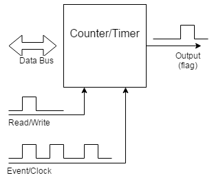
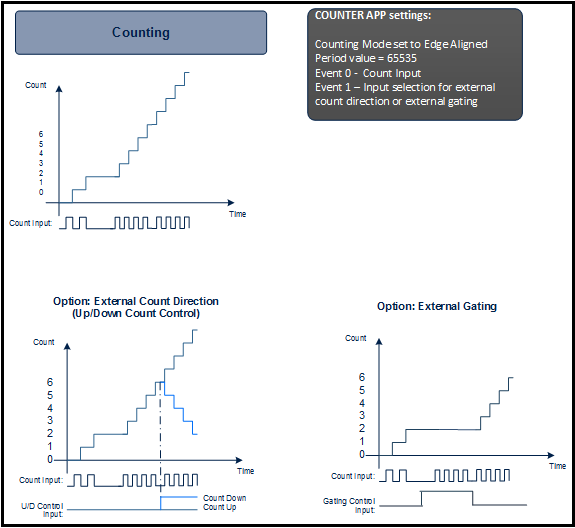
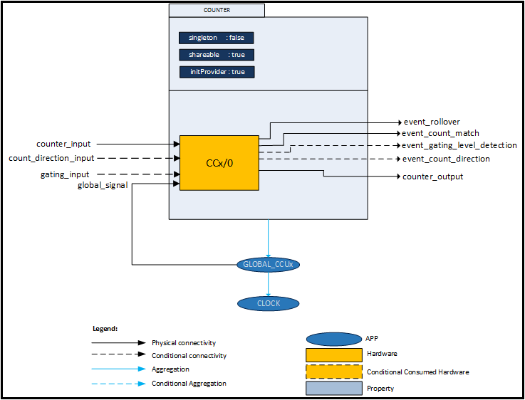
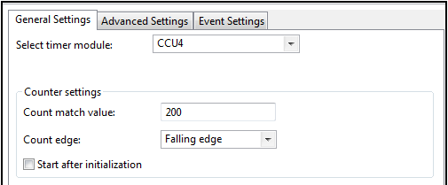
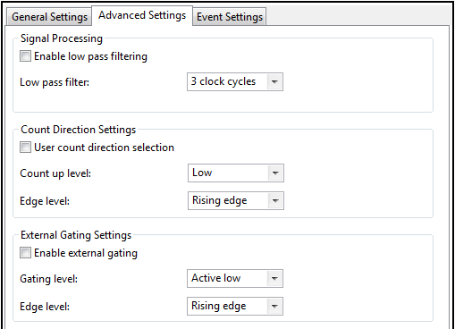
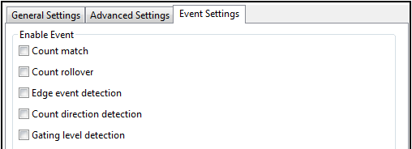

# Counter

## 목적
* Timer의 기본 구조에 대하여 이해하고, Counter와 Timer 의 사용방법을 이해하자.

## 참고자료

* [XMC4500 Reference Manual v1.5 2014-04]
    - xmc4500_rm_v1.5_2014_04.pdf
* [XMC4500 Data Sheet v1.4 2016-01]
    - Infineon-XMC4500-DS-v01.04-EN.pdf
* [COUNTER] (DAVE APP on-line help)

## Counter와 Timer

Counter 모듈 (혹은 Timer 모듈)은 대부분의 임베디드 시스템에서 중요한 구성 요소로서 많은 마이크로 컨트롤러에 기본적으로 포함되어 있다. 이 모듈을 이용하여 외부 사건의 발생 회수를 세거나, 경우에 따라 경과 시간을 측정할 수도 있다.(프로세서 사이클 또는 클럭 틱을 사용하여 계산). 일반적으로 발생회수를 세는 경우를 카운터라 부르고 경과 시간을 측정하는 경우에 타이머라고 이야기 한다. 하드웨어에 대해 이야기 할 때 카운터와 타이머라는 명칭을 혼용하여 많이 사용한다. 전문 용어상으로 주어진 응용 프로그램에서 하드웨어가 사용되는 방법에 따라 구분하고 있다.



그림은 마이크로 컨트롤러 내부에 포함되는 것과 유사한 간단한 카운터를 보여주고 있다. 카운터는 로드 가능한 8 비트 카운트 레지스터, 입력 클럭 신호 및 출력 신호로 구성된다. 소프트웨어를 사용하여 카운트 레지스터를 0x00과 0xFF 사이의 초기 값으로 로드 한다. 입력 이벤트/클록 신호의 연속적인 천이에 따라 카운터 값은 계속 증가하게 된다.

8 비트 카운트가 오버플로되면 출력 신호(플래그)가 발생하게 된다. 이 출력 신호는 프로세서의 인터럽트를 발생하거나 프로세서가 확인할 수 있는 플래그 비트를 발생한다. 이 카운터를 다시 시작하기 위해 소프트웨어는 카운트 레지스터를 동일값 혹은 다른 값으로 다시 로드한다. 입력의 신호를 이벤트 신호로 구성하였을 경우에는 이벤트의 발생 회수를 알 수 있는 카운터로 사용하게 되고, 입력 신호가 주기적인 클럭 신호일 경우에는 경과 시간을 측정할 수 있는 타이머로 사용하게 되는 것이다.

카운터를 증가 혹은 감소 시키는 여부를 결정할 수 있는 설정 정보를 가지고 있다. 업 카운터 인 경우 초기 값에서 0xFF까지 카운트를 증가하고 다운 카운터는 0x00을 향해 감소 시킨다.

일반적으로 카운터는 콘트롤레지서트에 reload 관련 설정 비트를 가지고 있어서, 이에 따라 카운터가 시작할 때 초기값을 설정할 수 있도록 구성되어 있다. 또한 프로세서에서 카운터의 값을 데이터 버스를 통해서 언제든지 읽을 수 있도록 하는 방법을 가지고 있다.


## DAVE APP (COUNTER)

COUNTER APP은 CCU4 또는 CCU8 타이머 슬라이스를 사용하여 정확한 하드웨어 카운터를 제공한다. 그리고 이 APP은 다음의 특징을 가진다.

* 사용할 타이머 모듈을 선택할 수 있다.(CCU4 또는 CCU8)
* 카운트 일치 값(count match value)과 카운트 할 신호의 트리거 엣지(trigger edge)를 선택 할 수 있다.
* 카운트 가능한 최대 값은 65535이다. 카운트 최대 값을 초과 시 0으로 되돌아간다(count rollover).
* 다양한 이벤트 _(count match event, count rollover, event edge detection, count direction, gate level detection)_ 를 지원하며 이러한 이벤트로 인터럽트를 발생 시킬 수 있다.
* 입력신호의 카운트 방향을 조정 할 수 있다. 기본 설정으로 카운터 값이 증가하는 방향으로 카운트한다.
* External count direction 은 External Event-1 으로 매핑되고, External Gating 은 External Evnet-1 혹은 -2 으로 매핑된다.



위의 그림은 COUNTER APP의 개략적인 기능을 보여준다.  

* 카운터는 선택한 엣지에서 카운트 값을 증가 시킨다.
* 카운트 값은 65535가 최대이며 이를 넘으면 카운트 롤오버(주기 일치) 이벤트가 발생한다.
* 카운트 값이 카운트 일치 값(count match value)과 일치하면 카운트 일치 이벤트(count match event)를 발생시킨다.
* 외부 카운트 방향(external count direction) 설정을 활성화하면, 카운트 방향 신호가 카운트 업 레벨 설정과 일치하여야 카운트 값이 증가한다. 일치 하지 않을 경우, 카운트 값은 감소한다.
* 외부 게이팅 레벨(external gating level) 설정이 활성화되면, 게이팅 설정이 활성화 상태일 때 카운트 값이 증가한다.

### 아키텍쳐(Architecture)



그림은 COUNTER APP의 내부적인 소프트웨어 구조를 나타낸 것이다. 이 APP은 그림과 같이 하드웨어 리소스를 사용하고 있으며 다양한 앱과 앱의 출력신호에 의존적이다. 이 APP의 설정과 기능을 위해서는 GLOBAL_CCUx(x=4,8)와 CLOCK APP을 필요로 한다.

* Signal

Signal Name                  | Input/Output | Availability | Description
-----------------------------|--------------|--------------|-----------------------------------------------
event_rollover               | Output       | Always       | 카운트 값이 최대값(65535)을 넘었을 때 발생
event_count_match            | Output       | Always       | 카운트 값이 카운트 일치 값과 일치 할 때 발생
event_gating_level_detection | Output       | Conditional  | 게이트 신호가 설정된 엣지 레벨 일 때 발생
event_count_direction        | Output       | Conditional  | 카운트 방향 신호가 설정된 엣지 레벨 일 때 발생
counter_output               | Output       | Always       | CCUx 타이머의 상태 신호
counter_input                | Input        | Always       | 카운터의 입력 신호
count_direction_input        | Input        | Conditional  | 카운터 UP/Down 입력 신호
gating_input                 | Input        | Conditional  | 외부 게이트 입력 신호
global_signal                | Input        | Always       |

### 설정(Configuration)



* Select timer module
    - CCU4: CCU4의 슬라이스 한 개를 사용한다.
    - CCU8: CCU8의 슬라이스 한 개를 사용한다.
* Counter settings: Count match value
    - 카운트 일치 이벤트를 발생시키기 위한 카운트 일치 값을 설정한다.
    - [1 ~ 65535]
* Counter settings: Count edge
    - Falling edge : 입력 신호가 하강 엣지일 때 카운트한다.
    - Rising edge : 입력 신호가 상승 엣지일 때 카운트한다.
    - Both the edges : 입력 신호가 상승 엣지, 하강 엣지 모두 카운트한다.
* Counter settings: Start after initialization
    - 시작과 함게 자동으로 카운터를 시작한다.



* Signal Processing: Enable low pass filtering
    - Enable 시, 카운터 입력 신호에 저역필터를 적용한다.
* Signal Processing: Low pass filter
    - 카운터 입력 신호의 저역필터 클럭을 선택한다.
    - 3 clock cycles, 5 clock cycles, 7 clock cycles 중 선택 가능
* Count Direction Settings: User count direction selection
    - Enable 시, 외부 신호로 카운트 방향을 제어 할 수 있다.
* Count Direction Settings: Count up level
    - High : 카운트 방향 신호가 High일 때 카운트 값이 증가한다.
    - Low : 카운트 방향 신호가 Low일 때 카운트 값이 증가한다.
* Count Direction Settings: Edge level
    - Falling edge : 카운트 방향 신호가 하강 엣지 일 때 카운트 방향 이벤트를 발생시킨다.
    - Rising edge : 카운트 방향 신호가 상승 엣지 일 때 카운트 방향 이벤트를 발생시킨다.
    - Both the edges : 카운트 방향 신호가 상승 엣지, 하강 엣지 일 때 카운트 방향 이벤트를 발생시킨다.
* External Gating Settings: Enable external Gating
    - Enable 시, 외부에서 게이팅 제어를 할 수 있다.
* External Gating Settings: Gating level
    - Active low : 게이트 신호가 Low 일 때, 카운트 값이 증가 하지 않는다.
    - Active high : 게이트 신호가 Hgih 일 때, 카운트 값이 증가 하지 않는다.
* External Gating Settings: Edge level
    - Falling edge : 게이트 신호가 하강 엣지 일 때, 게이팅 레벨 이벤트가 발생한다.
    - Rising edge : 게이트 신호가 상승 엣지 일 때, 게이팅 레벨 이벤트가 발생한다.
    - Both the edges : 게이트 신호가 상승 또는 하강 엣지 일 때, 게이팅 레벨 이벤트가 발생한다.



* Enable Event: Count match
    - 카운트 일치 이벤트 발생여부 설정
* Enable Event: Count rollover
    - 카운트 롤오버 이벤트 발생여부 설정
* Enable Event: Edge event detection
    - 엣지 탐색 이벤트 발생여부 설정
* Enable Event: Count direction detection
    - 카운트 방향 이벤트 발생여부 설정
* Enalbe Event: Gating level detection
    - 게이트 레벨 이벤트 발생여부 설정

### 자료구조

카운터 관련 설정 정보를 관리하기 위하여 COUNTER_handle 구조체를 활용하여 COUNTER_t 자료형을 사용한다. COUNTER_t 자료형에서는 카운터를 사용하기 위해 사용할 하드웨어 모듈 선택(CCU4 또는 CCU8)과 해당 모듈 설정정보를 관리하는 자료형인 COUNTER_CCUx_CONFIG_t(x = [4,8])로 구성되어 있다.

```
typedef struct COUNTER_handle
{
  COUNTER_CCU_t counter_type; /**< Determines which peripheral the Counter will run in*/
  COUNTER_CCU4_CONFIG_t *const ccu4_handle; /**< Pointer to the CC4 configuration handler*/
  COUNTER_CCU8_CONFIG_t *const ccu8_handle; /**< Pointer to the CC8 configuration handler*/
}COUNTER_t;

typedef struct COUNTER_CCU4_CONFIG
{
  GLOBAL_CCU4_t *const global_handle; /**< Holds the global handle for GLOBAL_CCU4 APP */
  XMC_CCU4_MODULE_t *const kernel_ptr; /**< Hold the base address of CCU4 kernel.*/
  XMC_CCU4_SLICE_t *const slice_ptr; /**< Hold the address of CCU4 slice.*/
  const XMC_CCU4_SLICE_EVENT_CONFIG_t *const event0_config; /**< Configure the event-0 for the count operation*/
  const XMC_CCU4_SLICE_EVENT_CONFIG_t *const count_dir_event_config; /**<Configure the External event for count direction*/
  const XMC_CCU4_SLICE_EVENT_CONFIG_t *const gating_event_config; /**<Configure the External event for gating signal*/
  const uint32_t shadow_mask;       /**< Holds the shadow transfer mask of the consumed slice*/
  const uint16_t count_match_value; /**< The number of edges to be counted to generate a count match interrupt*/
  const XMC_CCU4_SLICE_EVENT_t countdir_event; /**<Configures the External count direction function of the CCU slice*/
  const XMC_CCU4_SLICE_EVENT_t gating_event;   /**< Configures the External gating function of the CCU slice*/
  const XMC_CCU4_SLICE_SR_ID_t count_match_node_id; /**< SR line for count match */
  const XMC_CCU4_SLICE_SR_ID_t count_rollover_node_id; /**< SR line for count rollover event */
  const XMC_CCU4_SLICE_SR_ID_t event_edge_det_node_id; /**< SR line for event edge detection*/
  const XMC_CCU4_SLICE_SR_ID_t event1_node_id; /**< SR line for gating level detection/count direction detection */
  const XMC_CCU4_SLICE_SR_ID_t event2_node_id; /**< SR line for gating level detection if count direction is used by event-1 */
  COUNTER_STATUS_t state; /**< The current state of the APP*/
  const uint8_t kernel_number; /**< The CCU4 kernel number in which the counter is configured*/
  const uint8_t slice_number; /**< The CCU4 slice which is used a counter*/
  const bool intr_count_match; /**< Enable/Disable the count match event */
  const bool intr_count_rollover; /**<  Enable/Disable the count rollover event */
  const bool intr_evt_edge_detect; /**<  Enable/Disable the event edge event */
  const bool intr_event1_detect; /**<  Enable/Disable the count direction detection event or gating level event */
  const bool intr_event2_detect; /**<  Enable/Disable the gating level event*/
  const bool init_start; /**< Start the counter after initialization. */
}COUNTER_CCU4_CONFIG_t;
```

COUNTER 관련 동작을 프로그래밍 하기 위한 열거형 자료형들은 다음과 같다.

```
typedef enum COUNTER_STATUS
{
  COUNTER_STATUS_SUCCESS    = 0,  /**< App is Initialized*/
  COUNTER_STATUS_FAILURE, 		   /**< Initialization failed*/
  COUNTER_STATUS_UNINITIALIZED,   /**< App is Uninitialized*/
  COUNTER_STATUS_RUNNING,         /**< The counter instance is running*/
  COUNTER_STATUS_IDLE             /**< The counter instance has stopped and the Slice is idle*/
} COUNTER_STATUS_t;

/**
 * @brief Selected peripheral either CCU4 or CCU8
 */
typedef enum COUNTER_TYPE
{
  COUNTER_CCU4 = 0, /**< the selected peripheral is CCU4*/
  COUNTER_CCU8      /**< the selected peripheral is CCU8*/
} COUNTER_CCU_t;

/**
 * @brief Selected event of CCUx
 */
typedef enum COUNTER_EVENT_TYPE
{
  COUNTER_EVENT_ROLLOVER_MATCH = 0U, /**< Event for Rollover condition*/
  COUNTER_EVENT_COUNT_MATCH    = 2U, /**< Event for count match condition*/
  COUNTER_EVENT_EDGE_EVENT     = 8U, /**< Event for event edge */
  COUNTER_EVENT_COUNT_DIR      = 9U,  /**< Event for count direction */
  COUNTER_EVENT_GATING_LEVEL   = 10U /**< Event for gating level */
}COUNTER_EVENT_t;

/**
 * @brief Mapping of External Event-1 of the CCUx
 */
typedef enum COUNTER_EXT_SIG
{
  COUNTER_EXT_SIG_NONE,
  COUNTER_EXT_SIG_COUNT_DIR,  /**< Used for using external signal for changing the count direction*/
  COUNTER_EXT_SIG_GATING /**<Used for using external gating signal for the counter operation*/
}COUNTER_EXT_SIG_t;
```

### 메쏘드(Method)

* COUNTER APP을 초기화하고, 현재의 동작상태를 검사, 시작/중지한다.

`COUNTER_STATUS_t  COUNTER_Init (COUNTER_t *const handle_ptr);`

`void  COUNTER_Start (COUNTER_t *const handle_ptr);`

`void  COUNTER_Stop (COUNTER_t *const handle_ptr);`

`COUNTER_STATUS_t  COUNTER_GetCounterStatus (COUNTER_t *const handle_ptr);`

* 현재 카운터 값을 읽거나 초기화 할 수 있다.

`uint16_t  COUNTER_GetCurrentCount (COUNTER_t *const handle_ptr);`

`void  COUNTER_ResetCounter (COUNTER_t *const handle_ptr);`

* 카운트 일치 값을 읽거나 새로운 카운트 일치 값을 설정 할 수 있다.

`uint16_t  COUNTER_GetCountMatch (COUNTER_t *const handle_ptr);`

`void  COUNTER_SetCountMatch (COUNTER_t *const handle_ptr, uint16_t count_match);`

* Event와 관련된 상태를 읽고 Event 플래그를 초기화 한다.

`bool  COUNTER_GetInterruptStatus (COUNTER_t *const handle_ptr, COUNTER_EVENT_t event);`

`void  COUNTER_ClearEvent (COUNTER_t *const handle_ptr, COUNTER_EVENT_t event);`

### 사용예

* 시작과 중지
    - COUNTER_GetCounterStatus 함수를 사용하여 타이머가 동작하는 중인지 확인하고,
    - 만약에 동작중이면 COUNTER_Stop 함수를 호출하여 중지하고,
    - 그렇지 않으면 COUNTER_Start 함수를 호출하여 시작한다.
```
DAVE_Init();

if (COUNTER_GetCounterStatus(&dhCOUNTER_0) == COUNTER_STATUS_SUCCESS)
{
  COUNTER_Stop(&dhCOUNTER_0);
}
else
{
  COUNTER_Start(&dhCOUNTER_0);
}
```

* 카운터 값 읽기
    - COUNTER_GetCurrentCount 함수를 사용하여 카운터 값을 읽고
    - COUNTER_ResetCounter 함수를 사용하여 카운터 값을 리셋 할 수 있다.
```
uint16_t count_value;
count_value = COUNTER_GetCurrentCount(&dhCOUNTER_0);
COUNTER_ResetCounter(&dhCOUNTER_0);
```

* 카운트 일치 값 설정
    - COUNTER_GetCountMatch 함수를 사용하여 설정한 카운트 일치 값을 확인 할 수 있다.
    - COUNTER_SetCountMatch 함수를 사용하여 카운트 일치 값을 설정 할 수 있다.

```
uint16_t count_match_value;
count_match_value = COUNTER_GetCountMatch(&dhCOUNTER_0);
COUNTER_SetCountMatch(&dhCOUNTER_0, 1000); // Change count match value to 1000
```

* COUNTER 관련 이벤트
    - COUNTER_GetInterruptStatus 함수를 사용하면 카운터의 이벤트 발생 유무를 알 수 있다.
    - COUNTER_ClearEvent 함수를 사용하여 이벤트를 클리어 할 수 있다.

```
bool  COUNTER_GetInterruptStatus (COUNTER_t *const handle_ptr, COUNTER_EVENT_t event);
void  COUNTER_ClearEvent (COUNTER_t *const handle_ptr, COUNTER_EVENT_t event);
```

## 실습프로젝트

* Lab Counter

## 요약
