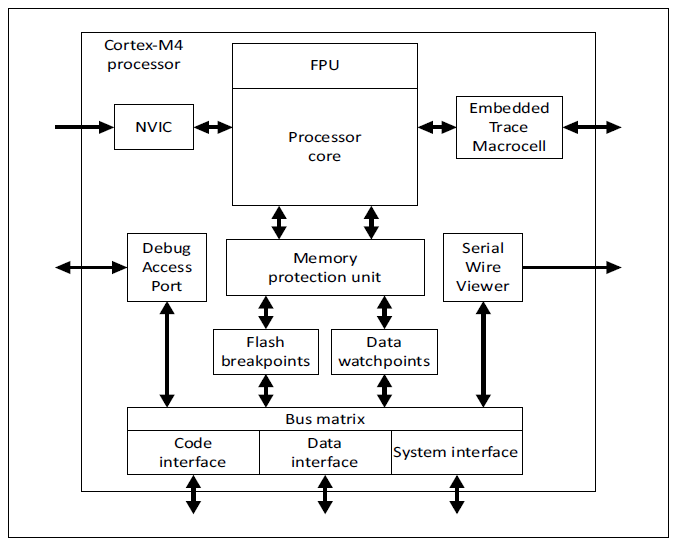
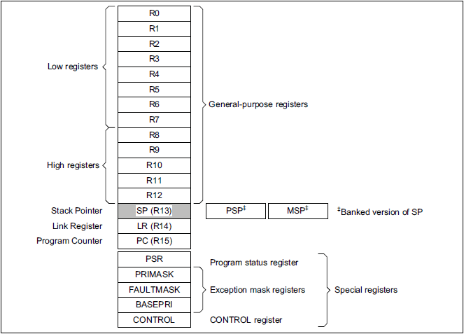
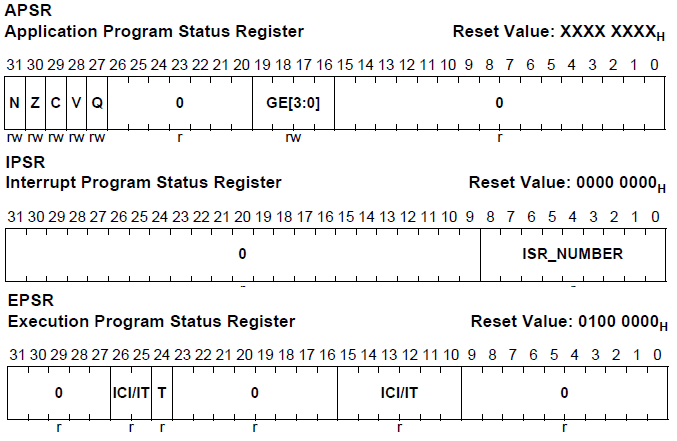
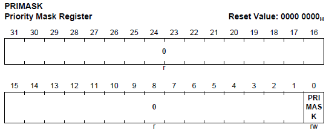
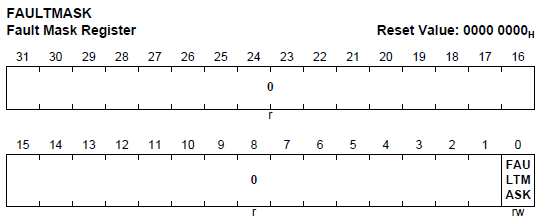
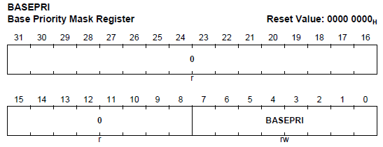
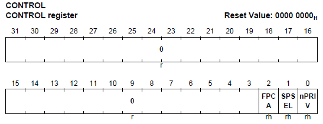
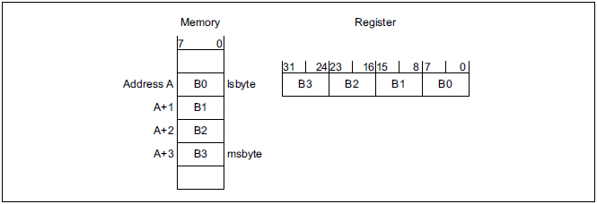

# CPU Subsystem

## 목적
* XMC4000 CPU의 프로그래머 모델을 살펴보고 이해하자.

## 참고자료

* [XMC4500 Reference Manual v1.5 2014-04]
    
- xmc4500_rm_v1.5_2014_04.pdf
    
* [The Call Stack from Computer Science]: https://www.youtube.com/watch?v=Q2sFmqvpBe0

## 시작하며

* C 언어와 라이브러리  
2000년대 초반까지 마이크로컨트롤러의 프로그래밍을 하려면 각종 레지스터의  용도와 어셈블리언어의 이해가 필수적인 항목이었다. 그러나 21세기에 들어서며 C 언어가 마이크로컨트롤러 개발에 일반적으로 사용되기 시작하면서 레지스터 수준의 CPU 이해와 어셈블리의 중요성이 점차 낮아지게 되었다.  더욱이 최근에는 각 마이크로컨트롤러 제조사들은 자사의 CPU를 위한 컴파일러 디버거는 물론 각종 입출력 주변장치를 위한 라이브러리까지 함께 제공하여 개발자의 편의를 더욱이 증대시켰다. 이제 개발자들은 마이크로컨트롤러의 프로그래밍이 전형적인 PC 프로그램과 유사하게 생각하고 개발할 수 있게 되었다.  그러나 마이크로컨트롤러 프로그램과 PC용 프로그램의 차이는 존재할 수 밖에 없고, 이 차이에 대한 개괄적인 이해가 있어야 마이크로컨트롤러 프로그램을 제대로 개발할 수 있게 된다. 물론 이전 처럼 자세한 하드웨어의 특징을 자세히 이해할 필요는 없다고 하더라도 프로그래밍에 필요한 수준까지는 이해하여야 하고, 대신 컴파일러, 라이브러리 혹은 예제 형태로 제공되는 자료들을 살펴보아야 한다.

* 프로그래머 모델이란?  
마이크로컨트롤러 프로그래밍에 필요한 수준의 추상화된 하드웨어 모델을 **프로그래머 모델** 이라고 한다.  C 언어와 같은 상위레벨 프로그래밍 언어 덕분에 레지스터 수준의 이해까지는 필요없게 되었지만 개괄적으로 이해를 해야 효율적인 프로그래밍을 할 수 있다. 대표적인 예가 인터럽트 관련 정보라고 할 수 있다. PC 프로그램에서는 인터럽트보다 더욱 추상화된 개념으로 이벤트가 제공 되고 이를 활용한 프로그래밍 기법들을 활용하고 있다. 하지만 마이크로컨트롤러에서는 인터럽트를 정확히 활용하는 것이 매우 중요한 요소이며, 특히 하드웨어와 관련이 있는 펌웨어(Firmware)의 개발이나 운영체제(OS: operating system) 관련 프로그래밍에서는 필수적인 요소라 할 수 있다. 프로그래머에게 필요한 수준으로 추상화된 하드웨어의 모델, 즉 프로그래머 모델,을 활용하여 CPU를 포함한 모든 부시스템에 대하여 이해하는 방법으로 설명하도록 할 것이다.

## XMC4000 CPU

XMC4000 패밀리 MCU는 강력한 성능을 자랑하는 32-bit ARM Cortex-M4 프로세서를 사용하고 있다. 이 CPU는 다음과 같은 중요한 특징을 가지고 있다.

* 빠른 인터럽트 처리가 가능한 뛰어난 연산성능
* 다수의 브레이크포인트 설정과 트레이스가 가능한 우수한 디버깅 기능
* 보안 안전성과 메모리 보호 유닛(MPU)
* 내부 통합된 슬립모드를 갖춘 저전력 소모

Cortex-M4 프로세서는 3단계(3-stage) 파이프라인의 하바드 아키텍쳐(Harvard arthitecture)의 고성능 프로세스 코어를 채택하고 있다. IEEE754 호환 단정도 부동소수점 (single-precision floating-point) 연산이 가능하고 SIMD(Single-Instruction, Multiple-Data), MAC(Multiply-And-aCcumulate), 포화연산(Saturating arithmetic)과 나누기 연산과 같은 다양한 명령어를 가지고 있다. 이러한 특징은 프로세서의 수행속도를 매우 높일 수 있음은 물론이고, 프로그램의 사이즈 또한 줄일 수 있다.  
Cortex-M4 프로세서는 Thumb-2 기술에 기반을 둔 Thumb 명령어 세트를 제공한다. Thumb 명령어 세트를 포함한 Cortex-M4의 명령어 세트를 활용함으로써 고성능의 32-bit 연산을 수행할 수 있으며, 동시에 8-bit 혹은 16-bit 마이크로컨트롤러 수준의 코드 사이즈를 갖을 수 있다.  
Cortex-M4 프로세서는 업계 최고 수준의 인터럽트 처리 성능을 갖는 인터럽트컨트롤러를 내장하고 있다.  인터럽트콘트롤러는 1개의 마스크할 수 없는 인터럽트(NMI: Non-Maskable Interrupt)와 64 수준까지 우선순위를 조정할 수 있는 다수의 인터럽트를 처리할 수 있다.  프로세스 코어와 인터럽트컨트롤로의 상호 협력관계를 극대화 하여서 인터럽트 지연시간을 최소화 하여 보다 빠른 인터럽트 서비스 루틴 (ISR: Interrupt Service Routine)의 처리가 가능하도록 하였다.  레지스터 정보를 하드웨어적으로 관리하도록 하여서 인터럽트서비스 루틴에서 어셈블리 명령어로 스택을 관리하는 코드를 넣을 필요가 없도록 하여, 쓸데없는 지연을 최소화 할 수 있다. 또한 tail-chain 최적화 방법을 활용하여 한 인터럽트 서비스 루틴에서 다른 인터럽트 서비스 루틴으로 분기할 경우 불필요한 시간 지연을 더욱 줄일 수 있도록 하였다.  

* Cortex-M4 코어는 다음과 같은 부분으로 구성되어진다.

**프로세스 코어**  
CPU는 16-bit, 32-bit Thumb2 명령어 세트와 디지탈신호처리 명령어 등을 제공한다.

**부동소수정 연산부**  
IEEE754 호환 단정밀도 실수 연산 기능을 제공한다.

**Nested Vectored 인터럽트 콘트롤러**  
매우 빠르게 반응하는 인터럽트 처리 기능을 제공한다.

**메모리 보호부**  
각 메모리 영역별로 메모리 속성을 할당하고 관리함으로 시스템의 신뢰성을 향상시킬 수 있다.  8개의 다른 메모리 영역과 1개의 선택적인 영역을 설정할 수 있다.

**디버그 기능**  
완벽한 하드웨어적 디버거 기능을 제공한다.

* Embedded Trace Macrocell
* JTAG port 혹은 2-pin Serial Wire Debug Access port
* Serial Wire Viewer
* Flash breakpoints 와 Data watchpoints

**시스템 레벨 인터페이스**  
*AMBA* 기술을 사용한 코드, 데이타, 시스템 인터페이스를 제공한다.

## 프로그래머 모델

### 프로세서의 모드와 특권 레벨

* 프로세서 모드
    * 쓰레드(Thread) 모드: 일반 응용프로그램이 동작되는 모드이다. 프로세서가 리셋이 된 후에는 쓰레드 모드로 들어가게 된다.
    * 핸들러(Handler) 모드: 예외상황(Exception) 처리 때 동작되는 모드이다. 모든 예외상황이 끝나고 난 후 쓰레드 모드로 들어가게 된다.
* 특권(Privileged) 레벨
    * Unprivileged: MSR, MRS와 같은 명령어를 사용할 수 없게 되며, 시스템 타이머, NVIC와 같은 하드웨어 접근에 제한을 받게 된다.
    * Privileged: 아무런 제약 없이 모든 명령어를 사용할 수 있으며, 모든 자원에 접근할 수 있다.

프로세서 모드는 CPU의 상태가 일반 응용프로그램을 수행하는지 예외상황을 처리하는 상황인지를 구분하기 위한 방법으로 사용된다.

특권 레벨은 OS를 사용하는 프로그램에서 하드웨어에 대한 접근 권한을 관리하기 위하여 제공된 기능이다. OS를 사용하지 않거나 작은 RTOS를 사용하는 시스템에서는 일반적으로 Privileged 레벨에서 동작하게 된다.

### 스택(Stacks)

* Cortex-M4 프로세서는 줄어드는(descending) 스택을 사용한다. 새로운 아이템이 스택에 저장될 때, 프로세서는 스택포인터를 줄이고 그 아이템을 새로운 메모리 공간에 넣게 된다.
* Cortex-M4 프로세서는 두개의 스택(**메인스택** 과 **프로세스스택**)을 가지고 있다.
    * 쓰레드 모드: 메인스택과 프로세스스택 모두를 사용할 수 있다.
    * 핸들러 모드: 메인스택만 사용할 수 있다.

### 코어 레지스터

프로세서 내부에는 고속으로 자료 저장을 하기 위한 레지스터가 있다.

* R0부터 R12까지는 일반용도 레지스터로서 자료나 주소와 같은 정보들을 저장하는 용도로 사용된다.
* R13 레지스터는 스택포인터(SP)라고도 불리며 스택의 최 상단을 가르키는 용도로 사용된다.  
* R14 레지스터는 링크레지스터(LR)라고도 불리며 함수의 호출시 돌아올 번지를 저장하는 용도로 사용된다.
* R15 레지스터는 프로그램카운터(PC)라고도 불리며 메모리에서 불러올 다음 명령어의 번지를 가르키는 용도로 사용된다.

* Program Status Register(PSR)이 있고 이것은 다음의 세 레지스터의 조합이다.
    * Application Program Status Register(APSR)
    * Interrupt Program Status Register(IPSR)
    * Execution Program Status Register(EPSR)

이 레지스터의 모든 비트들은 서로 겹치지 않게 할당되어 있으며, 이 레지스터를 개별적으로 접근할 수 있으며, PSR레지스터를 통하여 동시에 여러 레지스터 정보에 접근할 수도 있게 구성되어 있다.

Exception Mask Registers를 사용하여 프로세서가 예외상황 처리를 못하게 설정한다. 이것은 실행시간이 중요한 태스크를 처리할 때 사용할 수 있다.

* Priority Mask Register: 설정가능한 우선순위를 갖는 모든 예외상황의 처리를 막는다.

* Fault Mask Register: Non-Maskable Interrupt (NMI)를 제외한 모든 예외상황의 처리를 막는다.

* Base Priority Mask Register: 예외처리의 최소 우선순위를 관리한다. 이 레지스터의 값과 같거나 낮은 우선순위 예외상황의 처리를 막는다.  

* CONTROL register를 사용하여
    * 사용할 스택을 결정하고(MSP 혹은 PSP)
    * Privilege 레벨을 결정하고 (Unprivileged 혹은 Privilege)
    * FPU의 활성상태를 결정한다

### 데이터 타입(Data Types)
프로세서는 다음의 자료형을 지원한다.

* 32-bit words
* 16-bit words
* 8-bit words

모든 자료는 **little-endian** 으로 처리한다.

### CMSIS
Cortex 마이크로컨트롤러를 위하여 **Cortex Microcontroller Software Interface Standard(CMSIS)** 라는 표준을 정의하고 있다. 그 구체적인 내용은

* 주변장치 레지스터를 접근하는 방법
* 예외처리 벡터 정의와 이름
* 코어레지스터의 이름

등을 담고 있다.
CMSIS를 활용함으로써 여러 회사들 간의 템플릿 코드와 소프트웨어 컴포넌트의 재사용성을 높일 수 있게 되었다.

## 메모리 모델 (Memory Model)

주소맵은 다음의 테이블과 같다. 각 메모리 영역은 미리 정의된 용도를 가지며 용도에 따른 속성또한 다르다. 이 정보는 링커 스크립트에 반영되어 있다. 일반적인 프로그래밍을 할 경우 이러한 속성까지 신경쓸 이유는 없다. 그러나 외부 장치를 메모리 공간에 할당하는 경우와 같이 저수준의 프로그래밍을 할 경우에는 정확하게 확인하고 작업하여야 한다.

Address Range         | Region            | Type             | Description
----------------------|-------------------|------------------|------------
0x00000000-0x1FFFFFFF | Code              | Normal           | Program Code
0x20000000-0x3FFFFFFF | SRAM              | Normal           | Data
0x40000000-0x5FFFFFFF | Peripheral        | Device           | Peripherals
0x60000000-0x9FFFFFFF | Ext. RAM          | Normal           | Data
0xA0000000-0xDFFFFFFF | Ext. Device       | Device           | External Device
0xE0000000-0xE00FFFFF | Private Peri. Bus | Strongly-ordered | Core Peripherals
0xE0100000-0xFFFFFFFF | Vendor Speci.     | Device           |

* Memory Types
    * Normal: 일반적인 메모리 영역으로 필요에 따라 명령어 순서를 바꿀 수 있는 영역
    * Device: 명령어 순서를 바꿀 수 없으며 버퍼링은 할 수 있는 영역
    * Strongly-ordered: 명령어 순서를 바꿀 수 없으며 버퍼링도 할 수 없는 영역

### 예외상황 모델(Exception Model)

*별도의 문서로 설명하도록 하겠다.*

### 결함(Fault) 처리

결함은 예외상황 중의 하나로서

* 버스에러 발생시
* 정의되지 않은 명령어 수행
* 접근할 수 없는 메모리영역 실행
* privilage 위반

등과 같은 원인들에 의해서 발생할 수 있다.

일반적으로 중대한 상황이므로 특별한 예외처리 방식을 갖고 처리하여야 한다. 자세한 설명은 생략하도록 한다.

## 전력관리
최근의 마이크로컨트롤러들은 전력 소모를 줄이기 위하여 대기전력 감소를 위한 특별한 Sleep mode를 가지고 있다. Cortex-M4 또한 sleep-mode 를 가지고 있으며

* Sleep mode 에서는 프로세서 클럭을 멈춘다
* Deep Sleep mode 에서는 시스템 클럭을 멈추고 내부 PLL와 플래시 메모리의 스위치를 끈다

Sleep mode는 System Control Register를 통하여 조정할 수 있으며 자세한 설명은 생략하도록 한다.

## Private Peripherals

Cortex-M4는 Core 영역에 private peripherals을 가지고 있다.
0xE0000000-0xE00FFFFF 번지에 할당되어 있으며, 내부 버스에 연결되어 있어서 지연시간 없이 빠르게 반응할 수 있다.

* System control block(SCB)
    * 시스템의 구성, 제어, 예외상황등에 대한 전반적인 관리를 한다.
* System timer, SysTick
    * 24-bit 타이머로 시스템에서 활용할 수 있는 주기신호 발생등의 용도로 사용한다.
* Nested Vectored Interrupt Controller(NVIC)
    * 112개의 인터럽트 관리
    * 프로그래밍 가능한 0-63 사이의 우선순위 관리
    * level 혹은 pulse 감지
* Memory Protection Unit(MPU)
    * 메모리 영역별로 나누고 잘못된 사용을 방지한다.
* Floating Point Unit(FPU)
    * IEEE754 표준에 따르는 단정도 실수 연산 기능을 수행한다.

## 실습 프로젝트

## 요약
