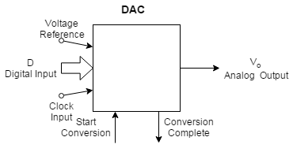
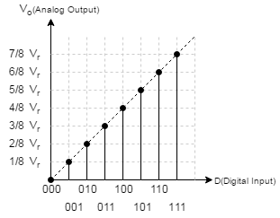
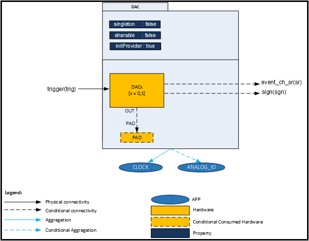
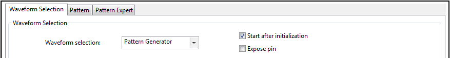
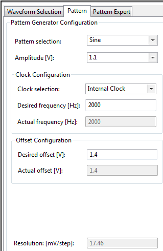
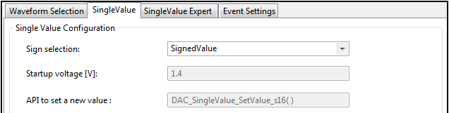

# DAC Basic

## 목적
* DAC의 동작 원리를 이해하고 XMC4500의 DAC 기본 동작 방법을 습득한다.

## 참고자료

* [DAC] (DAVE APP on-line help)

## DAC의 동작 원리

전자 제품에서 디지털 - 아날로그 변환기 (DAC, D / A, D-A, D2A 또는 D-A)는 디지털 신호를 아날로그 신호로 변환하는 장치이다. 아날로그 - 디지털 변환기(ADC)는 역방향 기능을 수행한다.  DAC의 적합성은 분해능(resolution), 최대 샘플링 빈도(maximum sampling frequency) 및 정확도(accuracy)의 세 가지 주요 파라미터에 의해 결정된다. 용도에 맞는 여러 가지 DAC 아키텍처가 있다. 일반적으로는 모든 소자가 집적되어 있는 집적 회로 (IC)로 활용하고, 회로의 특성을 정확하게 매칭시켜야 하는 경우에는 개별소자로 구현하여 활용하기도 한다. DAC는 신호를 저하시킬 수 있으므로 애플리케이션 측면에서 이것을 고려하여 선정하여야 한다.

DAC의 대표적인 응용분야로는 오디오 신호 변환이 있다. 음악 플레이어에서 일반적으로 디지털 데이터 스트림을 아날로그 오디오 신호로 변환하는 데 DAC를 사용한다. 또한 디지털 비디오 데이터를 아날로그 또는 디지털 비디오 신호로 변환하여 TV 또는 휴대폰에서 사용되어 화면 드라이버에 연결하여 단색 또는 컬러 이미지를 표시하는 것에도 사용한다. 이 두 애플리케이션은 속도 / 해상도 트레이드-오프 관계에 놓여있는 대표적인 예이다. 오디오 DAC는 저속 고해상도 유형이며 비디오 DAC는 저해상도에서 중간 해상도의 고속 유형이다.

디지털 - 아날로그 변환기는 2 진수 입력을 아날로그 출력으로 변환하는 회로이다. DAC 내부의 실제 회로는 매우 복잡하나, 사용자 입장에서는 내부구조까지 알 필요는 없다. 그러나 그림과 같이 DAC를 블록 다이어그램으로 나타낼 수 있다. 여기에는 \\(D​\\)로 표시되는 디지털 입력과 \\(V_o​\\)로 표시되는 아날로그 출력이 있다. 이 변환을 하는 과정에서 기준이되는 안정적인 전압, 즉 기준전압(voltage reference)이 필요하다.



대부분의 DAC는 디지털 입력과 아날로그 출력 사이에 단순한 관계가있다. 여기서, \\(V_r\\)은 전압 기준의 값이고, \\(D\\)는 이진 입력의 값이고, n은 그 입력의 비트 수이며, \\(V_o\\)는 출력 전압이다. 방정식의 관계를 그래픽으로 표현면 그립 과 같다. 각 입력 디지털 값에는 해당 아날로그 출력이 있다. 마치 디지털 입력으로 전압 계단을 만드는 것과 같다. 가능한 출력 값의 수는 \\(2^n\\) 이 되고, 스텝 크기(이를 해상도라 한다)는 \\({V_r}/{2^n}\\)  이 된다.  가능한 최대 출력 값은 \\(D=(2^n-1)\\) 일 때 발생하기 때문에 출력으로서의 \\(V_r\\) 의 값은 절대로 도달하지 않는다. DAC의 범위는 최대 및 최소 출력 값의 차이이다. 예를 들어, 6 비트 DAC는 64 개의 가능한 출력 값을 갖고,  3.2 V 기준 전압을 갖는 경우라면 50 mV의 분해능 (스텝 크기)을 갖게됩니다.

$$
V_o = \frac{D}{2^n}\times{V_r}
$$



## DAVE APP (DAC)

이 APP은 DAC를 다양한 모드로 설정하고 UI 설정에 따라 파형을 만든다.

* DAC 모드
    - Pattern Generator : 내부에 포함되어 있는 파형 생성기를 사용하여 싸인, 코싸인, 삼각파, 구형파형 또는 사용자가 정의한 파형을 발생한다.
    - Single Value/ Data Mode : 이 모드는 고정된 단일 전압으로 출력한다. 만약 클럭과 동기화하여  사용하면 이 모드는 DATA 레지스터에 프로그램 되어 있는 값을 순서대로 출력할 수 있다.
    - Ramp : 시작 전압과 정지 전압 설정을 바탕으로 램프 파형을 만들어 낸다.
    - Noise : 랜덤한 잡음 파형을 발생할 수 있다.

이 앱은 다음의 사항들을 설정할 수 있다.

* DAC 4가지 모드 중에 하나를 선택 할 수 있다.
* 진폭, 주파수, 오프셋을 설정 할 수 있다.
* 다른 주변장치와 동기화 시켜 동작 시킬 수 있다.
* DAC 출력을 ADC와 공유시킬 수 있다.

### 아키텍쳐(Architecture)


위의 그림은 DAC APP 내부 소프트웨어 아키텍처를 나타낸 것이다. 이 APP의 인스턴스는 하나의 DAC 슬라이스를 설정한다. 이 APP은 CLOCK_XMC4 APP에 의존성을 가진다.

* Signals

| Signal Name | Input/Output | Availability | Description   |
| ----------- | ------------ | ------------ | ------------- |
| event_ch_sr | Output       | Data mode    | DMA 트리거 이벤트   |
| sign        | Output       | Pattern mode | 생성된 파형의 부호 정보 |
| trigger     | Input        | Always       | 입력 트리거 신호     |


### 설정(Configuration)


* Waveform Selection
    - DAC 모드를 선택 할 수 있다.
    - Pattern Generator / SingleValue / Ramp / Noise
* Start after initialization
    - 초기화와 함께 DAC를 시작한다.
* Expose pin
    - Enable 시, DAC 출력 핀을 ADC 입력핀과 공유한다.

* [설정 계층 구조] Waveform Selection
    * Pattern / Pattern Expert
        * Sine / Rectangle / Triangle / Custom
    * SingleValue / SingleValue Expert
    * Ramp
    * Noise



* Pattern selection
    - Sine : 출력 신호로 싸인 파형을 선택한다.
    - Rectangle : 출력 신호로 구형파를 선택한다.
    - Triangle : 출력 신호로 삼각파를 선택한다.
    - Custom : 출력 신호로 사용자가 정의한 파형을 출력한다.
* Amplitude [V]
    - 출력 신호의 진폭을 선택한다.
    - 0.004 / 0.009 / 0.017 / 0.034 / 0.069 / 0.138/ 0.275 / 0.55 / 1.1 / 2.2 V 중 선택 가능하다.
* Clock Configuration: Clock selection
    - Internal Clock : DAC 변환을 트리거 할 소스로 내부 클럭을 사용한다.
    - External Trigger : DAC 변환을 트리거 할 소스를 외부에서 가져온다.
* Clock Configuration: Desired frequency [Hz]
    - 출력 파형의 희망 주파수를 설정 할 수 있다.
    - [4 ~ 234375] Hz
* Clock Configuration: Actual frequency [Hz]
    - 실제로 적용되는 주파수를 보여준다
    - [1 ~ 5000000]
* Offset Configuration: Desired offset [V]
    - DAC 출력 전압의 희망 오프셋을 설정한다.
    - [0 ~ 2.5]이지만, 진폭에 따라 입력 할 수 있는 범위가 달라진다.
* Offset Configuration: Actual offset [V]
    - 실제로 적용되는 오프셋 값이다.
    - 범위: [-3.132 ~ 5.9056]
* Resolution
    - DAC 분해능을 mV/step 단위로 표현
    - [0 ~ POSITIVE_INFINITY]



* Sign selection
    - SignedValue : DAC 입력 값의 범위가 [-2048 ~ 2049]로 된다.
    - UnsignedValue : DAC 입력 값의 범위가 [0 ~ 4095]로 된다.
* Startup voltage[V]
    - DAC 입력 값이 0일 때 출력 전압을 나타낸다.
    - Unsigned 모드에서는 0.3V, Signed 모드에서는 1.4V이다.
* API to set a new value
    - DAC에 값을 입력하기 위한 API를 나타낸다.


### 자료구조
DAC 관련 설정 정보를 관리하기 위하여 DAC_t 자료형을 사용한다. 이 자료형은 구조체로써 각종 설정정보들을 포함하고 있다. 그리고 자료형에는 스케일 설정정보를 담고 있는 XMC_DAC_CH_CONFIG_t 자료형을 포함하고 있다.
```
typedef struct DAC_t
{
  /* This structure contains the user configuration */
  XMC_DAC_t  * const                  dac_module_ptr;          /**< DAC Module Pointer */
  const XMC_DAC_CH_CONFIG_t *         dac_config_ptr;          /**< DAC Channel Configuration Data */
#if (DAC_ANALOG_IO_USED == 1U)
  const ANALOG_IO_t            *const analog_io_config_ptr;   /**< This hold the address of the ANALOG_IO configuration structure*/
#endif
  XMC_DAC_CH_MODE_t                   dac_mode;                /**< DAC Mode Configuration */
  XMC_DAC_CH_TRIGGER_t                dac_input_trigger;       /**< DAC Input Trigger */
  XMC_DAC_CH_PATTERN_SIGN_OUTPUT_t    dac_sign_output;         /**< DAC Sign Output */
  uint32_t                            dac_frequency;           /**< DAC Frequency */
  uint16_t                            dac_ramp_start;          /**< DAC Ramp Start */
  uint16_t                            dac_ramp_stop;           /**< DAC Ramp Stop */
  uint16_t                            dac_ramp_start_mv;       /**< DAC Ramp Start in milli volts */
  uint16_t                            dac_ramp_stop_mv;        /**< DAC Ramp Stop in milli volts */
  uint8_t                             dac_service_request;     /**< Service request Enabled/Disabled */
  uint8_t                             dac_coupled;             /**< DAC Coupled Mode Enabled/Disabled */
  uint8_t                             dac_ch;                  /**< DAC CH Number */
  const uint8_t  *const               dac_pat_table_ptr;       /**< Pointer to Pattern generation table */
  uint8_t                             dac_start_after_init;    /**< Waveform generation starts after initialization */
} DAC_t;

typedef struct XMC_DAC_CH_CONFIG
{
  union
  {
    struct
    {
      uint32_t :23;                /**< Not used bits */
      uint32_t data_type:1;        /**< input data type - unsigned / signed */
      uint32_t :4;                 /**< Not used bits */
      uint32_t output_negation:1;  /**< Negation of the output waveform enabled/disabled */
      uint32_t :3;
    };
    uint32_t cfg0;
  };
  union
  {
    struct
    {
      uint32_t output_scale:4;  /**< Scale value of type XMC_DAC_CH_OUTPUT_SCALE_t. It includes scaling + mul/div bit */
      uint32_t output_offset:8; /**< offset value */
      uint32_t :20;
    };
    uint32_t cfg1;
  };
} XMC_DAC_CH_CONFIG_t;
```
DAC 관련 동작을 프로그래밍 하기 위한 열거형 자료형들은 다음과 같다.
```
typedef enum DAC_STATUS
{
  DAC_STATUS_SUCCESS = 0,          /**< DAC Initialization successful */
  DAC_STATUS_FAILURE,              /**< DAC Initialization failed */
  DAC_STATUS_API_FAIL              /**< DAC API Call returned ERROR */
} DAC_STATUS_t;

typedef enum DAC_VSS
{
   DAC_VSS_0001_mV = 0,            /**< DAC output 1 milli volts */
   DAC_VSS_0002_mV,                /**< DAC output 2 milli volts */
   DAC_VSS_0004_mV,                /**< DAC output 4 milli volts */
   DAC_VSS_0009_mV,                /**< DAC output 9 milli volts */
   DAC_VSS_0017_mV,                /**< DAC output 17 milli volts */
   DAC_VSS_0034_mV,                /**< DAC output 34 milli volts */
   DAC_VSS_0069_mV,                /**< DAC output 69 milli volts */
   DAC_VSS_0138_mV,                /**< DAC output 138 milli volts */
   DAC_VSS_0275_mV,                /**< DAC output 275 milli volts */
   DAC_VSS_0550_mV,                /**< DAC output 550 milli volts */
   DAC_VSS_1100_mV,                /**< DAC output 1100 milli volts */
   DAC_VSS_2200_mV,                /**< DAC output 2200 milli volts */
}  DAC_VSS_t;
```
### 메쏘드(Method)

* DAC APP을 초기화하고, DAC 동작을 시작/중지한다.
    - DAC 모듈은 내부적으로 아날로그 전압을 만들어내는 아날로그 부분과 파형생성을 담당하는 디지털 부분으로 나누어져 있다. 이 각 부분을 개별적으로 Enable/Disable 할 수 있다.
    - 아날로그 부분의 활성/비활성화 할 때는 DAC_EnableCHOutput/DAC_DisableCHOutput 을 사용
    - 디지털 부분의 활성/비활성화 할 때는 DAC_Enable/DAC_Disable 을 사용

  `DAC_STATUS_t  DAC_Init (const DAC_t *const HandlePtr);`

  `__STATIC_INLINE void  DAC_EnableCHOutput (const DAC_t *const HandlePtr);`

  `__STATIC_INLINE void  DAC_DisableCHOutput (const DAC_t *const HandlePtr);`

  `__STATIC_INLINE void  DAC_Enable (const DAC_t *const HandlePtr);`

  `__STATIC_INLINE void  DAC_Disable (const DAC_t *const HandlePtr);`

* Pattern Generator 모드일 때, 진폭, 주파수, 오프셋, 사인 사용여부를 설정 할 수 있다.

  `void  DAC_Pattern_SetAmplitude (const DAC_t *const HandlePtr, DAC_VSS_t Amplitude);`

  `__STATIC_INLINE DAC_STATUS_t  DAC_Pattern_SetFrequency (const DAC_t *const HandlePtr, const uint32_t Frequency);`

  `DAC_STATUS_t  DAC_Pattern_SetOffset (const DAC_t *const HandlePtr, int16_t Dc_offset_mv);`

  `__STATIC_INLINE void  DAC_Pattern_EnableSignOut (const DAC_t *const HandlePtr);`

  `__STATIC_INLINE void  DAC_Pattern_DisableSignOut (const DAC_t *const HandlePtr);`

  `__STATIC_INLINE void  DAC_Pattern_ChangePattern (const DAC_t *const HandlePtr, const uint8_t *const PatternPtr);`

* Single Value 모드일 때, SignedValue 또는 UnsignedValue 설정에 따라 다음 두 가지 방법으로 DAC에 입력 할 수 있다.
    - Coupled register 를 사용할 때는 DAC_SingleValue_SetValue_u16_Coupled/DAC_SingleValue_SetValue_s16_Coupled 를 사용한다.

  `DAC_STATUS_t  DAC_SingleValue_SetValue_u16 (const DAC_t *const HandlePtr, uint16_t Data);`
-   Data : [0 ~ 4095]

  `DAC_STATUS_t  DAC_SingleValue_SetValue_s16 (const DAC_t *const HandlePtr, int16_t Data);`
  - Data : [-2048 ~ 2048]

  `DAC_STATUS_t  DAC_SingleValue_SetValue_u16_Coupled (const DAC_t *const HandlePtr, uint16_t Data0, uint16_t Data1);`

  `DAC_STATUS_t  DAC_SingleValue_SetValue_s16_Coupled (const DAC_t *const HandlePtr, int16_t Data0, int16_t Data1);`

* Ramp 모드 관련 API

  `DAC_STATUS_t  DAC_Ramp_SetStart (DAC_t *const HandlePtr, uint16_t Ramp_start_mv)`
  - Configures ramp start voltage in Ramp mode.

  `DAC_STATUS_t  DAC_Ramp_SetStop (DAC_t *const HandlePtr, uint16_t Ramp_stop_mv);`
  - Configures ramp stop voltage in Ramp mode.

  `DAC_STATUS_t  DAC_Ramp_SetFrequency (const DAC_t *const HandlePtr, uint32_t Frequency_Hz);`
  - Configures ramp frequency in Ramp mode.  

* Noise 모드 관련

  `__STATIC_INLINE void  DAC_Noise_EnableOffset (const DAC_t *const HandlePtr);`
  - Enables offset in Noise mode.

  `__STATIC_INLINE void  DAC_Noise_DisableOffset (const DAC_t *const HandlePtr);`
  - Disables offset in Noise mode.

  `DAC_STATUS_t  DAC_Noise_SetAmplitude (const DAC_t *const HandlePtr, DAC_VSS_t Amplitude);`
  - Configures an amplitude in Noise Mode.  

### 사용예

* 시작과 중지
    - DAC_Enable 함수를 사용하여 DAC를 시작 할 수 있다.
    - DAC_Disable 함수를 사용하여 DAC를 중지 시킬 수 있다.

```
DAC_Enable(&dhDAC_0);
DAC_Disable(&dhDAC_0);
```

* Single Value 모드일 때, DAC에 값 입력하기
    - SignedValue 설정에서는 DAC_SingleValue_SetValue_s16 함수를 사용하여 값을 입력한다.
    - UnsignedValue 설정에서는 DAC_SingleValue_SetValue_u16 함수를 사용하여 값을 입력한다.

```
DAC_STATUS_t dac_status;
dac_status = DAC_SingleValue_SetValue_s16(&dhDAC_0, 1000) // 1.938 V
dac_status = DAC_SingleValue_SetValue_u16(&dhDAC_0, 1000) // 0.837 V
```

* Pattern Generator 모드일 때, 진폭, 주파수, 오프셋 설정
    - DAC_Pattern_SetAmplitude 함수를 사용하여 진폭을 설정 할 수 있다.
    - DAC_Pattern_SetFrequency 함수를 사용하여 주파수를 설정 할 수 있다.
    - DAC_Pattern_SetOffset 함수를 사용하여 오프셋을 설정 할 수 있다.

```
DAC_Pattern_SetAmplitude(&dhDAC_0, DAC_VSS_2200_mV); // 2.2V
DAC_Pattern_SetFrequency(&dhDAC_0, 3000); // 3000 Hz
DAC_Pattern_SetOffset(&dhDAC_0, 1400); // 1.4V
```

## 실습프로젝트

* Lab DAC Basic

## 요약
