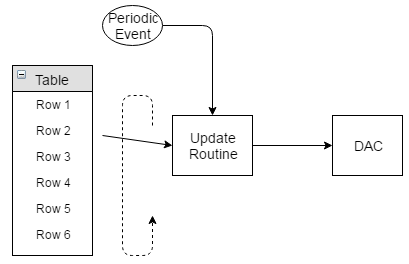
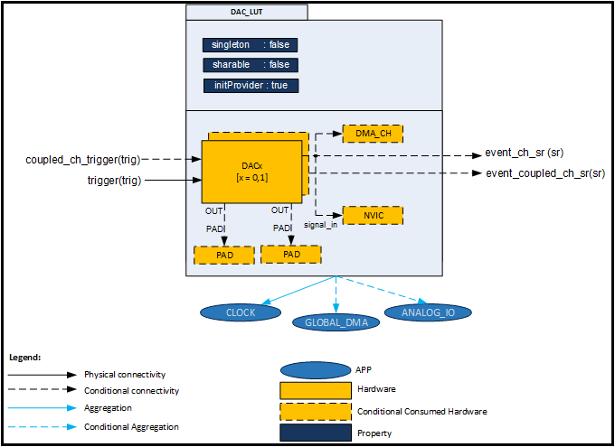
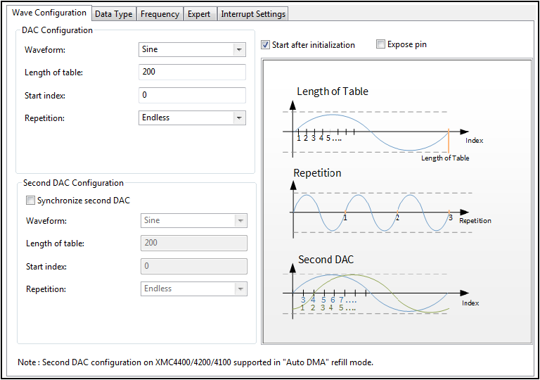
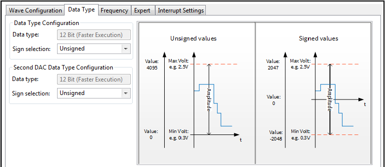
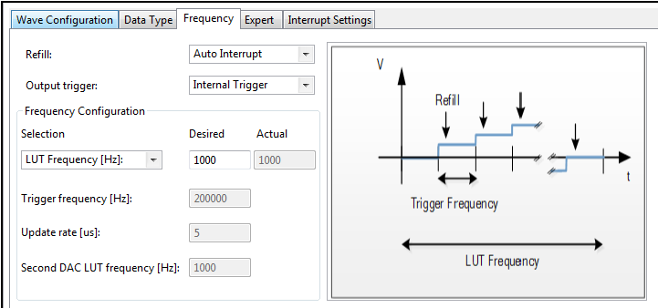
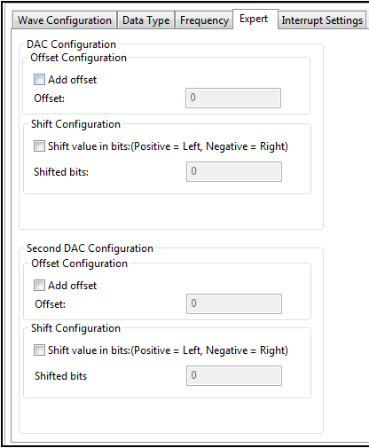
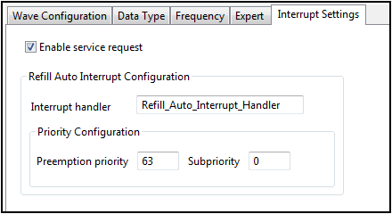

# DAC Look-Up Table

## 목적
* DAC를 사용하여 보다 정밀한 사용자 정의 파형 발생 방법을 배운다.

## 참고자료

* [XMC4500 Reference Manual v1.5 2014-04]
    - xmc4500_rm_v1.5_2014_04.pdf
* [XMC4500 Data Sheet v1.4 2016-01]
    - Infineon-XMC4500-DS-v01.04-EN.pdf
* [DAC LUT] (DAVE APP on-line help)

## 사용자 정의 파형 발생

* 마이크로컨트롤러의 입출력 프로그램을 잘 구성한다는 것은?  

마이크로컨트롤러로 복잡한 일을 수행할 경우에는 다양한 입출력 신호의 처리와, 통신 정보의 처리, 그리고 사용자 프로그램의 수행등이 동시에 이루어 져야 한다. 이중에 저수준, 즉 입출력 신호의 처리와 통신 정보의 처리 등은 사용자 관점에서 보았을 때 중요한 관심사가 아니고 시스템에서 알아서 처리해 주어야 하는 부분이다. 그러나 단순한 방식으로 이것을 처리하면 사용자 프로그램과 구분이 되지 않아 프로그램이 복잡하게 되고, 사용자 프로그램의 수행시간이 모자라게 되는 상황이 발행하게 된다. 이를 방지하기 위해서 인터럽트, 혹은 DMA 등을 활용하여 사용자 프로그램에서 간섭을 최대한 줄이고 마치 '알아서' 처리해 주게끔 구성하여야 한다.

예를 들어 사용자 정의 파형을 발생하는 경우를 생각해 보자. DAC를 활용하여 1kHz 의 사인파를 발생하고자 한다고 하면, 이 파형을 배열의 형태로 저장하고, 일정 주기마다(trigger frequency) 이 배열의 원소들을 순차적으로 DAC로 갱신하도록 구성하여 주어야 한다. 그러나 사용자 프로그램 입장에서는 내부적인 상세한 동작은 신경쓰지 않고 원래의 동작인 1kHz의 사인파의 발생에만 관심을 갖고 싶을 것이다. 마이크로컨트롤러의 입출력 프로그램을 한다는 것은 이와 같이 필요한 정보만 사용자가 신경쓰도록 하고, 상세한 정보는 은닉시키고, 실제 동작에서 발생되는 부가적인 오버헤드(overhead)는 최소화 하는 것이다.

* 용도

소리나 음성 등을 재생하는 경우에는 그 파형이 전형적인 사인파나 삼각파와 같이 수식으로 표현될 수 없고 사용자 정의 파형으로 구성되어 있는 형태이다. 이 경우에는 소리의 파형 정보를 테이블로 구성하여 DAC 등을 활용하여 재생하는 방식으로 재생하여야 한다.

뿐만 아니라 사인파나 삼각파 등의 전형적인 파형을 재생하는 경우라 하더라도, 파형의 크기를 계산하는 연산 루프의 수행시간 등을 고려하여 보다 빠르고 정밀하게 재생하기 위하여 테이블 등을 활용할 필요가 있다. 대표적인 예로 공학계산에 많이 사용되는 삼각함수의 값을 계산하기 위해서 무한급수 등의 방법을 활용하고 있지만, 이 방법의 연산시간이 너무 많이 걸리는 경우는 이 값을 테이블로 구성하여 활용하기도 한다.

* 동기화 된 두 채널의 신호

레졸버와 같은 특정 센서들의 경우에는 위상이 90도 차이가 있는 두 채널의 사인파를 입력으로 하여 동작한다. 이러한 센서등을 활용하기 위해서는 마이크로컨트롤러에서 90도 위상차이가 있는 정밀한 사인파를 발생하여 주어야 한다. 이와 같은 목적으로 동기화된 두 채널의 신호 발생이 필요하게 된다.

* 구조 (인터럽트 사용)



사용자 정의 파형을 출력하기 위한 구성요소를 살펴보면, 사용자 정의 파형을 담고 있는 테이블(Table), 파형 출력을 위한 DAC, 파형 정보와 DAC를 연결하기 위한 루틴(Update Routine), 그리고 주기적 트리거 신호 발생부(Periodic Event)가 있다.

이 동작의 핵심이 되는 Update routine 에서는 매 주기마다 파형 테이블에서 다음 원소의 값을 읽어들이고, 이 값을 DAC에 쓰게 된다. 사용자가 직접 주기적으로 Update routine 을 호출하여도 되지만 마이크로컨트롤러의 하드웨어를 활용하여 주기적인 인터럽트를 발생시켜 이 루틴을 수행하는 것이 더욱 바람직 하다. 주기적인 하드웨어 타이머 인터럽트를 사용한다면 그 발생주기가 소프트웨어 타이머 보다 정밀할 뿐만 아니라, 인터럽트 루틴 내부로 값의 업데이트 동작을 은닉시킬 수 있다.

* DMA를 사용한 개선된 구조

인터럽트를 사용하여 파형의 값을 업데이트 방식으로 구성하면 사용자가 직접 업데이트 하는 것 보다는 더욱 개선된 형태이기는 하지만 CPU 입장에서는 매번 인터럽트를 처리하여야 하는 과정이 필요하다. 여러개의 인터럽트가 동시에 발생되는 상황이 된다면 경우에 따라 이 값을 업데이트 하는 인터럽트 루틴의 지연이 발생할 수 있고, 이것은 발생하고자 하는 신호의 왜곡을 일으키게 된다. 반대의 경우로 이 인터럽트가 너무 빈번하게 발생하게 된다면, 다른 응용프로그램의 수행을 지연시키는 상황을 야기할 수 도 있다.

단순한 자료의 전달만 하는 경우라면, 즉 테이블에서 DAC로 자료 전달만 하는 경우라면 이러한 용도로 사용하기에 더욱 적합한 것은 DMA를 활용하는 것이다. DMA의 구체적인 활용 방법에 대해서는 DMA 부분을 참고하기 바란다.


## DAVE APP (DAC_LUT)

이 APP으로 개선된 파형을 만들 수 있다. 하드웨어 패턴 생성기 모드 사용 대신 이 APP은 파형을 생성하기 위해 룩업테이블을 사용한다. 따라서 파형을 생성함에 있어 좀더 유연하게 만들 수 있다. 또한, 이 APP은 DAC 하드웨어 동기화 기능을 사용하여 이중파형을 만들 수 있다. DAC01DATA 레지스터에 값을 쓰는 방법으로 DAC 두 채널을 동기화 시킬 수 있다. 이 APP은 또한 룩업테이블과 DAC 데이터 레지스터 간의 데이터 전송속도를 향상시키기 위해 DMA기능을 사용할 수 있다.

이 APP은 다음의 특징을 가진다.

* 파형 생성을 위한 룩업테이블의 크기를 설정 할 수 있다.
* DAC sign/unsign 모드 선택 할 수 있다.
* 동기화된 이중 파형 사용 시 룩업테이블의 시작 주소를 달리하여 상의 차이를 만들 수 있다.
* 파형의 반복 횟수를 설정 할 수 있다.
* Refill modes - Manual Software/Auto Interrupt/Auto DMA 를 선택할 수 있다.
* Data type - 12 bit(Faster execution)/16 bit(User friendly) 를 선택할 수 있다.

### 아키텍쳐(Architecture)


위의 그림은 DAC_LUT APP의 내부 소프트웨어 아키텍처를 표현한 것이다. 이 APP의 각각의 인스턴스는 기본적으로 DAC 채널 한 개를 설정한다. 만약 "Synchronized second DAC"옵션을 선택하면 해당 인스턴스는 이중 파형을 생성하기 위해 DAC 2개를 설정한다.
이 APP은 CLOCK_XMC4, CPU_CTRL_XMC4 APP에 필요로한다. 만약 Refill 모드가 "Auto DMA"로 설정하면 GLOBAL_DMA APP과 DMA 하드웨어 채널 한 개를 사용한다.

* Signals

| Signal Name         | Input/Output | Availability                                      | Description                       |
|---------------------|--------------|---------------------------------------------------|-----------------------------------|
| event_ch_sr         | Output       | Service request 활성화                            | 서비스 요청 신호                  |
| event_coupled_ch_sr | Output       | Synchronized second DAC/Service request 활성화 시 | 추가된 DAC 채널의 서비스요청 신호 |
| trigger             | Input        | Always                                            | DAC 트리거 신호                   |
| coupled_ch_trigger  | Input        | Synchronized second DAC 활성화 시                 | 추가된 DAC 채널의 트리거 신호     |

### 설정(Configuration)


* DAC Configuration: Waveform
    - Sine : 출력파형으로 싸인파형을 선택한다.
    - Cosine : 출력파형으로 코싸인파형을 선택한다.
    - Triangle : 출력파형으로 삼각파형을 선택한다.
    - Custom : 유저가 정의한 룩업테이블을 사용하여 출력파형을 만든다.
* DAC Configuration: LUT name
    - Waveform 설정에서 Custom으로 설정 시 파형 출력을 위한 룩업테이블을 지정할 수 있다.
* DAC Configuration: Length of table
    - 룩업테이블의 크기를 설정할 수 있다.
    - [32 ~ 1024]
* DAC Configuration: Start index
    - 생성할 파형의 시작 주소를 설정 할 수 있다.
    - [0 ~ 1024]
* DAC Configuration: Repetition
    - Endless : 출력파형을 지속적으로 출력한다.
    - Cycles : 출력파형을 Repetition cycles 설정에서 지정한만큼만 출력한다.
* DAC Configuration: Repetition cycles
    - Repetiton 설정에서 Cycles으로 설정 시 파형 출력의 횟수를 설정 할 수 있다.
    - [1 ~ 32767]
* Second DAC Configuration: Synchronized second DAC
    - Enable 시, 다른 DAC채널과 동기화하여 파형을 출력 할 수 있다.
* Second DAC Configuration: Waveform
    - Sine : 두 번째 DAC 출력파형으로 싸인파형을 선택한다.
    - Cosine : 두 번째 DAC 출력파형으로 코싸인파형을 선택한다.
    - Triangle : 두 번째 DAC 출력파형으로 삼각파형을 선택한다.
    - Custom : 유저가 정의한 룩업테이블을 사용하여 두 번째 DAC의 출력파형을 만든다.
* Second DAC Configuration: LUT name
    - Waveform 설정에서 Custom으로 설정 시 파형 출력을 위한 룩업테이블을 지정할 수 있다.
* Second DAC Configuration: Length of table
    - 두 번째 DAC의 룩업테이블의 크기를 설정 할 수 있다.
    - [32 ~ 1024]
* Second DAC Configuration: Start index
    - 두 번째 DAC를 통해 생성할 파형의 시작 주소를 설정 할 수 있다.
    - [0 ~ 1024]
* Second DAC Configuration: Repetition
    - Endless : 두 번째 DAC 출력파형을 지속적으로 출력한다.
    - Cycles : 두 번째 출력파형을 Repetition cycles 설정에서 지정한만큼만 출력한다.
* Second DAC Configuration: Repetition cycles
    - Second DAC Configuration: Repetition 설정에서 Cycles로 설정 시 두 번째 DAC 파형 출력의 횟수를 설정 할 수 있다.
    - [1 ~ 32767]



* Data Type Configuration: Data Type
    - 12 Bit(Faster Execution) : DAC 입력으로 12 Bit 데이터 타입을 사용할 수 있다.
    - 16 Bit(User Friendly) : DAC 입력으로 16 Bit 데이터 타입을 사용할 수 있다. Custom 모드 사용 시 사용할 수 있다.
* Data Type Configuration: Sign selection
    - Unsigned : DAC를 Unsigned 모드로 사용할 수 있다.
    - Signed : DAC를 Sign 모드로 사용할 수 있다.
* Second DAC Data Type Configuration: Data Type
    - 12 Bit(Faster Execution) : 두 번째 DAC 입력으로 12 Bit 데이터 타입을 사용할 수 있다.
    - 16 Bit(User Friendly) : 두 번째 DAC 입력으로 16 Bit 데이터 타입을 사용할 수 있다. Custom 모드 사용 시 사용할 수 있다.
* Second DAC Data Type Configuration: Sign selection
    - Unsigned : 두 번째 DAC를 Unsigned 모드로 사용할 수 있다.
    - Signed : 두 번째 DAC를 Sign 모드로 사용할 수 있다.



* Refill
    - Manual Software : 소프트웨어로 DAC 레지스터를 최신화한다.
    - Auto Interrupt : 인터럽트로 DAC 레지스터를 최신화한다.
    - Auto DMA : DMA로 DAC 레지스터를 최신화한다.
* Output trigger
    - Internal Trigger : 내부적으로 DAC를 트리거 한다.
    - External Trigger : 외부 트리거 신호를 사용하여 DAC를 트리거 한다.
    - Software Trigger : DAC를 트리거 하기 위해서 주기적으로 DAC_LUT_SoftwareTrigger 메쏘드를 사용해야 한다.
* Frequency Configuration: Selection
    - LUT Freqnency[Hz] : 룩업테이블의 데이터를 순환하는 기준으로 DAC 속도를 설정한다.
    - Trigger Frequency[Hz] : DAC 트리거 주파수를 기준으로 DAC속도를 설정한다.
    - Update Rate[us] : DAC를 한 번 실행시키는 것을 기준으로 DAC 속도를 설정한다.
* Frequency Configuration: Desired
    - 원하는 DAC 속도를 설정 할 수 있다.
    - Selection 설정에 따라 입력 할 수 있는 값의 범위도 다르다.
* Frequency Configuration: Actual
    - 실제로 적용되는 DAC 속도를 나타낸다.
* Frequency Configuration: Trigger frequency[Hz]
    - DAC 트리거 주파수를 나타낸다.
    - [0 ~ 5120000000]
* Frequency Configuration: Update rate[us]
    - DAC 값을 최신화하는 주기를 나타낸다.
    - [0 ~ 1000000]
* Frequency Configuration: Second DAC LUT frequency[Hz]
    - 두 번째 DAC의 룩업테이블을 순환하는 주기를 나타낸다.
    - [0 ~ 5000000]



* 파형의 Offset 과 Phase 를 조정할 수 있다.



* Enable service request
    - Enable 시, Data 모드의 서비스 요청 인터럽트를 발생시킨다.
* Refill Auto Interrupt Configuration: Priority Configuration
    - 서비스 요청 인터럽트 우선순위를 설정할 수 있다.
* Refill Auto Interrupt Configuration: Interrupt handler
    - 서비스 요청 인터럽트 핸들러의 이름을 설정 할 수 있다.

### 자료구조

DAC_LUT 관련 설정 정보를 관리하기 위하여 DAC_LUT 구조체를 활용하여 DAC_LUT_t 자료형을 사용하고 있다. 이 구조체에는 DAC 설정정보 뿐만 아니라, 채널 스케일링 설정정보를 관리하는 자료형인 XMC_DAC_CH_CONFIG_t, 인터럽트 설정정보를 관리하는 자료형인 DAC_LUT_ISR_Handle_t를 포함하고 있다.
```
typedef struct DAC_LUT
{
    /* This structure contains the user configuration */
    XMC_DAC_t             * const module_ptr; /**< DAC Module Pointer */
    XMC_DAC_CH_CONFIG_t   * const config_ptr; /**< DAC Channel Configuration Data */
    DAC_LUT_DMA_CONFIG_t  * const dma_config_ptr; /**< DMA configuration structure in DMA refill mode. */
  const ANALOG_IO_t        *const analog_io_config_ptr;   /**< This hold the address of the ANALOG_IO configuration structure*/
    XMC_DAC_CH_CONFIG_t   * const sync_config_ptr; /**< DAC Sync Channel Configuration Data */
    XMC_DAC_CH_TRIGGER_t          input_trigger; /**< DAC Input Trigger */
    DAC_LUT_REFILL_t              refill_sel; /**< Refill option selection */
    DAC_LUT_ISR_Handle_t  * const isr_config_ptr; /**< Interrupt Configuration */
    DAC_LUT_DATATYPE_t            data_type; /**< 12 bit fast execution or 16 bit user friendly */
    DAC_LUT_DATATYPE_t            data_type_sync_ch; /**< 12 bit fast execution/ 16 bit user friendly for 2nd DAC */
    DAC_LUT_STATE_t               state; /**< enumerates the state of the APP. */
    uint32_t                      frequency; /**< DAC Frequency */
    volatile uint32_t *           dac_data_reg_ptr; /**< DAC data register pointer */
    uint16_t                      wavegen_start_index; /**< Waveform generation start index */
    uint16_t                      wavegen_sync_start_index; /**< Waveform generation second DAC start index */
    uint16_t                      wavegen_current_index; /**< Waveform generation current index */
    uint16_t                      wavegen_sync_current_index; /**< Waveform generation second DAC current index */
    uint32_t *                    wave_lut_ptr; /**< Lookup table pointer for CH data*/
    uint32_t *                    wave_lut_coupled_ptr; /**< Lookup table pointer for coupled Mode */
    uint16_t                      wavegen_lut_lenght; /**< Waveform generation lookup table length */
    uint16_t                      wavegen_sync_lut_lenght; /**< Waveform generation lookup table length for 2nd DAC*/
    uint16_t                      wavegen_repetition_cycle; /**< Waveform generation repetition cycles */
    uint16_t                      wavegen_sync_repetition_cycle; /**< Waveform repetition cycles for 2nd DAC */
    int16_t                       wavegen_current_cycle; /**< Waveform generation current repetition cycle */
    int16_t                       wavegen_sync_current_cycle; /**< Waveform current repetition cycle for 2nd DAC */
    uint8_t                       service_request; /**< Service request Enabled/Disabled */
    uint8_t                       ch; /**< DAC CH Number */
    uint8_t                       sync_ch; /**< Second DAC CH Number */
    uint8_t                       start_after_init; /**< Waveform generation starts after initialization */

} DAC_LUT_t;

typedef struct XMC_DAC_CH_CONFIG
{
  union
  {
  struct
  {
    uint32_t :23;                /**< Not used bits */
    uint32_t data_type:1;        /**< input data type - unsigned / signed */
    uint32_t :4;                 /**< Not used bits */
    uint32_t output_negation:1;  /**< Negation of the output waveform enabled/disabled */
    uint32_t :3;
  };
  uint32_t cfg0;
  };
  union
  {
  struct
  {
    uint32_t output_scale:4;  /**< Scale value of type XMC_DAC_CH_OUTPUT_SCALE_t. It includes scaling + mul/div bit */
    uint32_t output_offset:8; /**< offset value */
    uint32_t :20;
  };
  uint32_t cfg1;
  };
} XMC_DAC_CH_CONFIG_t;

typedef struct DAC_LUT_ISR_Handle
{
    uint8_t node_id; /*!< interrupt node id*/
    uint8_t priority; /*!< interrupt priority*/
    uint8_t sub_priority; /*!< interrupt sub priority*/

} DAC_LUT_ISR_Handle_t;
```
DAC_LUT 관련 동작을 프로그래밍 하기 위한 열거형 자료형들은 다음과 같다.
```
typedef enum XMC_DAC_CH_OUTPUT_SCALE
{
  XMC_DAC_CH_OUTPUT_SCALE_NONE =
      0x0U,                                                                   /**< No scaling */
  XMC_DAC_CH_OUTPUT_SCALE_MUL_2 =
      (0x1U << DAC_DAC0CFG1_MULDIV_Pos) | (0x1U << DAC_DAC0CFG1_SCALE_Pos),   /**< multiplied by 2 */
  XMC_DAC_CH_OUTPUT_SCALE_MUL_4 =
      (0x1U << DAC_DAC0CFG1_MULDIV_Pos) | (0x2U << DAC_DAC0CFG1_SCALE_Pos),   /**< multiplied by 4 */
  XMC_DAC_CH_OUTPUT_SCALE_MUL_8 =
      (0x1U << DAC_DAC0CFG1_MULDIV_Pos) | (0x3U << DAC_DAC0CFG1_SCALE_Pos),   /**< multiplied by 8 */
  XMC_DAC_CH_OUTPUT_SCALE_MUL_16 =
      (0x1U << DAC_DAC0CFG1_MULDIV_Pos) | (0x4U << DAC_DAC0CFG1_SCALE_Pos),   /**< multiplied by 16 */
  XMC_DAC_CH_OUTPUT_SCALE_MUL_32 =
      (0x1U << DAC_DAC0CFG1_MULDIV_Pos) | (0x5U << DAC_DAC0CFG1_SCALE_Pos),   /**< multiplied by 32 */
  XMC_DAC_CH_OUTPUT_SCALE_MUL_64 =
      (0x1U << DAC_DAC0CFG1_MULDIV_Pos) | (0x6U << DAC_DAC0CFG1_SCALE_Pos),   /**< multiplied by 64 */
  XMC_DAC_CH_OUTPUT_SCALE_MUL_128 =
      (0x1U << DAC_DAC0CFG1_MULDIV_Pos) | (0x7U << DAC_DAC0CFG1_SCALE_Pos),   /**< multiplied by 128 */
  XMC_DAC_CH_OUTPUT_SCALE_DIV_2 =
      0x1U << DAC_DAC0CFG1_SCALE_Pos,                                         /**< divided by 2 */
  XMC_DAC_CH_OUTPUT_SCALE_DIV_4 =
      0x2U << DAC_DAC0CFG1_SCALE_Pos,                                         /**< divided by 4 */
  XMC_DAC_CH_OUTPUT_SCALE_DIV_8 =
      0x3U << DAC_DAC0CFG1_SCALE_Pos,                                         /**< divided by 8 */
  XMC_DAC_CH_OUTPUT_SCALE_DIV_16 =
      0x4U << DAC_DAC0CFG1_SCALE_Pos,                                         /**< divided by 16 */
  XMC_DAC_CH_OUTPUT_SCALE_DIV_32 =
      0x5U << DAC_DAC0CFG1_SCALE_Pos,                                         /**< divided by 32 */
  XMC_DAC_CH_OUTPUT_SCALE_DIV_64 =
      0x6U << DAC_DAC0CFG1_SCALE_Pos,                                         /**< divided by 64 */
  XMC_DAC_CH_OUTPUT_SCALE_DIV_128 =
      0x7U << DAC_DAC0CFG1_SCALE_Pos                                          /**< divided by 128 */
} XMC_DAC_CH_OUTPUT_SCALE_t;

typedef enum DAC_LUT_STATE
{
  DAC_LUT_STATE_UNINITIALIZED, /**< Default state after power on reset */
  DAC_LUT_STATE_INITIALIZED,   /**< INITIALIZED state after execution */
  DAC_LUT_STATE_DMA_ERROR      /**< DMA error occurred during data transfer */

} DAC_LUT_STATE_t;

```

### 메쏘드(Method)
* DAC_LUT APP을 초기화하고, 시작/정지 할 수 있다.

  `DAC_LUT_STATUS_t  DAC_LUT_Init (DAC_LUT_t *HandlePtr);`

  `void  DAC_LUT_Start (DAC_LUT_t *HandlePtr);`

  `void  DAC_LUT_Stop (DAC_LUT_t *HandlePtr);`

* DAC_LUT APP이 사용하는 룩업테이블의 시작인덱스, 현재 인덱스를 설정 할 수 있으며, 현재 실행 중인 인덱스 위치를 알 수도 있다. 그리고 시작 인덱스의 위치로 다시 돌아갈 수 있다.

  `DAC_LUT_STATUS_t  DAC_LUT_SetStartIndex (DAC_LUT_t *HandlePtr, uint8_t ch, uint16_t start_index);`

  `DAC_LUT_STATUS_t  DAC_LUT_SetIndex (DAC_LUT_t *HandlePtr, uint8_t ch, uint16_t index);`

  `uint16_t  DAC_LUT_GetIndex (DAC_LUT_t *HandlePtr, uint8_t ch);`

  `void  DAC_LUT_ResetIndex (DAC_LUT_t *HandlePtr);`

* DAC 반복 출력 관련 설정을 할 수 있으며, 파형이 몇 번 반복됐는지도 알 수 있다.

  `DAC_LUT_STATUS_t  DAC_LUT_SetRepetition (DAC_LUT_t *HandlePtr, uint8_t ch, uint16_t repetition);`

  `uint16_t  DAC_LUT_GetRepetition (DAC_LUT_t *HandlePtr, uint8_t ch);`

* 사용하는 룩업테이블을 변경 할 수 있다.

  `DAC_LUT_STATUS_t  DAC_LUT_ChangeLutAddress (DAC_LUT_t *HandlePtr, uint8_t ch, uint32_t *address);`

* 진폭관련 스케일 값을 변경 할 수 있다.

`__STATIC_INLINE void  DAC_LUT_ScaleValue (DAC_LUT_t *HandlePtr, uint8_t ch, XMC_DAC_CH_OUTPUT_SCALE_t scale);`

* 사용자가 직접 DAC를 트리거, 리필 할 수 있다.

`void  DAC_LUT_SoftwareTrigger (DAC_LUT_t *HandlePtr);`

`DAC_LUT_STATUS_t  DAC_LUT_ManualSWRefill (DAC_LUT_t *HandlePtr);`

### 사용예


## 실습프로젝트

* Lab DAC LUT

## 요약
