# Development Environment

## 목적

마이크로컨트롤러의 프로그래밍 방법은 모니터와 키보드가 연결되어 있는 PC 프로그램의 개발과는 상당히 다르다.  이렇게 다른 개발환경에 대하여 이해하고 친숙하게 되는 것이 마이크로컨트롤러 학습에 가장 선행되는 단계이다. 여기에서는 다음과 같이

* 마이크로컨트롤러 개발에 사용하는 개발환경에 대한 일반적인 이해
* DAVE 와 XMC4500 Relax-Lite 보드의 활용방법

등을 이해하여 학습자들이 부담없이 개발환경을 이용할 수 있도록 안내하고자 한다.

## 참고자료

[C/C++ Development User Guide] (Dave On-line Help)

[Using the GNU Compiler Collection] ((DaveRoot)/eclipse/ARM-GCC-49/share/doc/gcc-arm-none-eabi/pdf/gcc/gcc.pdf)

[J-link Software Package](https://www.segger.com/j-link-software.html)

[KIT_XMC45_RELAX_V1](http://www.infineon.com/cms/en/product/evaluation-boards/KIT_XMC45_RELAX_V1/productType.html?productType=db3a304437849205013813b23ac17763#ispnTab1)

## 개발환경

마이크로컨트롤러의 개발환경은 PC 프로그램의 개발환경과 상당히 다르다. 여기서는 PC 프로그램에 대한 개발환경에 대하여 이해하고 있다고 가정하고, 이 두 개발환경에 대하여 비교하며 설명하도록 하겠다.

### Host-compiler 과 Cross-compiler 환경

PC용 프로그램을 개발할 때는 **소스코드를 개발하는 환경** 과 개발 결과로 만들어진 **파일의 실행 환경** 이 일반적으로 같다. 그러나 마이크로컨트롤러용 프로그램을 개발할 때는 이 두가지 환경이 일치하지 않는다. 마이크로컨트롤러는 일반적으로 프로그래머가 사용할 수 있는 키보드나 모니터 환경을 가지고 있지 않으며 기억장소가 제한적이므로 컴파일러와 같이 개발 툴 또한 내부적으로 가지고 있지 않다. 일반 PC 프로그램 개발에 사용되는 컴파일러를 **Host-compiler** 이라고 말하고, 마이크로컨트롤러용 컴파일러를 **Cross-compiler** 라고 한다.  예를 들어 Windows 7 PC에서 실행되지만 스마트폰에서 실행되는 코드를 생성하는 컴파일러는 Cross-compiler이다.

### 전형적인 마이크로컨트롤러 개발 환경

Cross-compiler 를 사용할 때 PC 에서 컴파일러 뿐만 아니라 프로젝트의 관리, 소스코드 편집기 등과 같은 프로그래밍 과정에서 필요로 하는 여러 도구들이 필요하다.  이러한 도구들의 모음을 통합개발환경(IDE: Integrated Development Environment)라고 한다. XMC 마이크로컨트롤러의 경우에는 DAVE 라는 IDE를 제공하고 있다.

Cross-compiler를 사용하여 해당 마이크로컨트롤러에서 실행할 수 있는 파일을 만들어 냈다고 하더라도, 이를 마이크로 컨트롤러에 넣고 실행시킬 수 있는 방법이 필요하다. 아울러 일반 PC 프로그램에서와 같이 프로그램의 실행과정을 살펴보면서 중요한 변수의 값 등을 확인할 수 있는 디버깅 방법 또한 필요하다. 이러한 기능을 위하여 PC와 마이크로컨트롤러를 연결할 수 있는 장치와 프로그램이 필요하고 이것을 **디버거(debugger)** 라고 부른다.  이 디버깅에 사용되는 특별한 하드웨어를 좁은의미의 디버거라고 부르고 이와 연결하여 사용하는 소프트웨어를 디버깅 소프트웨어라고 구분하여 부르기도 한다.  XMC 마이크로컨트롤러의 경우에는 SEGGER 라는 회사에서 개발한 디버거를 저가로 쉽게 사용할 수 있다.

일반적으로 개발할 때는 최종 제품의 하드웨어와는 다른 개발용 보드를 만들어서 사용하게 된다. 개발용 보드는 최종 제품과는 달리 개발에 필요한 여러가지 입출력 신호를 개발자가 편하게 사용할 수 있도록 구성한다. 최근에는 마이크로컨트롤러 제조사가 자사의 제품 홍보 및 시장 활성화를 위하여 저가의 개발용보드를 출시하기도 한다. 용도에 맞는 개발용 보드를 구할 수 있다면 이 보드를 사용하여 개발하고, 동시에 최종 제품의 하드웨어 개발을 할 수 있으므로 개발 기간 또한 더욱 단축할 수 있다. XMC 마이크로컨트롤러 경우에는 각 패밀리의 대표적인 개발/평가용 보드를 값싸게 제공하고 있다.

마이크로컨트롤러 프로그램은 일반 PC프로그램과 달리 외부 입출력 I/O를 사용하여 제어를 하는 내장형시스템(embedded system)의 형태로 실행되게 된다.  그러므로 외부 입출력 신호를 만들어 주고 살펴볼 수 있는 계측장비가 일반적으로 많이 사용된다. 대표적으로는 특정 전압의 파형을 생성하는 함수발생기(function generator)와 정밀한 측정을 할 수 있는 오실로스코프(osciloscope)가 있다. 간단하게 입출력 신호를 만들어 주고 확인할 경우에는 가변저항, 스위치, LED 등을 활용하기도 한다.

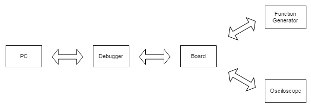

## DAVE

* 통합개발환경이란?  
통합개발환경(統合開発環境, Integrated Development Environment, IDE)은 코딩, 디버그, 컴파일, 배포 등 프로그램 개발에 관련된 모든 작업을 하나의 프로그램 안에서 처리하는 환경을 제공하는 소프트웨어이다. 종래의 소프트웨어 개발에서는 컴파일러, 텍스트 편집기, 디버거 등을 따로 사용했다. 이러한 프로그램들을 하나로 묶어 대화형 인터페이스를 제공한 것이 통합 개발 환경이다. 최근의 통합 개발 환경(IDE)은 그래픽 사용자 인터페이스(GUI) 응용 프로그램 개발용 고속 개발 도구가 많다.
* DAVE는 통합개발환경 그 이상이다.  
DAVE는 XMC를 위한 코딩, 컴파일, 링킹, 디버깅 뿐만 아니라 하드웨어를 손쉽게 사용할 수 있는 Infineon 사의 소프트웨어 라이브러리를 관리할 수 있는 환경또한 제공하고 있다. 최근의 32-bit 급 마이크로컨트롤러는 전통적인 방법으로 레지스터 수준에서 프로그래밍 하기에는 너무 복잡하기 때문이다. 이 소프트웨어 라이브러리를 사용하면 XMC 패밀리 내의 소프트웨어의 이식성을 향상할 수 있을 뿐만 아니라 적절한 소프트웨어 개발 기법을 사용하면 다른 종류의 마이크로컨트롤러로도 쉽게 이식할 수 있게 된다.
* DAVE와 이클립스  
DAVE는 대표적인 통합개발환경인 이클립스(Eclipse)를 기반으로 개발되었다. 이클립스는 다양한 플랫폼에서 쓸 수 있으며, 자바를 비롯한 다양한 언어를 지원하는 프로그래밍 통합 개발 환경을 목적으로 시작하였으나, 현재는 OSGi를 도입하여, 범용 응용 소프트웨어 플랫폼으로 진화하였다. 자바로 작성되어 있으며, 자유 소프트웨어이지만 막강한 기능을 자랑한다. 월식(蝕, 일식 또는 월식)을 뜻하는 이클립스란 이름은 자바를 개발한 회사의 Sun이란 이름을 염두에 두었다는 말도 있으며, 원래 마이크로소프트와 비주얼 스튜디오 생태 시스템을 겨냥한 것이라는 발표도 있었다. 원래 IBM의 웹스피어 스튜디오 애플리케이션 디밸로퍼(WebSpheare Studio Application Developer)란 이름으로 개발되었던 것인데, 엔진부분을 오픈소스로 공개한 것을 기반으로 지금의 이클립스로 발전해 왔다.  

### 프로젝트 생성 및 관리

* 프로젝트란?
프로젝트란 효율적인 관리를 위해서 연관된 파일과 설정들을 모은 것이다.

* Project 생성
    - 상단의 File 메뉴에서 [New]-[DAVE Project]를 선택한다.
    - 프로젝트의 이름을 입력하고 프로젝트 타입은 DAVE CE Project를 선택한다.
    - XMC4500-F100x1024 보드를 선택하고 Finish를 누른다.
    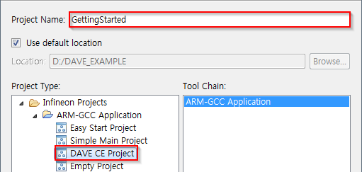

* 프로젝트 불러오기
    - 상단의 File 메뉴에서 import를 선택한다.  
    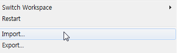
    - Existing Projects into Workspace를 선택한다.   
    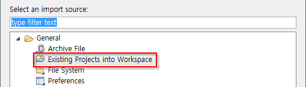
    - 아래의 그림과 같이 Browse를 선택하고 프로젝트가 있는 폴더위치를 설정한다. 그리고 Import 하고자 하는 프로젝트를 체크하고 Finish를 누른다.  
    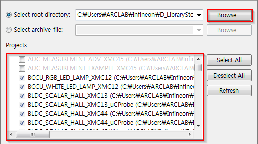
    - 위의 그림의 폴더 위치는 DAVE가 제공하는 예제코드의 위치이다. 이 곳에서 유용한 예제코드를 불러올 수 있다.

> 예제코드 다운로드
> 예제코드를 불러오기 위해서는 먼저 예제코드를 다운로드 해야 한다. 다운로드 하기 위해서는 상단의 [Help] - [Install DAVE APP/Example/Device Library]에서 아래의 그림과 같이 DAVE Project Library Manager를 선택하면 DAVE에서 제공하는 예제코드 목록이 나타난다. 여기서 필요한 예제코드를 체크하여 다운로드 할 수 있다.
> 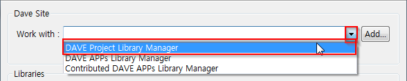


* 헤더파일과 소스파일 추가
    - 상단의 File메뉴에서 [New]-[Other]을 선택한다.
    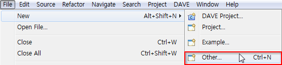
    - 아래 그림과 같이 C/C++에서 헤더파일과 소스파일을 프로젝트에 추가 할 수 있다.
    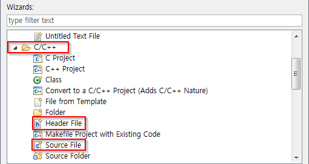

* 프로젝트 활성화
    - 작업하고자 하는 프로젝트의 마우스 우클릭 메뉴에서 Set Active Project를 선택하여 활성화한다. 활성화 된 프로젝트의 이름은 bold체가 된다.  
    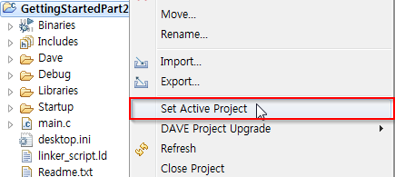

* 프로젝트의 디버그/릴리즈 설정
    - 프로젝트의 디버그 설정이란 프로그램을 디버깅 관련 기능을 사용할 수 있도록 컴파일 시 컴파일 옵션들을 자동으로 설정하는 기능이다.
    - 프로젝트의 릴리즈 설정이란 프로그램을 배포하기 위해 코드를 최적화하여 컴파일 하는 설정이다. 릴리즈 설정으로 컴파일 시 디버깅 관련 옵션은 모두 제외되어 디버깅할 수 없다.
    - 마우스 우클릭 메뉴에서 [Build Configurations]-[Set Active]에서 프로젝트의 빌드 설정을 변경 할 수 있다.
    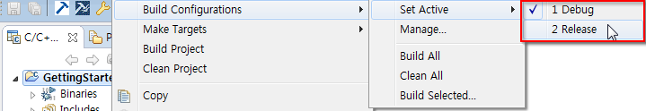

## 컴파일러(Compiler)

DAVE에서는 GCC를 기반으로 하는 ARM 프로세서용 Cross-compiler를 사용하고 있다. GNU 컴파일러 모음 (GCC)은 다양한 프로그래밍 언어를 지원하는 GNU 프로젝트에 의해 생성 된 컴파일러 시스템이다. GCC는 GNU toolchain의 핵심 구성 요소이다. FSF (Free Software Foundation)는 GNU General Public License (GNU GPL)에 따라 GCC를 배포하고 있다. GCC는 도구와 예제로서 자유 소프트웨어의 성장에 중요한 역할을 담당해 왔다. 원래 GNU C 컴파일러라는 이름으로 C와 C++ 프로그래밍 언어 만 처리했을 때 GCC 1.0은 1987 년에 발표되었다. 나중에 Objective-C, Objective-C ++, Fortran, Java, Ada 및 Go 용으로 개발되었다. GCC는 다양한 프로세서 아키텍처로 이식되었으며 무료 및 독점 소프트웨어 개발을위한 도구로 널리 배포된다. GCC는 ARM 기반의 임베디드 시스템 뿐만 아니라 AMCC, Freescale Power Architecture 기반 칩에서도 사용할 수있다.  

### 컴파일러 설정
사용자가 코드를 컴파일 할 때 프로그램 최적화 옵션, 디버깅 관련 옵션 등 많은 옵션설정이 필요하다. DAVE에서는 이러한 설정들을 GUI 환경에서 설정하고 최종 컴파일러 실행 명령어를 생성한다.

* 컴파일러 설정창 열기
    - 상단의 Project 메뉴에서 Properties를 선택한다.  
    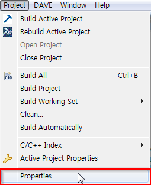
    - 아래의 그림과 같이 메뉴들을 선택하면 C Compiler 설정을 확인 할 수 있다.
    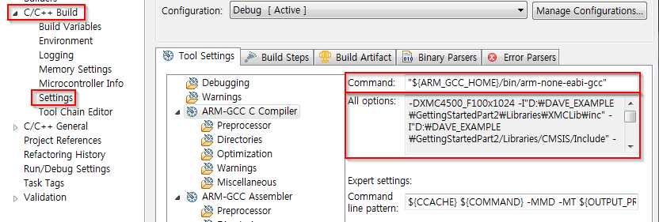

* 컴파일러 설정 요소
    - 위의 그림에서 ARM-GCC C Compiler를 선택하면 우측에 Command와 All options가 나타난다. Command는 실제로 사용할 컴파일러 프로그램을 나타내고 All options는 컴파일 실행 시 사용할 옵션들이다. 이 옵션들은 좌측의 Preprocessor, Directories, Optimization, Warnings, Miscellaneous 탭에서 설정한 정보들이 반영된다.
    - Preprocessor에서는 컴파일 과정에서 심볼을 정의할 수 있다. 일반적으로 이 과정에서 정의한 심볼을 통해서 타겟 보드를 구분한다.
    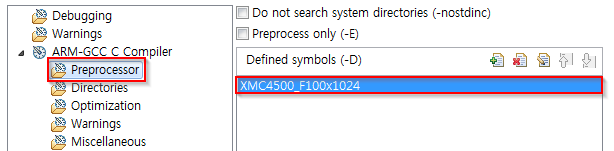
    - Directories에서는 컴파일 할 파일들의 위치를 설정한다.
    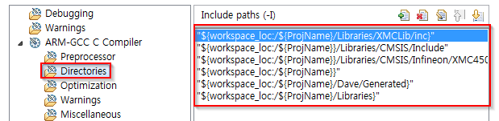
    - Optimization에서는 실행 파일의 최적화 정도를 설정한다.
    - Warnings에서는 컴파일 시 버그를 출력하는 정도를 조정한다.
    - Miscellaneous에서 사용할 언어표준, 소수 연산관련 설정한다.

### 빌드(Build)
빌드란 소스 코드 파일을 컴퓨터에서 실행할 수 있는 독립 소프트웨어 가공물로 변환하는 과정을 말한다. 따라서, 컴파일도 빌드의 한 과정으로 볼 수 있다.

* 프로젝트를 빌드 하기 위해서 아래그림과 같이 상단의 도구모음에서 1번 또는 2번을 사용하면 된다. 1번은 변경된 파일만 다시 컴파일하여 실행파일을 만든다. 반면에, 2번은 모든 파일을 컴파일하여 실행파일을 만든다.
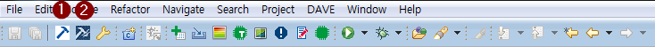
* 빌드를 성공하면 아래의 그림 같은 결과를 콘솔에서 확인 할 수 있다.
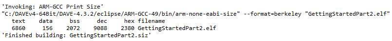

## 디버거(Debugger)

DAVE는 eclipse 를 기반으로 하므로 GCC에서 기본으로 채택하고 있는 GDB를 기반으로 ARM 프로세서의 디버깅 기능을 사용하고 있다. GDB와 ARM 프로세서의 기능을 활용하여 저가의 디버깅 시스템을 구축할 수 있다.  

* GDB의 특징  
일반적으로 GDB라고 불리는 GNU 디버거는 gdb를 실행 파일로 지정하며, GNU 운영 체제의 표준 디버거이다. 그러나 GNU 운영체제에만 사용되는 것은 아닙니다. Ada, C, C ++, Objective-C, Free Pascal, Fortran, Java와 부분적으로 다른 많은 프로그래밍 언어에서 작동하는 많은 유닉스 계열 시스템에서 작동하는 휴대용 디버거입니다.  

* ARM 프로세서의 디버깅 지원
최신의 모든 ARM 프로세서에는 하드웨어 디버깅 기능이 포함되어있어 소프트웨어 디버거가 리셋에서 시작하여 중단, 스테핑 및 코드 중단 점과 같은 작업을 수행 할 수 있다. 일부 최신 코어는 ARM의 자체 2-wire "SWD"프로토콜을 선택적으로 지원하지만 JTAG 지원을 사용하여 이러한 기능을 구현한다.

### 디버거 설정
DAVE에서 디버거를 사용하기 위해서는 보드와의 연결, 프로그램 이미지 파일 등의 설정이 필요하다.

* 아래 그림과 같이 상단 도구모음에서 Debug Configurations를 선택하여 디버그 설정창을 확인 할 수 있다.
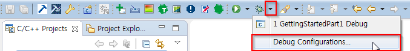

* Debug Configurations에서 좌측의 GDB SEGGER J-Link Debugging을 선택한다. 그리고 우측의 Main 탭에서 프로젝트명과 C/C++ Application이 올바르게 설정됐는지 확인한다. 그 후 하단의 Debug 버튼을 누르면 Debug화면으로 전환된다.
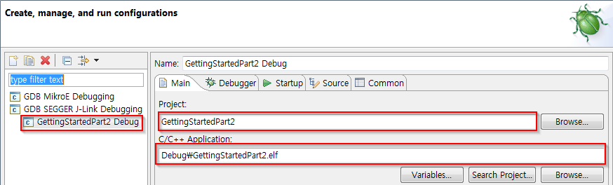

### 디버거 활용: 실행 및 중지
* DAVE Debugger 진입 시 상단 도구모음에는 다음 그림과 같은 버튼들이 추가된다. 
  * 1번은 프로그램을 시작하는 버튼이다. 
  * 2번은 프로그램을 일시정지, 
  * 3번은 프로그램을 완전 정지하는 버튼이다. 
  * 4번과 5번은 프로그램을 한 스탭 씩 실행하는 버튼이다. 둘의 차이점은 다음 프로그램 스탭이 함수인 경우 4번은 함수 내부로 들어가서 한 스탭씩 프로그램을 실행한다. 반면에 5번은 함수 루틴 전체를 한 스탭으로 실행한다.  
    

### 디버거 활용: Breakpoint와 변수값 확인
* Breakpoint는 특정 위치에서 프로그램의 실행을 정지시키는 기능이다. 아래의 그림에서는 PWM_SetFreq(&dhPWM_1, u32NewFreq) 함수가 실행되기 전 프로그램은 일시 정지된다. Breakpoint는 아래 그림의 표시 된 영역에서 정지시키고자 하는 라인에 맞춰 더블클릭하여 설정한다.  
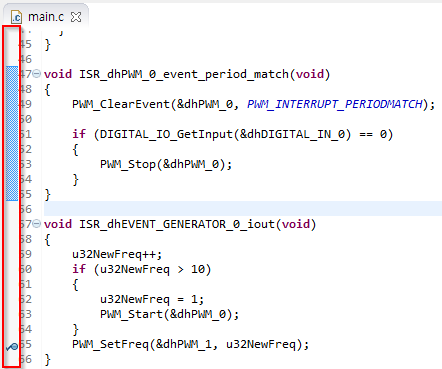
* 디버거에서 프로그램 실행 중 변수 값을 확인 할 수 있다. 변수 값을 보기 위해서는 아래 그림과 같이 Expressions 탭을 추가해야 한다. Expressions 탭에서 Add new expression을 누르고 확인하고자 하는 변수 이름을 입력한다.  
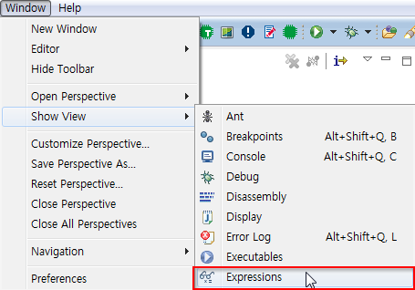
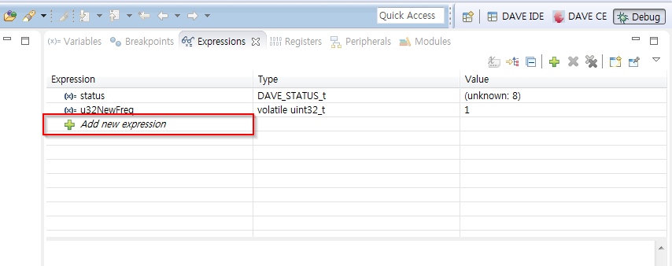
## 개발 보드(Board)

* 개발 보드 혹은 평가용 보드  
마이크로컨트롤러 개발 보드는 마이크로컨트롤러와 엔지니어가 보드의 마이크로컨트롤러에 익숙해지고 이를 프로그래밍하는 법을 배우는 데 필요한 최소한의 지원 로직을 포함하는 인쇄 회로 기판이다. 흔히 평가용 보드(evaluation-boards)라는 이름으로 많이 불리기도 한다.
가정용 컴퓨터와 같은 범용 시스템과는 달리 일반적으로 개발 보드에는 사용자 인터페이스 전용 하드웨어가 거의 또는 전혀 포함되어 있지 않다. 직렬 포트를 통해 플래시 메모리로 프로그램을 다운로드하거나 이전 시스템의 소켓에 프로그램 가능한 메모리의 일부 형태를 다운로드하는 것과 같이 사용자가 제공 한 프로그램을 받아들이고 실행하는 몇 가지 조항이 있다.

XMC4500을 위한 평가용 보드 또한 여러가지가 존재한다. 실습을 위하여 최소한의 기능과 확장성을 가지고 있는 XMC4500 Relax-Lite 보드를 활용한다. 중요한 구성을 살펴보면 다음과 같다.

* XMC4500 마이크로컨트롤러 (LQFP100 package)
* 탈부착 가능한 On-board USB 디버거
* 두개의 40pin 헤더 영역
* USB를 통하여 연결할 수 있는 전원 공급부
* USB 연결 플러그
* 2개의 사용자 버튼과 2개의 사용자 LED
* Ethernet Physical 플러그(주, XMC4500 Relax 보드)
* microSD 카드 슬롯(주, XMC4500 Relax 보드)

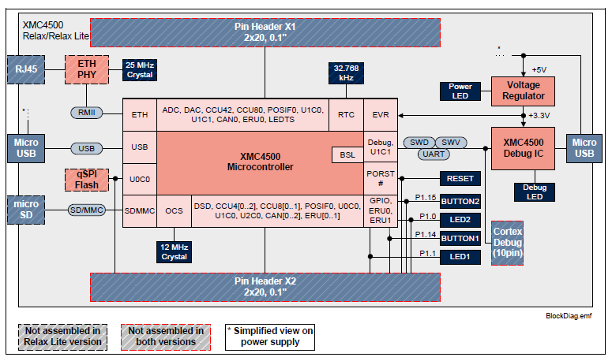

사진에서 볼 수 있는 바와 같이 지극히 적은 개수의 소자들로 구성된 보드이다. 이는 XMC4500 마이크로컨트롤러가 내부적으로 많은 기능을 가지고 있어 높은 집적도를 가지고 있기 때문이다. 디버거 또한 다른 XMC4500 칩을 사용하여 구성하여 놓았다. 그러므로 개발자는 가장 간단하게는 USB 케이블만 연결하면 개발 보드에 전원을 공급함과 동시에 디버깅을 수행할 수 있게 된다. 개발이 끝난 후에는 디버거 부분을 절단하여 더욱 작은 크기로 시스템을 구성할 수도 있다.

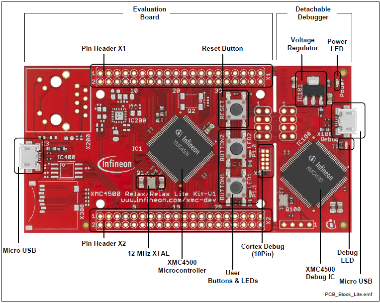

핀 헤더 X1 및 X2는 평가 보드를 확장하거나 XMC4500에서 측정을 수행하는 데 사용할 수 있다. 핀 헤더에서 사용 가능한 GPIO 신호를 나타내고 있다. 이 테이블은 또한에 개발보드 PCB의 바닥면에 인쇄되어 있어 더욱 쉽게 시스템을 구성할 수 있도록 도와주고 있다.

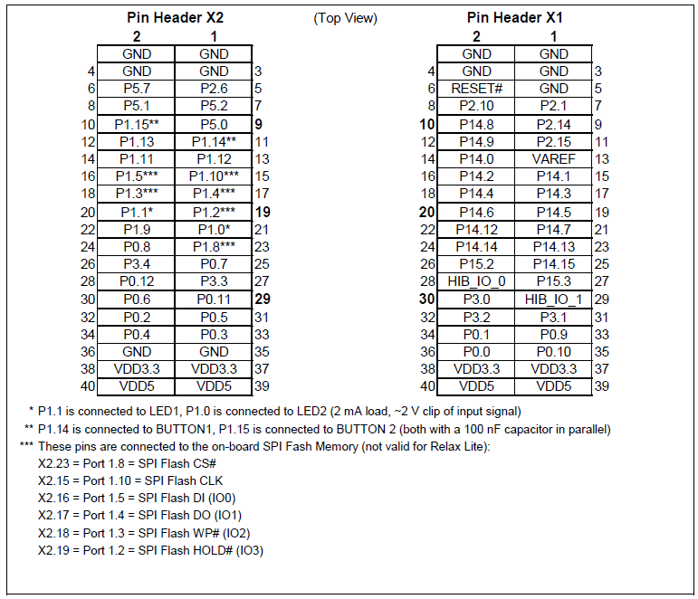

## 실습

1. 프로젝트 개발 이력을 관리해보자.
* GettingStated 프로젝트에 Readme.txt라는 파일을 만들고 현재 프로젝트 이름과 프로젝트에 대한 설명을 해보자.
* 오늘 날짜와 변경사항들을 기록해보자.
2. 주파수의 증분을 변경하여 보자.
* GettingStated 프로젝트의 dhPWM_0 APP의 주파수를 10 Hz로 변경하자. LED1에 어떠한 변화가 일어났는가?
3. 브레이크 포인트를 넣고 변수값의 변화를 확인하자.
* GettingStated의 디버그모드에서 u32NewFreq 변수를 Expressions 탭에 등록하자.
* ISR_dhPIN_INTERRUPT_0 함수의 ```PWM_SetFreq(&dhPWM_1, u32NewFreq);``` 프로그램 라인에서 Breakpoint을 설정해보자.
* 프로그램을 실행하고 BUTTON2를 눌러보자. u32NewFreq의 값에 어떠한 변화가 생겼는가?
