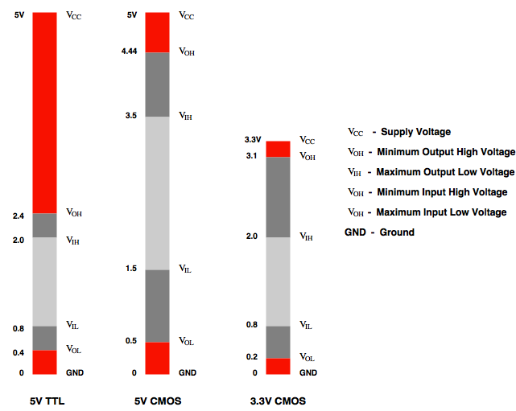
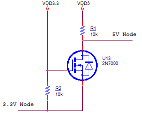

# Digital Signal Interface

## Objective

* TTL/CMOS 로직게이트에 대한 기본적인 특성 이해
* 디지털 디바이스 인터페이스 방법 이해
  * 이 문서에서는 많은 로직 패밀리 중 5V CMOS, 5V TTL, 3.3V CMOS 간 인터페이스를 중점적으로 다룰 것이다.
  * 아두이노는 5V CMOS 디바이스이며, XMC4500은 3.3V CMOS 디바이스이다. 그리고 아두이노 키트 중 5V TTL 디바이스도 일부 있기 때문이다.

## Reference

* TTL in 위키피디아 - https://en.wikipedia.org/wiki/Transistor%E2%80%93transistor_logic
* CMOS in 위키피디아 - https://en.wikipedia.org/wiki/CMOS
* Texas Instruments - Logic Guide(sdyu001ab) - [http://www.ti.com/lit/sg/sdyu001ab/sdyu001ab.pdf](http://www.ti.com/lit/sg/sdyu001ab/sdyu001ab.pdf)
* NXP - Level shifting techniques in I2C bus design(AN10441) - [http://www.nxp.com/documents/application_note/AN10441.pdf](http://www.nxp.com/documents/application_note/AN10441.pdf)

## Basic theory

### Transistor-transistor logic(TTL) gate 특징

* 바이폴라 트랜지스터와 저항을 사용하여 만든 로직게이트
* 정지 상태에서 전력소모가 많다.
* 운용할 수 있는 전류가 CMOS보다 크다.

### Complementary metal-oxide-semiconductor(CMOS) logic gate 특징

* Enhancement type mode N채널  FET와 P채널 FET 배열로 만든 로직게이트
* 정지 상태에서 전력소모가 작아 마이크로프로세서, 마이크로컨트롤러, SRAM 등 많은 분야에서 사용
* 노이즈에 강하다.

## TTL/CMOS 로직 패밀리 간 인터페이스 시 문제점 및 고려사항

* 위 그래프를 통해서, 로직패밀리들의 입출력 전압범위가 다른 것을 확인 할 수 있다. 그러므로 인터페이스 하기 위해서 상호 입출력 전압을 고려해야 한다. 만약 이를 고려 하지 않고 회로를 설계한다면 회로가 오작동 할 수 있다.
* 서로 다른 로직 패밀리 간 인터페이스 하기 위해서 출력 디바이스의 출력 전압으로 입력 디바이스 상태를 High 또는 Low 상태로 올바르게 만드는 것이 중요하다. 
  * 예를 들어, 3.3V  CMOS 디바이스 출력을 5V CMOS 디바이스 입력 시 회로가 오작동 할 수 있다. 그 이유는 3.3V CMOS 디바이스의 High 상태 최대 출력 전압이 3.3V이지만 5V CMOS 디바이스의 상태를 High로 만들기 위한 최소 전압은 3.5V이므로 3.3V CMOS 디바이스 출력으로 5V CMOS 디바이스의 상태를 High로 만들 수 없기 때문이다.
* 따라서 디지털 로직 패밀리간 인터페이스 시 다음의 사항을 확인해야 한다.
  - 입력 디바이스의 상태를 올바르게 High상태로 만들기 위해서 출력 디바이스의 $$ V_{OH} $$가 입력 디바이스 $$ V_{IH} $$보다 커야 한다.
  - 입력 디바이스의 상태를 올바르게 Low상태로 만들기 위해서 출력 디바이스의 $$ V_{OL} $$가 입력 디바이스 $$ V_{IL} $$보다 작아야 한다.

## 서로 다른 로직 패밀리 간 인터페이스

- 같은 로직 패밀리간 인터페이스 시 추가회로가 필요 없지만,서로 다른 로직 패밀리 간 인터페이스 하기 위해서 추가회로가 필요 할 수 있다.
- 추가회로에는 전압분배회로, Bi-Directional level shifter 회로 등을 사용하거나 전압 레벨 시프터(Voltage Level Shifter)와 같은 IC소자가 있다.
- 추가회로는 종류가 다양하며 상황을 고려하여 올바른 회로 선택이 필요하다.
- Bi-directional level shifter를 소개 할 것이다. 이 회로는 특별하게 3.3V와 5V 로직 패밀리 간 양방향 입출력 할 수 있는 회로이다.

### 5V CMOS와 5V TTL 인터페이스

* 5V CMOS 출력 -> 5V TTL 입력

  5V CMOS $$ V_{OH} $$가 5V TTL $$ V_{IH} $$보다 높고, 5V CMOS $$ V_{OL} $$이 5V TTL $$ V_{IL} $$보다 낮으므로 추가회로 없이 인터페이스 가능하다.

* 5V TTL 출력 -> 5V CMOS 입력

  5V TTL $$ V_{OH} $$가 2.4V로써 5V CMOS $$ V_{IH} $$ 3.5보다 낮다. 이 경우에는 다음과 같은 추가회로를 사용하여 인터페이스 할 수 있다.

  * 74HCT245 소자 사용
  * 5V TTL 출력 단에 풀업 저항 사용
  * MC14504B 또는 CD4504BE 소자 사용

### 3.3V CMOS와 5V TTL 인터페이스

* 3.3V CMOS 출력 -> 5V TTL입력

  3.3V CMOS $$ V_{OH} $$가 5V TTL $$ V_{IH} $$보다 높고, 3.3V CMOS $$ V_{OL} $$이 5V TTL $$ V_{IL} $$보다 낮으므로 추가회로 없이 인터페이스 가능하다.

* 5V TTL 출력 -> 3.3V CMOS 입력

  5V TTL 출력 최대 전압이 5V이다. 이는 3.3V CMOS 최대 입력 전압보다 높기 때문에 전압을 낮추는 회로가 필요하다. 이 때 사용할 수 있는 회로로는 전압분배회로가 있다.

### 3.3V CMOS와 5V CMOS 인터페이스

* 3.3V CMOS출력 -> 5V CMOS 입력

  3.3V CMOS $$ V_{OH} $$가 5V CMOS $$ V_{IH} $$보다 작기 때문에, 전압을 증가시키는 회로가 필요하다.

  * 74HCT245 소자 사용

* 5V CMOS 출력 -> 3.3V CMOS 입력

  5V CMOS 출력 전압의 범위가 3.3V CMOS 입력 전압 범위보다 크다. 따라서 전압을 낮추는 회로가 필요하다. 이때 사용할 수 있는 회로로는 전압분배회로가 있다.

### Bi-directional level shifter

- Bi-directional level shifter는 3.3V 로직패밀리와 5V 로직패밀리간 양방향 입출력 할 수 있는 회로이다.
- XMC4500 디지털 I/O 입출력 모드 상관없이 5V 로직패밀리와 인터페이스 할 수 있다.
  - 현재 대부분의 MCU는 디지털 I/O를 설정을 통해 입력 또는 출력으로 선택 할 수 있다.
  - Bi-directional level shifter는 양방향성을 가지기 때문에 이 회로를 사용하면 XMC4500 디지털 I/O 입출력 모드에 관계 없이 5V 로직패밀리와 인터페이스 할 수 있다.
  - 아두이노와 3.3V 로직패밀리 간 인터페이스 용도로도 사용 할 수 있다.
- 이 회로를 구현하기 위한 방법으로 TXS0108EPWR 전압레벨시프터 IC 소자를 이용하는 방법과 저항과 FET를 사용하여 구현하는 방법이 있다. 이 문서에서는 저항과 FET를 사용하여 구현하는 방법을 자세히 소개 할 것이다.

#### Bi-directional level shifter 회로 동작 원리 설명

* 3.3V Node 출력 -> 5V Node 입력

  * 3.3V Node 전압이 0V이면

    $ V_{GS} $가 3.3V이므로 FET는 도통상태가 되므로 5V Node 전압은 3.3V Node전압과 같아진다. 따라서 5V Node 전압은 0V가 된다.

  * 3.3V Node 전압이 3.3V이면

    $ V_{GS} $가 0V이므로 FET는 차단상태가 된다. 따라서 5V Node 전압은 5V가 된다.

* 5V Node 출력 -> 3.3V Node 입력

  * 5V Node 전압이 0V이면

    이전 3.3V Node 의 전압이 3.3V이었다면:  FET는 Off 상태이고 전류는 R2와 FET의 다이오드를 통하여 0V 인 5V Node로 흐르게 된다.  그러므로 3.3V Node는 다이오드의 순방향 전압강하 값(약 0.7V)가 된다.  이때 $V_{GS} $ 값이 FET threshold 전압보다 커지게 되고 FET는 on 상태로 바뀌게 된다.  그러므로 3.3V Node 전압은 5V Node 전압이 0V가 된다.

    3.3V Node의 전압이 0V 라면: FET는 On 상태가 되고 3.3V Node 전압은 5V Node 전압과 같은 0V가 유지된다.

  * 5V Node의 전압이 5V이면

    3.3V Node 전압이 0V 이었다면: FET는 on 상태가 이고, 그러므로 3.3V Node 는 5V Node의 전압과 같은 값이 되기 위해 증가하게 된다.  3.3V Node 전압이 증가하게 되면 $V_{GS}$ 전압이 FET threshold 접압보다 작게 되고, 이때 FET는 off 된다.  FET가 off 되면 3.3V Node는 VDD3.3 과 같은 전압을 갖게 된다.

    3.3V Node 전압이 3.3V 라면: FET는 off 상태가 되고, 3.3V Node는 VDD3.3 과 같은 전압을 유지하게 된다.

