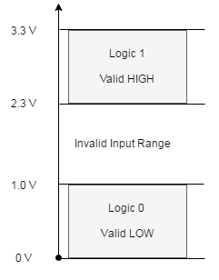
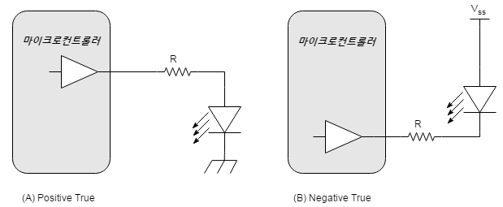
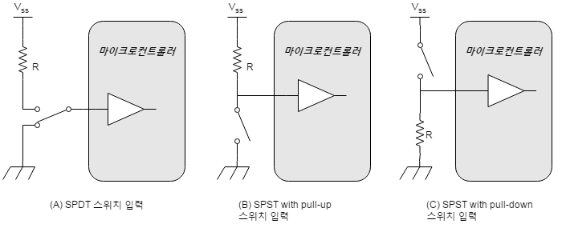
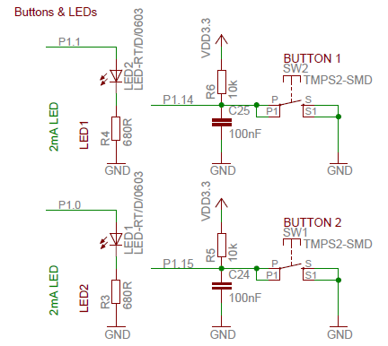
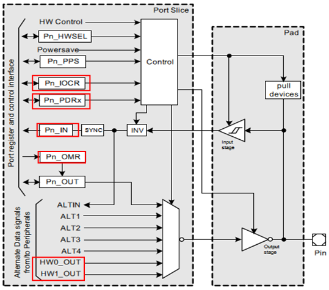
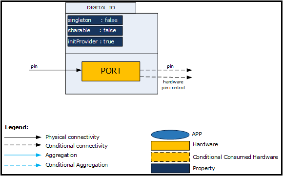
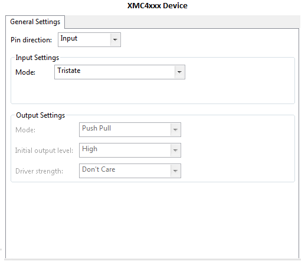
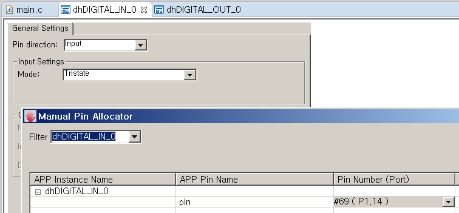
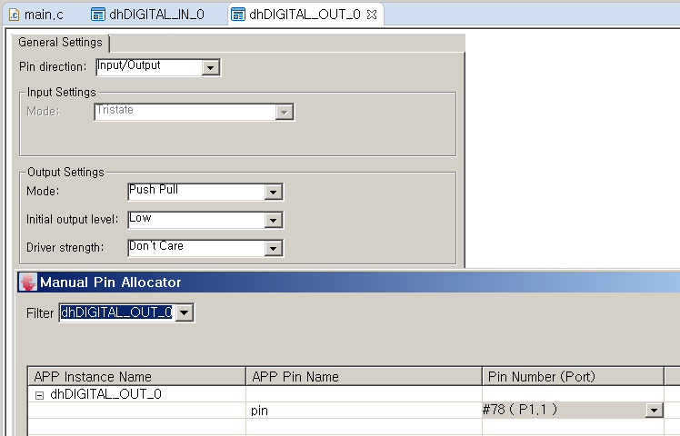

# Digital IOs

## 목적
* 디지탈 입출력의 원리 대하여 이해한다.
* 디지탈 입출력 DAVE APP과 XMC4500 의 특징을 이해한다.

## 참고자료

* [XMC4500 Reference Manual v1.5 2014-04]
    - xmc4500_rm_v1.5_2014_04.pdf
* [XMC4500 Data Sheet v1.4 2016-01]
    - Infineon-XMC4500-DS-v01.04-EN.pdf

* [KIT_XMC45_RELAX_V1](http://www.infineon.com/cms/en/product/evaluation-boards/KIT_XMC45_RELAX_V1/productType.html?productType=db3a304437849205013813b23ac17763#ispnTab1)
        - Board_Users_Manual_XMC4500_Relax_Kit-V1_R1.2_released.pdf
* [DIGITAL IO] (DAVE APP on-line help)

## 디지탈 입출력의 원리

외부세계와 마이크로컨트롤러가 정보를 주고 받을 경우에는 외부세계의 정보를 전기적인 신호로 변환하여 마이크로컨트롤러와 연결하게 된다. 전기적인 신호에 담겨있는 정보의 종류에 따라서 아날로그(Analog), 디지탈(Digital), 그리고 타이버(Timer)로 구분할 수 있다. 이 이외에도 마이크로컨트롤러는 다른 IC나 컴퓨터 시스템과 정보를 주기 위하여 통신(Communication)을 하기도 한다.  이와 같은 여러가지 인터페이스 종류 중에서 가장 간단한 디지탈 입출력 방법을 알아보도록 한다.

### 전압과 논리값
컴퓨터는 여러개의 0과 1로 표현되는 이진수정보를 처리하여 동작한다. 그러므로 실제 외부의 전기 신호를 0과 1로 분할하는 기준이 필요하다. 이 기준에 따라 하드웨어를 구성할 때는 전기 신호가 이 기준에 적합하게 발생하도록 구성하여야 하고, 소프트웨어를 구성할 때는 구체적인 하드웨어의 정보는 신경쓰지 않고 0 또는 1로 분할하여 사용할 수 있게 된다.

일반적인 디지탈 회로에서는 논리값은 전압값으로 표현된다. 이와같이 디지탈 회로를 구성하는 장점에 대하여 생각해보자. 디지탈 회로로 구성된 경우에는 정확한 전압값을 알 필요가 없다. 대신에 우리는 특정 범위의 값과 논리값을 나타내는 것으로 처리하게 된다. 이렇게 함으로써 신호에 노이즈가 섞여서 들어오게 되는 경우나 전원의 불안정등으로 신호의 외곡이 발생하는 경우에도 논리값을 정확하게 얻을 수 있게 된다.  
XMC는 3.3V 전원으로 동작하고 구체적인 입력전압의 범위를 비롯한 전기적인 특성은 데이타시트에 수록되어 있다.  일반적인 3.3V 동작 디지탈회로에서 입력을 받는 경우 1.0V 보다 낮은 전압은 0, 혹은 LOW, 으로 인식하고 2.3V 보다 높은 전압은 1, 혹은 HIGH, 로 인식한다. 출력하는 경우에는 논리값 1이 출력하는 경우는 3.3V의 전압이, 논리값 0을 출력하는 경우에는 0V의 전압이 전기적으로 생성되는 것으로 생각할 수 있다. 그러나 외부회로가 구성되어서 전류가 많이 흐르게 되는 경우에는 이 값이 변할 수 있게 되고, 자세한 사항은 데이타시트를 참고하도록 한다.  


### 간단한 입출력 회로

디지탈 출력을 사용하는 가장 간단한 예는 LED를 점멸하는 것이다. LED를 켜기 위해서는 적절한 전류, 일반적으로 수mA 에서 수십mA,가 LED에 흐르게 하면 된다. LED의 극성을 고려하여 다음과 같이 회로를 구성하면 전류를 흘릴 수 있게 된다. 직렬연결되 저항은 LED에 흐르는 전류를 제한하여 LED의 소손을 방지하며 적절한 밝기를 유지할 수 있도록 하는 용도로 사용된다. 이 저항의 값은 다이오드의 순방향 전압강하값과 마이크로컨트롤러 출력단의 전압을 고려하여 설계할 수 있다. 자세한 사항은 전자회로 교과목을 참고하기 바란다.

(A)와 (B) 구성 모두 LED 의 점멸을 가능하게 할 수 있지만, 켜고 끄는 마이크로 컨트롤러의 출력값이 다르게 된다. (A) 구성에서는 디지탈출력 값이 1일 경우 LED 가 켜지게 되고, (B) 구성에서는 그 반대로 동작하게 된다. 이러한 논리관계를 각각 Positive True 로직, Negative True 로직이라 부르며 소프트웨어 개발시 정확하게 구분하여야 한다.



가장 간단한 디지탈 입력 신호 처리의 예는 스위치로 부터 HIGH/LOW 의 신호를 직접 받는 것이다. 디지탈입력 신호를 만들어 주기위해서는 스위치를 사용하여 전기적으로 HIGH 범위에 있는 전압값과 LOW 범위의 전압값을 발생할 수 있는 회로를 구성하여야 한다. 스위치의 접점의 형태에 따라서 (A) 혹은 (B),(C)와 같은 형태로 이러한 전압을 만들어 낼 수 있다. 일반적으로 HIGH/LOW의 두가지 상태만을 만들어 내야 하는 경우라면 (B), (C)와 같은 SPDT 스위치를 사용한다. (B)와 (C)는 앞서 설명한 디지탈출력의 경우와 마찬가지로 각각 Positive/Negative True 로직의 대응관계를 갖게 된다. 일반적인 경우에는 전원이 연결된 상태에서 디지탈입력 단자 사이에 전류를 제한할 수 있는 직렬저항이 들어간 (B)의 회로를 사용한다.



* 참고: Positive True vs. Negative Ture  
디지탈 회로상의 High 가 논리상의 참 혹은 거짓으로 대응되게 관계를 생성할 수 있으므로 정확하게 고려하지 않으면 많은 혼돈을 일으키게 된다. 디지탈논리는 참과 거짓 두가지 상태만 존재하므로 이 둘중 한쪽 상태만 정의하면 다른쪽 상태도 자연스럽게 정의되게 된다.  
우리가 일반적으로 Positive, High, 혹은 1의 값을 참(True)로 대응하는 관계를 사용하고 이를 **Positive True, Positive Assertion** 로직이라 부른다. 이에 비하여 회로의 구성상 필요성에 따라 거짓(False)로 대응하는 관계를 구성하였을 경우를 **Negative True, Negative Assertion** 로직이라 말한다.

  | 로직값 | Positive True Logic | Negative True Logic |
  | -------- | -------- | -------- |
  | 참(True)   | HIGH, 1   | LOW, 0   |
  | 거짓(False)   | LOW, 0   | HIGH, 1   |

* 참고: SPDT, SPST
pole 및 throw라는 용어는 스위치 접점 변형을 설명하는데도 사용된다. "Pole"의 수는 단일 물리적 액추에이터에 의해 제어되는 전기적으로 분리 된 스위치의 수이다. 예를 들어 "2-Pole"스위치는 같은 메커니즘을 통해 한 번에 열리고 닫히는 두 개의 개별적인 병렬 연결 세트를 가지고 있다. "Throw"의 수는 스위치가 각 폴에 대해 채택 할 수있는 별도의 배선 경로 수이다. Single Throw 스위치는 한 쌍의 접점이 닫히거나 열릴 수 있다. Double Throw 스위치는 두 개의 다른 접점 중 하나에 연결될 수있는 접점을 가지고 있으며, Triple Throw 는 세 개의 다른 접점 중 하나에 연결될 수있는 접점을 가지고 있다.
    - SPDT(Single Pole, Double Throw)
    - SPST(Single Pole, Single Throw)  

* 참고: Pull-up, Pull-down  
전자회로 교재 참고

### XMC4500 Relax-Lite 보드의 Digital IO 회로
실습에서 사용하는 보드의 Digital IO 부분의 회로를 살펴보면 다음과 같다.

* 디지털 출력  
Positive-True 방식으로 LED 가 구동된다.

* 디지털 입력  
SPST 방식으로 스위치가 연결되어 버튼이 눌렸을 때 Low 전압이 인가된다.
캐피시터가 병렬로 연결되어 있어서 스위칭에 의한 노이즈를 제거한다.



## DAVE APP (DIGITAL_IO)

### XMC4500 의 중요 특징

디지탈 포트 핀은 다음의 그림과 같은 구조를 가지고 있으며, *DIGITAL_IO APP* 은 다음과 같은 기능을 제공한다.

* 포트 핀을 general purpose input 혹은 general purpose input/output 용도로 설정한다.
* 다양한 IO pad 의 특성을 조정한다.
* 포트 핀을 다양한 다른 주변장치와 연결한다.(DAVE 의 HW Signal Connection 이용)



붉은색 박스로 표시된 부분은 *DIGITAL_IO APP* 으로 설정할 수 있는 레지스터들이다.

* 입력 동작: 포트 핀으로 연결된 전압을 읽어들인다. 선택적으로 inverting 할 수 있다.
    * 패드에 내부적으로 존재하는 약한 pull-up 혹은 pull-down 회로를 설정한다.
    * 입력 패드의 히스테리시스 특성을 설정한다.

* 입출력 동작: 출력 드라이버가 활성화 되고, 포트 핀으로 출력값을 내보낸다.
    * Open-drain 혹은 push-pull 방식으로 출력 핀을 설정한다.
    * 출력 패드의 드라이버 강도를 설정한다.
    * (상세한 전기적인 설정 값은 파라메터 부분을 참고)

* Hardware Controlled 동작: 연결되는 주변장치에 따라서 핀이 조정된다.
    * HWSEL 비트필드를 설정한다.
    * 패드의 드라이버 강도를 설정한다.
    * 입력 패드의 히스테리시스를 설정한다.
    * 입력 핀의 자료 극성을 설정한다.

### 아키텍쳐(Architecture)



위 다이어그램은 DIGITAL_IO APP의 내부 소프트웨어 아키텍처를 나타낸다. DIGITAL_IO APP 인스턴스는 그림과 같이 고정 속성을 갖는 DAVE ™ 프로젝트에 존재한다. 이 APP의 각 인스턴스는 MCU에서 PORT 핀을 구성한다. DIGITAL_IO APP는 주변 장치 연결을위한 출력 신호도 제공한다.

인스턴스 생성 된 APP (코드 생성 후)는 GUI 구성을 사용하여 특정 데이터 구조를 생성한다. 이 데이터 구조의 이름은 APP 인스턴스 라벨을 변경하여 수정할 수 있다 (예 : 라벨을 기본 DIGITAL_IO_0에서 dhDIGITAL_IN_0(으)로 변경).

* Signals

Signal Name  | Input/Output  | Availability  | Description
--|---|---|--
pin  | Input/Output  | Input 혹은 Input/Output  | GPIO 기능
hardware pin control  | Input/Output  | Input 혹은 Input/Output  | 주변장치에 의해서 결정되는 기능  

### 설정(Configuration)


* Pin direction
    * Input: Digital Input
    * Input/Output: Digital Input/Output
    * Hardware Controlled: 연결된 주변장치에 의해서 동작되는 핀
* Input Settings: Mode
    * Tristate: 내부적인 Pull 디바이스 장치와 연결하지 않음
    * Pull Up: 내부적인 Pull Up 디바이스 활성화
    * Pull Down: 내부적인 Pull Down 디바이스 활성화
    * Continuous Sammpling Mode: 내부적인 Pull 디바이스를 활성화 하지 않은 상태에서 핀의 출력값을 연속적으로 샘플링
    * Inverted Tristate: Tristate 와 동작은 같고, 입력값이 inverted 됨
    * Inverted Pull Up: Pull Up 과 동작은 같고, 입력값이 inverted 됨
    * Inverted Pull Down: Pull Down 과 동작은 같고, 입력값이 inverted 됨
    * Inverted Continuous Sampling Mode: Continuous Sampling Mode와 동작은 같고, 입력값이 inverted 됨
* Output Settings: Mode
    * Push Pull: Push-pull 증폭단을 통하여 출력, 외부에 pull 디바이스 연결 없이 Low 와 High 를 구동할 수 있다.
    * Open Drain: 외부에 Pull up 장치를 연결하여 사용, 외부 회로가 없는 상태에서는 Low 전압 구동만 가능하다.
* Output Settings: Initial output level
    * Low: 초기 출력을 Low 로 한다.
    * High: 초기 출력을 High 로 한다.
* Output Settings: Driver strength : 출력의 전기적인 특성 설정한다.(전력소모, 노이즈특성, 크로스토크 등등을 고려)
    * Don't Care: 특별한 고려사항이 없는 경우
    * Weak Driver: Class A1 패드 사용
    * Medium Driver: Class A1 패드 사용
    * Strong Driver Soft Edge: Class A1+, A2 패드 사용
    * Strong Driver Slow Edge: Clss A1+, A2 패드 사용
    * Strong Driver Sharp Edge: Class A2 패드 사용
    * Strong Driver Medium Edge: Class A2 패드 사용

* [참고] XMC 패드 특성과 클래스
    * XMC 에서 사용되는 패드의 종류를 요약하면 다음과 같다.

    Class  | Speed Grade  | Usage  |
    --|---|---|
    A1  | 6 MHz  | GPIO  |
    A1+  | 25 MHz  | serial I/O  |  
    A2  | 80 MHz  | external bus  |    

    * 패드의 드라이버 모드에 따라서 다음과 같은 전압파형을 갖게 된다.

    

### 자료구조
DIGITAL_IO App 을 활용하기 위한 가장 기본적인 자료형은 다음의 *DIGITAL_IO_t* 이다.
이 구조체를 활용하여 포트번호, GPIO의 속성, 핀번호 등등 DAVE Configuration 에서 설정한 사용자의 정보를 관리하게 된다.

```
typedef struct DIGITAL_IO
{
  XMC_GPIO_PORT_t *const gpio_port;             /**< port number */
  const XMC_GPIO_CONFIG_t gpio_config;          /**< mode, initial output level and pad driver strength / hysteresis */
  const uint8_t gpio_pin;                       /**< pin number */
  const XMC_GPIO_HWCTRL_t hwctrl;               /**< Hardware port control */
} DIGITAL_IO_t;
```

각 API(Application Programming Interface) 함수들의 정상적인 동작 유무를 확인하기 위하여 리턴값으로 *DIGITAL_IO_STATUS_t* 형의 자료를 돌려주게 된다.
```
typedef enum DIGITAL_IO_STATUS
{
  DIGITAL_IO_STATUS_OK = 0U,/**< 0=Status OK */
  DIGITAL_IO_STATUS_FAILURE = 1U/**< 1=Status Failed */
} DIGITAL_IO_STATUS_t;
```
### 메쏘드(Method)

디지털 IO를 처리하는 함수는 대략 4가지로 구분지을 수 있다.

* 첫번째로 사용자는 크게 의식하지 않지만 코드 생성과 관련하여 DAVE APP의 버젼을 확인하기 위한 함수가 있다. (추후 다른 APP 에서는 이 버젼 확인 함수는 언급하지 않도록 하겠다)

    `DAVE_APP_VERSION_t DIGITAL_IO_GetAppVersion(void)`

* 두번째로 포트 핀을 초기화 하는 함수가 있다.

    `DIGITAL_IO_STATUS_t  DIGITAL_IO_Init (const DIGITAL_IO_t *const handler)`

* 세번째로는 출력 포트 핀을 동작시키는 함수들이다. 출력을 High/Low/Toggle 시키는 3개의 함수가 있다.

    `__STATIC_INLINE void  DIGITAL_IO_SetOutputHigh (const DIGITAL_IO_t *const handler)`

    `__STATIC_INLINE void  DIGITAL_IO_SetOutputLow (const DIGITAL_IO_t *const handler)`

    `__STATIC_INLINE void  DIGITAL_IO_ToggleOutput (const DIGITAL_IO_t *const handler)`

* 네번째로 입력 포트 핀의 값을 읽어들이는 함수이다.

    `__STATIC_INLINE uint32_t  DIGITAL_IO_GetInput (const DIGITAL_IO_t *const handler)`


### 사용예

* Digital Input 설정
사용자가 다음의 그림과 같이 디지털 입력으로 포트핀 14 번을 설정하고 Dave 로 코드를 생성한다면 다음의 코드와 같이 DIGITAL_IO_t 의 자료형으로 포트핀에 대한 구조체가 생성된다. 일반적으로 이와 같이 하드웨어를 추상화한 자료구조를 핸들러라 표현한다.

    

```
const DIGITAL_IO_t dhDIGITAL_IN_0 =
{
  .gpio_port = XMC_GPIO_PORT1,
  .gpio_pin = 14U,
  .gpio_config = {
    .mode = XMC_GPIO_MODE_INPUT_TRISTATE,

  },
  .hwctrl = XMC_GPIO_HWCTRL_DISABLED
};
```
* Digital Output 설정
사용자가 다음의 그림과 같이 디지털 출력으로 포트핀 1 번을 설정하고 Dave 로 코드를 생성한다면 다음의 코드와 같이 DIGITAL_IO_t 의 자료형으로 포트핀에 대한 구조체가 생성된다.

    

```
const DIGITAL_IO_t dhDIGITAL_OUT_0 =
{
  .gpio_port = XMC_GPIO_PORT1,
  .gpio_pin = 1U,
  .gpio_config = {
    .mode = XMC_GPIO_MODE_OUTPUT_PUSH_PULL,
    .output_level = XMC_GPIO_OUTPUT_LEVEL_LOW,

  },
  .hwctrl = XMC_GPIO_HWCTRL_DISABLED
};
```

* 설정값의 초기화
사용자는 이와 같이 DAVE APP을 설정하고 사용하면 main.c 함수에서 DAVE_Init() 함수가 호출되어 개별적인 APP 을 초기화 하지 않고 사용할 수 있다.  이 과정을 좀 더 상세히 살펴보면 다음과 같다.  

    1. main 함수에서 DAVE_Init() 함수 호출
```
int main(void)
{
  DAVE_STATUS_t status;
  status = DAVE_Init();           /* Initialization of DAVE APPs  */
  ... 이하 생략 ...
```   

    2. DAVE_Init() 함수에서 개별 APP 의 초기화 함수(DIGITAL_IO_Init 함수) 호출

```   
DAVE_STATUS_t DAVE_Init(void)
{
  DAVE_STATUS_t init_status;
  init_status = DAVE_STATUS_SUCCESS;
  if (init_status == DAVE_STATUS_SUCCESS)
  {
  	 /**  Initialization of DIGITAL_IO APP instance dhDIGITAL_IN_0 */
  	 init_status = (DAVE_STATUS_t)DIGITAL_IO_Init(&dhDIGITAL_IN_0);
   }
    ...(중간생략)...
  if (init_status == DAVE_STATUS_SUCCESS)
  {
  	 /**  Initialization of DIGITAL_IO APP instance dhDIGITAL_OUT_0 */
  	 init_status = (DAVE_STATUS_t)DIGITAL_IO_Init(&dhDIGITAL_OUT_0);
  }
    ...(중간생략)...
  return init_status;
} /**  End of function DAVE_Init */
```
이와 같이 초기화는 자동으로 이루어 진다. 그러나 사용자가 실행중에 포트핀의 설정값을 바꾸고자 한다면 APP의 초기화 함수(DIGITAL_IO_Init 함수)를 명시적으로 호출하여야 한다.

* 포트핀에 출력하기
출력으로 설정된 포트핀에 전압을 High/Low/Toggle 로 내보내려면 다음과 같이 메소드를 사용하면 된다. 다음의 예는 각각 dhDIGITAL_OUT_0 로 High와 Low 전압을 출력하는 예이다.

```
DIGITAL_IO_SetOutputHigh(&dhDIGITAL_OUT_0);
DIGITAL_IO_SetOutputLow(&dhDIGITAL_OUT_0);
```

* 포트핀으로 부터 입력값 읽어들이기
입력으로 설정된 포트핀에서 전압(High/Low)을 읽어들이려면 다음의 메소드를 사용하면 된다. DIGITAL_IO_GetInput 메소드의 반환값이 uint32_t 이므로 값을 저장할 변수(MyInput) 또한 같은 자료형으로 선언하였다.
```
uint32_t MyInput;
MyInput = DIGITAL_IO_GetInput(&dhDIGITAL_IN_0);
```
## 실습프로젝트

* Lab DigitalIos

## 요약
