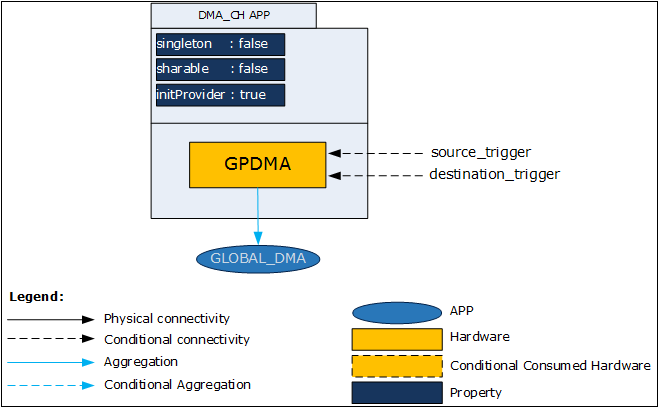
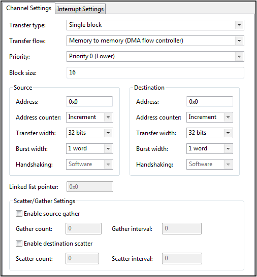
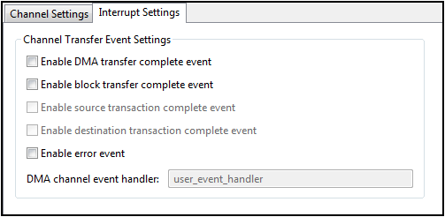

# DMA (Direct Memory Access)

## 목적
* DMA의 동작원리를 이해하고, DMA_CH DAVE App 의 활용 방법을 학습한다.

## 참고자료

* [XMC4500 Reference Manual v1.5 2014-04]
    - xmc4500_rm_v1.5_2014_04.pdf
* [XMC4500 Data Sheet v1.4 2016-01]
    - Infineon-XMC4500-DS-v01.04-EN.pdf
* [DMA CH] (DAVE APP on-line help)

## DMA란

DMA는 특정 하드웨어 하위 시스템이 중앙 처리 장치 (CPU)와 독립적으로 주 시스템 메모리 (RAM)에 액세스 할 수있게 해주는 컴퓨터 시스템의 기능이다. DMA가 없으면 CPU가 프로그램 된 입력 / 출력을 할 때 읽기 또는 쓰기 작업을 하게되어 전체적으로 사용되므로 다른 작업을 수행 할 수 없다. DMA를 사용하면 CPU는 DMA를 사용하여 전송을 시작한 다음 전송이 진행되는 동안 다른 작업을 수행하고, 마지막으로 작업이 완료되면 DMA 컨트롤러에서 인터럽트를 수신하게 된다. 이 기능은 CPU가 데이터 전송 속도를 따라갈 수 없거나 CPU가 비교적 느린 I/O 데이터 전송을 기다리는 동안 다른 작업을 수행해야 할 때 유용하다. 많은 하드웨어 시스템은 디스크 드라이브 컨트롤러, 그래픽 카드, 네트워크 카드 및 사운드 카드를 포함한 DMA를 사용한다. DMA는 멀티 코어 프로세서에서 칩 내부 데이터 전송에도 사용된다. DMA 채널이있는 컴퓨터는 DMA 채널이없는 컴퓨터보다 훨씬 적은 CPU 오버 헤드로 장치간에 데이터를 전송할 수 있게 된다. 마찬가지로 멀티 코어 프로세서 내부의 처리 요소는 프로세서 시간을 차지하지 않고 로컬 메모리와 데이터를 주고받을 수 있으므로 계산 및 데이터 전송을 병렬로 진행할 수 있게 된다. DMA는 "메모리에서 메모리로"복사하거나 메모리 내에서 "데이터를 이동"하는 데에도 사용할 수 있다. DMA는 대용량 복사본 또는 분산 수집 작업과 같이 단순 읽기 쓰기 동작을 반복적으로 수행해야 하는 경우에 CPU의 부하를 경강시킬 수 있다.

DMA를 사용하려면 CPU에 포인터와 읽을 바이트 수를 지정한다. 수신 할 때, CPU는 바이트 수에 도달 할 때까지 주변기기로부터 데이터를 읽어들이고 소프트웨어 인터럽트를 발생시킨다. 마찬가지로 전송할 때 CPU는 버퍼에서 주변 장치로 데이터를 이동시키고 카운트가 완료되면 인터럽트를 발생시킨다.

DMA는 특별한 프로그램이 데이터 처리를 수행하는 것과 같다. 설정은 비교적 간단하다. 매뉴얼에서 DMA 레지스터를 찾는다: transmit pointer register, transmit count, receive pointer register, 그리고 receive count. 데이터가 일정한 스트림 인 경우 DMA 컨트롤러에서 다른 위치로 데이터를 복사할 수 있다. 일정한 스트림 대신 데이터가 청크(분할되어 있는 여러개의 조각)로 들어오는 경우 하나의 DMA 컨트롤러의 채널을 사용하여 전송할 수 있다.

많은 DMA은 두 개의 버퍼를 번갈아 사용하여 전송의 효율을 더욱 높이는 방법으로 구현되어 있다. 이렇게 하면 프로세서가 주변 장치 데이터를 다른 장치로 (또는 다른 장치로) 전송하는 동안 소프트웨어가 하나의 버퍼를 사용할 수 있다. DMA는 디스크 드라이브 컨트롤러 및 네트워크 카드와 같은 처리량이 매우 높은 주변 장치에 주로 많이 사용된다. 또한 멀티 코어 프로세서에서 코어 간 통신에도 사용된다. 전송 할 바이트 수를 알고 있는 경우 DMA는 CPU의 오버 헤드를 줄여 프로그램의 실행 속도를 높이는 효율적인 방법이다.

## DAVE APP (DMA_CH)

DMA_CH APP은 GPDMA를 사용하여 단일 데이터 블럭 또는 여러 데이터 블럭을 전달하는 APP이다. 또한 이 APP은 링크드 리스트와 scatter-gather 전달 용도로도 사용 할 수 있다.

### 아키텍쳐(Architecture)



위의 그림은 DMA_CH APP 내부 소프트웨어 아키텍처를 나타낸 것이다. APP의 인스턴스는 GPDMA 하드웨어 모듈을 설정한다. 여러 데이터 블럭을 송신하기 위해서는 GPDMA0의 채널0 또는 채널1을 사용해야 한다. 단일 데이터 블럭을 송신하기 위해서는 어떤 DMA 채널을 사용해도 무방하다.
이 APP은 GLOBAL_DMA APP에 의존적이다. GLOBAL_DMA APP은 채널 설정, 이벤트 콜백함수, 콜백 함수 인자 값들을 담고 있는 데이터 구조체를 생성한다.

* Signals

Signal Name  | Input/Output  | Availability  | Description  |  
--|---|---|---|
source_trigger  | Input  | Conditional  |  _다른 APP으로부터 송신되는 DMA 트리거 신호_ |  
destination_trigger  | Input  | Conditional  | _다른 APP으로부터 송신되는 데이터 주소_  |  

### 설정(Configuration)



* Transfer type : DMA 송신 타입을 선택 할 수 있다.
    - Single block
    - Multi-block: source address contiguous, destination address reload
    - Multi-block: source address reload, destination address contiguous
    - Multi-block: source address reload, destination address reload
    - Multi-block: source address contiguous, destination address linked
    - Multi-block: source address reload, destination address linked
    - Multi-block: source address linked, destination address contiguous
    - Multi-block: source address linked, destination address reload
    - Multi-block: source address linked, destination address linked
* Transfer flow : DMA 송신 흐름 타입을 선택 할 수 있다.
    - Memory to memory (DMA flow controller)
    - Memory to peripheral (DMA flow controller)
    - Peripheral to memory (DMA flow controller)
    - Peripheral to peripheral (DMA flow controller)
    - Peripheral to memory (Peripheral flow controller)
    - Peripheral to peripheral (Source peripheral flow controller)
    - Memory to peripheral (Peripheral flow controller)
    - Peripheral to peripheral (Destination peripheral flow controller)
* Priority
    - 채널 우선순위를 설정한다.
    - [0 ~ 7] 값을 선택 가능하며, 0이 가장 낮고 7이 가장 높은 우선순위이다.
* Block size
    - GPDMA를 활용하여 전송할 블럭 크기를 설정 할 수 있다.
    - [1 ~ 4095]
* Source: Address
    - 전송 할 데이터의 주소를 설정
    - main.c 파일안에 uint32_t 타입의 pointer를 주소로써 사용 할 수도 있다.
* Source: Adress counter
    - 전송 할 데이터의 주소 변경 모드를 선택
    - Increment/Decrement/No Change 모드 중 선택 가능하다
* Source: Transfer width
    - 8 bits/16 bits/ 32bits 중에 선택 가능하다.
* Source: Burst width
    - 송신 한 번에 전송 할 데이터의 크기를 설정 할 수 있다.
    - 1 word/4 words/8 words 중에 선택 가능하다.
* Source: Handshaking
    - 주변장치와 메모리 간의 데이터 전송을 위한 트리거 방법을 설정 할 수 있다.
    - Hardware / Software 중 선택 가능하다.
* Destination: Address
    - 수신 할 데이터의 주소를 설정
    - main.c 파일안에 uint32_t 타입의 pointer를 주소로써 사용 할 수도 있다.
* Destination: Address counter
    - 수신 할 데이터의 주소 변경 모드를 선택
    - Increment/Decrement/No Change 모드 중 선택 가능하다
* Destination: Transfer width
    - 8 bits/16 bits/ 32bits 중에 선택 가능하다.
* Destination: Burst width
    - 수신 한 번에 전송 할 데이터의 크기를 설정 할 수 있다.
    - 1 word/4 words/8 words 중에 선택 가능하다.
* Destination: Handshaking
    - 메모리와 주변장치 간의 데이터 전송을 위한 트리거 방법을 설정 할 수 있다.
    - Hardware / Software 중 선택 가능하다.
* Linked list pointer
    - DMA 링크드 리스트 주소를 설정 할 수 있다.
* Scatter/Gather Settings: Enable source gather
    - Enable시, Advanced DMA 채널을 통해 Gather 기능을 사용 할 수 있다.
* Scatter/Gather Settings: Gather count
    - Gather 카운트를 설정 할 수 있다.
    - [0 ~ 4095]
* Scatter/Gather Settings: Gather interval
    - Gather 간격을 설정 할 수 있다.
    - [0 ~ 1048575]
* Scatter/Gather Settings: Enable destination scatter
    - Enable시, Advanced DMA 채널을 통해 Scatter 기능을 사용 할 수 있다.
* Scatter/Gather Settings: Scatter count
    - Scatter 카운트를 설정 할 수 있다.
    - [0 ~ 4095]
* Scatter/Gather Settings: Scatter interval
    - Scatter 구간을 설정 할 수 있다.
    - [0 ~ 1048575]



* Channel Transfer Event Settings: Enable DMA transfer complete event
    - Enable시, 송신이 완료되면 인터럽트가 트리거된다.
* Channel Transfer Event Settings: Enable block transfer complete event
    - Enable시, 블럭 송신이 완료되면 인터럽트가 트리거된다.
* Channel Transfer Event Settings: Enable source transaction complete event
    - Enable시, 송신이 완료되면 인터럽트가 트리거된다.
* Channel Transfer Event Settings: Enable destination transaction complete event
    - Enable시, 수신이 완료되면 인터럽트가 트리거된다.
* Channel Transfer Event Settings: Enable error event
    - Enable시, 에러가 발생하면 인터럽트가 트리거된다.
* Channel Transfer Event Settings: DMA channel event handler
    - DMA 이벤트가 발생 됐을 때 사용 될 DMA 사용자 콜백함수의 이름을 지정 할 수 있다.

### 자료구조
DMA 관련 설정 정보를 관리하기 위하여 DMA_CH_t 구조체를 활용하여 DMA_CH_t 자료형을 사용한다. 이 구조체에는 DMA 채널번호, 채널 설정정보를 담고 있는 자료형인 DMA_CH_CONFIG_t, 리로드 함수 주소, DMA 인터럽트 관련 설정정보를 담고 있는 GLOBAL_DMA_t 자료형을 포함하고 있다.

```
typedef struct DMA_CH_t
{
  GLOBAL_DMA_t *const dma_global; /**< A pointer to GLOBAL_DMA handle structure */
  DMA_CH_CONFIG_t *const config; /**< A pointer to DMA_CH configuration structure */
  void (*reload)(struct DMA_CH_t *obj);
  uint8_t ch_num; /**< Channel number */
} DMA_CH_t;

typedef struct DMA_CH_CONFIG
{
  XMC_DMA_CH_CONFIG_t ch_config; /**< A pointer to DMA channel configuration */
  XMC_DMA_CH_EVENT_HANDLER_t callback; /**< User callback for DMA events */
  uint32_t events; /**< DMA events */
} DMA_CH_CONFIG_t;

typedef struct GLOBAL_DMA
{
  XMC_DMA_t *dma; /** Pointer to DMA unit */
  const GLOBAL_DMA_INTERRUPT_CONFIG_t *const config; /** Pointer to configuration data */
  bool initialized; /** Is DMA_GLOBAL initialized? */
  IRQn_Type irq_node; /** Mapped NVIC Node */
} GLOBAL_DMA_t;
```
DMA 관련 동작을 프로그래밍 하기 위한 열거형 자료형들은 다음과 같다
```
typedef enum DMA_CH_STATUS_t
{
  DMA_CH_STATUS_SUCCESS = 0U, /**< DMA operation successful */
  DMA_CH_STATUS_FAILURE,      /**< DMA operation failure */
  DMA_CH_STATUS_CHANNEL_BUSY  /**< DMA channel busy */
} DMA_CH_STATUS_t;
```
### 메쏘드(Method)

* DMA APP을 초기화하고, DMA를 활성화/비활성화 시킬 수 있다. 그리고 활성화/비활성화 상태를 확인 할 수 있다.

  `DMA_CH_STATUS_t  DMA_CH_Init (DMA_CH_t *const obj);`

  `__STATIC_INLINE void  DMA_CH_Enable (DMA_CH_t *const obj);`

  `__STATIC_INLINE void  DMA_CH_Disable (DMA_CH_t *const obj);`

  `__STATIC_INLINE bool  DMA_CH_IsEnabled (DMA_CH_t *const obj);`

* DMA를 일시 정지/다시 시작 할 수 있으며 그 상태를 확인 할 수 있다.

  `__STATIC_INLINE void  DMA_CH_Suspend (DMA_CH_t *const obj);`

  `__STATIC_INLINE void  DMA_CH_Resume (DMA_CH_t *const obj);`

  `__STATIC_INLINE bool  DMA_CH_IsSuspended (DMA_CH_t *const obj);`

* 전송할 데이터의 주소, 목적지 주소, 전송 할 블럭 크기를 설정 할 수 있다.

  `__STATIC_INLINE void  DMA_CH_SetSourceAddress (DMA_CH_t *const obj, uint32_t addr);`

  `__STATIC_INLINE void  DMA_CH_SetDestinationAddress (DMA_CH_t *const obj, uint32_t addr);`

  `__STATIC_INLINE void  DMA_CH_SetBlockSize (DMA_CH_t *const obj, uint32_t block_size);`

* 데이터를 전송하기 위한 요구신호, 수신하기 위한 요구신호를 트리거 할 수 있다.

  `__STATIC_INLINE void  DMA_CH_TriggerSourceRequest (DMA_CH_t *const obj, const XMC_DMA_CH_TRANSACTION_TYPE_t type, bool last);`

  `__STATIC_INLINE void  DMA_CH_TriggerDestinationRequest (DMA_CH_t *const obj, const XMC_DMA_CH_TRANSACTION_TYPE_t type, bool last);`

* DMA 초기 설정을 리로드 할 수 있다.

  `__STATIC_INLINE void  DMA_CH_Reload (DMA_CH_t *const obj);`

* 복수개의 블럭을 전달할 수 있다.

  `__STATIC_INLINE void  DMA_CH_RequestLastMultiblockTransfer (DMA_CH_t *const obj);`

### 사용예


## 실습프로젝트


## 요약
