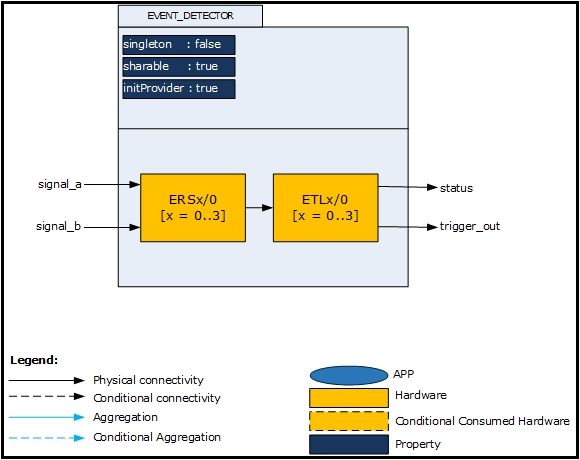
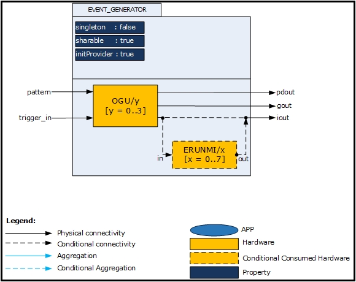
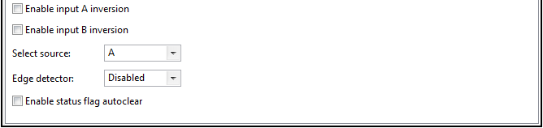
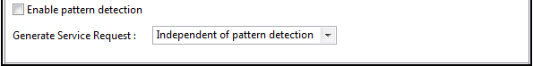

# ERU

## 목적
* 마이크로컨트롤러의 이벤트(Event) 개념을 이해하고 EVENT_DETECTOR, EVENT_GENERATOR APP 의 활용방법을 익힌다.

## 참고자료

* [XMC4500 Reference Manual v1.5 2014-04]
    - xmc4500_rm_v1.5_2014_04.pdf
* [XMC4500 Data Sheet v1.4 2016-01]
    - Infineon-XMC4500-DS-v01.04-EN.pdf
* [UART] (DAVE APP on-line help)


## EVENT 의 개념

## DAVE APP (EVENT_DETECTOR, EVENT_GENERATOR)

### XMC4500 의 중요 특징

### 개략(Overview)

#### EVENT_DETECTOR
EVENT_DETECTOR APP은 ERU(Event Request Unit) 모듈의 ERS(Event Request Select Unit)와 ETL(Event Trigger Logic Unit)을 사용하여 내부 또는 외부 서비스 요청을 처리하는 APP이다. 이 APP은 다음과 같은 특징을 가진다.

* 두 입력 신호의 극성을 선택적으로 반전 시킬 수 있다.
* 신호를 그룹화(AND 또는 OR)하여 트리거 신호를 만들 수 있다.
* 이벤트를 발생시키기위해 트리거 신호의 엣지를 선택 할 수 있다.
* 입력 신호의 모니터링과 신호처리 목적으로 소프트웨어 플래그(status 신호)를 사용할 수 있다.

#### EVENT_GENERATOR
EVENT_GENERATOR APP은 ERU 모듈의 OGU(Output Gating Unit)를 사용하여 EVENT_DETECTOR APP으로부터 입력 받고 아래와 같은 기능을 제공한다.

* 선택된 상태 플래그 신호에 대한 패턴일치
* 주변 장치, 외부 트리거 이벤트를 위한 서비스 요청 생성
* 패턴 일치 결과에 따른 서비스 요청 생성 신호 게이팅

### 아키텍쳐(Architecture)


위 그림은 EVENT_DETECTOR APP 내부 소프트웨어 아키텍처를 보여준다. APP의 각각의 인스턴스는 ERU 모듈의 ERS, ETL 블럭을 사용한다.

* ERS(Event Request Select Unit)
    - ERS는 ERU 모듈의 입력을 다루는 유닛이다. ERS는 Signal A와 Signal B를 제공한다. 이 두 신호는 다른 주변 장치와 연결하여 ERU의 입력 신호로 활용할 수 있다.
* ETL(Event Trigger Logic Unit)
    - ERS를 통해서 입력 받은 신호를 설정에 따라 처리 후 status 신호와 trigger_out 신호를 출력한다. 이 출력 신호들은 EVENT_GENERATOR APP과 연결된다.
    1. Software clear : status 플래그 신호는 사용자가 지정한 이벤트 신호가 발견 됐을 때 Set된다. 이 모드에서 status 플래그 신호를 클리어하기 위해서는 소프트웨어적으로 처리 해야 한다.
    2. Auto clear : 사용자가 지정한 이벤트 신호가 발견 되지 않으면 status 플래그 신호는 자동으로 클리어된다.

* Signals

Signal Name | Input/Output | Availability | Description
------------|--------------|--------------|-----------------------------------------------------------------------
signal_a    | Input        | Always       | ERS 블럭 입력 신호
signal_b    | Input        | Always       | ERS 블럭 입력 신호
trigger     | Output       | Always       | 설정된 이벤트 엣지가 탐색되면 EVENT_GENERATOR APP과 연결된 동작이 실행
status      | Output       | Always       | 선택된 이벤트가 탐색되면 SET된다.



위 그림은 EVENT_GENERATOR APP의 내부 소프트웨어 아키텍처를 보여준다. 이 APP은 ERU의 OGU(Output Gating Unit)와 SCU의 ERUNMI을 사용한다.

* OGU(Output Gating Unit)
    - EVENT_DETECTOR APP으로부터 트리거 이벤트와 status 플래그를 입력으로 받아 시스템에 결과를 출력한다.

* Signals

Signal Name | Input/Output | Availability | Description
------------|--------------|--------------|------------------------------------------
pattern     | Input        | Always       | EVENT_DETECTOR로부터 입력받는 status 신호
trigger     | Input        | Always       | EVENT_DETECTOR로부터 입력받는 trigger신호
pdout       | Output       | Always       | 패턴 일치 결과
gout        | Output       | Conditional  | for XMC1000
iout        | Output       | Always       | INTERRUPT APP 또는 주변장치와 연결
in          | Input        | Conditional  | ERUNMI 입력신호
out         | Output       | Conditional  | ERUNMI 출력신호

### 설정(Configuration)



* Enable input A inversion
    - signal_a 상태를 반전시킨다.
* Enable input B inversion
    - signal_b 상태를 반전시킨다.
* Select source
    - A : signal_a를 입력신호로 선택한다.
    - B : signal_b를 입력신호로 선택한다.
    - A OR B : signal_a와 signal_b의 OR 논리조합 신호를 입력신호로 사용한다.
    - A AND B : signal_a와 signal_b의 AND 논리조합 신호를 입력신호로 사용한다.
* Edge detector
    - Disable : 어떠한 엣지에서도 이벤트를 발생시키지 않는다.
    - Rising Edge : 상승엣지에 이벤트를 발생시킨다.
    - Falling Edge : 하강엣지에 이벤트를 발생시킨다.
    - Either Edge : 상승엣지, 하강엣지 모두에 이벤트를 발생시킨다.
* Enable status flag autoclear
    - Enable 시, 상태 플래그는 반대 엣지가 발생 했을 때 자동으로 클리어된다.
    - Disable 시, 상태 플래그는 소프트웨어로 리셋한다.



* Enable pattern detection
    - Enable 시, OGU에서 패턴 일치 설정에 따라 iout 신호가 출력된다.
* Generate service request
    - No Service request : 어떠한 이벤트에도 서비스 요청 신호가 출력이 안되며 패턴 일치 출력(pout) 신호는 트리거 출력 신호와는 무관하게 사용 할 수 있다.
    - Independent of Pattern Detection : EVENT_DETECTOR APP 트리거 이벤트로 서비스 요청 신호가 출력되며 패턴 일치 신호와는 무관하게 사용 할 수 있다.
    - On Pattern Detection Match : 패턴 일치 할 때만 EVENT_DETECTOR APP 트리거 이벤트에 따라 서비스 요청 신호를 출력한다.
    - On Pattern Detection Mismatch : 패턴 불 일치 할 때만 EVENT_DETECTOR APP 트리거 이벤트에 따라 서비스 요청 신호를 출력한다.

### 자료구조
EVENT_DETECTOR APP 관련 설정 정보를 관리하기 위하여 EVENT_DETECTOR 구조체를 활용하여 EVENT_DETECTOR_t 자료형을 사용하고 있다. 이 구조체에는 ERU 관련 설정과 ETL 관련설정을 담고 있는 자료형인 XMC_ERU_ETL_CONFIG_t를 포함하고 있다.
```
typedef struct EVENT_DETECTOR
{
  XMC_ERU_t* const eru; /**< ERU module assigned */
  const uint8_t channel; /**< ERU channel assigned(0-3) */
  const XMC_ERU_ETL_CONFIG_t *const config; /**< reference to hardware configuration */
  bool init_status; /**< This parameter indicates the initialized state of each instance */
} EVENT_DETECTOR_t;

typedef struct XMC_ERU_ETL_CONFIG
{
  union
  {
    uint32_t input; /**< While configuring the bit fields, the values have to be shifted according to the position */
    struct
    {
      uint32_t input_a: 2; /**< Configures input A. Refer @ref XMC_ERU_ETL_INPUT_A_t for valid values */
      uint32_t input_b: 2; /**< Configures input B. Refer @ref XMC_ERU_ETL_INPUT_B_t for valid values */
      uint32_t : 28;
    };
  };

  union
  {
    uint32_t raw;
    struct
    {
      uint32_t enable_output_trigger: 1;  /**< Enables the generation of trigger pulse(PE), for the configured edge
                                               detection. This accepts boolean values as input. */
      uint32_t status_flag_mode: 1;       /**< Enables the status flag auto clear(LD), for the opposite edge of the
                                               configured event edge. This accepts boolean values as input. */
      uint32_t edge_detection: 2;         /**< Configure the event trigger edge(FE, RE).
                                               Refer @ref XMC_ERU_ETL_EDGE_DETECTION_t for valid values. */
      uint32_t output_trigger_channel: 3; /**< Output channel select(OCS) for ETLx output trigger pulse.
                                               Refer @ref XMC_ERU_ETL_OUTPUT_TRIGGER_CHANNEL_t for valid values. */
      uint32_t : 1;
      uint32_t source: 4;                 /**< Input path combination along with polarity for event generation.
                                               Refer @ref XMC_ERU_ETL_SOURCE_t for valid values. */
      uint32_t : 20;
    };
  };
} XMC_ERU_ETL_CONFIG_t;
```
ERU의 ETL 관련 동작을 프로그래밍 하기 위한 열거형 자료형들은 다음과 같다.
```
typedef enum XMC_ERU_ETL_INPUT_A
{
  XMC_ERU_ETL_INPUT_A0 = 0x0U, /**< input A0 is selected */
  XMC_ERU_ETL_INPUT_A1 = 0x1U, /**< input A1 is selected */
  XMC_ERU_ETL_INPUT_A2 = 0x2U, /**< input A2 is selected */
  XMC_ERU_ETL_INPUT_A3 = 0x3U  /**< input A3 is selected */
} XMC_ERU_ETL_INPUT_A_t;

/**
 * Defines input signal for path B of ERSx(Event request source, x = [0 to 3]) unit.
 * @image html "eru_input_b.png" "ETLx Input B selection"
 */
typedef enum XMC_ERU_ETL_INPUT_B
{
  XMC_ERU_ETL_INPUT_B0 = 0x0U, /**< input B0 is selected */
  XMC_ERU_ETL_INPUT_B1 = 0x1U, /**< input B1 is selected */
  XMC_ERU_ETL_INPUT_B2 = 0x2U, /**< input B2 is selected */
  XMC_ERU_ETL_INPUT_B3 = 0x3U  /**< input B3 is selected */
} XMC_ERU_ETL_INPUT_B_t;

/**
 * Defines input path combination along with polarity for event generation by ERSx(Event request source) unit to
 * ETLx(Event trigger logic),x = [0 to 3] unit.
 * @image html "eru_input_trigger.png" "ETLx input trigger signal generation"
 */
typedef enum XMC_ERU_ETL_SOURCE
{
  XMC_ERU_ETL_SOURCE_A = 0x0U,              /**< select (A) path as a event source */
  XMC_ERU_ETL_SOURCE_B = 0x1U,              /**< select (B) path as a event source */
  XMC_ERU_ETL_SOURCE_A_OR_B = 0x2U,         /**< select (A <b>OR</b> B) path as a event source */
  XMC_ERU_ETL_SOURCE_A_AND_B = 0x3U,        /**< select (A <b>AND</b> B) path as a event source */
  XMC_ERU_ETL_SOURCE_NOT_A = 0x4U,          /**< select (inverted A) path as a event source */
  XMC_ERU_ETL_SOURCE_NOT_A_OR_B = 0x6U,     /**< select (inverted A <b>OR</b> B) path as a event source */
  XMC_ERU_ETL_SOURCE_NOT_A_AND_B = 0x7U,    /**< select (inverted A <b>AND</b> B) path as a event source */
  XMC_ERU_ETL_SOURCE_NOT_B = 0x9U,          /**< select (inverted B) path as a event source */
  XMC_ERU_ETL_SOURCE_A_OR_NOT_B = 0xaU,     /**< select (A <b>OR</b> inverted B) path as a event source */
  XMC_ERU_ETL_SOURCE_A_AND_NOT_B = 0xbU,    /**< select (A <b>AND</b> inverted B) path as a event source */
  XMC_ERU_ETL_SOURCE_NOT_A_OR_NOT_B = 0xeU, /**< select (inverted A <b>OR</b> inverted B) path as a event
                                                           source */
  XMC_ERU_ETL_SOURCE_NOT_A_AND_NOT_B = 0xfU /**< select (inverted A <b>AND</b> inverted B) path as a event
                                                           source */
} XMC_ERU_ETL_SOURCE_t;

/**
 * Defines trigger edge for the event generation by ETLx (Event Trigger Logic, x = [0 to 3]) unit, by getting the signal
 * from ERSx(Event request source, x = [0 to 3]) unit.
 */
typedef enum XMC_ERU_ETL_EDGE_DETECTION
{
  XMC_ERU_ETL_EDGE_DETECTION_DISABLED = 0U, /**< no event enabled */
  XMC_ERU_ETL_EDGE_DETECTION_RISING = 1U,   /**< detection of rising edge generates the event */
  XMC_ERU_ETL_EDGE_DETECTION_FALLING = 2U,  /**< detection of falling edge generates the event */
  XMC_ERU_ETL_EDGE_DETECTION_BOTH = 3U      /**< detection of either edges generates the event */
} XMC_ERU_ETL_EDGE_DETECTION_t;

/**
 * Defines Output Channel of OGUy(Output gating unit y = [0 to 3]) to be mapped by the trigger pulse generated by
 * ETLx(Event Trigger Logic, x = [0 to 3]) unit.
 * @note Generation of output trigger pulse need to be enabled @ref XMC_ERU_OGU_PERIPHERAL_TRIGGER_t
 * @image html "eru_connection_matrix.png" "ERU_ETL ERU_OGU Connection matrix"
 */
typedef enum XMC_ERU_ETL_OUTPUT_TRIGGER_CHANNEL
{
  XMC_ERU_ETL_OUTPUT_TRIGGER_CHANNEL0 = 0U, /**< Event from input ETLx triggers output OGU0 */
  XMC_ERU_ETL_OUTPUT_TRIGGER_CHANNEL1 = 1U, /**< Event from input ETLx triggers output OGU1 */
  XMC_ERU_ETL_OUTPUT_TRIGGER_CHANNEL2 = 2U, /**< Event from input ETLx triggers output OGU2 */
  XMC_ERU_ETL_OUTPUT_TRIGGER_CHANNEL3 = 3U, /**< Event from input ETLx triggers output OGU3 */
} XMC_ERU_ETL_OUTPUT_TRIGGER_CHANNEL_t;
```

EVENT_GENERATOR APP 관련 설정 정보를 관리하기 위하여 EVENT_GENERATOR 구조체를 활용하여 EVENT_GENERATOR_t 자료형을 사용하고 있다. 이 구조체에는 ERU 관련 설정과 OGU 관련 설정을 포함하고 있는 자료형인 XMC_ERU_OGU_CONFIG_t을 포함하고 있다.

```
typedef struct EVENT_GENERATOR
{
  XMC_ERU_t* const eru; /**< ERU module assigned */
  const XMC_ERU_OGU_CONFIG_t *const config; /**< reference to hardware configuration */
  const uint32_t nmi_eru_msk; /**< Mask to enable the NMI feature */
  const uint8_t channel; /**< ERU channel assigned(0-3) */
  bool init_status; /**< This parameter indicates the initialized state of each instance */
} EVENT_GENERATOR_t;

typedef union XMC_ERU_OGU_CONFIG
{
    uint32_t raw;

    struct
    {
      uint32_t peripheral_trigger: 2;        /**< peripheral trigger(ISS) input selection.
                                                  Refer @ref XMC_ERU_OGU_PERIPHERAL_TRIGGER_t for valid values. */
      uint32_t enable_pattern_detection: 1;  /**< Enable generation of(GEEN) event for pattern detection result change.
                                                  This accepts boolean values as input. */
      uint32_t : 1;
      uint32_t service_request: 2;          /**< Gating(GP) on service request generation for pattern detection result.
                                                 Refer @ref XMC_ERU_OGU_SERVICE_REQUEST_t for valid values. */
      uint32_t : 6;
      uint32_t pattern_detection_input: 4;  /**< Enable input for the pattern detection(IPENx, x = [0 to 3]).  
                                                 Refer @ref XMC_ERU_OGU_PATTERN_DETECTION_INPUT_t for valid values.
                                                 <b>OR</b> combination of the enum items given as input */
      uint32_t : 16;
    };
} XMC_ERU_OGU_CONFIG_t;
```
ERU의 OGU 관련 동작을 프로그래밍 하기 위한 열거형 자료형들은 다음과 같다.
```
typedef enum XMC_ERU_OGU_PATTERN_DETECTION
{
  XMC_ERU_OGU_PATTERN_DETECTION_DISABLED = 0U, /**< Pattern match is disabled */
  XMC_ERU_OGU_PATTERN_DETECTION_ENABLED = 1U   /**< Pattern match is enabled, the selected status flags of
                                                    ETLx(Event Trigger Logic, x = [0 to 3]) unit, are
                                                    used in pattern detection. */
} XMC_ERU_OGU_PATTERN_DETECTION_t;

/**
 * Defines the inputs for Pattern detection. The configured status flag signal from the ETLx(Event Trigger Logic,
 * x = [0 to 3]) unit indicates the pattern to be detected.
 */
typedef enum XMC_ERU_OGU_PATTERN_DETECTION_INPUT
{
  XMC_ERU_OGU_PATTERN_DETECTION_INPUT0 = 1U, /**< Status flag ETL0, participating in pattern match */
  XMC_ERU_OGU_PATTERN_DETECTION_INPUT1 = 2U, /**< Status flag ETL1, participating in pattern match */
  XMC_ERU_OGU_PATTERN_DETECTION_INPUT2 = 4U, /**< Status flag ETL0, participating in pattern match */
  XMC_ERU_OGU_PATTERN_DETECTION_INPUT3 = 8U  /**< Status flag ETL0, participating in pattern match */
} XMC_ERU_OGU_PATTERN_DETECTION_INPUT_t;

/**
 * Defines peripheral trigger signal for event generation. Based on the selected peripheral for event generation,
 * the trigger signal is mapped.
 */
typedef enum XMC_ERU_OGU_PERIPHERAL_TRIGGER
{
  XMC_ERU_OGU_PERIPHERAL_TRIGGER1 = 1U, /**< OGUy1 signal is mapped for event generation */
  XMC_ERU_OGU_PERIPHERAL_TRIGGER2 = 2U, /**< OGUy2 signal is mapped for event generation */
  XMC_ERU_OGU_PERIPHERAL_TRIGGER3 = 3U  /**< OGUy3 signal is mapped for event generation */
} XMC_ERU_OGU_PERIPHERAL_TRIGGER_t;

/**
 * Defines the gating scheme for service request generation. In later stage of the OGUy(Output gating unit,
 * y = [0 to 3]) based on the gating scheme selected ERU_GOUTy(gated output signal) output is defined.
 * @image html "interrupt_gating_signal.png" "Interrupt gating signal"
 */
typedef enum XMC_ERU_OGU_SERVICE_REQUEST
{
  XMC_ERU_OGU_SERVICE_REQUEST_DISABLED = 0U,                      /**< Service request blocked, ERUx_GOUTy = 0 */
  XMC_ERU_OGU_SERVICE_REQUEST_ON_TRIGGER = 1U,                    /**< Service request generated enabled, ERUx_GOUTy = 1 */
  XMC_ERU_OGU_SERVICE_REQUEST_ON_TRIGGER_AND_PATTERN_MATCH = 2U,  /**< Service request generated on trigger event and input pattern match, ERUx_GOUTy = ~pattern matching result*/
  XMC_ERU_OGU_SERVICE_REQUEST_ON_TRIGGER_AND_PATTERN_MISMATCH = 3U/**< Service request generated on trigger event and input pattern mismatch, ERUx_GOUTy = pattern matching result*/
} XMC_ERU_OGU_SERVICE_REQUEST_t;
```

### 메쏘드(Method)
* EVENT_DETECTOR APP, EVENT_GENERATOR APP을 초기화한다.

  `EVENT_DETECTOR_STATUS_t  EVENT_DETECTOR_Init (EVENT_DETECTOR_t *const handle);`

  `EVENT_GENERATOR_STATUS_t  EVENT_GENERATOR_Init (EVENT_GENERATOR_t *const handle);`

* status 플래그를 확인하거나 패턴 상태를 탐색한다.

  `__STATIC_INLINE uint32_t  EVENT_DETECTOR_GetStatusFlag (const EVENT_DETECTOR_t *const handle);`

  `STATICINLINE uint32t  EVENTGENERATORGetPatternDetectionStatus (const EVENTGENERATORt *const handle);`

* status 플래그를 SET하거나, 클리어한다.

  `__STATIC_INLINE void  EVENT_DETECTOR_SetStatusFlag (const EVENT_DETECTOR_t *const handle);`

  `__STATIC_INLINE void  EVENT_DETECTOR_ClearStatusFlag (const EVENT_DETECTOR_t *const handle);`

### 사용예

* 설정값의 초기화
사용자는 이와 같이 DAVE APP을 설정하고 사용하면 main.c 함수에서 DAVE_Init() 함수가 호출되어 개별적인 APP 을 초기화 하지 않고 사용할 수 있다.  

## 실습프로젝트

* Lab ERU

## 요약
