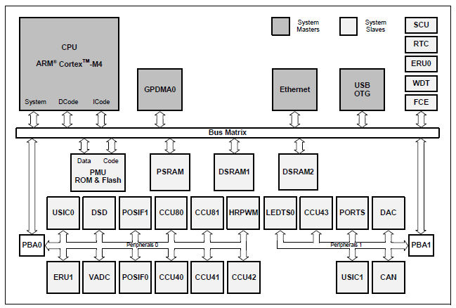
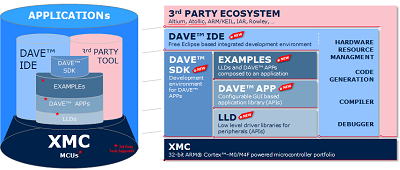
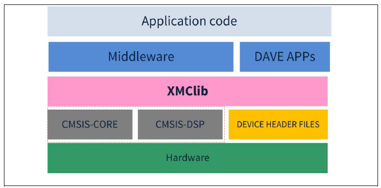

# Getting Started XMC

## 목적
* [XMC4000](http://www.infineon.com/cms/en/product/microcontroller/32-bit-industrial-microcontroller-based-on-arm-registered-cortex-registered-m/channel.html?channel=db3a30433c1a8752013c3e221b9d004f)의 개괄적인 특징을 이해한다.
* [DAVE v4.0](http://www.infineon.com/cms/en/product/microcontroller/32-bit-industrial-microcontroller-based-on-arm-registered-cortex-registered-m/dave-version-4-free-development-platform-for-code-generation/channel.html?channel=5546d46145f1f3a401461977f5d71b76) 개발환경을 이해한다.

## 참고자료

* [Training Introduction to Microcontroller World: ](http://www.infineon.com/dgdl/Infineon-Training_Introduction_to_Microcontroller_World.pdf-TR-v01_00-EN.pdf?fileId=5546d46253f6505701540f6cbccc1b40)
    - Infineon-Training_Introduction_to_Microcontroller_World.pdf-TR-v01_00-EN.pdf

* [XMC™ - Product introduction](http://www.infineon.com/dgdl/Infineon-XMC-Product-introduction-TR-v01_00-EN.pdf?fileId=5546d46253f65057015460e462547e5c)
    - Infineon-XMC-Product-introduction-TR-v01_00-EN.pdf

* [Webcast on DAVE™ - Getting started with version 4.0](http://2696.2871.m.edge-cdn.net/vsc_2871_2696_1_vid_863478/webcast-on-dave-getting-started-with-version-4-0.html)
    - Infineon-Working with DAVE-AN-v01_00-EN.pdf
    - XMC4700 이용
    - 좋은 follow-up Example
    - MUST READ Article

* [KIT_XMC45_RELAX_V1](http://www.infineon.com/cms/en/product/evaluation-boards/KIT_XMC45_RELAX_V1/productType.html?productType=db3a304437849205013813b23ac17763#ispnTab1)
    - Board_Users_Manual_XMC4500_Relax_Kit-V1_R1.2_released.pdf

## XMC4000 의 중요 특징
XMC4000 시리즈는 ARM Cortex-M4 프로세서 코어를 사용하는 산업용 마이크로 컨트롤러군이다. XMC4000 시리즈는 특히 전기모터제어, 전력변환, 산업용 장비, 그리고 제어응용 분야에 특화된 기능들을 가지고 있다.
오늘날의 내장형 제어 시스템은 저전력 특징을 갖어야 하는 것을 기본으로 점점더 복잡한 기능을 필요로 하게 되었다. 이에 따라 XMC4000는 DSP(Digital Signal Processing) 혹은 FPU(Floating Point Unit)와 같은 강력한 연산능력을 갖춘 CPU 코어 사용하며, 성능을 극대화 하기 위한 통합형 주변장치를 갖추고 있다.  XMC 활용에 앞서서 중요한 구조적 특징과 모듈별 특징을 살펴보면 다음과 같다.

### 시스템 개관

### CPU 서브시스템
* CPU 코어
    * 고성능 32bit ARM Cortex-M4 CPU
    * 16-bit and 32-bit Thumbs2 명령어 세트
    * DSP/MAC 명령어들
    * 운영체제(Operating System)를 위한 시스템 타이머(SysTick)
* 부동소수점 연산 유닛(Floating Point Unit)
* 메모리 보호 유닛(Memory Protection Unit)
* 네스티드 벡터드 인터럽트 제어기(Nested Vectored Interrupt Controller)
* 12 채널까지 지원하는 일반용도 DMA 두개
* 외부와 내부의 서비스 요청을 처리하기 위한 이벤트 요청 유닛(Event Request Unit: ERU)
* 멀티 비트 에러를 감지할 수 있는 CRC 엔진 (Flexible CRC Engine: FCE)

### 온-칩 메모리
* 16KB boot 롬
* 16KB 고속 프로그램 메모리
* 32KB 고속 데이터 메모리
* 32KB 고속 통신 메모리
* 512KB 플래시 메모리 (4KB 의 명령어 캐쉬)

### 통신 주변장치
* 10/100 Mbit/s 전송률을 갖는 이더넷 모듈
* 내부적인 물리계층을 갖는 Universal Serial Bus, USB 2.0 host, Full-Speed OTG
* Full-CAN/Basic-CAN을 지원하고 64개의 메세지 객체를 갖는 Controller Area Network(CAN) 인터페이스
* UART, SPI, IIC, IIS 혹은 LIN을 지원하는 Universal Serial Interface Channel(USIC)
* Human-Machine 인터페이스를 위한 LED 와 Touch-Sense Controller(LEDTS)

### Analog Frontend 주변장치
* 아날로그-디지탈 변환 (Analog-Digital Converter: VADC)
    * 12bit 분해능, 8채널, 유효범위 검사를 위한 비교기 내장
* 델타-시그마-복조기 (Delta-Sigma Demodulator: DSD)
    * 고분해능 A/D 신호 변환 용도
* 디지탈-아날로그 변환 (Digital-Analog Converter: DAC)
    * 12bit 분해능, 2채널

### 산업 제어용 주변장치
* 4개의 Capture/Compare Unit 4 (CCU4)
    * 일반 타이머 용도
* 2개의 Capture/Compare Unit 8 (CCU8)
    * 모터제어 혹은 전력변환
* 4채널의 고분해능 PWM (HRPWM)
* 2개의 위치 인터페이스 (POSIF)
    * 모터제어를 위한 홀신호 혹은 엔코더 신호
* 고안정성 시스템을 위한 Window Watchdog 타이머(WDT)
* 칩 온도 센서 (Die Temperature Sensor: DTS)
* 알람 기능을 갖는 실시간 클락
* 시스템 설정과 제어를 위한 시스템 제어 유닛(System Control Unit: SCU)

### 입출력 라인들
* 프로그래밍 가능한 포트 드라이버 제어 모듈 (PORTS)
* 비트단위로 주소할당 가능
* 트라이-스테이트로 입력 모드 설정 가능
* 푸시-풀(Push/pull) 혹은 open drain 으로 출력 모드 설정 가능
* JTAG interface를 사용한 경계 스캔 시험(boundary scan test)

### On-Chip 디버그 지원
* 디버그를 위한 모든 기능 지원: 8 브레이크 포인트, 트래이스
* 다양한 인터페이스 지원: ARM-JTAG, SWD, single-wire-trace

## DAVE 란?

XMC 패밀리를 위하여 Infineon은 DAVE(Digital Application Virtual Engineer) 라는 무료 개발 환경을 제공하고 있다. 중요한 특징은
* Eclipse 기반의 통합 개발환경
* GNU C-compiler
* XMC-lib: 확장성, 재사용성이 뛰어난 XMC용 라이브러리와 저장소
* DAVE Apps: 사용의 편의성을 높인 그래픽한 시스템 설계 도구와 코드 생성 도구
* 제 3자용 개발 도구와의 연계성을 높인 개방성
등으로 요약할 수 있다.

일반적인 마이크로컨트롤러 관련 개발 환경은 IDE와 컴파일러의 패키지로 구성되고 사용자를 위하여 예제를 함께 제공하고있다. 이에 비하여 DAVE는 라이브러리와 그래픽한 설계도구, 코드생성도구 등을 함께 제공하고 있다. DAVE를 사용하여 개발자들은 손쉽게 XMC를 사용한 소프트웨어를 설계하고 개발할 수 있는 것이다. 더욱이 이러한 환경을 무료로 제공하여 산업현장과 교육현장의 엔지니어들이 경제적 부담없이 XMC를 활용할 수 있도록 하고 있다.

### 프로그래머의 IDE, eclipse & GNU-C
DAVE는 이클립스를 기본 플랫폼으로 구성된 통합개발환경이다. 이클립스는 다양한 플랫폼에서 쓸 수 있으며, 자바를 비롯한 다양한 언어를 지원하는 프로그래밍 통합 개발 환경을 목적으로 시작되었다.  C 언어 개발을 위한 패키지로 CDT(C/C++ Development Toolkit)이 있으며, 이 패키지로 C/C++ 개발을 하려면 컴파일러가 추가로 필요하다.  PC용 컴파일러로는 Cygwin GCC와 MinGW GCC가 대표적이다. 현재는 PC용으로 뿐만 아니라 대부분의 마이크로컨트롤러 개발환경으로 자리매김 하고 있다. 이클립스는 프로젝트 관리와 소스코드 편집등의 기본적인 기능 이외에도 프로그래밍을 위한 다양한 기능을 포함하고 있다.   

DAVE는 ARM Cortex용 GCC컴파일러를 내장하고 있다. GNU 컴파일러 모음(GNU Compiler Collection: GCC)는 GNU 프로젝트의 일환으로 개발되어 널리 쓰이고 있는 컴파일러 모음이다.  자유 소프트웨어 진영의 프로그램 가운데 가장 잘 알려진 것 중에 하나인 GCC는 원래는 C만을 지원했던 컴파일러이고, 그래서 GNU C 컴파일러(GNU C Compiler)의 줄임말로 쓰이기도 한다. GCC는 GNU 시스템의 공식 컴파일러로서 많은 컴파일러와 운영체제를 만드는데 사용되었을 뿐만 아니라 ARM을 비롯한 다양한 계열의 프로세서를 지원하고 있다. 많은 상용 컴파일러또한 GCC의 명령어 구조를 참고하여 만들어 지고 있으므로 GCC 컴파일러 및 링커의 활용법 또한 충분한 시간을 습득할 가치가 있다.

### DAVE 의 계층적 구조
제공되는 라이브러리적 측면에서 DAVE의 구조를 살펴보면 그림과 같다.

XMC 하드웨어를 제일 밑으로 하고 그 위에 계층적으로 라이브러리를 구성하고 있다.

* Device 헤더 파일과 CMSIS-CORE/CMSIS-DSP
    * Device 헤더 파일: XMC 하드웨어에 접근하기 위한 I/O 레지스터 정의 파일이다.
    * CMSIS-CORE(Cortex Microcontroller SW Interface Standard): Cortex 프로세서 코어와 주변장치를 사용하기 위한 표준화된 API 이다. 이 라이브러리에 SIMD (Single Instruction, Multiple Data) 관련 명령어의 함수들이 포함되어 있다.
    * CMSIS-DSP(Cortex Microcontroller SW Interface Standard): 다양한 자료형(fractional Q7, Q15, Q31, 단정도 부동소수점(32bit))을 위한 DSP 라이브러리 모음이다

* XMC-lib
    * XMC의 모든 주변장치의 기능을 사용하기 위한 프로그램 루틴들과 자료구조들을 담고 있다.
    * 주변장치의 레지스터들을 추상화하여 제공하고 이것을 사용하기 위한 상태없는 API를 제공한다. (초기화, 설정, 주변장치간 연결, 이벤트 처리, I/O 처리, 주변장치 동작 등)
    * 기본적으로 MISRA-C 2004를 준수하여 개발되었다.

* DAVE-APPS
    * XMC-lib 를 추상화하여 그래픽한 설정화면을 갖는 라이브러리 모음이다.
    * 컴포넌트기반 프로그래밍의 기본 환경을 제공하여 쉽게 XMC의 주변장치와 전형적인 사용예를 쉽게 설정할 수 있도록 도와준다.
    * DAVE-APPS의 종류
        * 시스템 제어: 인터럽트, DMA, CRC, RTOS 등
        * 일반적 목적: Timer, PWM, ADC, DAC, GPIO
        * 통신: USIC(UART, SPI, I2C), USB, Ethernet
        * 전력변환: Buck Converter, 고정밀도 PWM
        * 모터제어: 비동기 모터, 영구자석동기기, BLDC, PWM 발생(SVPWM, Block Commutation), 회전자위치감지(Hall, Encoder, Resolver)
        * HMI, 조명: GUI Library, 디스플레이, 터치스크린, LED 조명 제어

## 실습

* Lab Getting Started 
    * XMC4700 Lite board 로 DAVE project 하나 만들고 따라해 보기

## 요약
