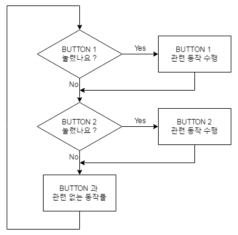
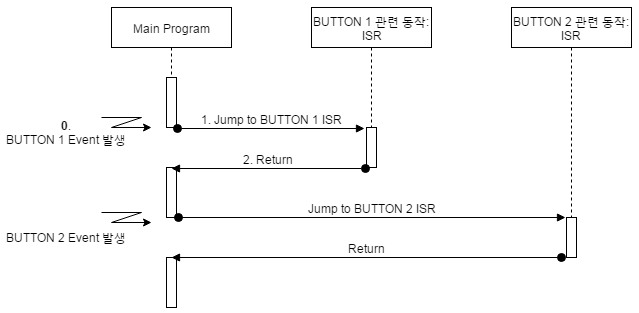
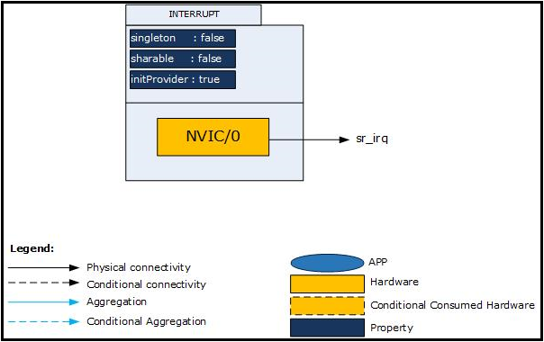
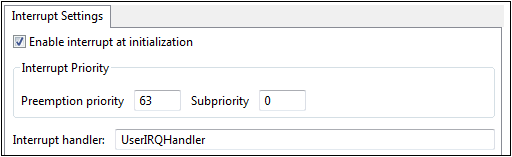
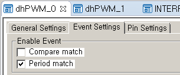
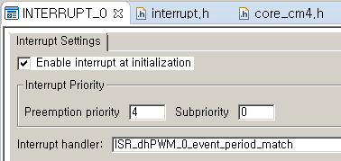
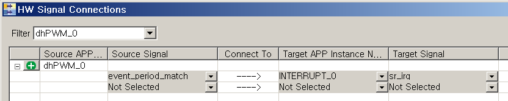
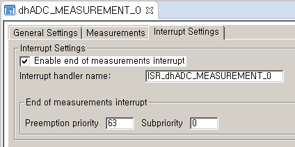
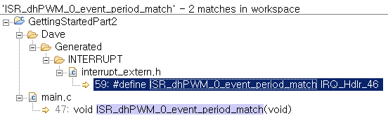

# Interrupt

## 목적
* **이벤트(Event)**, **폴링(Polling)**, 그리고 **인터럽트(Interrupt)**에 대하여 이해하고, XMC4000 CPU의 인터럽트 처리방법 이해하자.

## 참고자료

* [INTERRUPT] (DAVE APP on-line help)

## 외부 이벤트에 대한 처리

### 이벤트, 인터럽트

임베디드 시스템은 **이벤트**가 발생하였을 때 적절한 시기에 반응해야한다. 일반적으로 다음을 수행 할 수 있어야 한다.

* 일회성, 혹은 반복적(주기적)인 이벤트 발생
* 미리 예측할 수 없는 시각에 발생하는 외부 이벤트에 대하여 실시간적인 처리

이와 같은 처리를 할 때 시스템 상에서 두개 이상의 이벤트가 동시에 처리해야 하는 경우가 발생하게 된다. 예를 들어 주기적인 일을 처리하고 있는 상황에서 외부 이벤트를 처리해야 하는 경우가 발생할 수 있는 것이다. 그러브로 시스템은 각 이벤트가 얼마나 긴급하게 처리하여야 하는지 관리하여 이에 따라서 처리하는 특별한 메카니즘을 필요로 한다.  

이벤트를 처리하는 메카니즘에는 폴링(Polling)이라는 방법과 인터럽트(Interrupt) 방법이 있다.  폴링 방법이란 무한 루프에서 이벤트의 발생여부를 계속 살펴보다가, 이벤트가 발생하는 경우 해당 작업을 실행하는 방법이다.  인터럽트라는 것은 CPU에서 수행하고 있던 일련의 작업을 중단하고 이벤트에 대하여 우선적인 처리를 한 후, 중단했던 작업을 다시 수행하는 방법이다.

### 외부 이벤트를 처리하는 쉬운 방법: **Polling**
이벤트에 의해서 동작하는 간단한 예제로 사용자가 버튼을 누를 때마다 해당 버튼입력에 대한 처리를 하는 경우를 생각해 보자.  사용자는 버튼을 누르고 이것에 대한 응답을 기다린다. 이러한 상황은 사전에 예고 없이 언제든지 발생할 수 있다.  그러므로 이것을 처리하기 위한 가장 간단한 방법은 외부 입력을 지속적으로 확인하는 것이다.  이 연속루프 내에서 두 개의 입력 버튼의 상태를 확인하고 활성화 된 입력에 응답하게 한다. 이러한 방식으로 외부 이벤트를 확인하는 방법을 **폴링 (polling)** 이라고 하며, 프로그램은 주기적으로 입력 상태를 확인하고 필요하면 응답하게 된다. 지금까지의 대부분의 예제에서 사용한 간단한 접근 방식이다. 

폴링은 간단한 시스템에서는 잘 작동하지만, 조금만 생각해 보면 복잡한 프로그램에는 적합하지 않다는 것을 쉽게 알수 있다.  시스템이 확장되어 마이크로컨트롤러가 20 여개의 입력 신호를 처리해야 한다고 가정해 보자. 폴링 방식으로 입력을 처리할 경우 대부분의 경우 루프 반복에서 입력 데이터가 변경되지 않을 수도 있지만 계속적으로 입력신호를 확인하여야 한다. 더욱이 문제가 될 수 있는 상황은 오류 방생과 같이 긴급하게 인식하고 처리하여야 하는 상황에서도 상대적으로 중요하지 않은 다른 입력들을 확인하는 것에 시간을 보내게 되어 긴급한 처리가 구조적으로 불가능하게 된다.




```
int main(void)
{
  Initialization
  
  while(1U)
  {
    Check BUTTON1
    if(BUTTON1 == PUSHED) { 
    	Process Button1-related actions
    }
    Check BUTTON2
    if(BUTTON2 == PUSHED) {
    	Process Button2-related actions
    }
	
	Do other things
  }
}
```


**[폴링의 문제점]**

1. 폴링 루틴을 수행하는 동안 프로세서는 다른 동작을 시킬 수 없게 된다.
2. 모든 입력이 동등하게 처리된다. 다시말하여 중요한 입력과 그렇지 않은 입력을 구분할 수 없다.

보다 나은 해결책은 입력이 변경되었을 경우, 즉 이 상황을 CPU에게 알려주도록 하는 것이다. 이와 같은 방식으로 시스템을 구성할 수 있다면 CPU가 입력의 변화를 계속 확인할 필요가 없으므로, 폴링을 하기위한 시간의 낭비가 없게 된다.  이와 같이 각 이벤트를 CPU에게 알려주는 방법 인터럽트라고 하고 대부분의 마이크로컨트롤러가 인터럽트 처리 메카니즘을 가지고 있다.

### 외부 이벤트를 처리하는 효과적인 방법: **Interrupt**
인터럽트는 앞서 설명한 폴링 방식의 근본적인 대안이라 할 수 있다.  이벤트 상황을 감지한 서브시스템은 인터럽트를 통하여 CPU가 현재 수행하고 있던 일을 중지하고 해당 이벤트를 처리해 달라고 요청하게 된다. 다른 곳에서 전화가 오기를 기다리고 있는 상황을 가정해 보자. 전화벨과 같이 전화가 왔음을(이벤트가 밸생했음을) 알려주는 것이 없다면 계속 전화기를 살펴보며 긴장하고 있어야 할 것이다. 만약 전화벨(인터럽트 메카니즘)이 있다면 전화를 기다리는 동안 독서를 하던 다른 활동을 할 수 있게 될 것이다. 전화벨이 울린다면 하던 독서를 멈추고 전화벨에 응답하고, 전화 통화가 끝나면 멈추었던 독서를 계속할 수 있는 것이다.

인터럽트는 이와 같이 CPU의 효율을 높일 수 있으므로 마이크로프로세서 구조에서 매우 중요한 부분이 되었다. 초기 마이크로프로세서에서는 한두개 혹은 적은 갯수의 인터럽트 소스를 염두에 두고 설계되었었으나, 최근에는  수십개의 인터럽트 소스를 처리할 수 있도록 설계되고 있다.



```
int main(void)
{
  Initialization
  
  while(1U)
  {
	Do other things
  }
}

void ISR_Button1(){
    Process Button1-related actions    
}

void ISR_Button2(){
   	Process Button2-related actions
    
}
```


**[인터럽트 처리 메카니즘]**

인터럽트를 사용하여 외부 이벤트를 처리하도록 구성하면 그림과 같은 과정으로 동작하게 된다. '0. BUTTON 1 Event 발생'하게 되면 CPU는 특별한 인터럽트 처리 메카니즘으로 인식하게 된다.  그러면 현재 수행하고 있던 일반 프로그램, 여기서는 'Main Program',을 중단하고 '1. BUTTON 1 관련 동작 ISR'을 수행하게 된다. 이 동작을 모두 마치면 중단되었던 'Main Program'으로 돌아가서 계속 수행하게 된다. 물론 이와 같은 처리를 하기 위해서는 BUTTON 1 Event 를 인터럽트 방식으로 처리할 수 있도록 설정되어 있어야 한다.

프로그램을 중단하고 복귀하는 인터럽트 처리 메카니즘을 좀 더 상세히 살펴보면 다음과 같다.

1. 인터럽트가 발생하게 되면 **마이크로컨트롤러가 자동으로 인식**하게 된다.
2. CPU가 인터럽트를 인식하면 현재 수행하고 있던 코드를 중지하고 현재 수행하고 있던 **코드 정보(이것을 '컨텍스트(context)'라 한다)를 특별한 메모리 공간, '스택(stack)',에 저장**하게 된다.
3. 현재 발생한 **인터럽트 관련 수행 코드(인터럽트 서비스 루틴(ISR:Interrupt Service Routine))**가 **어디에 있는 지 관리하는 테이블(인터럽트 벡터 테이블(Interrupt Vector Table))**을 참고 하여 해당 서비스 루틴을 실행하게 된다.
4. 인터럽트 서비스 루틴의 실행을 마치면, 중단되었던 코드로 돌아오게 된다. **스택에 저장되었던 컨텍스트를 복원**하여 원래의 동작을 계속하게 된다.

**[인터럽트 관련 설정]**

이와 같이 인터럽트를 처리하기 위해서는 관련 정보에 대한 프로그래밍을 사전에 해야 한다.

* 인터럽트 활성화 설정  
하드웨어 정보를 참고하여 인터럽트 발생을 CPU에 알려줄 수 있도록 설정하여야 한다. 대부분의 서브시스템들은 내부적으로 인터럽트 발생 여부를 CPU에 알려주는 기능을 활성/비활성 할 수 있도록 구성되어 있고 디폴트 값으로 비활성화 되어 있다. 그러므로 이벤트를 인식하고 CPU에 인터럽트로 알려줄 수 있도록 설정하여야 한다. 이는 하드웨어에 대한 정보를 참고하여 세밀히 하여야 한다.
* 인터럽트 벡터 테이블 구성  
CPU에서 처리할 수 있는 인터럽트들의 목록은 해당 하드웨어에서 미리 결정되어 있다. 모든 인터럽트들에 대하여 해당 인터럽트 서비스 루틴들에 대한 정보를 테이블 형태로 특정 주소 공간에 위치하여야 한다. C 언어를 기준으로 설명하면 이 테이블은 인터럽트 서비스 루틴의 함수 시작번지, 함수포인터,의 테이블로서 링커등을 활용한 저수준 조작으로 특정 주소공간에 위치시키게 된다. 이와 같은 저수준의 동작은 상당히 전문적인 지식을 필요로 하여 초보 사용자는 많은 어려움을 겪는다. 일반적으로는 컴파일러에서 제공하는 벡터 테이블 소스코드를 수정하는 방식으로 활용하게 된다.
* 인터럽트 서비스 루틴  
이벤트 처리와 관련된 인터럽트 서비스 루틴의 형태로 프로그래밍 해 놓아야 한다. C 언어 기준으로 일반 함수의 형태로 이해하고 프로그래밍 하면 된다. 다만 인터럽트 서비스 루틴으로 파라메터를 전달하거나 반환값을 받는 동작을 시킬 때는 전역변수를 활용하여야 한다. 실행시간 관점에서 인터럽트 서비스 루틴은 가능한한 단순하고 짧게 만드는 것이 좋다. 이와 관련된 자세한 사항은 스케쥴링 관련 파트에서 설명하도록 하겠다.

한개의 인터럽트 처리의 경우에는 위와 같이 생각하면 된다. 그러나 시스템이 복잡해서 수십여개의 인터럽트를 처리하여야 하는 경우에는 복수개의 인터럽트가 동시에 발생하는 경우를 대비하여야 한다. 이를 처리하는 방법은 각 인터럽트마다 **우선순위**를 할당하여 동시에 발생한 경우 우선순위가 높은 인터럽트부터 처리하는 방식으로 동작하게 된다. 이와 관련된 상세한 내용은 스케쥴링 관련 파트에서 추가적으로 설명하도록 하겠다.


## DAVE APP (INTERRUPT)

Cortex-M 벡터 테이블은 예외 핸들러와 인터럽트 서비스 루틴의 주소를 포함하고 있다. 이 APP을 사용해서 사용자가 만든 인터럽트 서비스 루틴을  벡터테이블에 등록하고 인터럽트 우선순위를 지정할 수 있다. 사용자는 ISR의 내부를 구체적으로 구현하여야 한다.

### 아키텍쳐(Architecture)


위 그림은 INTERRUPT APP 내부의 소프트웨어 아키텍처를 표현한 것이다. 이 APP의 인스턴스는 NVIC 노드를 한 개 씩 사용한다. INTERRUPT APP은 주변 장치와의 연결을 위해서 입력 신호를 가지고 있다.

* Signals

Signal Name | Input/Output | Availability | Description
------------|--------------|--------------|-------------------
sr_irq      | Input        | Always       | 인터럽트 요구 신호

### 설정(Configuration)


* Enable interrupt at initialization
    - 시작과 함께 INTERRUPT를 사용하기 위해 초기화한다.
* Interrupt Priority
    - Priority : [0 ~ 63] 값에서 선택 할 수 있으며 0이 최고 높은 우선순위다.
    - Subpriority : [0 ~ 0] 값에서 선택 할 수 있다.
    - CPU_CTRL_XMC4 APP에서 Number of priority bits for priority grouping 설정을 변경하여 Priority와 Subpriority 값의 범위를 조정 할 수 있다.
* Interrupt handler
    - 인터럽트 처리를 위한 C 함수 이름(인터럽트 핸들러 이름)을 사용자가 설정할 수 있다.

### 자료구조
INTERRUPT APP관련 설정 정보를 관리하기 위하여 INTERRUPT 구조체를 활용하여 INTERRUPT_t 자료형을 사용하고 있다.
```
typedef struct INTERRUPT
{
  const IRQn_Type node;       /**< Mapped NVIC Node */
  const uint8_t priority; 	  /**< Node Interrupt Priority */
  const uint8_t subpriority;  /**< Node Interrupt SubPriority only valid for XMC4x */
  const bool enable_at_init;  /**< Interrupt enable for Node */
} INTERRUPT_t;
```

### 메쏘드(Method)
* INTERRUPT APP을 초기화, 인터럽트를 활성화/비활성화 할 수 있다.

`INTERRUPT_STATUS_t  INTERRUPT_Init (const INTERRUPT_t *const handler);`

`__STATIC_INLINE void  INTERRUPT_Enable (const INTERRUPT_t *const handler);`

`__STATIC_INLINE void  INTERRUPT_Disable (const INTERRUPT_t *const handler);`

* IRQ를 잠시 보류 설정/해제 할 수 있으며, 현재 보류된 인터럽트 노드 번호를 알아낼 수도 있다.  
[참고] Pending 상태란? 거시적 관점에서 보면 이벤트에 의해서 인터럽트가 인식되고 인터럽트 서비스 루틴이 바로 시작되는 것으로 생각할 수 있지만, 실제 상황에서는 인식되고 인터럽트 서비스 루틴으로 들어갈 때까지 시간지연(Interrupt Latency)가 있다. 그러므로 인터럽트가 인식된 시각과 인터럽트 서비스 루틴이 시작되는 시각 사이의 유한한 시간 인터발이 존재한다. 여러개의 인터럽트가 동시에 발생될 때, 혹은 인터럽트 서비스 루틴이 실행중 일때 인터럽트가 또 발생하였을 경우 인터럽트가 인식되었지만 아직 서비스 루틴으로 들어가지 못하고 있는 상황임을 표시할 수 있는 방법이 있어야 한다. 이 상태를 Pending 상태라고 한다. 즉 Pending 상태는 인터럽트는 인식되었지만 아직 서비스가 시작되지 못한 상태를 나타내는 것이다.

`__STATIC_INLINE uint32_t  INTERRUPT_GetPending (const INTERRUPT_t *const handler);`

`__STATIC_INLINE void  INTERRUPT_SetPending (const INTERRUPT_t *const handler);`

`__STATIC_INLINE void  INTERRUPT_ClearPending (const INTERRUPT_t *const handler);`

* 현재 활성화 상태의 IRQ를 알 수 있다.

`__STATIC_INLINE uint32_t INTERRUPT_GetActive  ( const INTERRUPT_t *const  handler );`

### 사용예

* PWM 주기 인터럽트 설정
예를 들어 PWM App 을 사용하여 'Period match event'와 인터럽트 서비스 루틴, ISR_dhPWM_0_event_period_match(),을 연결하고자 한다면 DAVE 상에서 다음과 같이 설정한다.

  1. PWM App 의 이벤트 활성화  
  

  2. INTERRUPT App 의 설정  
  

  3. PWM App 과 INTERRUPT App 의 연결  
  

  4. ISR 프로그래밍
```
void ISR_dhPWM_0_event_period_match(void)
{
	PWM_ClearEvent(&dhPWM_0, PWM_INTERRUPT_PERIODMATCH); // Clear Interrupt status flag

  /* 인터럽트 관련 사용자 코드 */

}
```
  * [참고] PWM App 과 같이 App 에서는 event만 발생시키고 INTERRUP App 과 연결을 시켜 사용하는 경우도 있고, 몇몇 다른 App 에서는 App 자체에서 Interrupt 관련 설정을 모두 할 수 있는 경우도 있다.



* 인터럽트 활성화 비활성화 설정
    - INTERRUPT_Enable 함수를 사용하여 인터럽트를 활성화 할 수 있다.
    - INTERRUPT_Disable 함수를 사용하여 인터럽트를 비활성화 할 수 있다.
```
INTERRUPT_Enable(&INTERRUPT_0);
INTERRUPT_Disable(&INTERRUPT_0);
```

### ISR 과 인터럽트 벡터 테이블 (중급)

프로그래머가 활성화한 이벤트에 해당하는 인터럽트 서비스 루틴의 이름은 정해진 위치의 인터럽트 벡터 테이블로 관리가 된다. 그러므로 프로그래머는 작명한 인터럽트 서비스 루틴명을 벡터 테이블에 직접 써줘야 한다. 그러나 이렇게 관리를 하게 되면, 그 위치를 찾기도 매우 어려울 뿐더러 변경시마다 매번 바꾸기가 번거롭기 때문에 DAVE에서는 '#define'을 활용한 고급 프로그래밍 기법을 사용하여 개발자의 편의를 돕고 있다. 이 과정을 좀 더 세심히 살펴보면 다음과 같다.

`ISR_dhPWM_0_event_period_match`라는 이름으로 인터럽트 서비스 루틴을 작명하였다면 탐색해 보면 그림과 같이 `interrupt_extern.h` 과 `main.c` 파일에 관련 정보가 자동 생성된다.


`main.c` 파일에는 ISR 관련 정보를 프로그래밍하기 위한 부분이고, `interrupt_extern.h` 파일의 정보는 인터럽트 벡터 테이블에 연결하기 위하여 자동 생성된 코드 이다. `interrupt_extern.h` 파일의 정보를 살펴보면
```
#define ISR_dhPWM_0_event_period_match IRQ_Hdlr_46
```
라고 되어 있다. 즉 사용자가 작명한 ISR의 이름을 `IRQ_Hdlr_46` 로 연결한 것이다. 이것을 다시 찾아보면 `XMC4500.h` 파일에 다음과 같이 다시 정의 되어 있다.
```
  /*... 이전 생략 ...*/
#define IRQ_Hdlr_45  CCU40_1_IRQHandler
#define IRQ_Hdlr_46  CCU40_2_IRQHandler
#define IRQ_Hdlr_47  CCU40_3_IRQHandler
  /*... 이후 생략 ...*/
```
`IRQ_Hdlr_46`은 `CCU40_2_IRQHandler`로 연결되어 있다. 이것은 인터럽트 벡터 테이블의 정보가 담겨있는 `startup_XMC4500.S` 파일에 다음과 같이 정의되어 있다.
```
/*... 이전 생략 ...*/
Entry   CCU40_0_IRQHandler          /* Handler name for SR CCU40_0   */
Entry   CCU40_1_IRQHandler          /* Handler name for SR CCU40_1   */
Entry   CCU40_2_IRQHandler          /* Handler name for SR CCU40_2   */
Entry   CCU40_3_IRQHandler          /* Handler name for SR CCU40_3   */
/*... 이후 생략 ...*/
```
이 어셈블리 파일은 인터럽트 벡터 테이블 정보를 담고 있는 파일로서 모든 프로그램에서 공통적으로 사용되는 것이다. 개별 프로젝트에서 이 벡터 테이블을 개발자가 직접 고치는 방법으로 사용하는 것이 아니라 위와 같이 연결하는 방법으로 DAVE에서는 사용자의 가변적인 정보과 프로젝트 템플릿의 고정적인 정보를 관리하고 있다.  

## 실습프로젝트

* Lab NVIC

## 요약
