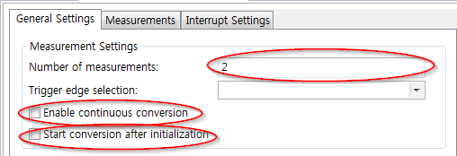

# Lab AdcMeasurement

## 개요
ADC_MEASUREMENT APP을 활용하여 X1_14(P14.0), X1_15(P14.1) 핀으로 입력되는 아날로그 전압을 디지털 값으로 변환한다.

### 목적
* ADC 관련설정 학습 후 DAVE ADC_MEASUREMENT APP을 활용한 관련설정 실습
* ADC 관련 메쏘드를 사용하여 운용방법 학습

### 학습성과
* DAVE 환경에서 ADC를 설정하고 사용할 수 있다.

### 선행사항들

### 참고자료 및 심화학습
* Lecture AdcBasic

## 예제에 대한 설명


### 동작 설명
* 외부 아날로그 전압을 X1_14(P14.0), X1_15(P14.1) 핀을 사용하여 입력받고 이를 AD 변환 후 사용자 호스트 컴퓨터에서 값을 확인한다.

### 프로그램 구조


#### DAVE APP
* ADC_MEASUREMENT

| Configuration Name | Value                              |
| ------------------ | ---------------------------------- |
| 채널 개수              | 2                                  |
| 채널 이름              | Channel_A(P14.0), Channel_B(P14.1) |
| 변환모드               | 12 Bit                             |
| 희망 샘플 시간[nsec]     | 67                                 |
| 트리거                | No External Trigger                |
| 인터럽트               | end of measurements interrupt      |

#### Variables

| Name      | Type     | Range          | Description   |
| --------- | -------- | -------------- | ------------- |
| channel_a | uint32_t | 0 ~ 4294967296 | 채널 A ADC 출력 값 |
| channel_b | uint32_t | 0 ~ 4294967296 | 채널 B ADC 출력 값 |

#### 기능
* main
    - ADC_MEASUREMENT_StartConversion 메쏘드를 사용하여 ADC를 시작한다.
* ISR_dhADC_0
    - dhADC_MEASUREMENT_0 컴포넌트의 ADC 완료 후 트리거 되는 인터럽트 서비스 루틴이다.
    - dhADC_MEASUREMENT_0 컴포넌트에서 ADC 결과 값을 ADC_MEASUREMENT_GetResult 함수로 읽고 다시 ADC_MEASUREMENT_StartConversion 메쏘드를 사용하여 ADC를 시작한다.

### 준비물과 하드웨어 구성
* XMC4500 Relax Lit Kit
* DAVE 4.3.2

### 프로그램 작성
1. 상단의 [File]-[New]-[DAVE Project] 메뉴를 사용하여 DAVE Project를 새로 만든다.

  

  

2. 툴바 메뉴의 **Add New App** 을 사용하여 **ADC_MEASUREMENT App** 을 추가한다.

  

3. ADC_MEASUREMENT_0의 오른쪽 마우스 메뉴에서 **Rename Instance Label** 을 선택하여 라벨이름을 dhADC_MEASUREMENT_0로 변경한다.

4. dhADC_MEASUREMENT_0을 다음의 그림과 같이 설정한다.

  

  

  

5. 툴바에서 **Manual Pin Allocator** 를 사용하여 다음과 같이 측정할 핀을 설정한다.


6. 설정을 적용하기 위해서 툴바에 **Generate the code** 를 사용한다.
7. main.c 코드를 다음과 같이 바꿔준다.

```
int main(void)
{
  DAVE_STATUS_t status;

  status = DAVE_Init();           /* Initialization of DAVE APPs  */

  if(status != DAVE_STATUS_SUCCESS)
  {
    /* Placeholder for error handler code. The while loop below can be replaced with an user error handler. */
    XMC_DEBUG("DAVE APPs initialization failed\n");

    while(1U)
    {

    }
  }

  ADC_MEASUREMENT_StartConversion(&dhADC_MEASUREMENT_0);

  /* Placeholder for user application code. The while loop below can be replaced with user application code. */
  while(1U)
  {

  }
}

void ISR_dhADC_MEASUREMENT_0()
{
	uint32_t channel_a;
	uint32_t channel_b;
	channel_a = ADC_MEASUREMENT_GetResult(&ADC_MEASUREMENT_Channel_A);
	channel_b = ADC_MEASUREMENT_GetResult(&ADC_MEASUREMENT_Channel_B);
	ADC_MEASUREMENT_StartConversion(&dhADC_MEASUREMENT_0);
}
```
8. 코드를 빌드하고 마이크로컨트롤러에 다운로드한다.

### 실행결과
* Channel_A(X1_14)핀을 GND(X1_2)와 연결하고 Channel_B(X1_15)핀을 VDD3.3(X1_37)핀과 연결 후 channel_a 변수와 channel_b 변수에 저장되는 ADC 결과 값을 확인한다.


* 반대로, Channel_A(X1_14)핀을 VDD3.3(X1_37)와 연결하고 Channel_B(X1_15)핀을 GND(X1_2)와 연결 후 channel_a 변수와 channel_b 변수에 저장되는 ADC 결과 값을 확인한다.


### 추가적인 실험
* 같은 기능을 수행하지만 내부적인 동작을 다음과 같이 바꿔 보자.
    - main 함수에서 명시적으로 ADC를 수행할 필요가 없도록 single-shot 모드가 아닌 continuous conversion 모드로 변경하고, 초기화 시 자동으로 변환을 수행하도록 한다.
    - ISR을 사용하지 않고 main 함수 내에서 아날로그 값을 읽는다.

> 위와 같이 설정하면 AD Conversion을 하기 위하여 CPU가 전혀 간섭할 필요가 없이 필요한 시점에 아무 때나 최신의 아날로그 값을 읽을 수 있다. 하지만, 주기적인 샘플링은 불가능하게 된다.

* ADC 설정을 다음과 같이 변경하여 AD 변환을 해보자. (Optional)

    - ADC_MEASUREMENT APP의 설정에서 Trigger edge selection을 External Trigger Upon Rising Edge를 선택한다.
    - PWM APP을 추가하고 주파수를 1 KHz로 설정한다. period match event를 발생시킨다.
    - HW signal connection을 이용하여 PWM의 period match event를 ADC_MEASUREMENT APP의 External trigger로 연결한다.
    - ADC_MEASUREMENT APP을 single-shot 모드로 설정하고 end of measurements interrupt를 활성화하여 ISR에서 아날로그 값을 읽는다.

> 위와 같이 설정하면 아날로그 신호를 ADC로 주기적으로 샘플링 할 수 있다.
