# Lab Check Development Environment

## 개요

DAVE를 다운로드 받아서 설치하고, 정상 설치 여부를 확인한다.

### 목적

DAVE와 디버거가 올바르게 설치되었는지 확인한다.

### 학습성과

- 올바른 하드웨어 연결 상태를 스스로 확인 할 수 있다.
- DAVE와 XMC4500 디버거 간 연결을 위한 설정을 할 수 있다.

## 개발환경 설치하기

1.  Infineon 홈페이지에서 Dave를 다운로드 받는다. (https://infineoncommunity.com/dave-download_ID645)

    *   Infineon 홈페이지에서 XMC 개발 도구를 찾아들어가면 위의 URL로 접속하게 된다.

    *   여기에서 다음과 같이 필요한 개인정보를 입력하고 `submit`하면 등록한 email로 다운로드 링크를 받을 수 있다. [주의] 설치파일이 상당히 크고 다운로드 시간이 오래 걸리므로 필요한 것, 자신의 컴퓨터에 맞는 DAVE for Windows 32-bit 또는 64-bit 만 받으면 된다. SDK는 받을 필요 없다.

        ​

        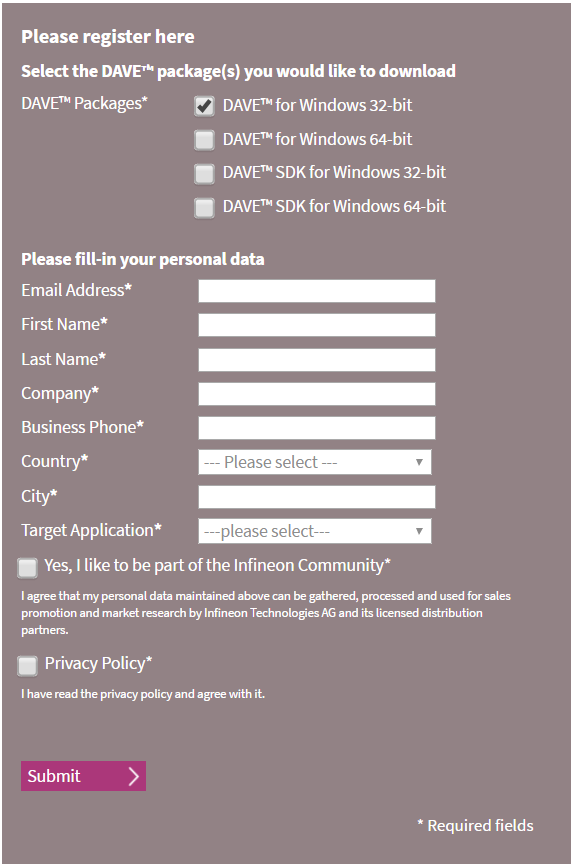

2.  다운로드 받은 파일을 실행하여 안내에 따라 DAVE 와 J-Link 설치한다.

    ​

## 개발환경 확인하기

### 하드웨어 연결 확인하기

1. 다음의 사진과 같이 USB케이블을 사용하여 XMC4500과 PC를 연결한다. USB 연결 시 연결하는 포트 위치를 정확히 확인하도록 한다.

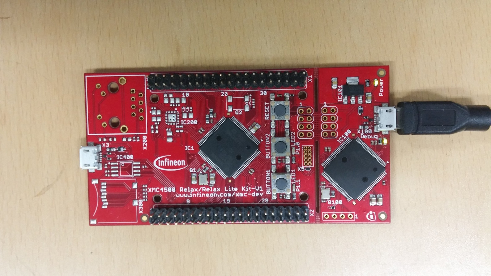

2. XMC4500을 처음 연결 시 드라이버를 설치한다. 드라이버 설치가 완료되면 아래 사진과 같이 장치관리자에서 J-Link driver를 확인 할 수 있다.

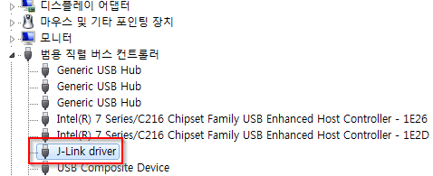

### PC 개발환경 확인하기

1. DAVE를 실행하고 상단의 [File]-[New]-[DAVE Project]를 선택한다.

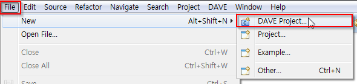

2. Project Name을 다음의 사진과 같이 입력하고 Project Type, Tool Chain을 사진과 같이 선택 후 하단의 Next버튼을 누른다.

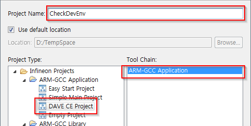

3. 아래의 사진과 같이 체크를 하고 하단의 Finish 버튼을 누른다. 아래 사진과 같이 CheckDevEnv 프로젝트가 만들어 진 것을 확인 할 수 있다.

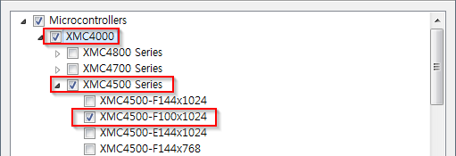

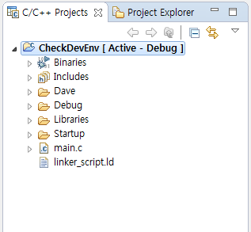


4. CheckDevEnv 프로젝트를 클릭하고 오른쪽 마우스 메뉴에서 [Build Configuration]-[Set Active]-[1 Debug]를 선택한다. 이 설정이 완료되면 위의 사진과 같이 프로젝트 이름이 CheckDevEnv [Active-Debug]로 된다.

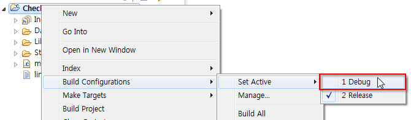

5. CheckDevEnv 프로젝트의 main.c 소스파일에서 main 함수를 다음과 같이 변경한다.

```c
int main(void)
{
  DAVE_STATUS_t status;

  status = DAVE_Init();           /* Initialization of DAVE APPs  */

  if(status != DAVE_STATUS_SUCCESS)
  {
    /* Placeholder for error handler code. The while loop below can be replaced with an user error handler. */
    XMC_DEBUG("DAVE APPs initialization failed\n");

    while(1U)
    {

    }
  }

  int i;

  /* Placeholder for user application code. The while loop below can be replaced with user application code. */
  while(1U)
  {
	  i = i + 1;
  }
}
```

6. 상단의 툴바메뉴에서 하얀색 바탕의 망치 아이콘을 클릭한다. 이 작업이 완료되면 콘솔창에 사진과 같은 메세지가 나타나는 것을 확인 할 수 있다.

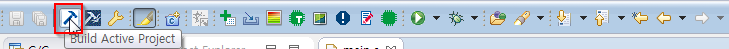

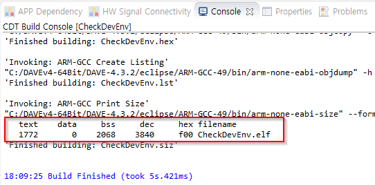

7. 상단의 툴바메뉴에서 벌레모양 아이콘 오른쪽의 아래 방향 화살표를 클릭하고 Debug Configurations를 선택한다.

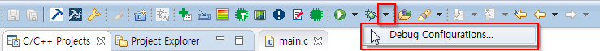

8. Debug Configurations 창에서 왼쪽의 GDB SEGGER J-Link Debugging을 더블클릭 후 아래 그림과 같이 설정이 되어 있는지 확인한다. 그 후, 하단의 Debug 버튼을 누른다. 디버거가 올바르게 실행된다면 아래의 두 번째 사진과 같은 화면으로 전환된다.

   * Project 하단의 텍스트 박스가 비어있다면 오른쪽의 Browse를 선택하고 CheckDevEnv를 선택한다.

   * C/C++ Application 하단의 텍스트 박스가 비어있다면 아래의 Search Project를 눌러 CheckDevEnv.elf를 선택한다.

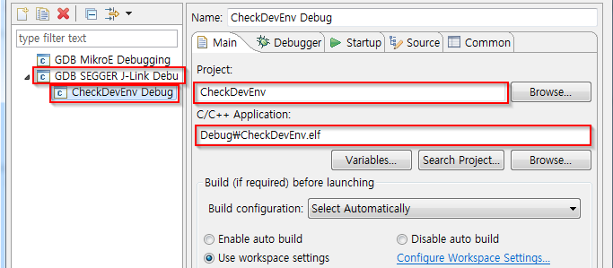

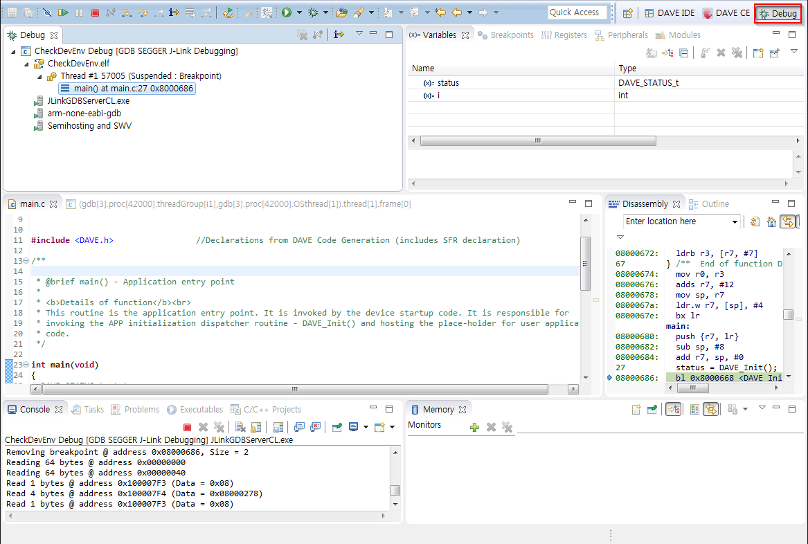

9. 만약 Debug를 눌렀을 때 아래와 같은 창이 나타난다면 이것은 XMC4500과 PC가 올바르게 연결되지 않은 것이다. 이는 위쪽의 하드웨어 연결을 다시 한 번 더 확인 할 필요가 있다.

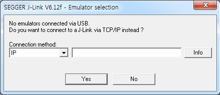

10. 디버거가 올바르게 실행 됐다면 상단의 툴바메뉴에서 아래 사진과 같은 아이콘을 클릭하여 프로그램을 시작한다.

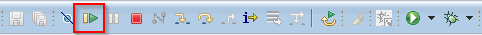

11. 디버거의 소스코드 화면에서 그림과 같이 코드 좌측을 더블 클릭하면 코드 실행 중 해당 코드라인에서 프로그램을 일시정지한다.

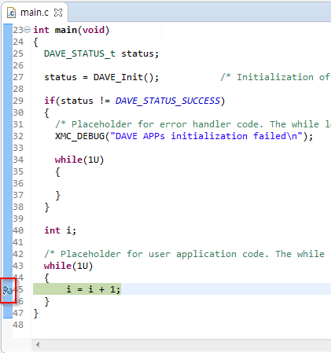

12. 우측 상단에서 그림과 같이 i 변수의 값을 확인 할 수 있다.

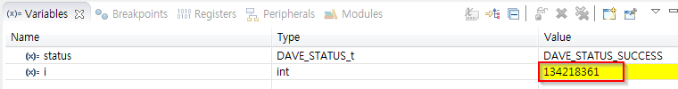
