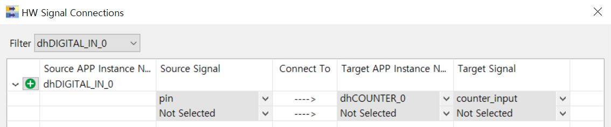

# LabCounter

## 개요
COUNTER APP을 사용하여 0~3의 값을 처리하는 카운터를 만든다.

### 목적
* 카운터 관련설정 학습 후 DAVE COUNTER APP을 활용한 관련설정 실습
* COUNTER APP 관련 메쏘드를 사용하여 운용방법 학습

### 학습성과
* DAVE 환경에서 카운터를 설정하고 사용할 수 있다.

### 선행사항들
* Lecture DigitalIos
* Lecture NVIC

### 참고자료 및 심화학습
* Lecture Counter

## 예제에 대한 설명


### 예제 동작
* BUTTON1을 누르면 카운터 값을 증가한다.
* 카운터 값은 3 초과 시 0으로 리셋되며 이 값은 디버거를 통해서 확인 할 수 있다.

### 프로그램 구조


#### DAVE APP
* DIGITAL_IO

| Name            | Pin direction |
|-----------------|---------------|
| dhDIGITAL_IN_0  | Input         |
| dhDIGITAL_OUT_0 | Input/Output  |

* COUNTER(dhCOUNTER_0)

| Configuration Name | Value       |
|--------------------|-------------|
| timer module       | CCU4        |
| Count match value  | 4           |
| Count edge         | Rising Edge |
| event              | count match |
| 초기화 후 시작      | O           |

* INTERRUPT

| Name        | Interrupt handler       |
|-------------|-------------------------|
| INTERRUPT_0 | dhCOUNTER_0_count_match |

#### Functions
* main
    - dhDIGITAL_IN_0의 값이 0이면 dhDIGITAL_OUT_0을 HIGH상태로 1이면 LOW상태로 만든다.
    - 현재 카운터 값을 읽는다.
* dhCOUNTER_0_count_match
    - 카운터 값이 4이면 발생하는 카운트 일치 이벤트에 의해 실행되는 인터럽트 서비스 루틴이다.
    - 카운터 이벤트 플래그를 클리어하고, 현재 카운터 값을 0으로 초기화한다.


### 준비물과 하드웨어 구성
* XMC4500 Relax Lite Kit-V1
* DAVE v4.3.2

### 프로그램 작성
1. 상단의 [File]-[New]-[DAVE Project] 메뉴를 사용하여 DAVE Project를 새로 만든다.

  

  

2. 툴바에서 **Add New APP** 을 사용하여 다음과 같이 COUNTER APP을 검색하고 추가한다.

  

3. COUNTER_0의 오른쪽 마우스 메뉴에서 **Rename Instance Label** 을 선택하여 라벨이름을 dhCOUNTER_0으로 변경한다.

4. dhCOUNTER_0을 다음과 같이 설정한다.

  

  

5. 툴바에서 **Add New APP** 을 사용하여 다음과 같이 DIGITAL_IO APP을 검색하고 2개 추가한다.

  

6. DIGITAL_IO_0과 DIGITAL_IO_1의 오른쪽 마우스 메뉴에서 **Rename Instance Label** 을 선택하여 라벨이름을 각각 dhDIGITAL_IN_0, dhDIGITAL_OUT_0으로 변경한다.

7. dhDIGITAL_IN_0을 다음과 같이 설정한다.

  

8. dhDIGITAL_OUT0을 다음과 같이 설정한다.

  

9. dhDIGITAL_OUT0의 **HW Signal Connections** 메뉴에서 다음과 같이 설정한다.

  

10. 툴바에서 **Add New APP** 을 사용하여 다음과 같이 INTERRUPT APP을 검색하고 추가한다.

  

  

11. dhCOUNTER_0의 **HW Signal Connections** 메뉴에서 다음과 같이 설정한다.

  

12. INTERRUPT_0을 다음과 같이 설정한다.

  

13. 툴바에서 **Manual Pin Allocator** 를 사용하여 다음과 같이 dhDIGITAL_IN_0 핀을 설정한다.


14. 툴바에서 **Generate Code** 를 사용하여 APP 설정을 코드에 적용한다.

15. main 함수에 다음과 같이 코드를 입력한다.

```
#include <DAVE.h>                 //Declarations from DAVE Code Generation (includes SFR declaration)

/**

 * @brief main() - Application entry point
 *
 * <b>Details of function</b><br>
 * This routine is the application entry point. It is invoked by the device startup code. It is responsible for
 * invoking the APP initialization dispatcher routine - DAVE_Init() and hosting the place-holder for user application
 * code.
 */

int main(void)
{
  DAVE_STATUS_t status;

  status = DAVE_Init();           /* Initialization of DAVE APPs  */

  if(status != DAVE_STATUS_SUCCESS)
  {
    /* Placeholder for error handler code. The while loop below can be replaced with an user error handler. */
    XMC_DEBUG("DAVE APPs initialization failed\n");

    while(1U)
    {

    }
  }

  uint16_t counter_value;

  /* Placeholder for user application code. The while loop below can be replaced with user application code. */
  while(1U)
  {
	  if (DIGITAL_IO_GetInput(&dhDIGITAL_IN_0) == 0)
	  {
		  DIGITAL_IO_SetOutputHigh(&dhDIGITAL_OUT_0);
	  }
	  else
	  {
		  DIGITAL_IO_SetOutputLow(&dhDIGITAL_OUT_0);
	  }

	  counter_value = COUNTER_GetCurrentCount(&dhCOUNTER_0);
  }
}

void dhCOUNTER_0_count_match(void)
{
	COUNTER_ClearEvent(&dhCOUNTER_0, COUNTER_EVENT_COUNT_MATCH);
	COUNTER_ResetCounter(&dhCOUNTER_0);
}
```

16. 빌드 후 코드를 마이크로컨트롤러에 다운로드한다.

### 실행결과
- dhDIGITAL_IN_0의 상태에 따라 dhDIGITAL_OUT_0의 출력을 변화시키고 이 출력신호를 카운터입력으로 사용한다.
- 카운트 값이 4가 되면 count_match 이벤트가 인터럽트를 발생시킨다.
- 인터럽트 서비스 루틴에서는 카운트 값을 0으로 초기화한다.
