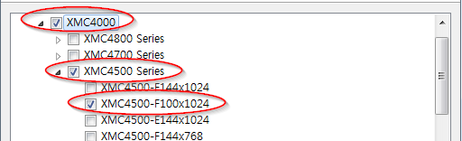

# Lab Dac

## 개요
DAC APP을 사용하여 LED 2개를 제어한다.
첫 번째 LED에는 싸인파를 출력하고, 두 번째 LED에는 DC전압을 출력한다.

### 목적
* DAC 관련 설정 학습후 DAVE DAC APP을 활용한 관련설정 실습
* DAC 관련 메쏘드를 사용한 운용방법 학습

### 학습성과
* DAVE 환경에서 DAC를 설정하고 사용할 수 있다.

### 선행사항들

### 참고자료 및 심화학습

* Lecture DacBasic

## 예제에 대한 설명


### 예제 동작
* 외부 LED1
    - 프로그램 처음 시작 시, LED의 밝기가 변하는 것을 확인 할 수 있다.
    - 디버거를 통해, e_amplitude, u32_frequency, i16_dc_offset_mv 변수에 값을 쓰면 출력되는 싸인파형의 진폭, 주파수, 오프셋이 변경되므로, 그에 대한 결과로 LED를 통해 확인 할 수 있다.

* 외부 LED2
    - 프로그램 처음 시작 시, LED가 꺼져있다.
    - 디버거를 통해, i16_single_value 변수에 [-2049 ~ 2048] 사이의 값을 입력하여 LED로 출력되는 전압을 조절 할 수 있다.

### 프로그램 구조


#### DAVE APP 설정
* dhDAC_0

| Tap                | Configuration Name         | Value             |
|--------------------|----------------------------|-------------------|
| Waveform Selection | Waveform selection         | Pattern Generator |
|                    | Start after initialization | Yes               |
| Pattern            | Pattern selection          | Sine              |
|                    | Amplitude                  | 1.1               |
|                    | Desired frequency          | 4                 |
|                    | Desired offset             | 1.4               |

* dhDAC_1

| Tap                | Configuration Name         | Value       |
|--------------------|----------------------------|-------------|
| Waveform Selection | Waveform selection         | SingleValue |
|                    | Start after initialization | Yes         |
| SingleValue        | Sign selection             | SignedValue |

#### Variables

| Name             | Type      | Range          | Description         |
|------------------|-----------|----------------|---------------------|
| e_amplitude      | DAC_VSS_t | Help 참조      | dhDAC_0 진폭 설정   |
| u32_frequency    | uint32_t  | 0 ~ 4294967296 | dhDAC_0 주파수 설정 |
| i16_dc_offset_mv | int16_t   | -32768 ~ 32767 | dhDAC_0 오프셋 설정 |
| i16_single_value | int16_t   | -32768 ~ 32767 | dhDAC_1 전압 설정   |

#### Function
* main
    - SetAmplitude, SetFrequency, SetOffset 메쏘드를 사용하여 dhDAC_0의 진폭, 주파수, 오프셋을 변경한다.
    - SetValue_s16 메쏘드를 사용하여 dhDAC_1 전압 레벨을 변경시킨다.

### 준비물과 하드웨어 구성
* XMC4500 Relax Lite Kit-V1
* DAVE v4.3.2

### 프로그램 작성
1. 상단의 [File]-[New]-[DAVE Project] 메뉴를 사용하여 DAVE Project를 새로 만든다.

  

  

2. 툴바 메뉴의 **Add New App** 을 사용하여 DAC APP 을 2개를 추가한다.


3. DAC_0과 DAC_1의 오른쪽 마우스 메뉴에서 **Rename Instance Label** 을 선택하여 라벨이름을 각각 dhDAC_0, dhDAC_1으로 변경한다.

  

4. dhDAC_0을 다음과 같이 설정한다.

  

  

5. dhDAC_1을 다음과 같이 설정한다.

  

  

6. 툴바에서 **Manual Pin Allocator** 를 사용하여 DAC Pin을 다음과 같이 설정한다.

  

7. 툴바에서 **Generate Code** 를 사용하여 APP 설정을 코드에 적용한다.

8. main 함수에 다음과 같이 코드를 입력한다.

```
#include <DAVE.h>                 //Declarations from DAVE Code Generation (includes SFR declaration)

/**

 * @brief main() - Application entry point
 *
 * <b>Details of function</b><br>
 * This routine is the application entry point. It is invoked by the device startup code. It is responsible for
 * invoking the APP initialization dispatcher routine - DAVE_Init() and hosting the place-holder for user application
 * code.
 */

int main(void)
{
  DAVE_STATUS_t status;

  DAC_VSS_t e_amplitude;
  uint32_t u32_frequency;
  int16_t i16_dc_offset_mv;
  int16_t i16_single_value;

  status = DAVE_Init();           /* Initialization of DAVE APPs  */

  if(status != DAVE_STATUS_SUCCESS)
  {
    /* Placeholder for error handler code. The while loop below can be replaced with an user error handler. */
    XMC_DEBUG("DAVE APPs initialization failed\n");

    while(1U)
    {

    }
  }

  /* Placeholder for user application code. The while loop below can be replaced with user application code. */
  e_amplitude = DAC_VSS_1100_mV;
  u32_frequency = 4;
  i16_dc_offset_mv = 1400;

  i16_single_value = 0;

  while(1U)
  {
	  DAC_Pattern_SetAmplitude(&dhDAC_0, e_amplitude);
	  DAC_Pattern_SetFrequency(&dhDAC_0, u32_frequency);
	  DAC_Pattern_SetOffset(&dhDAC_0, i16_dc_offset_mv);

	  DAC_SingleValue_SetValue_s16(&dhDAC_1, i16_single_value);
  }
}
```

9. 빌드 후 코드를 마이크로컨트롤러에 다운로드한다.

### 실행결과
* 외부 LED1
    - 초기 프로그램 실행 시, 진폭 1.1 V, 주파수 4 Hz, 오프셋 1.4 V의 싸인파형이 출력된다.
    - e_amplitude, u32_frequency, i16_dc_offset_mv 변수값을 변경하면 출력하는 정현파의 진폭, 주파수, 오프셋이 변경된다.
* 외부 LED2
    - 처음 프로그램 실행 시, DC 0.3 V가 출력된다.
    - i16_single_value 변수 값을 변경하면 출력 전압을 변경 할 수 있다.

### 추가적인 실험
* DAC Pattern Generator 모드의 Custom 기능을 사용해서 주파수가 10 Hz인 다음과 같은 파형을 만들어보자


