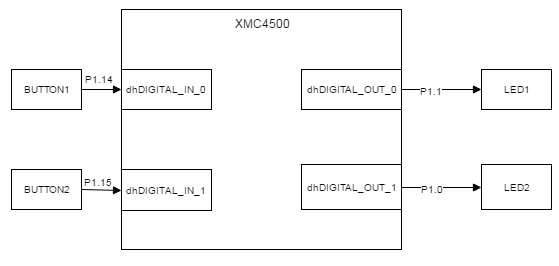
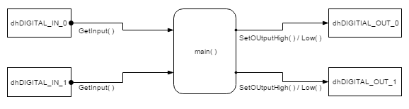
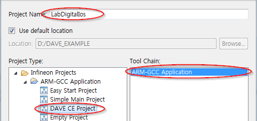
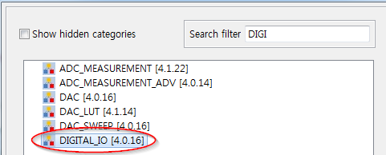
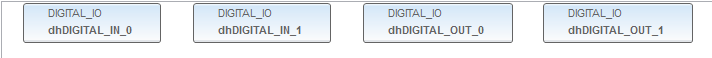
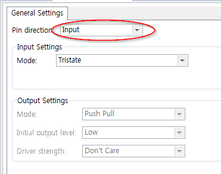
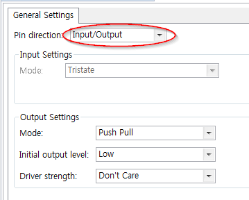
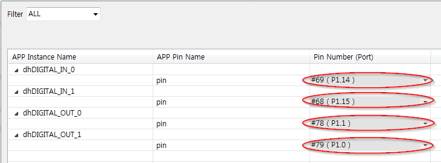

# Lab Digital Io

## 개요
디지털 IO를 사용하여 보드 상의 버튼 상태에 따라 LED를 ON/OFF 한다.

### 목적
* 디지털 IO 관련설정 학습 후 DAVE DIGITAL_IO APP을 활용한 관련설정 실습
* DIGITAL_IO APP 관련 메쏘드를 사용하여 운용방법 학습

### 학습성과
* DAVE 환경에서 디지털 IO를 운용할 수 있다.

### 선행사항들

### 참고자료 및 심화학습
* Lecture DigitalIos

## 예제에 대한 설명


###  예제 동작
* LED1
    - 버튼 조작에 따라 LED1에 ON(3.3 V) / OFF(0 V) 전압이 인가된다.
* LED2
    - 버튼 조작에 따라 LED1에 ON(3.3 V) / OFF(0 V) 전압이 인가된다.

### 프로그램 구조


#### DAVE APP
* DIGITAL_IO

| Name            | Pin Direction |
|-----------------|---------------|
| dhDIGITAL_IN_0  | Input         |
| dhDIGITAL_IN_1  | Input         |
| dhDIGITAL_OUT_0 | Input/Output  |
| dhDIGITAL_OUT_1 | Input/Output  |

#### Functions
* main
    - dhDIGITAL_IN_0의 상태를 DIGITAL_IO_GetInput 메쏘드를 사용하여 입력받고 입력에 따라 결과를 DIGITAL_IO_SetOutputHigh / DIGITAL_IO_SetOutputLow 메쏘드를 사용하여 출력한다.
    - dhDIGITAL_IN_1의 상태를 DIGITAL_IO_GetInput 메쏘드를 사용하여 입력받고 입력에 따라 결과를 DIGITAL_IO_SetOutputHigh / DIGITAL_IO_SetOutputLow 메쏘드를 사용하여 출력한다.

### 준비물과 하드웨어 구성
* XMC4500 Relax Lite Kit-V1
* DAVE v4.3.2

### 프로그램 작성
1. 상단의 [File]-[New]-[DAVE Project] 메뉴를 사용하여 DAVE Project를 새로 만든다.

  

  

2. 툴바에서 **Add New APP** 을 사용하여 다음과 같이 DIGITAL_IO APP을 검색하고 4개 추가한다.

  

3. DIGITAL_IO_0, DIGITAL_IO_1, DIGITAL_IO_2, DIGITAL_IO_3의 오른쪽 마우스 메뉴에서 **Rename Instance Label** 을 선택하여 라벨이름을 각각 DIGITAL_IN_0, DIGITAL_IN_1, DIGITAL_OUT_0, DIGITAL_OUT_1로 변경한다.

  

4. DIGITAL_IN_0, DIGITAL_IN1은 다음과 같이 설정한다.



5. DIGITAL_OUT_0, DIGITAL_OUT_1은 다음과 같이 설정한다.



6. 툴바에서 **Manual Pin Allocator** 를 사용하여 핀을 다음과 같이 설정한다.



7. 툴바에서 **Generate Code** 를 사용하여 APP 설정을 코드에 적용한다.

8. main 함수에 다음과 같이 코드를 입력한다.

```
#include <DAVE.h>                 //Declarations from DAVE Code Generation (includes SFR declaration)

/**

 * @brief main() - Application entry point
 *
 * <b>Details of function</b><br>
 * This routine is the application entry point. It is invoked by the device startup code. It is responsible for
 * invoking the APP initialization dispatcher routine - DAVE_Init() and hosting the place-holder for user application
 * code.
 */

int main(void)
{
  DAVE_STATUS_t status;

  status = DAVE_Init();           /* Initialization of DAVE APPs  */

  if(status != DAVE_STATUS_SUCCESS)
  {
    /* Placeholder for error handler code. The while loop below can be replaced with an user error handler. */
    XMC_DEBUG("DAVE APPs initialization failed\n");

    while(1U)
    {

    }
  }

  /* Placeholder for user application code. The while loop below can be replaced with user application code. */
  while(1U)
  {
  	if (DIGITAL_IO_GetInput(&dhDIGITAL_IN_0) == 0U)
  		DIGITAL_IO_SetOutputHigh(&dhDIGITAL_OUT_0);
  	else
  		DIGITAL_IO_SetOutputLow(&dhDIGITAL_OUT_0);

  	if (DIGITAL_IO_GetInput(&dhDIGITAL_IN_1) == 0U)
  	    DIGITAL_IO_SetOutputHigh(&dhDIGITAL_OUT_1);
  	else
  		DIGITAL_IO_SetOutputLow(&dhDIGITAL_OUT_1);
  }
}
```

9. 빌드 후 코드를 마이크로컨트롤러에 다운로드한다.


### 실행결과
* LED1
    - BUTTON1을 누르면 켜진다.
    - BUTTON1에서 손을 떼면 꺼진다.
* LED2
    - BUTTON2를 누르면 켜진다.
    - BUTTON2에서 손을 떼면 꺼진다.
