# Lab Getting Started Part1

## 개요
보드의 상의 LED1과 LED2를 서로 다른 주기로 점멸한다.

### 목적
Dave 및 XMC4500 kit를 처음으로 활용해 보고, 정상적인 설치여부를 확인한다.

### 학습성과
* DAVE 개발 환경 이해
* DAVE App 이해

### 선행사항들
Lecture Getting Started
### 참고자료 및 심화학습

## 예제에 대한 설명
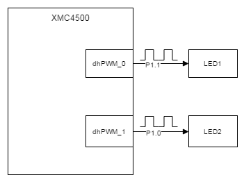

### 예제 동작
* 보드 상의 LED1은 5 Hz의 주파수로 점멸한다.
* 보드 상의 LED2는 1 Hz의 주파수로 점멸한다.

### 준비물과 하드웨어 구성
* XMC4500 Relax Lite Kit-V1
* DAVE v4.3.2

### 프로그램 작성
1. 상단의 [File]-[New]-[DAVE Project] 메뉴를 사용하여 DAVE Project를 새로 만든다.
  
  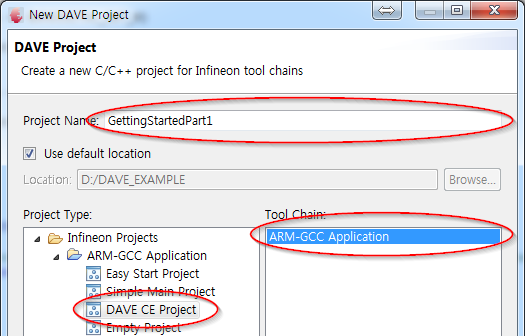
  
  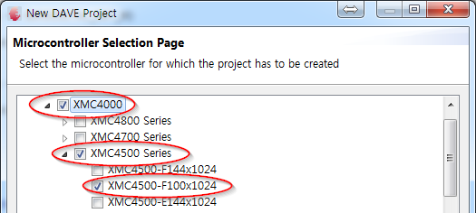
  
  
2. 툴바에서 **Add New APP** 을 사용하여 다음과 같이 PWM APP을 검색하고 추가한다. 추가하면 하단에 PWM App이 추가된 것을 확인 할 수 있다.
  
  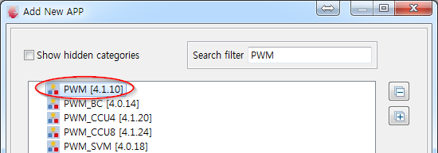
  
  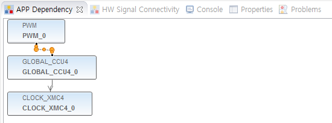
  
  
3. PWM_0 APP의 오른쪽 마우스 메뉴에서 **Rename Instance Label** 을 클릭하여 앱 이름을 dhPWM_0으로 변경한다.
  
  
4. dhPWM_0 APP을 더블클릭하여 설정을 다음과 같이 변경한다.
  
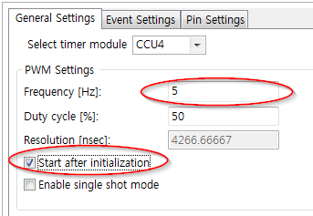
  
  
5. dhPWM_0 APP의 오른쪽 마우스 메뉴에서 **Add New Instance** 를 선택한다. 그리고 3번과정과 같은 방법으로 dhPWM_1라고 APP 이름을 변경한다.
  
  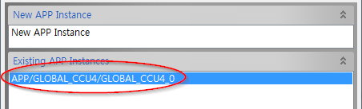
  
  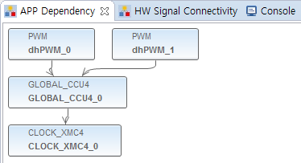
  
  
6. dhPWM_0 APP의 오른쪽 마우스 메뉴에서 **Copy APP Configuration** 을 선택하고, dhPWM_1 APP의 오른쪽 마우스 메뉴에서 **Paste APP Configuration** 을 선택한다. 그 후, dhPWM_1 APP 설정에서 Frequency만 1 Hz로 변경한다.  
  
  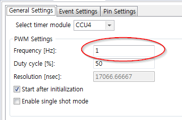
  
  
7. 툴바에서 **Manual Pin Allocator** 사용하여 PWM Output pin을 다음과 같이 설정한다.
  
  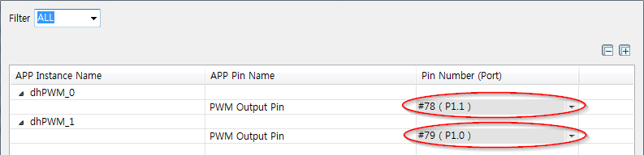
  
  
8. 툴바에서 **Report** 를 사용하여 APP 설정사항들을 확인 할 수 있다.
  
  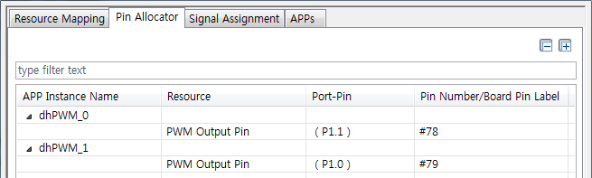
  
  
9. 툴바에서 **Generate Code** 를 선택하여 APP 설정들을 실제로 코드에 반영하도록 한다.
  
  
10. 코드를 빌드하고 마이크로컨트롤러에 다운로드 한다.
  
### 실행결과
* 보드 상의 LED1은 5 Hz, LED2는 1Hz로 점멸 되는 것을 확인 할 수 있다.
