# Lab Getting Started Part2

## 예제에 대한 설명
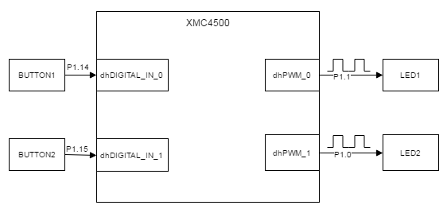

### 예제 동작
* Part1의 동작에 추가적으로 다음을 수행한다.
	* [참고] Part1 동작: LED1 5Hz, LED2 1Hz 점멸
* BUTTON1을 누르면 LED1의 점멸을 멈춘다.
* BUTTON2를 누를 때마다,
	* LED2의 주파수를 1Hz 씩 증가시킨다.
	* LED2의 주파수가 10 Hz보다 커지면 1 Hz로 리셋되고, 이때 LED1도 리셋되어 다시 5Hz의 주파수로 점멸 된다.

### 프로그램 구조
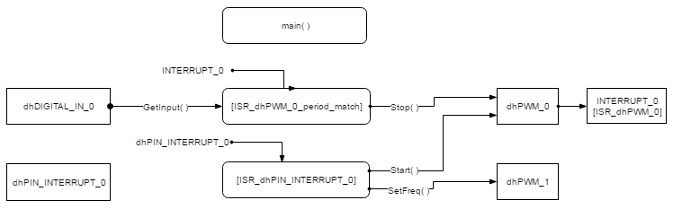
#### DAVE APP
* DIGITAL_IO

| Name           | Pin direction |
|----------------|---------------|
| dhDIGITAL_IN_0 | Input         |

* PWM

| Name    | timer module | Frequency[Hz] | Duty[%] | 초기화 후 시작 여부 | Event        |
|---------|--------------|---------------|---------|---------------------|--------------|
| dhPWM_0 | CCU4         | 5             | 50      | O                   | period match |
| dhPWM_1 | CCU4         | 1             | 50      | O                   | X            |

* INTERRUPT

Name        | Enable interrupt at initialization | Interrupt handler
------------|------------------------------------|-------------------------
INTERRUPT_0 | O                                  | ISR_dhPWM_0_period_match

* PIN_INTERRUPT

| Name              | Edge         | Handler Name          | Enable during initialization |
|-------------------|--------------|-----------------------|------------------------------|
| dhPIN_INTERRUPT_0 | Falling Edge | ISR_dhPIN_INTERRUPT_0 | O                            |

#### Functions
* ISR_dhPWM_0_period_match
	- dhPWM_0의 period match 이벤트에 의해 주기적으로 트리거되는 인터럽트 서비스 루틴이다.
	- dhDIGITAL_IN_0(BUTTON1)의 상태를 읽고 만약 그 값이 0이면(BUTTON1을 누르면) dhPWM_0 컴포넌트의 동작을 정지시킨다.
* ISR_dhPIN_INTERRUPT_0
	- dhPIN_INTERRUPT_0에 의해서 실행되는 인터럽트 서비스 루틴이다.
	- dhPWM_1의 주파수를 1 Hz 씩 증가시킨다. 10 Hz를 넘으면 dhPWM_0를 재시작하고 dhPWM_1의 주파수를 1 Hz로 리셋시킨다.

### 준비물과 하드웨어 구성
* XMC4500 Relax Lite Kit-V1
* DAVE v4.3.2

### 프로그램 작성
1. Lab Getting Started Part1에 이어서 툴바에서 **Add New APP** 을 사용하여 DIGITAL_IO 앱을 추가한다.

	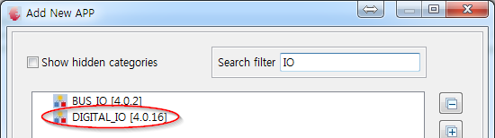

	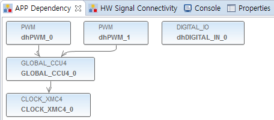

2. DIGITAL_IO APP의 오른쪽 마우스 메뉴에서, **Rename Instance Label** 을 선택하여 dhDIGITAL_IN_0으로 APP라벨이름을 변경한다.
3. 툴바에서 **Manual Pin Allocator** 를 사용하여 dhDIGITAL_IN_0 App의 Input Pin을 지정한다.

	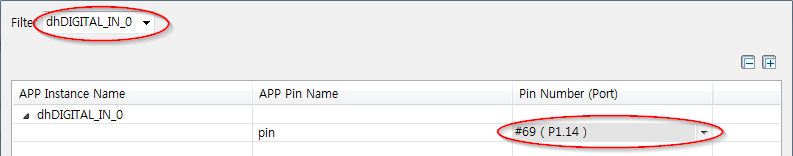

4. dhPWM_0 설정에서 다음과 같이 Period match 설정을 체크한다.

	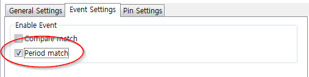

5. 툴바에서 **Add New App** 을 사용하여 INTERRUPT APP을 추가한다.

	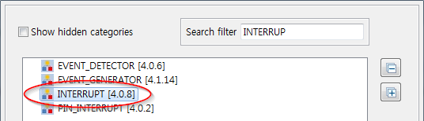

	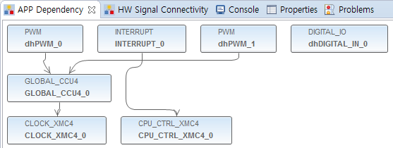

6. INTERRUPT_0 APP 설정에서 다음과 같이 Interrupt handler 이름을 ISR_dhPWM_0_period_match라고 지정한다.

	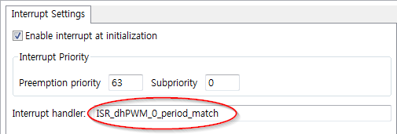

7. 다음과 같이 dhPWM_0 APP 설정화면 우측 하단에서 **HW Signal Connection** 을 사용하거나 dhPWM_0 APP 오른쪽 마우스 메뉴에서 **HW Signal Connection** 을 사용하여 인터럽트 연결관계를 설정한다.

	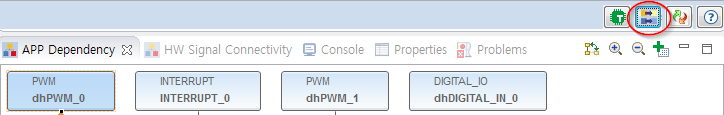

	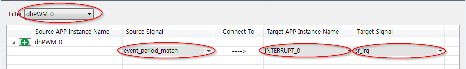

8. 7번의 Signal Connection은 하단의 Signal Connectivity 탭에서 확인할 수 있다.

	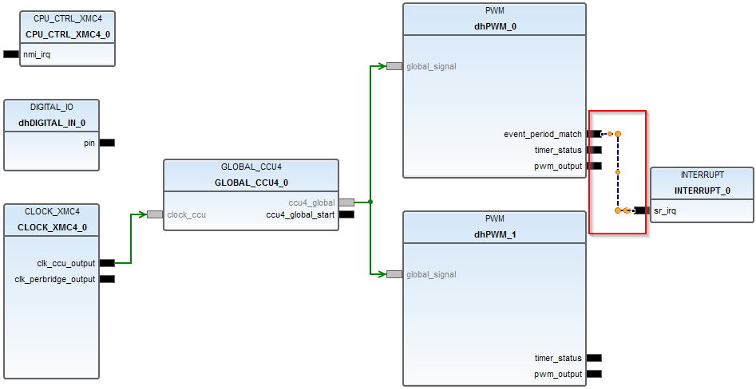

9. main.c 제일 하단에 다음과 같은 ISR_dhPWM_0_period_match 코드를 추가한다.
```
void ISR_dhPWM_0_period_match(void)
{
	PWM_ClearEvent(&dhPWM_0, PWM_INTERRUPT_PERIODMATCH);

	if (DIGITAL_IO_GetInput(&dhDIGITAL_IN_0) == 0)
	{
		PWM_Stop(&dhPWM_0);
	}
}
```

> APP 관련 메뉴얼은 APP 설정 화면에서 우측하단 툴바에 "Help"를 사용하거나 App 오른쪽 마우스 메뉴에서 APP Help를 사용하면 된다.

> PWM_ 입력 후 Ctrl + Space 단축키를 사용하면 PWM API 목록을 확인하고 선택할 수 있다.

10. 툴바의 **Add New APP** 을 사용하여 PIN_INTERRUPT APP을 추가하고 dhPIN_INTERRUPT_0 라고 라벨을 설정한다.

	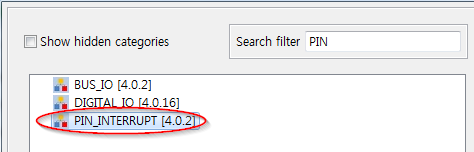

	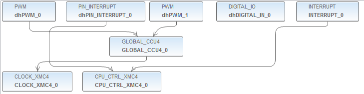

11. 툴바의 **Manual Pin Allocator** 를 사용하여 dhPIN_INTERRUPT_0를 p1.15에 할당한다.

	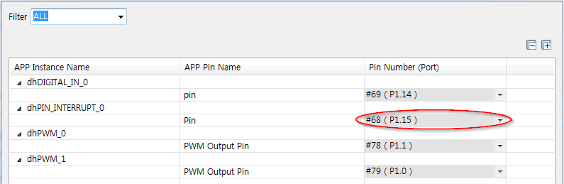

12. dhPIN_INTERRUPT_0 설정에서 다음 그림과 같이 설정한다.

	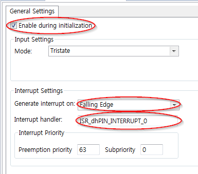

13. 툴바에서 **Generate Code** 를 사용하여 APP 설정을 코드에 적용한다.
14. main.c에 다음의 코드를 추가한다.

`volatile uint32_t u32NewFreq=1;     //#Include 아래 전역변수로 선언`

```
void ISR_dhEVENT_GENERATOR_0_iout(void)
{
	u32NewFreq++;
	if (u32NewFreq > 10)
	{
		u32NewFreq = 1;
		PWM_Start(&dhPWM_0);
	}
	PWM_SetFreq(&dhPWM_1, u32NewFreq);
}
```
15. 빌드 후 코드를 마이크로컨트롤러에 다운로드한다.

### 실행결과
* LED1은 5 Hz, LED2는 1Hz로 점멸 된다. (Part1 과 동일)
* BUTTON1을 누르면 LED1의 토글링이 멈추는 것을 확인 할 수 있다.
* BUTTON2을 누를 때마다, LED2의 주파수가 1Hz 씩 증가하고 10Hz가 되면 LED1과 LED2는 리셋된다.
