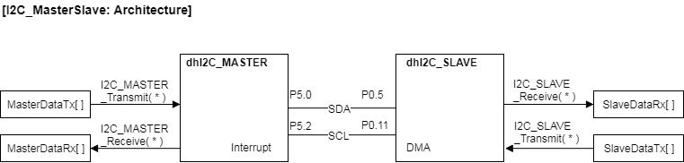

# Inter-Integrated Circuit Lab  

## Must Execute Code

*   I2CMasterSlave.zip 프로젝트 import 하여 실행해 보세요.


## Understand I2C_MASTER & SLAVE App

### I2C_MASTER APP 

I2C_MASTER APP 의 Help 를 열고 다음의 항목들을 살펴보세요.

*   Overview 에서 다음의 항목들을 살펴보세요.

    *   Master 에서 일반적으로 사용하는 전송 속도는 얼마인가요?

        .

    *   7 Bit Address Mode를 사용하는 경우에 8번째 Bit은 R/W 모드를 의미합니다. Slave Address 가 10번지 이라면,

        *   WRITE를 할 때는 10 + 0
        *   READ를 할 때는 10 + 1

*   APP Configuration Parameter 의 항목들을 살펴보세요.

    *   Pin Settings에서 SDA/SCL 모드가 Open Drain 과 Push Pull 이라는 항목이 존재합니다.  이 두가지는 전기적으로 어떻게 다른 것인가요?  그리고 어떤 경우에 각각 사용하는 것일까요?

        .

        .

        ​

*   Methods 항목을 참고해서 다음의 함수들에 대한 간략한 설명을 적어보세요.

```
I2C_MASTER_Receive(&dhI2C_MASTER, true, I2C_MasterAddressSent, I2C_MasterDataRx, I2C_DataSize, true, true);
```

.

.

.

.

```
I2C_MASTER_Receive(&dhI2C_MASTER, true, I2C_MasterAddressSent, I2C_MasterDataRx, I2C_DataSize, true, true);
```

.

.

.

.

```
I2C_MASTER_IsTxBusy(&dhI2C_MASTER)
```

.

.

.

### I2C_SLAVE App

I2C_SLAVE APP 의 Help 를 열고 다음의 항목들을 살펴보세요.

*   APP Configuration Parameter를 열고 다음의 항목들을 유의해서 살펴 봅니다.
    *   General Settings 에 Address Settings 이 있습니다.  이 항목들로 Address Mode 7bit 혹은 10bit을 선택하고, 이 Slave Node의 Address를 설정합니다.

*   Methods 항목을 참고해서 다음의 함수들에 대한 간략한 설명을 적어보세요.

```
I2C_SLAVE_Receive(&dhI2C_SLAVE, I2C_SlaveDataRx, I2C_DataSize);
```

.

.

.

```
I2C_SLAVE_Transmit(&dhI2C_SLAVE, I2C_SlaveDataTx, I2C_DataSize);
```

.

.

.

## Example 

*   다음의 그림과 같이 SPI_MASTER App 과 SPI_SLAVE App 을 연결하여 시험한다.
*   2byte 혹은 4byte의 data를 transmit, recieve, 혹은 transfer 할 수 있도록 한다.




*   dhSPI_MASTER App Configuration
    *   General Settings
        *   Desired bus speed[KHz]: *100*
    *   Advanced Settings
        *   Transmit mode: *Interrupt*
        *   Receive mode: *Interrupt*
        *   Enable transmit FIFO: *check*
        *   Enable receive FIFO: *check*
    *   **Pin Settings**
        *   Enable advanced pin config: *check*
        *   SDA/Mode: Push Pull
        *   SCL/Mode: Push Pull

*   dhSPI_SLAVE App Configuration
    *   General Settings
        *   Desired bus speed[KHz]: *100*
        *   Address Settings/Mode: *7*
        *   Address Settings/Address: *10*
    *   Advanced Settings
        *   Protocol Handling / Transmit mode: *DMA*
        *   Protocol Handling / Receive mode: *DMA*
    *   Interrupt Settings
        *   End of receive callback: *check*, `CB_I2C_SlaveReceive`
        *   Read request received: *check*, `CB_I2C_SlaveReadRequest`

### 중요 변수

 * `uint8_t I2C_TxDataSize`: 한번에 I2C로 전송되는 byte 수
 * `uint8_t I2C_RxDataSize`: 한번에 I2C로 수신되는 byte 수
 * `bool I2C_MasterTxEnable`: 활성화 되면 MASTER_Transmit 동작 1회  실행
 * `bool I2C_MasterRxEnable`: 활성화 되면 MASTER_Receive 동작 1회  실행
 * `bool I2C_MasterTransEnable`: 활성화 되면 MASTER_Transfer 동작 1회  실행
 * `uint8_t I2C_MasterAddressSent`: Slave Address
 * `uint8_t I2C_MasterDataTx[], I2C_MasterDataRx[], I2C_SlaveDataTx[], I2C_SlaveDataRx[]`: 전송되어지는 Data buffer

### Slave Node 준비

*   Slave Node 에서 주고 받을 Data 를 연결해 준다.
    *   (주의) Slave Node는 스스로 Data 를 보내고 받을 수 없다.  Master Node에서 통신 싸이클이 진행되어야 준비되어 있던 Data 를 보내고 받게 된다.
    *   Master Node에서 전송을 시작하기 전에 다음과 같이 `I2C_SlaveDataRx[]`, `I2C_SlaveDataTx[]` 저장공간을 `dhI2C_SLAVE`에 연결해 준다. 

```c
I2C_SLAVE_Receive(&dhI2C_SLAVE, I2C_SlaveDataRx, I2C_DataSize);
I2C_SLAVE_Transmit(&dhI2C_SLAVE, I2C_SlaveDataTx, I2C_RxDataSize);
```

### 명령 활성화 입력에 따른 동작

*   그리고 무한 루프에서 `MasterTxEnable`, `MasterRxEnable`, `MasterTransEnable` 값에 따라서 각각의 동작을 1회 할 수 있도록 한다.

```c
	while(1){

		if(I2C_MasterTxEnable != false)
		{
			while( I2C_MASTER_IsTxBusy(&dhI2C_MASTER) == true) { };
			I2C_SLAVE_Receive(&dhI2C_SLAVE, I2C_SlaveDataRx, I2C_TxDataSize);
			I2C_MASTER_Transmit(&dhI2C_MASTER, true, I2C_SlaveAddress, I2C_MasterDataTx, I2C_TxDataSize, true);
			I2C_MasterTxEnable = false;
		}

		if(I2C_MasterRxEnable != false)
		{
			while( I2C_MASTER_IsRxBusy(&dhI2C_MASTER) == true) { };
			I2C_SLAVE_Transmit(&dhI2C_SLAVE, I2C_SlaveDataTx, I2C_RxDataSize);
			I2C_MASTER_Receive(&dhI2C_MASTER, true, I2C_SlaveAddress, I2C_MasterDataRx, I2C_RxDataSize, true, true);
			I2C_MasterRxEnable = false;
		}

		if(I2C_MasterTransEnable != false){
			while( I2C_MASTER_IsTxBusy(&dhI2C_MASTER) == true) { };
			I2C_SLAVE_Receive(&dhI2C_SLAVE, I2C_SlaveDataRx, I2C_TxDataSize);
			I2C_MASTER_Transmit(&dhI2C_MASTER, true, I2C_SlaveAddress, I2C_MasterDataTx, I2C_TxDataSize, false);
			while( I2C_MASTER_IsTxBusy(&dhI2C_MASTER) == true) { };
			I2C_SLAVE_Transmit(&dhI2C_SLAVE, I2C_SlaveDataTx, I2C_RxDataSize);
			I2C_MASTER_Receive(&dhI2C_MASTER, true, I2C_SlaveAddress, I2C_MasterDataRx, I2C_RxDataSize, true, true);
			while( I2C_MASTER_IsRxBusy(&dhI2C_MASTER) == true) { };
			I2C_MasterTransEnable = false;
		}
```

### Transmit 동작

*   Debugger 혹은 uC/Probe를 사용하여 `MasterTxEnable` 을 1로 변경하면 `I2C_MASTER_Transmit()` Method가 1회 실행하게 된다.
    *   `MasterDataTx[]` --> `SlaveDataRx[]`


### Receive 동작

*   `MasterRxEnable` 을 1로 변경하면 `I2C_MASTER_Receive()` Method가 1회 실행하게 된다.
    *   ` MasterDataRx[]` <-- `SlaveDataTx[]` 


### Transfer 동작

*   `MasterTransEnable` 을 1로 변경하면 `I2C_Master_Transmit`, `I2C_MASTER_Receive()` Method가 1회 실행하게 된다.
    *   `MasterDataTx[]` --> `SlaveDataRx[]`

    *   ` MasterDataRx[]` <-- `SlaveDataTx[]` 

        ​

## Assignment

*   위의 Architecture와 같이 SPI 신호들을 연결하세요.

| I2C  | MASTER | SLAVE |
| ---- | ------ | ----- |
| SDA  | P5.0   | P0.5  |
| SCL  | P5.2   | P0.11 |

*   MyI2CMasterSlave 프로젝트를 Build 하고 실행해 보세요.

    ​

*   Expression 창에 중요 변수들을 등록하고 그 값을 확인해 보세요.

| Variable Name   | Expectation | Measured | Variable Name  | Expectation | Measured |
| --------------- | ----------- | -------- | -------------- | ----------- | -------- |
| MasterDataTx[0] |             |          | SlaveDataRx[0] |             |          |
| MasterDataTx[1] |             |          | SlaveDataRx[1] |             |          |
| MasterDataTx[2] |             |          | SlaveDataRx[2] |             |          |
| MasterDataTx[3] |             |          | SlaveDataRx[3] |             |          |
| MasterDataRx[0] |             |          | SlaveDataTx[0] |             |          |
| MasterDataRx[1] |             |          | SlaveDataTx[1] |             |          |
| MasterDataRx[2] |             |          | SlaveDataTx[2] |             |          |
| MasterDataRx[3] |             |          | SlaveDataTx[3] |             |          |

   

*   MasterTxEnable을 사용하여 MASTER_Transmit 을 1회 실행시키고 다음의 결과를 확인해 보세요.

| Variable Name   | Expectation | Measured | Variable Name  | Expectation | Measured |
| --------------- | ----------- | -------- | -------------- | ----------- | -------- |
| MasterDataTx[0] |             |          | SlaveDataRx[0] |             |          |
| MasterDataTx[1] |             |          | SlaveDataRx[1] |             |          |
| MasterDataTx[2] |             |          | SlaveDataRx[2] |             |          |
| MasterDataTx[3] |             |          | SlaveDataRx[3] |             |          |
| MasterDataRx[0] |             |          | SlaveDataTx[0] |             |          |
| MasterDataRx[1] |             |          | SlaveDataTx[1] |             |          |
| MasterDataRx[2] |             |          | SlaveDataTx[2] |             |          |
| MasterDataRx[3] |             |          | SlaveDataTx[3] |             |          |

    

* MasterRxEnable을 사용하여 MASTER_Receive 을 1회 실행시키고 다음의 결과를 확인해 보세요.

| Variable Name   | Expectation | Measured | Variable Name  | Expectation | Measured |
| --------------- | ----------- | -------- | -------------- | ----------- | -------- |
| MasterDataTx[0] |             |          | SlaveDataRx[0] |             |          |
| MasterDataTx[1] |             |          | SlaveDataRx[1] |             |          |
| MasterDataTx[2] |             |          | SlaveDataRx[2] |             |          |
| MasterDataTx[3] |             |          | SlaveDataRx[3] |             |          |
| MasterDataRx[0] |             |          | SlaveDataTx[0] |             |          |
| MasterDataRx[1] |             |          | SlaveDataTx[1] |             |          |
| MasterDataRx[2] |             |          | SlaveDataTx[2] |             |          |
| MasterDataRx[3] |             |          | SlaveDataTx[3] |             |          |


