# Lab Interrupt

## 개요
PWM APP을 사용하여 이벤트를 발생시키고 인터럽트를 트리거 하도록한다.  이 인터럽트 서비스 루틴은 LED를 토글한다.

### 목적
* INTERRUPT 관련설정 학습 후 DAVE INTERRUPT APP을 활용한 관련설정 실습
* INTERRUPT 관련 API 활용 방법 학습

### 학습성과
* DAVE 환경에서 INTERRUPT APP을 사용하여 인터럽트를 사용 할 수 있다.

### 선행사항들
* Lecture DigitalIos
* Lecture PwmBasic

### 참고자료 및 심화학습
* Lecture Interrupt

## 예제에 대한 설명

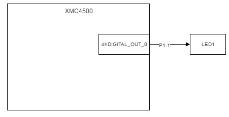

### 예제 동작
LED1이 5 Hz의 주파수로 토글한다.

### 프로그램 구조
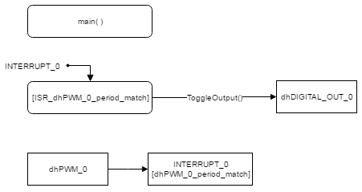
#### DAVE APP
* DIGITAL_IO

| Name            | Pin direction |
|-----------------|---------------|
| dhDIGITAL_OUT_0 | Input/Output  |

* PWM

| Name    | timer module | Frequency[Hz] | Duty[%] | 초기화 후 시작 여부 | Event        |
|---------|--------------|---------------|---------|---------------------|--------------|
| dhPWM_0 | CCU4         | 5             | 50      | O                   | Period match |

* INTERRUPT

Name        | Enable interrupt at initialization | Interrupt handler
------------|------------------------------------|-------------------------
INTERRUPT_0 | O                                  | ISR_dhPWM_0_period_match

#### Functions
* ISR dhPWM_0_period_match
    - PWM의 주기 일치 이벤트 발생에 따라 실행되는 인터럽트 서비스 루틴이다.
    - dhDIGITAL_OUT_0를 토글한다.

### 준비물과 하드웨어 구성
* XMC4500 Relax Lite Kit-V1
* DAVE v4.3.2

### 프로그램 작성
1. 상단의 [File]-[New]-[DAVE Project] 메뉴를 사용하여 DAVE Project를 새로 만든다.

  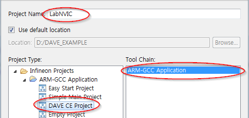

  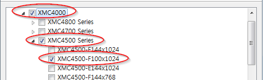

2. 툴바에서 **Add New APP** 을 사용하여 다음과 같이 PWM APP을 검색하고 추가한다.

  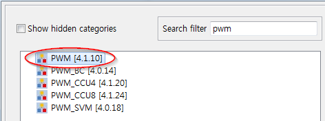

3. PWM_0의 오른쪽 마우스 메뉴에서 **Rename Instance Label** 을 선택하여 라벨이름을  dhPWM_0으로 변경한다.

4. dhPWM_0를 다음과 같이 설정한다.

  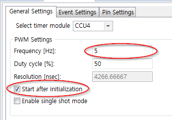

  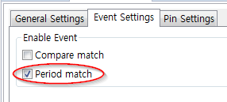

5. 툴바에서 **Add New APP** 을 사용하여 다음과 같이 DIGITAL_IO APP을 검색하고 추가한다.

  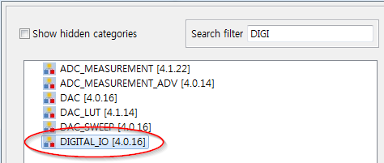

6. DIGITAL_IO_0의 오른쪽 마우스 메뉴에서 **Rename Instance Label** 을 선택하여 라벨이름을 dhDIGITAL_OUT_0으로 변경한다.

7. dhDIGITAL_OUT_0을 다음과 같이 설정한다.

  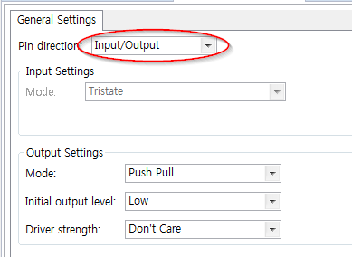

8. 툴바에서 **Add New APP** 을 사용하여 다음과 같이 INTERRUPT APP을 검색하고 추가한다.

  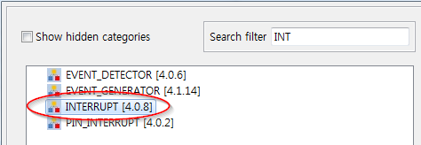

  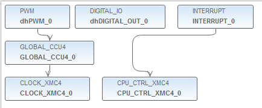

9. INTERRUPT_0을 다음과 같이 설정한다.

  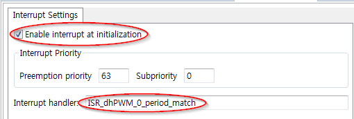

10. dhPWM_0의 **HW Signal Connections** 메뉴에서 다음과 같이 설정한다.

  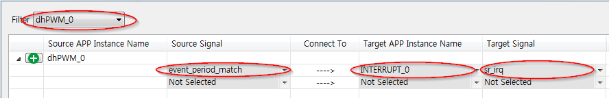

11. **Manual Pin Allocator** 메뉴에서 다음과 같이 설정한다.

  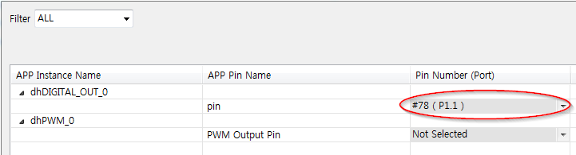

12. 툴바에서 **Generate Code** 를 사용하여 APP 설정을 코드에 적용한다.

13. main 함수에 다음과 같은 코드를 추가한다.

```
void ISR_dhPWM_0_period_match(void)
{
	DIGITAL_IO_ToggleOutput(&dhDIGITAL_OUT_0);
}
```

14. 빌드 후 코드를 마이크로컨트롤러에 다운로드한다.

### 실행결과
* PWM 5 Hz의 주기로 period match event를 발생시킨다.
* period match event는 인터럽트를 트리거한다.
* 인터럽트 서비스 루틴에서 LED1을 토글한다.

### 추가적인 실험
다음의 사항들을 구현해보자.

* INTERRUPT_0 APP의 Enable interrupt at initialization 설정을 해제하고 메쏘드를 사용하여 직접 인터럽트를 Enable 해보자.
* 인터럽트를 활성화/비활성화 시켜보자
    - PIN_INTERRUPT를 추가하고 Falling Edge에서 인터럽트가 발생하도록 한다. 그리고 BUTTON2(P1.15)에 맵핑한다.
    - BUTTON2를 누를 때마다 INTERRUPT_0를 Enable/Disable 상태를 변경하도록 한다.
