# Lab Pwm

## 개요
PWM APP을 사용하여 LED를 제어하고 버튼의 정보를 읽어들여 PWM 설정을 변경한다.

### 목적
* PWM 관련설정 학습 후 DAVE PWM APP을 활용한 관련설정 실습
* PWM 관련 메쏘드 사용방법 학습

### 학습성과
* DAVE 환경에서 PWM을 설정하고 사용할 수 있다.
* PWM 모듈을 자동/수동으로 초기화 할 수 있다.
* PWM 신호의 주파수와 듀티싸이클을 변경할 수 있다.

### 선행사항들
* Lecture DigitalIos

### 참고자료 및 심화학습
* Lecture PwmBasic

## 예제에 대한 설명

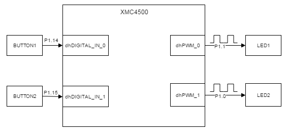

### 예제 동작
* LED1
    - 5Hz 로 점멸한다.
    - BUTTON1을 누르면 2Hz로 점멸하다가, 누르지 않으면 다시 5Hz로 점멸한다.
    - PWM 관련 설정을 자동으로 초기화 한다.
* LED2
    - 밝기가 어두운 상태(TBD)로 켜진다.
    - BUTTON2를 누르면 밝아졌다가(TBD),  누르지 않으면 다시 어두워진다.
    - PWM 관련 설정을 수동으로 초기화 한다.

    ​

### 프로그램 구조

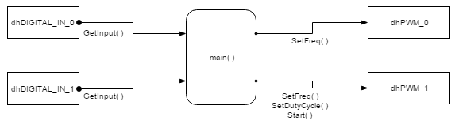

#### DAVE APP
* DIGITAL_IO

| Name           | Pin direction |
| -------------- | ------------- |
| dhDIGITAL_IN_0 | Input         |
| dhDIGITAL_IN_1 | Input         |

* PWM

| Name    | timer module | Frequency[Hz] | Duty[%]    | 초기화 후 시작 여부 |
| ------- | ------------ | ------------- | ---------- | ------------------- |
| dhPWM_0 | CCU4         | 5             | 50         | O                   |
| dhPWM_1 | CCU4         | Don't Care    | Don't Care | X                   |

#### Functions
* 초기화 : dhPWM_1의 설정 정보
    * PWM_SetFreq함수와 PWM_SetDutyCycle함수를 사용하여 각각 주파수를 100 Hz, 듀티를 10%로 설정한다.
    * PWM_Start 함수로 PWM을 수동시작한다
* loop
    - dhDIGITAL_IN_0(BUTTON1)의 상태를 DIGITAL_IO_GetInput 함수로 읽고 dhPWM_0(LED1)의 주파수를 PWM_SetFreq 함수로 변경한다.

    - dhDIGITAL_IN_1(BUTTON2)의 상태를 DIGITAL_IO_GetInput 함수로 읽고 dhPWM_1(LED2)의 듀티를 PWM_SetDutyCycle로 변경한다.

### 준비물과 하드웨어 구성
* XMC4500 Relax Lite Kit-V1
* DAVE v4.3.2

### 프로그램 작성
**[STEP1]** 상단의 [File]-[New]-[DAVE Project] 메뉴를 사용하여 DAVE Project를 새로 만든다.

  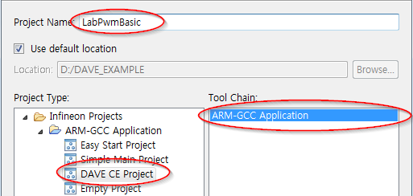

  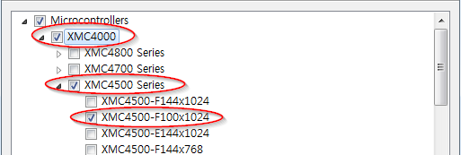

**[STEP2]** 툴바에서 **Add New APP** 을 사용하여 다음과 같이 PWM APP을 검색하고 2개 추가한다.

  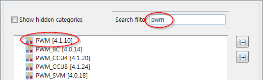

  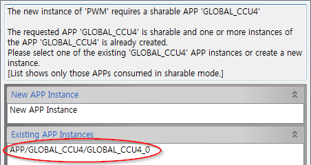

**[STEP3]** PWM_0과 PWM_1의 오른쪽 마우스 메뉴에서 **Rename Instance Label** 을 선택하여 라벨이름을 각각 dhPWM_0, dhPWM_1으로 변경한다.

  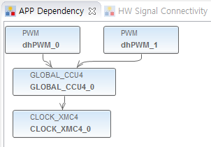

**[STEP4]** dhPWM_0 APP을 더블클릭하여 다음과 같이 설정을 변경한다.

  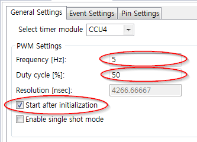

**[STEP5]** 툴바에서 **Manual Pin Allocator** 를 사용하여 PWM Output pin을 다음과 같이 설정한다.

  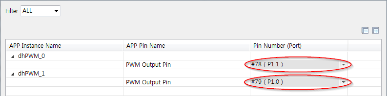

**[STEP6]**. 툴바에서 **Add New APP** 을 사용하여 다음과 같이 DIGITAL_IO APP을 검색하고 2개 추가한다.

  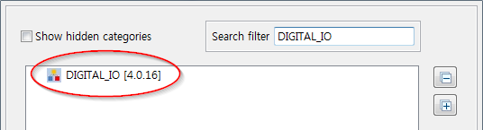

**[STEP7]** DIGITAL_IO_0, DIGITAL_IO_1 APP의 오른쪽 마우스 메뉴에서 **Rename Instance Label** 을 선택하여 라벨이름을 각각 dhDIGITAL_IN_0, dhDIGITAL_IN_1로 변경한다.

  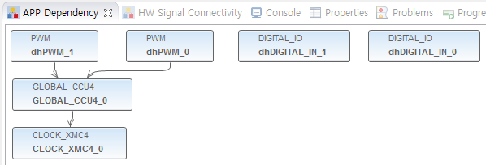

**[STEP8]** dhDIGITAL_IN_0, dhDIGITAL_IN_1 APP 설정에서 다음과 같이 Pin Direction을 Input으로 설정한다.

  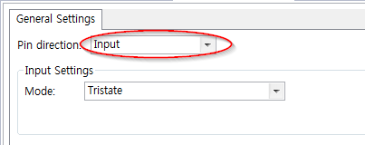

**[STEP9]** 툴바에서 **Manual Pin Allocator** 를 사용하여 dhDIGITAL_IN_0, dhDIGITAL_IN_1 APP 핀 설정을 다음과 같이 한다.

  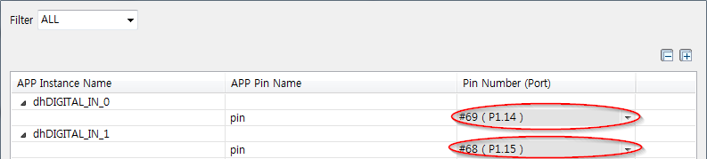

**[STEP10]** 툴바에서 **Generate Code** 를 사용하여 APP 설정을 코드에 적용한다.


**[STEP11]** main.c 파일에 다음과 같이 코드를 입력한다.

```
int main(void)
{
  DAVE_STATUS_t status;

  status = DAVE_Init();           /* Initialization of DAVE APPs  */

  if(status != DAVE_STATUS_SUCCESS)
  {
    /* Placeholder for error handler code. The while loop below can be replaced with an user error handler. */
    XMC_DEBUG("DAVE APPs initialization failed\n");

    while(1U)
    {

    }
  }

  PWM_SetFreq(&dhPWM_1, 100);
  PWM_SetDutyCycle(&dhPWM_1, 1000);
  PWM_Start(&dhPWM_1);

  /* Placeholder for user application code. The while loop below can be replaced with user application code. */
  while(1U)
  {
	  if (DIGITAL_IO_GetInput(&dhDIGITAL_IN_0) == 0U){
		  PWM_SetFreq(&dhPWM_0, 2);
	  }
	  else{
		  PWM_SetFreq(&dhPWM_0, 5);
	  }

	  if (DIGITAL_IO_GetInput(&dhDIGITAL_IN_1) == 0U){
		  PWM_SetDutyCycle(&dhPWM_1, 9000);
	  }
	  else{
		  PWM_SetDutyCycle(&dhPWM_1, 1000);
	  }

  }
}
```

**[STEP12]** 빌드 후 코드를 마이크로컨트롤러에 다운로드한다.


### 실행결과
* LED1
    - BUTTON1을 누르지 않으면, 주파수 5 Hz(듀티 50%) PWM 신호가 LED1으로 출력된다.
    - BUTTON1을 누르면, 주파수 2 Hz(듀티 50%) PWM신호가 LED1으로 출력된다.
* LED2
    - BUTTON2를 누르지 않으면, 듀티 10%(주파수 100 Hz)  PWM신호가 LED2으로 출력된다.
    - BUTTON2를 누르면, 듀티 90%(주파수 100 Hz) PWM 신호가 LED2으로 출력된다.


### 추가적인 실험
**[PwmExercise]** 다음과 같이 동작하도록 구현해본다.  `PWM_Start()`, `PWM_Stop()` 메쏘드 활용 연습

* BUTTON1과 BUTTON2를 동시에 누르면 dhPWM_0와 dhPWM_1 모두 중지시킨다.
* 다시 한번 두 버튼을 동시에 누르면 dhPWM_0와 dhPWM_1 모두 다시 동작시킨다.
