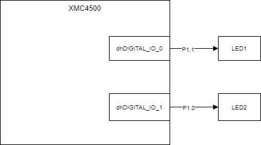
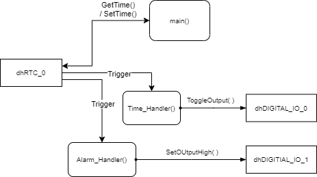

# LabRtc

## 개요
RTC App을 현재 시간을 설정하고 Alarm을 활용하는 방법을 배운다.

### 목적
* RTC의 원리를 이해하고 시간을 관리하는 방법을 배운다.
* Alarm을 이해하고 원하는 시간에 Alarm을 발생시킬 수 있도록 한다.

### 학습성과
* DAVE 환경에서 RTC를 설정하고 사용할 수 있다.

### 선행사항들
* Lecture DigitalIos
* Lecture NVIC

### 참고자료 및 심화학습
* Lecture RTC

## 예제에 대한 설명



### 예제 동작
* 1초 마다 Time Interrupt가 발생하고 LED1이 토글된다.
* 10초 마다 Alarm Interrupt가 발생하고 LED2이 토글된다.

### 프로그램 구조



#### DAVE APP
* RTC
  * 매초마다 Timer Event를 발생시킨다.
  * Alarm Event를 활성화 한다.
* DIGITAL_IO
  * Timer Event와 Alarm Event 발생시 Toggle 하도록 한다.

#### Functions
* Time_Handler()
    
    * Timer Event와 연결된 Interrupt Handler
    * LED1을 Toggle 한다.
    
* Alarm_Handler()

    * Alarm Event와 연결된 Interrupt Handler
    * LED2을 Toggle 한다.
    * 10초 후에 다시 Alarm이 발생하도록 설정한다.

    

### 프로그램 작성
1. RTC App 설정
   - Name: dhRTC_0
   - Start after initialization: Check
   - Interrupt Settings / Timer Event Settings / Seconds: Check
   - Interrupt Settings / Alarm Event Settings / Enable alarm interrupt: Check
2. DIO 추가 및 설정
   - Name: dhDIGITAL_IO_0, dhDIGITAL_IO_1
   - Output 으로 설정하고 P1.0과 P1.1 에 할당

3. 프로그래밍

   ```c
   #include <DAVE.h>                
   #include <time.h>
   
    void Time_Handler(void)
    {
      DIGITAL_IO_ToggleOutput(&dhDIGITAL_IO_0);
    }
   
    void Alarm_Handler(void)
    {
      XMC_RTC_ALARM_t alarm_time;
   
      DIGITAL_IO_ToggleOutput(&dhDIGITAL_IO_1);
   
      RTC_GetAlarmTime(&alarm_time);     // Read the current alarm time
   
      alarm_time.seconds = alarm_time.seconds + 10;
      if(alarm_time.seconds > 59)
      {
          alarm_time.seconds = 0;
          alarm_time.minutes++;
      }
   
      if(alarm_time.minutes > 59)
      {
   		 alarm_time.minutes = 0;
   		 alarm_time.hours++;
      }
   
     RTC_SetAlarmTime(&alarm_time);     // Reconfigure alarm time for next minute
    }
   
   int main(void)
   {
     DAVE_STATUS_t status;
     XMC_RTC_TIME_t timeval =
     {
   	.seconds = 0U,
   	.minutes = 0U,
   	.hours = 0U,
   	.days = 3U,
   	.month = 10,
   	.year = 2020U
     };
   
     XMC_RTC_ALARM_t alarm =
     {
        .seconds = 10U,
        .minutes = 0U,
        .hours = 0U,
        .days = 3U,
        .month = 10,
        .year = 2020U
     };
   
   
     struct tm stdtimeval;
   
     status = DAVE_Init();           /* Initialization of DAVE APPs  */
     RTC_SetTime(&timeval);
     RTC_SetAlarmTime(&alarm);
   
     if(status != DAVE_STATUS_SUCCESS)
     {
       XMC_DEBUG("DAVE APPs initialization failed\n");
       while(1U)
       {    }
     }
   
     while(1U)
     {
       RTC_GetTime(&timeval);
       RTC_GetStdTime(&stdtimeval);
     }
   }
   
   ```

   

### 실행결과
* LED1은 1초 주기로 Toggle 하고 LED2 는 10초 주기로 Toggle 한다.

### 분석

* 72행 혹은 73행에 Break Point를 설정하고 Debugger의 Variable 창을 사용하여 `timeval`, `stdtimeval`의 자료구조를 살펴보고 각 변수 값이 변경되는 사항을 파악한다.

* `Time_Handler()`와 `Alarm_Handler()`에 Break Point를 설정하여 주기적으로 동작하는지 확인한다.
