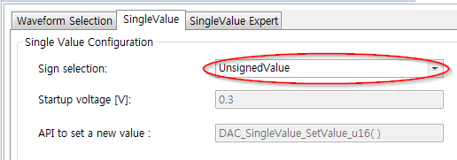

# Lab Signal Generator & monitor

## 개요
초급과정에서 배운 것들을 통합하여 Signal generator & monitor를 만들어 본다.

### 목적
* 초급과정 복습과 응용

### 학습성과
* DAVE 상에서 마이크로컨트롤러의 기본적인 주변장치들을 사용 할 수 있다.

### 선행사항들
* Lecture DigitalIos
* Lecture PwmBasic
* Lecture AdcBasic
* Lecture DacBasic
* Lecture uc-Probe

### 참고자료 및 심화학습


## Signal generator & monitor 설명


### Signal generator & monitor 동작
* 디지털 IO를 사용하여 4개의 입력을 받고 상태를 PC로 확인한다.
* 디지털 IO를 사용하여 4개의 출력을 PC로 조작한다.
* 보드 상의 LED1, LED2는 10 Hz의 주파수로 토글링된다.
* ADC 채널 4개를 사용하고 그 결과를 PC에서 확인한다.
* DAC 채널 2개를 사용하고 PC를 통해 출력 아날로그 전압을 조정할 수 있다.
* PWM 채널 1개를 사용하며 주파수와 듀티를 PC로 설정 할 수 있다.

### 프로그램 구조


#### DAVE APP
* DIGITAL_IO

| Name            | Pin direction |
|-----------------|---------------|
| dhDIGITAL_IN_0  | Input         |
| dhDIGITAL_IN_1  | Input         |
| dhDIGITAL_IN_2  | Input         |
| dhDIGITAL_IN_3  | Input         |
| dhDIGITAL_OUT_0 | Input/Output  |
| dhDIGITAL_OUT_1 | Input/Output  |
| dhDIGITAL_OUT_2 | Input/Output  |
| dhDIGITAL_OUT_3 | Input/Output  |

* ADC_MEASUREMENT(dhADC_MEASUREMENT_0)

| Configuration Name        | Value                                 |
|---------------------------|---------------------------------------|
| Number of measurements    | 4                                     |
| Trigger edge selection    | No External Trigger                   |
| Conversion mode           | 12 Bit                                |
| Desired sample time[nsec] | 67                                    |
| Option                    | Enable continuous conversion          |
|                           | Start conversion after initialization |

* SYSTIMER(dhSYSTIMER_0)

| Configuration Name        | Value |
|---------------------------|-------|
| SysTick timer period[us]  | 1000  |
| Number of software timers | 8     |

* DAC

| Name    | Mode        | sign selection | 초기화 후 시작 |
|---------|-------------|----------------|----------------|
| dhDAC_0 | SingleValue | UnsignedValue  | O              |
| dhDAC_1 | SingleValue | UnsignedValue  | O              |

* PWM(dhPWM_0)

| Configuration Name | Value                      |
| ------------------ | -------------------------- |
| timer module       | CCU4                       |
| Frequency[Hz]      | 10                         |
| Duty cycle[%]      | 50                         |
| Option             | Start after initialization |

#### Variables

| Name                     | Type     | Range          | Description          |
| ------------------------ | -------- | -------------- | -------------------- |
| dhDIGITAL_IN_0_u32Value  | uint32_t | 0 ~ 4294967296 | dhDIGITAL_IN_0 상태  |
| dhDIGITAL_IN_1_u32Value  | uint32_t | 0 ~ 4294967296 | dhDIGITAL_IN_1 상태  |
| dhDIGITAL_IN_2_u32Value  | uint32_t | 0 ~ 4294967296 | dhDIGITAL_IN_2 상태  |
| dhDIGITAL_IN_3_u32Value  | uint32_t | 0 ~ 4294967296 | dhDIGITAL_IN_3 상태  |
| dhDIGITAL_OUT_0_u32Value | uint32_t | 0 ~ 4294967296 | dhDIGITAL_OUT_0 상태 |
| dhDIGITAL_OUT_1_u32Value | uint32_t | 0 ~ 4294967296 | dhDIGITAL_OUT_1 상태 |
| dhDIGITAL_OUT_2_u32Value | uint32_t | 0 ~ 4294967296 | dhDIGITAL_OUT_2 상태 |
| dhDIGITAL_OUT_3_u32Value | uint32_t | 0 ~ 4294967296 | dhDIGITAL_OUT_3 상태 |
| dhADC_0_u16ChAValue      | uint16_t | 0 ~65536       | ChannelA ADC 결과값  |
| dhADC_0_fltChAValue      | float    |                | ChannelA ADC 결과값  |
| dhADC_0_u16ChBValue      | uint16_t | 0 ~65536       | ChannelB ADC 결과값  |
| dhADC_0_fltChBValue      | float    |                | ChannelB ADC 결과값  |
| dhADC_0_u16ChCValue      | uint16_t | 0 ~65536       | ChannelC ADC 결과값  |
| dhADC_0_fltChCValue      | float    |                | ChannelC ADC 결과값  |
| dhADC_0_u16ChDValue      | uint16_t | 0 ~65536       | ChannelD ADC 결과값  |
| dhADC_0_fltChDValue      | float    |                | ChannelD ADC 결과값  |
| dhPWM_0_u32Frequency     | uint32_t | 0 ~ 4294967296 | dhPWM_0 입력 주파수  |
| dhPWM_0_u32Duty          | uint32_t | 0 ~ 4294967296 | dhPWM_0 입력 듀티값  |
| dhDAC_0_u16Value         | uint16_t | 0 ~65536       | dhDAC_0 입력값       |
| dhDAC_0_fltValue         | float    |                | dhDAC_0 입력값       |
| dhDAC_1_u16Value         | uint16_t | 0 ~65536       | dhDAC_1 입력값       |
| dhDAC_1_fltValue         | float    |                | dhDAC_1 입력값       |


#### Software Timer

| Name        | Period[us] | mode                   | callback function         |
|-------------|------------|------------------------|---------------------------|
| timer_1ms   | 1000       | SYSTIMER_MODE_PERIODIC | CB_SYSTIMER_0_timer_1ms   |
| timer_100ms | 100000     | SYSTIMER_MODE_PERIODIC | CB_SYSTIMER_0_timer_100ms |

#### Functions
* CB_SYSTIMER_0_timer_1ms
    - 시스템 타이머에 의해 1ms마다 실행되는 콜백함수이다.
    - dhDAC_0, dhDAC_1로 값을 써서 전압을 조정한다.
    - dhDIGITAL_OUT_4을 토글한다.
* CB_SYSTIMER_0_timer_100ms
    - 시스템 타이머에 의해 100ms마다 실행되는 콜백함수이다.
    - dhDIGITAL_IN_x(x=1,2,3,4)로부터 상태를 입력받는다.
    - dhDIGITAL_OUT_x_u32Value 값에 따라 dhDIGITAL_OUT_x(x=1,2,3,4)로 출력을 결정한다.
    - dhADC_MEASUREMENT_0로부터 4개의 채널에 해당하는 결과 값을 읽는다.
    - dhPWM_0의 주파수, 듀티를 조정한다.
    - dhDIGITAL_OUT_5를 토글한다.

### 준비물과 하드웨어 구성
* XMC4500 Relax Lite Kit-V1
* DAVE v4.3.2

### 프로그램 구성
1. 상단의 [File]-[New]-[DAVE Project] 메뉴를 사용하여 DAVE Project를 새로 만든다.

  

  

2. 툴바에서 **Add New APP** 을 사용하여 다음과 같이 DIGITAL_IO APP을 검색하고 10개 추가한다.

  

3. DIGITAL_IO APP의 오른쪽 마우스 메뉴에서 **Rename Instance Label** 을 선택하여 라벨이름을 변경한다. DIGITAL_IO APP 4개는 DIGITAL_IN_x(x=0,1,2,3), DIGITAL_IO APP 6개는 DIGITAL_OUT_x(x=0,1,2,3,4,5)라고 라벨을 변경한다.

4. DIGITAL_IN_x(x=0,1,2,3)을 다음과 같이 설정한다.

  

5. DIGITAL_OUT_x(x=0,1,2,3,4,5)을 다음과 같이 설정한다.

  

6. 툴바에서 **Add New APP** 을 사용하여 다음과 같이 DAC APP을 검색하고 2개 추가한다.

  

7. DAC_0과 DAC_1의 오른쪽 마우스 메뉴에서 **Rename Instance Label** 을 선택하여 라벨이름을 각각 dhDAC_0, dhDAC_1으로 변경한다.

8. dhDAC_0과 dhDAC_1을 다음과 같이 설정한다.

  

  

9. 툴바에서 **Add New APP** 을 사용하여 다음과 같이 PWM APP을 검색하고 추가한다.

  

10. PWM_0의 오른쪽 마우스 메뉴에서 **Rename Instance Label** 을 선택하여 라벨이름을 dhPWM_0으로 변경한다.

11. dhPWM_0을 다음과 같이 설정한다.

  

12. 툴바에서 **Add New APP** 을 사용하여 다음과 같이 ADC_MEASUREMENT APP을 검색하고 추가한다

  

13. ADC_MEASUREMENT_0의 오른쪽 마우스 메뉴에서 **Rename Instance Label** 을 선택하여 라벨이름을 dhADC_MEASUREMENT_0로 변경한다.

14. dhADC_MEASUREMENT_0을 다음과 같이 설정한다.

  

  

15. 툴바에서 **Add New APP** 을 사용하여 다음과 같이 SYSTIMER APP을 검색하고 추가한다.

  

16. SYSTIMER_0의 오른쪽 마우스 메뉴에서 **Rename Instance Label** 을 선택하여 라벨이름을 dhSYSTIMER_0으로 변경한다.

17. dhSYSTIMER_0를 다음과 같이 설정한다.

  

18. 툴바에서 **Manual Pin Allocator** 를 사용하여 핀 설정을 다음과 같이 한다.

  

19. 툴바에서 **Generate Code** 를 사용하여 APP 설정을 코드에 적용한다.

### 프로그래밍 STEP1: System Timer 

* 시스템타이머를 올바로 설정하고 동작을 확인한다.
* `CB_SYSTIMER_0_timer_1ms()` , `CB_SYSTIMER_0_timer_100ms()`  콜백 함수를 만들고 소프트웨어 타이머를 동작시킨다.
    * 각 콜백 함수내에 LED1과 LED2를 토글시키는 동작을 포함시킨다.
    * `uint32_t SYSTIMER_0_u32Tick1ms` 와  `uint32_t SYSTIMER_0_u32Tick100ms` 를 전역변수로 선언하고 각각 1000, 10의 값까지 증가하는 카운터로 만든다.   이변수를 사용하여 콜백 함수가 제대로 실행되는지 확인할 수 있다.
* 확인방법
    * LED1이 100ms 마다 점멸한다.
    * LED2가 1ms 마다 점멸한다. (육안으로는 중간 밝기로 켜져있는 상태)
    * 디버거를 사용하여 중지하고 `SYSTIMER_0_u32Tick1ms` 와  `SYSTIMER_0_u32Tick100ms`  변수값을 살펴볼 수 있다.
    * uC-Probe 를 사용하여  `SYSTIMER_0_u32Tick1ms` 와  `SYSTIMER_0_u32Tick100ms`  변수의 변화 상태를 그래프로 살펴볼 수 있다.

```c
#include <DAVE.h>          

uint32_t SYSTIMER_0_u32Tick1ms;
uint32_t SYSTIMER_0_u32Tick100ms;

void CB_SYSTIMER_0_timer_1ms(void)
{
	SYSTIMER_0_u32Tick1ms++;
	if(SYSTIMER_0_u32Tick1ms >= 1000){
		SYSTIMER_0_u32Tick1ms = 0;
	}
	DIGITAL_IO_ToggleOutput(&dhDIGITAL_OUT_4);
}

void CB_SYSTIMER_0_timer_100ms(void)
{
	SYSTIMER_0_u32Tick100ms++;
	if(SYSTIMER_0_u32Tick100ms >= 10){
		SYSTIMER_0_u32Tick100ms = 0;
	}
	DIGITAL_IO_ToggleOutput(&dhDIGITAL_OUT_5);
}

int main(void)
{
	DAVE_STATUS_t status;

	uint32_t timer_1ms;
	uint32_t timer_100ms;

	status = DAVE_Init();           /* Initialization of DAVE APPs  */
	if(status != DAVE_STATUS_SUCCESS)
	{ /*중간생략*/	}

	timer_1ms = SYSTIMER_CreateTimer(1000, SYSTIMER_MODE_PERIODIC, (void*)CB_SYSTIMER_0_timer_1ms, NULL);
	timer_100ms = SYSTIMER_CreateTimer(100000, SYSTIMER_MODE_PERIODIC, (void*)CB_SYSTIMER_0_timer_100ms, NULL);

	SYSTIMER_StartTimer(timer_1ms);
	SYSTIMER_StartTimer(timer_100ms);

	while(1U)
	{	}
}


```


### 프로그래밍 STEP2: Digital 입출 기능 

* 디지탈 입출력 기능을 구현
    * 사용할 변수를 명명법을 사용하여 선언한다.
    * 프로그램 초기화 단계에서 해당 변수들을 초기화 한다.
    * `CB_SYSTIMER_0_timer_100ms()` 함수에서 디지탈 핀의 입력을 읽어들여 해당 변수에 할당한다.
    * `CB_SYSTIMER_0_timer_100ms()` 함수에서 변수의 값을 해당 디지탈 핀에 출력한다.  단 이때 잘못된 변수값에 대한 처리를 고려한다.
    * uC-Probe 화면에 디지탈 입력과 출력에 대한 처리를 구성한다.
* 확인방법
    * dhDIGITAL_IN_0 와 dhDIGITAL_OUT_0 핀을 점핑선으로 연결하고 uC-Probe 에서 출력값을 변경하여 본다.
    * 이때 정상값, 0, 1 에 대해서 확인하고, 비정상 값을 입력하여 확인한다.
    * 위의 단계가 정상적으로 동작하면 다른 입출력에 대해서도 같은 방법으로 확인한다.

```c
/* 전역변수 선언 영역 */
uint32_t dhDIGITAL_IN_0_u32Value;
	/* 이하생략 */

uint32_t dhDIGITAL_OUT_0_u32Value;
	/* 이하생략 */

/* main() 의 초기화 영역 */
	dhDIGITAL_OUT_0_u32Value = 0;
	/* 이하생략 */

/* CB_SYSTIMER_0_timer_100ms(void) 함수 영역 */
	dhDIGITAL_IN_0_u32Value = DIGITAL_IO_GetInput(&dhDIGITAL_IN_0);
	/* 이하생략 */
	if (dhDIGITAL_OUT_0_u32Value == 0){
		DIGITAL_IO_SetOutputLow(&dhDIGITAL_OUT_0);
	}
	else{
		DIGITAL_IO_SetOutputHigh(&dhDIGITAL_OUT_0);
	}
	/* 이하생략 */
```


### 프로그래밍 STEP3: PWM 출력 기능

* PWM 출력 기능 구현
    * 사용할 변수를 명명법을 사용하여 선언한다.
    * 변수를 초기화 한다.
    * `CB_SYSTIMER_0_timer_100ms()` 함수에서 해당 변수값을 PWM App에 출력하는 기능을 프로그래밍한다.
* 확인방법
    * 앞서 만들어 놓은 확인용 LED를 사용하여 연결하고 uC-Probe 에서 출력값을 변경하여 본다.
```c
/* 전역변수 선언 영역 */
uint32_t dhPWM_0_u32Frequency;
uint32_t dhPWM_0_u32Duty;

/* main() 의 초기화 영역 */
	dhPWM_0_u32Frequency = 10;
	dhPWM_0_u32Duty = 5000;

/* CB_SYSTIMER_0_timer_100ms(void) 함수 영역 */
	PWM_SetFreqAndDutyCycle(&dhPWM_0, dhPWM_0_u32Frequency, dhPWM_0_u32Duty);
```


### 프로그래밍 STEP4: Analog 입력 기능

* 변환 관련 
    * DAVE App 에서는 0~2^12 의 정수 범위를 갖고,
    * 전기적으로 0~3.3V 의 값을 읽어들이게 된다.
    * 사용자는 정수보다는 전기적인 물리량, 즉 전압값이 더 친숙하므로 변환 관계를 프로그래밍 하도록 한다.
* 아날로그 입력 기능 구현
    * 사용할 변수를 명명법을 사용하여 선언한다.(DAVE App을 위한 정수와 사용자를 위한 실수)
    * 해당 변수를 초기화 한다.
    * `CB_SYSTIMER_0_timer_100ms()` 함수에서 아날로그 입력을 읽어들이고 사용자를 위하여 실수형 전압값을 변환하는 기능을 프로그래밍 한다.
* 확인방법
    * Channel_A핀을 점핑선으로 연결하고 GND 혹은 VDD 3.3V 핀과 연결하 uC-Probe 에서 값이 각각 0, 혹은 3.3V 와 유사한지 확인한다.
    * 다른 핀들도 같은 방법으로 확인한다.
```c
/* 전역변수 선언 영역 */
uint16_t dhADC_0_u16ChAValue;
	/* 이하생략 */

float dhADC_0_fltChAValue;
	/* 이하생략 */

/* main() 의 초기화 영역 */
	dhADC_0_u16ChAValue = 0;
	dhADC_0_fltChAValue = 0.0;
	/* 이하생략 */

/* CB_SYSTIMER_0_timer_100ms(void) 함수 영역 */
	dhADC_0_u16ChAValue = ADC_MEASUREMENT_GetResult(&ADC_MEASUREMENT_Channel_A);
	dhADC_0_fltChAValue = ((float)dhADC_0_u16ChAValue / 4096.0) * 3.3;
	/* 이하생략 */
```


### 프로그래밍 STEP5: Analog 출력 기능

* 변환관련
    * 전기적으로 0.3 ~ 2.5V 의 범위를 갖고,
    * DAVE App 에서는 0 ~ 2^12 의 정수 범위를 갖는다. (unsigned int 의 경우)
    * 사용자는 정수보다는 전기적인 물리량, 즉 전압값이 더 친숙하므로 변환 관계를 프로그래밍 하도록 한다.
* 아날로그 출력 구현
    * 사용할 변수를 명명법을 사용하여 선언한다.
    * 해당 변수를 초기화 한다.
    * `CB_SYSTIMER_0_timer_1ms()` 함수에서 실수형 전압값을 정수형으로 변환하는 기능과 이 값을 DAC App에 출력하는 기능을 프로그래밍 한다.
* 확인방법
    * dhDAC_0 와 Channel_A핀을 점핑선으로 연결하고 uC-Probe 에서 출력값을 변경하여 본다.
    * dhDAC_1 도 위와 같은 방법으로 확인한다.
* [Optional] Digital 출력의 경우와 같이 사용자의 잘못된 입력에 대하여 방어적인 프로그래밍 기법이 적용될 필요가 있다.
    * DAC에서 유용한 범위, 즉 0.3~2.5V,를 벗어나는 입력에 대해서 변환 관계를 추가적으로 고려해 주어야 한다.
    * 0.3V 보다 작은 경우에는 0.3V로, 2.5V 보다 큰 경우에는 2.5V 로 포화시켜 주는 방법을 추가해 보자.
```c
/* 전역변수 선언 영역 */
uint16_t dhDAC_0_u16Value;
float dhDAC_0_fltValue;
	/* 이하생략 */

/* main() 의 초기화 영역 */
	dhDAC_0_u16Value = 0;
	dhDAC_0_fltValue = 0.0;

	/* 이하생략 */

/* CB_SYSTIMER_0_timer_1ms(void) 함수 영역 */
	dhDAC_0_u16Value = (uint16_t)(((dhDAC_0_fltValue - 0.3)/2.2) * 4095.0);
	DAC_SingleValue_SetValue_u16(&dhDAC_0, dhDAC_0_u16Value);

    /* 이하생략 */
```


### 최종결과

uC-Probe 환경에서 다음의 것들이 가능하다.

* dhDIGITAL_IN_x_u32Value(x=0,1,2,3) 변수를 통해서 dhDIGITAL_IN_x(x=0,1,2,3)의 상태를 확인 할 수 있다.
* dhADC_0_u16ChxValue(x=A,B,C,D) 변수를 통해서 ADC 결과 값을 정수 형태로 확인 할 수 있다.
* dhADC_0_fltChxValue(x=A,B,C,D) 변수를 통해서 ADC 결과 값을 실제 물리 단위로 확인 할 수 있다.
* dhDIGITAL_OUT_x_u32Value(x=0,1,2,3) 변수를 통해서 dhDIGITAL_OUT_x(x=0,1,2,3)의 전압을 변화 시킬 수 있다.
* dhPWM_0_u32Frequency와 dhPWM_0_u32Duty 변수를 통해서 dhPWM_0의 주파수, 듀티를 조정 할 수 있다.
* dhDAC_x_u16Value(x=0,1) 변수를 통해서 dhDAC_x(x=0,1)의 아날로그 전압을 정수 형태로 입력 할 수 있다.
* dhDAC_x_fltValue(x=0,1) 변수를 통해서 dhDAC_x(x=0,1)의 아날로그 전압을 실제 물리량 단위로 입력 할 수 있다.


