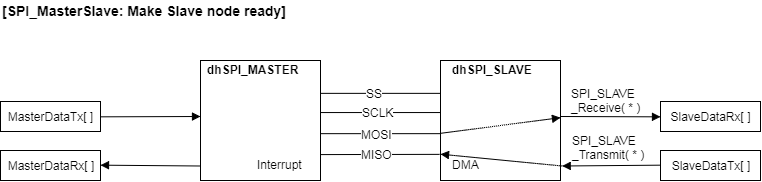
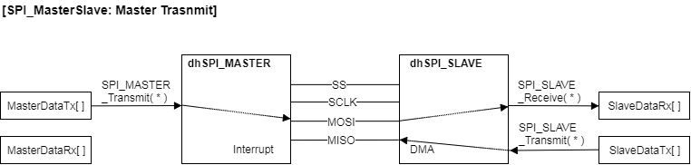
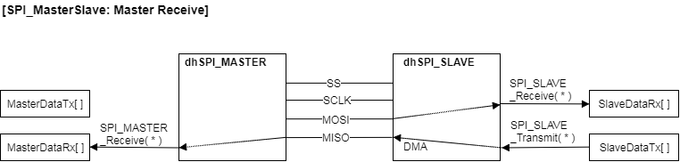
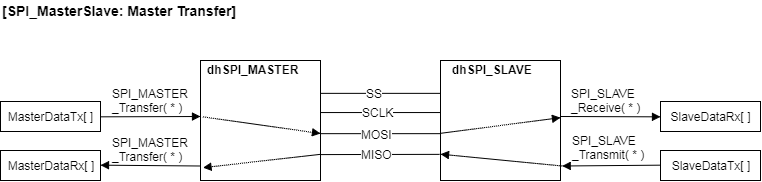

# Serial Peripheral Interface Lab  

## References

[Serial Communication in sparkfun](https://learn.sparkfun.com/tutorials/serial-communication)

[Serial Peripheral Interface (SPI) in sparkfun](https://learn.sparkfun.com/tutorials/serial-peripheral-interface-spi)

## Must Execute Code

*   SpiMasterSlave.zip 프로젝트 import 하여 실행해 보세요.


## Understand SPI_MASTER & SLAVE App

SPI_MASTER APP 의 Help 를 열고 다음의 항목들을 살펴보세요.

*   Overview 에서 다음의 항목들을 살펴보세요.

    *   Standard Full-Duplex
    *   Half duplex
    *   Dual SPI
    *   Quad SPI

*   Transmit & Receive Mode 에는 어떤 것들이 있나요?

    .

    .

    .

*   Help 의 Methods 항목을 참고해서 다음의 함수들에 대한 간략한 설명을 적어보세요.

```
SPI_MASTER_Transmit(&dhSPI_MASTER_0, master_send_data,10);
```

.

.

.

```
SPI_MASTER_Receive(&dhSPI_MASTER_0, master_rec_data,10);
```

.

.

.

```
SPI_MASTER_DisableSlaveSelectSignal(&dhSPI_MASTER_0);
SPI_MASTER_EnableSlaveSelectSignal(&dhSPI_MASTER_0, SPI_MASTER_SS_SIGNAL_1);
```

.

.

.

```
SPI_MASTER_IsTxBusy(&dhSPI_MASTER_0)
```

.

.

.


## Example 

*   다음의 그림과 같이 SPI_MASTER App 과 SPI_SLAVE App 을 연결하여 시험한다.
*   2byte 혹은 4byte의 data를 transmit, recieve, 혹은 transfer 할 수 있도록 한다.


*   dhSPI_MASTER App Configuration
    *   General Settings
        *   Operation mode: *Full Duplex*
        *   Desired bus speed[KHz]: *1000*
        *   Parity selection: *None*
    *   Advanced Settings
        *   Protocol Handling / Transmit mode: *Interrupt*
        *   Protocol Handling / Receive mode: *Interrupt*
        *   Number of slave select line: *1*
        *   Enable frame end: *check*
        *   Word length: *8*
        *   Frame length: *8* or *16* (Slave 와 같아야 합니다)
        *   Bit order: *Transmit/receive MSB first*
        *   Clock settings: *High if inactive, transmit on falling clock edge, receive on rising clock edge*
        *   Enable transmit FIFO: *check*
        *   Enable receive FIFO: *check*
    *   Interrupt Settings
        *   End of receive/transfer callback: *check*, `ISR_SpiMasterRx`

*   dhSPI_SLAVE App Configuration
    *   General Settings
        *   Operation mode: *Full Duplex*
        *   Parity selection: *None*
    *   Advanced Settings
        *   Protocol Handling / Transmit mode: *DMA*
        *   Protocol Handling / Receive mode: *DMA*
        *   Slave select input line is used: *check*
        *   Word length: *8*
        *   Frame length: *8* or *16* (Master 와 같아야 합니다)
        *   Bit order: *Transmit/receive MSB first*
        *   Enable inverted clock input: *check*
    *   Interrupt Settings
        *   End of receive/transfer callback: *check*, `ISR_SpiSlaveRx`

### 중요 변수

 * `uint8_t FrameByte`: 한번에 SPI로 전송되는 byte 수
 * `uint8_t MasterTxEnable`: 활성화 되면 MASTER_Transmit 동작 1회  실행
 * `uint8_t MasterRxEnable`: 활성화 되면 MASTER_Receive 동작 1회  실행
 * `uint8_t MasterTransEnable`: 활성화 되면 MASTER_Transfer 동작 1회  실행
 * `uint8_t SlaveEcho`: 활성화 되면 Receive 한 Data 를 Transmit
 * `uint8_t MasterDataTx[], MasterDataRx[], SlaveDataTx[], SlaveDataRx[]`: 전송되어지는 Data buffer

### Slave Node 준비

*   Slave Node 에서 주고 받을 Data 를 연결해 준다.
    *   (주의) Slave Node는 스스로 Data 를 보내고 받을 수 없다.  Master Node에서 통신 싸이클이 진행되어야 준비되어 있던 Data 를 보내고 받게 된다.
    *   프로그램의 초기화 단계에서 다음과 같이 `SlaveDataRx[]`, `SlaveDataTx[]` 저장공간을 `dhSPI_SLAVE`에 연결해 준다. 
    *   만약 `SlaveEcho` 가 활성화 되어 있다면 `SlaveDataRx[]`의 Data를  `SlaveDataTx[]` 에 복사해 준다.  Slave Receive Callback 함수에서  `SlaveDataRx[]`, `SlaveDataTx[]` 저장공간을 `dhSPI_SLAVE`에 다시 연결해 준다.  

```c
/* During Initialization */
SPI_SLAVE_Receive(&dhSPI_SLAVE, SlaveDataRx, FrameByte);
SPI_SLAVE_Transmit(&dhSPI_SLAVE, SlaveDataTx, FrameByte);

/* Slave Receive Callback */
void ISR_SpiSlaveRx(){
    if(SlaveEcho == true){
		memcpy(SlaveDataTx, SlaveDataRx, FrameByte);
	}
    SPI_SLAVE_Receive(&dhSPI_SLAVE, SlaveDataRx, FrameByte);
    SPI_SLAVE_Transmit(&dhSPI_SLAVE, SlaveDataTx, FrameByte);
}
```





### 명령 활성화 입력에 따른 동작

*   Master의 Slave Select 신호를 활성화 한다.
*   그리고 무한 루프에서 `MasterTxEnable`, `MasterRxEnable`, `MasterTransEnable` 값에 따라서 각각의 동작을 1회 할 수 있도록 한다.

```c
  /* Slave Select 신호 활성화 */
  SPI_MASTER_DisableSlaveSelectSignal(&dhSPI_MASTER);
  SPI_MASTER_EnableSlaveSelectSignal(&dhSPI_MASTER, SPI_MASTER_SS_SIGNAL_0);
  
  while(1U)
  {
	  if(MasterTxEnable == true){
		  while(SPI_MASTER_IsTxBusy(&dhSPI_MASTER))  {  }
		  SPI_MASTER_Transmit(&dhSPI_MASTER, MasterDataTx, FrameByte);
		  MasterTxEnable = false;
	  }
	  if(MasterRxEnable == true){
		  while(SPI_MASTER_IsTxBusy(&dhSPI_MASTER))  {  }
		  SPI_MASTER_Receive(&dhSPI_MASTER, MasterDataRx, FrameByte);
		  MasterRxEnable = false;
	  }
	  if(MasterTransEnable == true){
		  while(SPI_MASTER_IsTxBusy(&dhSPI_MASTER))  {  }
		  SPI_MASTER_Transfer(&dhSPI_MASTER, MasterDataTx, MasterDataRx, FrameByte);
		  MasterTransEnable = false;
	  }
  }
```

### Transmit 동작

*   Debugger 혹은 uC/Probe를 사용하여 `MasterTxEnable` 을 1로 변경하면 `SPI_MASTER_Transmit()` Method가 1회 실행하게 된다.
    *   `MasterDataTx[]` --> `SlaveDataRx[]`




### Receive 동작

*   `MasterRxEnable` 을 1로 변경하면 `SPI_MASTER_Receive()` Method가 1회 실행하게 된다.
    *   ` MasterDataRx[]` <-- `SlaveDataTx[]` 




### Transfer 동작

*   `MasterTransEnable` 을 1로 변경하면 `SPI_MASTER_Transfer()` Method가 1회 실행하게 된다.
    *   `MasterDataTx[]` --> `SlaveDataRx[]`
    *   ` MasterDataRx[]` <-- `SlaveDataTx[]` 




## Assignment

*   위의 Architecture와 같이 SPI 신호들을 연결하세요.

| SPI  | MASTER | SLAVE |
| ---- | ------ | ----- |
| MISO | P0.0   | P0.5  |
| MOSI | P0.1   | P0.4  |
| SCLK | P0.10  | P0.11 |
| SS0  | p0.9   | P0.6  |

*   MySpiMasterSlave 프로젝트를 Build 하고 실행해 보세요.

    

*   Expression 창에 중요 변수들을 등록하고 그 값을 확인해 보세요.

| Variable Name   | Expectation | Measured | Variable Name  | Expectation | Measured |
| --------------- | ----------- | -------- | -------------- | ----------- | -------- |
| MasterDataTx[0] |             |          | SlaveDataRx[0] |             |          |
| MasterDataTx[1] |             |          | SlaveDataRx[1] |             |          |
| MasterDataTx[2] |             |          | SlaveDataRx[2] |             |          |
| MasterDataTx[3] |             |          | SlaveDataRx[3] |             |          |
| MasterDataRx[0] |             |          | SlaveDataTx[0] |             |          |
| MasterDataRx[1] |             |          | SlaveDataTx[1] |             |          |
| MasterDataRx[2] |             |          | SlaveDataTx[2] |             |          |
| MasterDataRx[3] |             |          | SlaveDataTx[3] |             |          |

   

*   MasterTxEnable을 사용하여 MASTER_Transmit 을 1회 실행시키고 다음의 결과를 확인해 보세요.

| Variable Name   | Expectation | Measured | Variable Name  | Expectation | Measured |
| --------------- | ----------- | -------- | -------------- | ----------- | -------- |
| MasterDataTx[0] |             |          | SlaveDataRx[0] |             |          |
| MasterDataTx[1] |             |          | SlaveDataRx[1] |             |          |
| MasterDataTx[2] |             |          | SlaveDataRx[2] |             |          |
| MasterDataTx[3] |             |          | SlaveDataRx[3] |             |          |
| MasterDataRx[0] |             |          | SlaveDataTx[0] |             |          |
| MasterDataRx[1] |             |          | SlaveDataTx[1] |             |          |
| MasterDataRx[2] |             |          | SlaveDataTx[2] |             |          |
| MasterDataRx[3] |             |          | SlaveDataTx[3] |             |          |

​    

* MasterRxEnable을 사용하여 MASTER_Receive 을 1회 실행시키고 다음의 결과를 확인해 보세요.

| Variable Name   | Expectation | Measured | Variable Name  | Expectation | Measured |
| --------------- | ----------- | -------- | -------------- | ----------- | -------- |
| MasterDataTx[0] |             |          | SlaveDataRx[0] |             |          |
| MasterDataTx[1] |             |          | SlaveDataRx[1] |             |          |
| MasterDataTx[2] |             |          | SlaveDataRx[2] |             |          |
| MasterDataTx[3] |             |          | SlaveDataRx[3] |             |          |
| MasterDataRx[0] |             |          | SlaveDataTx[0] |             |          |
| MasterDataRx[1] |             |          | SlaveDataTx[1] |             |          |
| MasterDataRx[2] |             |          | SlaveDataTx[2] |             |          |
| MasterDataRx[3] |             |          | SlaveDataTx[3] |             |          |


*   MasterTransEnable을 사용하여 MASTER_Transfer 을 1회 실행시키고 다음의 결과를 확인해 보세요.

| Variable Name   | Expectation | Measured | Variable Name  | Expectation | Measured |
| --------------- | ----------- | -------- | -------------- | ----------- | -------- |
| MasterDataTx[0] |             |          | SlaveDataRx[0] |             |          |
| MasterDataTx[1] |             |          | SlaveDataRx[1] |             |          |
| MasterDataTx[2] |             |          | SlaveDataRx[2] |             |          |
| MasterDataTx[3] |             |          | SlaveDataRx[3] |             |          |
| MasterDataRx[0] |             |          | SlaveDataTx[0] |             |          |
| MasterDataRx[1] |             |          | SlaveDataTx[1] |             |          |
| MasterDataRx[2] |             |          | SlaveDataTx[2] |             |          |
| MasterDataRx[3] |             |          | SlaveDataTx[3] |             |          |

