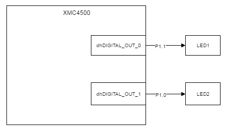
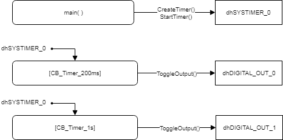
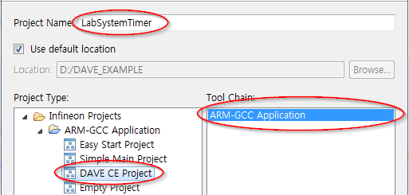
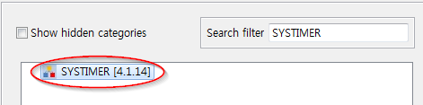
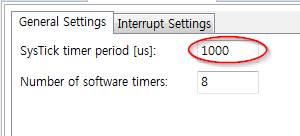
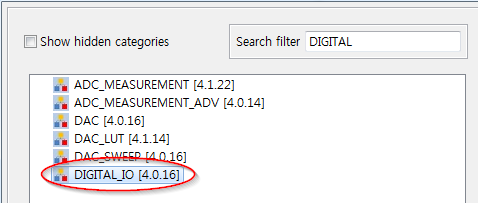
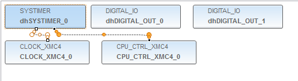
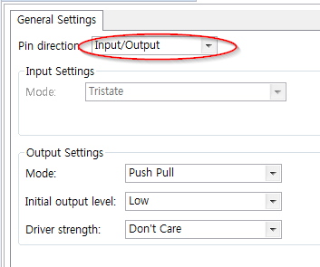
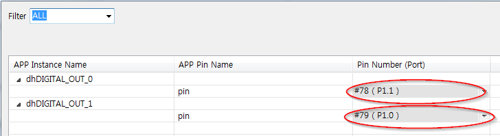

# Lab Systimer

## 개요
시스템 타이머를 사용하여 보드 상의 LED를 주기적으로 토글한다.

### 목적
* 시스템 타이머 관련설정 학습 후 DAVE SYSTIMER APP을 활용한 관련설정 실습
* SYSTIMER APP 관련 메쏘드를 사용하여 운용방법 학습

### 학습성과
* DAVE 환경에서 시스템 타이머를 설정하고 사용할 수 있다.

### 선행사항들
* Lecture DigitalIos

### 참고자료 및 심화학습
* Lecture SystemTimer

## 예제에 대한 설명



### 예제 동작
* LED1를 시스템 타이머를 사용하여 200ms 마다 토글한다.
* LED2를 시스템 타이머를 사용하여 1s 마다 토글한다.

### 프로그램 구조

#### DAVE APP
* DIGITAL_IO

| Name            | Pin direction |
|-----------------|---------------|
| dhDIGITAL_OUT_0 | Input/Output  |
| dhDIGITAL_OUT_1 | Input/Output  |

* SYSTIMER(dhSYSTIMER_0)

| Configuration Name        | Value |
|---------------------------|-------|
| SysTick timer period[us]  | 1000  |
| Number of software timers | 8     |

#### Functions
* main
    - SYSTIMER_CreateTimer 메쏘드를 사용하여 Timer_200ms_Id, Timer_1s_Id 소프트웨어 타이머 두 개를 생성한다.
    - 두 소프트웨어 타이머를 SYSTIMER_StartTimer 메쏘드를 사용하여 시작한다.

| Name           | period[us] | mode                   | callback       |
| -------------- | ---------- | ---------------------- | -------------- |
| Timer_200ms_Id | 200000     | SYSTIMER_MODE_PERIODIC | CB_Timer_200ms |
| Timer_1s_Id    | 1000000    | SYSTIMER_MODE_PERIODIC | CB_Timer_1s    |

* CB_Timer_200ms
    - Timer_200ms에 의해 실행되는 콜백함수이다.
    - dhDIGITAL_OUT_0을 토글한다.
* CB_Timer_1s
    - Timer_1s 의해 실행되는 콜백함수이다.
    - dhDIGITAL_OUT_1을 토글한다.

### 준비물과 하드웨어 구성
* XMC4500 Relax Lite Kit-V1
* DAVE v4.3.2

### 프로그램 작성
1. 상단의 [File]-[New]-[DAVE Project] 메뉴를 사용하여 DAVE Project를 새로 만든다.

  

  

2. 툴바에서 **Add New APP** 을 사용하여 다음과 같이 SYSTIMER APP을 검색하고 추가한다.

  

3. SYSTIMER_0의 오른쪽 마우스 메뉴에서 **Rename Instance Label** 을 선택하여 라벨이름을 dhSYSTIMER_0으로 변경한다.

4. dhSYSTIMER_0 APP을 다음과 같이 설정을 변경한다.

  

5. 툴바에서 **Add New APP** 을 사용하여 다음과 같이 DIGITAL_IO APP을 검색하고 2개 추가한다.

  

6. DIGITAL_IO_0, DIGITAL_IO_1의 오른쪽 마우스 메뉴에서 **Rename Instance Label** 을 선택하여 라벨이름을 각각 dhDIGITAL_OUT_0, dhDIGITAL_OUT_1으로 변경한다.

  

7. dhDIGITAL_OUT_0와 dhDIGITAL_OUT_1을 다음과 같이 설정한다.

  

8. 툴바에서 **Manual Pin Allocator** 를 사용하여 dhDIGITAL_OUT_0, dhDIGITAL_OUT_1 APP 핀 설정을 다음과 같이 한다.

  

9. 툴바에서 **Generate Code** 를 사용하여 APP 설정을 코드에 적용한다.

10. main.c 파일에 코드를 다음과 같이 입력한다.

```c
#include <DAVE.h>                 //Declarations from DAVE Code Generation (includes SFR declaration)

/**

 * @brief main() - Application entry point
 *
 * <b>Details of function</b><br>
 * This routine is the application entry point. It is invoked by the device startup code. It is responsible for
 * invoking the APP initialization dispatcher routine - DAVE_Init() and hosting the place-holder for user application
 * code.
 */

uint32_t Timer_200ms_Id;
uint32_t Timer_1s_Id;

void CB_Timer_200ms(void)
{
	DIGITAL_IO_ToggleOutput(&dhDIGITAL_OUT_0);
}

void CB_Timer_1s(void)
{
	DIGITAL_IO_ToggleOutput(&dhDIGITAL_OUT_1);
}

int main(void)
{
    DAVE_STATUS_t status;

    status = DAVE_Init();           /* Initialization of DAVE APPs  */

    if(status != DAVE_STATUS_SUCCESS)
    {
        /* Placeholder for error handler code. The while loop below can be replaced with an user error handler. */
        XMC_DEBUG("DAVE APPs initialization failed\n");
        while(1U)
        {

        }
    }

    Timer_200ms_Id = SYSTIMER_CreateTimer(200000, SYSTIMER_MODE_PERIODIC, (void*) CB_Timer_200ms, NULL);
    Timer_1s_Id = SYSTIMER_CreateTimer(1000000, SYSTIMER_MODE_PERIODIC, (void*) CB_Timer_1s, NULL);

    SYSTIMER_StartTimer(Timer_200ms_Id);
    SYSTIMER_StartTimer(Timer_1s_Id);

    /* Placeholder for user application code. The while loop below can be replaced with user application code. */
    while(1U)
    {

    }
}

```

11. 빌드 후 코드를 마이크로컨트롤러에 다운로드한다.

### 실행결과
* Timer_200ms 소프트웨어 타이머를 사용하여 200ms 주기로 LED1을 토글한다.
* Timer_1s 소프트웨어 타이머를 사용하여 1s 주기로 LED2를 토글한다.

### 추가적인 실험
다음과 같이 동작을 구현해보자

* DIGITAL_IO APP을 2개 추가하고 각각 BUTTON1, BUTTON2와 연결한다.
* 소프트웨어 타이머를 추가하고 100 ms 주기로 콜백 함수를 실행시킨다.
* 콜백함수에는 다음의 동작을 구현한다.
    - BUTTON1을 누르면 Timer_200ms 소프트웨어타이머를 삭제한다.
    - BUTTON2을 누르면 Timer_1s 소프트웨어타이머를 중지한다.
    - BUTTON1과 BUTTON2를 동시에 누르면, 
        - Timer_200ms 가 삭제되었다면 다시 생성하고 시작시킨다.
        - Timer_1s 가 중지되었다면 다시 시작한다.
