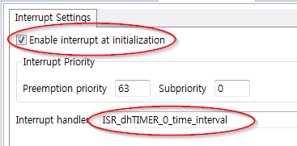

# LabTimer

## 개요
타이머 모듈을 사용하여 주기적으로 인터럽트를 발생시켜 LED를 제어한다.

### 목적
* 타이머 관련설정 학습 후 DAVE TIMER APP을 활용한 관련설정 실습
* 타이머 관련 메쏘드를 사용하여 운용방법 학습

### 학습성과
* DAVE 환경에서 타이머를 설정하고 사용할 수 있다.

### 선행사항들
* Lecture DigitalIos
* Lecture NVIC

### 참고자료 및 심화학습
* Lecture Timer

## 예제에 대한 설명


### 예제 동작
* 1초 주기로 LED1이 토글된다.

### 프로그램 구조


#### DAVE APP
* TIMER

| Name      | timer module | Timer interval[us] | 초기화 후 시작 여부 | event         |
| --------- | ------------ | ------------------ | ----------- | ------------- |
| dhTIMER_0 | CCU4         | 1000000            | O           | time interval |

#### Functions
* ISR_dhTIMER_time_interval
    - dhTIMER_0 time interval 이벤트에 의해 트리거되는 인터럽트 서비스 루틴이다.
    - dhDIGITAL_OUT_0을 토글한다.

### 준비물과 하드웨어 구성
* XMC4500 Relax Lite Kit-V1
* DAVE v4.3.2

### 프로그램 작성
1. 상단의 [File]-[New]-[DAVE Project] 메뉴를 사용하여 DAVE Project를 새로 만든다.

  

  

2. 툴바에서 **Add New APP** 을 사용하여 다음과 같이 TIMER APP을 검색하고 추가한다.

  

3. TIMER_0의 오른쪽 마우스 메뉴에서 **Rename Instance Label** 을 선택하여 라벨이름을 dhTIMER_0으로 변경한다.

4. dhTIMER_0을 다음과 같이 설정한다.

  

  

5. 툴바에서 **Add New APP** 을 사용하여 다음과 같이 INTERRUPT APP을 검색하고 추가한다.

  

6. INTERRUPT_0을 다음과 같이 설정한다.

  

7. dhTIMER_0 설정창 우측 하단의 **HW Signal Connections** 메뉴에서 다음과 같이 설정한다.

  

8. 툴바에서 **Add New APP** 을 사용하여 다음과 같이 DIGITAL_IO APP을 검색하고 추가한다.

  

9. DIGITAL_IO_0의 오른쪽 마우스 메뉴에서 **Rename Instance Label** 을 선택하여 라벨이름을 dhDIGITAL_OUT_0으로 변경한다.

  

9. DIGITAL_OUT_0의 설정을 다음과 같이 변경한다.

 

10. 툴바에서 **Manual Pin Allocator** 를 사용하여 핀을 다음과 같이 설정한다.

  

11. 툴바에서 **Generate Code** 를 사용하여 APP 설정을 코드에 적용한다.

12. main.c 파일에 다음의 코드를 추가한다.


```
void ISR_dhTIMER_0_time_interval(void)
{
	DIGITAL_IO_ToggleOutput(&dhDIGITAL_OUT_0);
}
```

13. 빌드 후 코드를 마이크로컨트롤러에 다운로드한다.

### 실행결과
* dhTIMER_0의 time_interval 이벤트를 사용하여 1초 주기로 LED1을 토글한다.

### 추가적인 실험
다음의 기능을 구현 해보자.

* TIMER APP을 사용하여 200ms 주기로 BUTTON1의 상태를 확인한다.
* BUTTON1이 눌러진 상태라면 dhTIMER_0 APP 상태를 확인하고 활성화 상태라면 비활성화 상태로 비활성화 상태라면 활성화 상태로 전환시켜보자.
