# Timer Input Capture Lab  


## Objectives

*   Input Capture 를 사용해서 Event의 발생 주기와 On-Time을 측정할 수 있다.


## CAPTURE APP

*   APP Help - Configuration Parameters
*   APP Help - Methods


## To Do

*   신호의 발생 주기를 Tick 단위로 측정할 수 있다.
*   신호의 On-Time을 Tick 단위와 nano sec 단위로 측정할 수 있다.
*   실험을 위해서 PWM APP을 사용하여 10KHz, 50% Duty 의 신호를 발생시키고, 이것을 측정하도록 한다.

## Architecture Design

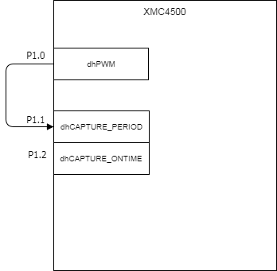


### 프로그램 구조

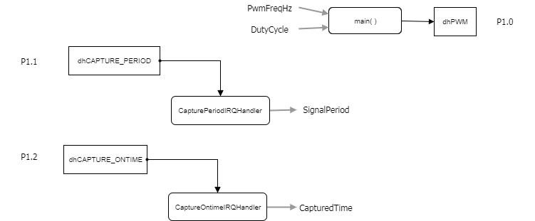

#### DAVE APP

* dhPWM
    * 초기 설정 사용
* dhCAPTURE_PERIOD
    * Timer Resolution Configuration  Direct
    * Desired Timer Resolution[nsec] : 100
    * Min Frequency [Hz] : 2000
    * Start after initialization : Enable
    * Capture edge : Rise-to-Rise
    * Overwrite Capture Value : Enable
    * Enable capture event : Enable
    * Capture interrupt callback : CapturePeriodIRQHandler
* dhCAPTURE_ONTIME
    * Timer Resolution Configuration  Direct
    * Desired Timer Resolution[nsec] : 100
    * Min Frequency [Hz] : 2000
    * Start after initialization : Enable
    * Capture edge : Rise-to-Fall
    * Overwrite Capture Value : Enable
    * Enable capture event : Enable
    * Capture interrupt callback : CaptureOnTimeIRQHandler

#### Function

* CapturePeriodIRQHandler
    * PWM 신호 한 주기 입력 시마다 수행
    * SignalPeriod 변수에 PWM 신호의 주기를 저장한다. 단위는 타이머 틱의 개수이다.

* CaptureOntimeIRQHandler
    * PWM on Time의 Falling edge 감지 후 수행
    * CapturedTime 변수에 PWM on time 시간을 저장한다. 단위는 타이머 틱의 개수이다.
    * CapturedTimeInNanoSec 변수에 PWM On time 시간을 저장한다. 단위는 나노초이다.


### 준비물과 하드웨어 구성

* XMC4500 Relax Lite Kit
* DAVE 4.3.2


### 프로그램 작성

1. 상단의 [File]-[New]-[DAVE Project] 메뉴를 사용하여 DAVE Project를 새로 만든다.

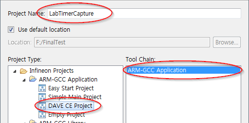

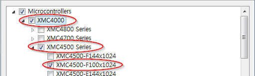

2. 툴바 메뉴의 **Add New App** 을 사용하여 **CAPTURE APP** 2개와 **PWM APP** 1개를 추가한다.

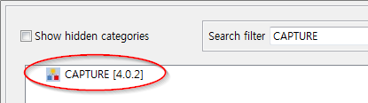

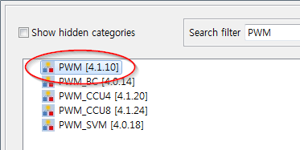

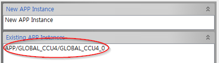

note : APP 추가 시, 위의 그림과 같이 3개 APP 모두 같은 CCU에 할당하도록 한다.

3. CAPTURE_0, CAPTURE_1의 오른쪽 마우스 메뉴에서 **Rename Instance Label** 을 선택하여 라벨이름을 각각 dhCAPTURE_PERIOD, dhCAPTURE_ONTIME로 변경한다.
4. 3번과 같은 방법으로 PWM_0 APP 라벨이름을 dhPWM으로 변경한다.
5. dhCAPTURE_PERIOD를 다음의 그림과 같이 설정한다.

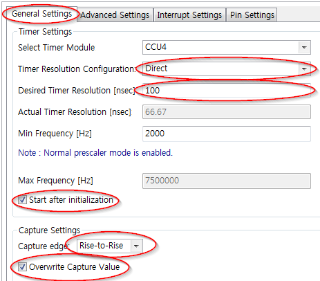

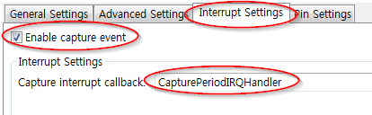

6. dhCAPTURE_ONTIME을 다음의 그림과 같이 설정한다.

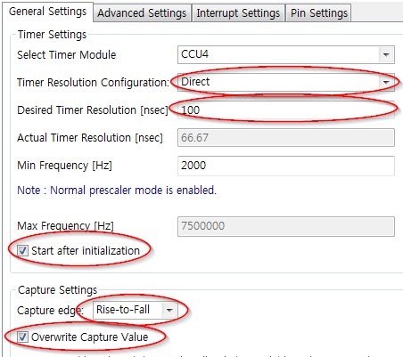

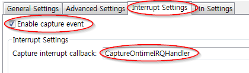

7. 툴바에서 **Manual Pin Allocator** 를 사용하여 핀을 다음과 같이 설정한다.

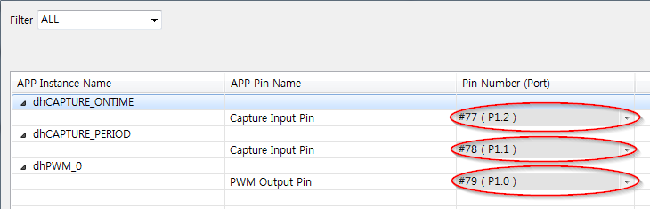

8. 설정을 적용하기 위해서 툴바에 **Generate the code** 를 사용한다.

9. main.c 코드를 다음과 같이 바꿔준다.

```c
uint32_t PwmFreqHz = 10000;
uint32_t DutyCycle = 5000;
uint32_t SignalPeriod =0;
uint32_t CapturedTime = 0;
uint32_t CapturedTimeInNanoSec = 0;

int main(void)
{
  DAVE_STATUS_t status;

  status = DAVE_Init();           /* Initialization of DAVE APPs  */
  PWM_Start(&dhPWM);

  if(status != DAVE_STATUS_SUCCESS)
  {
    /* Placeholder for error handler code. The while loop below can be replaced with an user error handler. */
    XMC_DEBUG("DAVE APPs initialization failed\n");

    while(1U)
    {

    }
  }

  /* Placeholder for user application code. The while loop below can be replaced with user application code. */
  while(1U)
  {
		PWM_SetFreqAndDutyCycle(&dhPWM, PwmFreqHz, DutyCycle);
  }
}


void CapturePeriodIRQHandler(){
    CAPTURE_GetPeriod(&dhCAPTURE_PERIOD, &SignalPeriod );
}

void CaptureOntimeIRQHandler(){
	CAPTURE_GetCapturedTime(&dhCAPTURE_ONTIME, &CapturedTime);
	CAPTURE_GetCapturedTimeInNanoSec(&dhCAPTURE_ONTIME, &CapturedTimeInNanoSec);
}
```


10. 코드를 빌드하고 마이크로컨트롤러에 다운한다.


### 실행결과

* PWM 주기 측정
    * p1.0과 p1.1을 점퍼선으로 연결 후, 프로그램을 실행한다. 그 후, 프로그램을 일시정지하고 아래와 같이 SignalPeriod 변수를 확인한다.

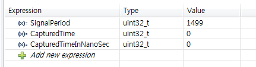

* PWM ontime 측정
    * p1.0과 p1.2를 점퍼선으로 연결 후, 프로그램을 실행한다. 그 후, 프로그램을 일시정지하고 아래와 같이 CapturedTime, CapturedTimeInNanoSec 변수를 확인한다.

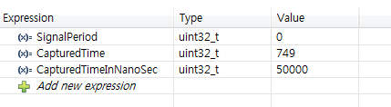


## [Activity]

*   Debugger 에 다음의 전역변수를 등록하고 중간에 Pause 하여 값을 확인한다.


| PwmFreqHz | DutyCycle | SignalPeriod | CapturedTime | CapturedTimeInNanoSec |
| --------- | --------- | ------------ | ------------ | --------------------- |
| 10000     | 5000      |              |              |                       |
| 10000     | 3000      |              |              |                       |
| 20000     | 3000      |              |              |                       |

*   Input Capture 를 사용할 때, 좀 더 넓은 의미에서 타이머를 사용할 때, 우리가 고려해야 하는 것(설계 인자)은 무엇인가요? 
*   위의 시험에서 3가지 Case 만 확인했습니다.  이것만 하면 충분 한가요? 부족하다면 필요한 시험을 제시해 보세요.