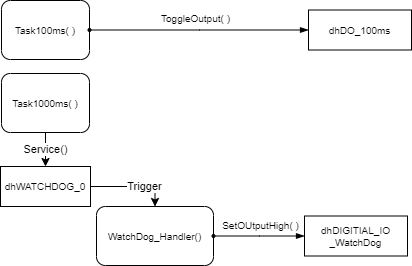

# LabWatchDog

## 개요
Watch Dog 서비스의 개념을 이해하고 활용할 수 있도록 한다.

### 목적
* Watch Dog 서비스의 개념을 이해한다.
* Watch Dog 관련 설정 방법과 Method를 활용할 수 있도록 한다.

### 선행사항들
* Lecture DigitalIos
* Lecture NVIC
* Lecture StaticScheduler

### 참고자료 및 심화학습
* Lecture WatchDog

## 예제에 대한 설명


### 예제 동작
* 200ms 주기로 Static Scheduler 의 Tick LED (LED2) 가 정상적으로 점멸한다.
* Watch Dog Alarm를 활성화되고 Upper Bound 내에 Watch Dog Service를 호출하지 않는 경우
  * Upper Bound 시간이 경과될때  때 LED1이 켜진다. (두번째 Upper Bound를 경과할 때 Reset이 걸리게 된다.)
* Watch Dog Alarm를 활성화되고 Upper Bound 내에 Service를 호출하는 경우
  * 시스템이 정상적으로 동작한다.

### 프로그램 구조



#### Functions
* WatchDog_Handler()
    - Upper Bound를 넘어 섰을 경우 발생하는 Alarm Event Handler
    - dhDIGITAL_IO_WatchDog을 On 한다.

### 준비물과 하드웨어 구성
* XMC4500 Relax Lite Kit-V1
* DAVE v4.3.2

### 프로그램 작성
1. StaticScheduler 파일을 import 한다.

2. WATCHDOG App을 추가하고 다음의 내용으로 설정한다.

    | Name         | UpperBound | LowerBound | Interrupt Settings | Event request | event handler    |
    | ------------ | ---------- | ---------- | ------------------ | ------------- | ---------------- |
    | dhWATCHDOG_0 | 5000       | 0          | Enable             | Via Interrupt | WatchDog_Handler |

3. DIGITAL_IO App을 추가하고 

    - Name: dhWATCHDOG_0
    - Pin Direction: Input/Output

4. Pin Allocation

    - dhDO_100ms : P1.0
    - dhDIGITAL_IO_WatchDog: P1.1

#### [Step1] WatchDog 활성화

* WatchDog 이 동작하는지 확인한다. WatchDog을 활성화 하고 실행한다.

* in main.c

```c
void WatchDog_Handler(void)
{
    DIGITAL_IO_SetOutputHigh(&dhDIGITAL_IO_WatchDog);
    WATCHDOG_ClearAlarm(); /* Clear the alarm event */
    /* To add some measures to clear infinite loop */
}
```
  

* in Scheduler.c

```c
static void TaskInit(void){
    /* Initialize ProbeScope */
    ProbeScope_Init(1000); /* 1 KHz */

    WATCHDOG_Start(); // Start WatchDog

}
```

* **[관찰]**

  * 5초가 지나면 WatchDog Alarm 이 활성화 되어 LED2 가 켜진다.
  * 10초, 두번째 주기, 가 지나면 Reset 되어 다시 시작한다.
  
  

#### [Step2] WatchDog Service 주기적 실행

* 주기적으로, 1초마다 WatchDog Service를 실행한다.

* in Scheduler.c

```c
static void Task1000ms(void){
    WATCHDOG_Service();
}
```
  
* **[관찰]**

  * 5초가 지나도 계속 정상적으로 동작한다.
  


#### [Step3] 의도적으로 무한루프로 빠지게 하여 WatchDog으로 리셋

* 7초가 될 때 의도적으로 무한루프에 빠지게 한다

  * in Scheduler.c

```c
uint32_t Ticks1000ms = 0;
static void Task1000ms(void){
    Ticks1000ms++;

    /* !!! Test purpose only. Wrong Operation in 7sec */
    if(Ticks1000ms == 7){
        while(1)
        {
          ;
        }
    }

    WATCHDOG_Service();

}
```

* **[관찰]**

  * 7초까지는 정상동작하고

  * 12초가 될 때 Alarm을 발생시키고, 

  * 17초가 될 때 Reset 한다.

    

### 토의할 사항

* 무한 루푸에 빠졌을 때 어떻게 하는 것이 좋을까요? 리셋을 하는 것이 최선일까요?
* XMC는 WatchDog 리셋을 하기 전에 Alarm Interrupt를 발생시킬 수 있습니다.  
  * 이것은 왜 필요할까요? 
  * 이 Interrupt에서는 어떤 동작을 해야할까요?