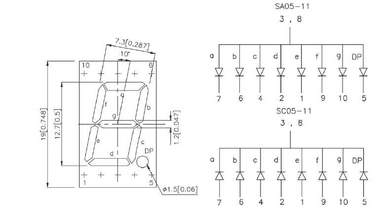
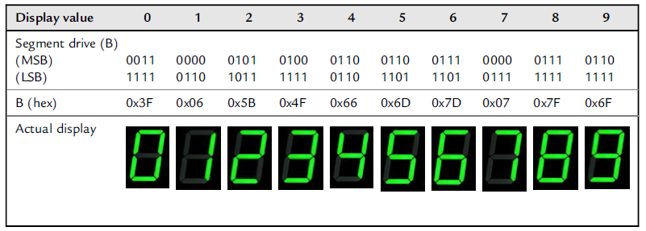
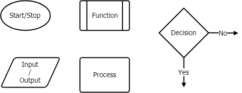
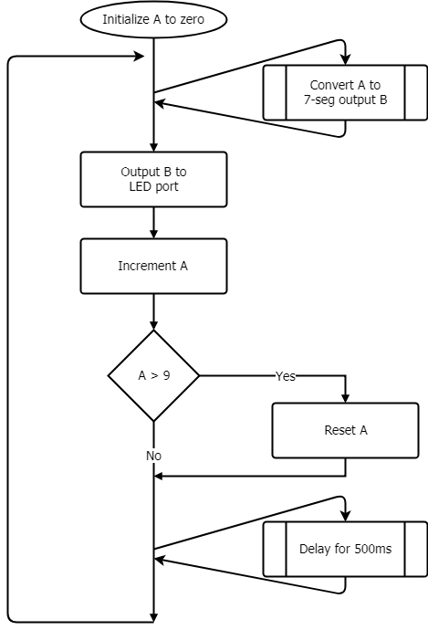
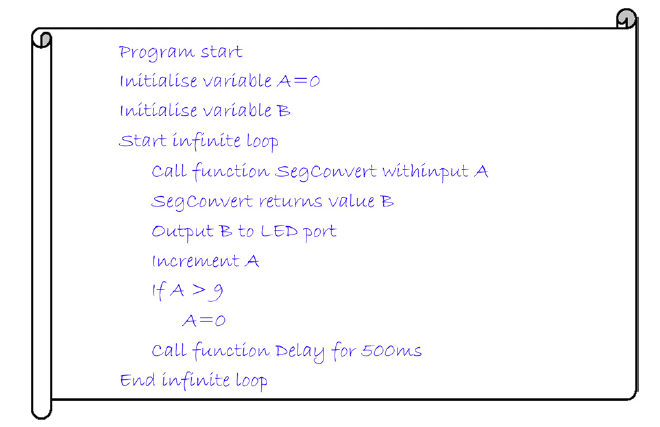

# Programming Techniques  - Program Design & Functions

## Functions

* 함수가 호출 및 복귀 과정

```c
int main(void){
	...
	Segment = SegConvert(Number);
	...
}		
```

[함수 호출 및 복귀 그림]

.

.

.

.

.

.

* 함수를 사용함으로써 생기는 장점과 단점을 다음의 관점에서 설명해 보세요.
  *   메모리 측면:
  *   모듈화 측면:
  *   overhead:
  *   이해도 측면:
* C 언어에서 함수와 관련된 제한 사항은?
  *   인자 전달 측면:
  *   반환값을 받는 측면:
* [참고] 함수간의 자료를 주고 받는 방법
  1. parameter 와 return value
  2. 전역변수 사용: 사용이 용이하나 특별한 관리가 필요


## Program Design

### [예제] SevenSeg

Design a program to increment continuously the output of a seven-segment numerical light-emitting diode (LED) display through the numbers 0 to 9, then reset back to 0 to continue counting. This includes:

* Use a function to convert a hexadecimal counter byte A to the relevant seven segment LED output byte B.
* Output the LED output byte to light the correct segment LEDs.
* If the count value is greater than 9, then reset to zero.
* Delay for 500 ms to ensure that the LED output counts up at a rate that is easily visible.

[참고]



* 만약 각 LED가 **DP g f e d c b a** 순서로 MSB 부터 LSB에 할당되어 있다면



### Using Flowcharts

*   Flowchart 의 구성요소




[예제]




### Pseudocode

[예제]



*   의사코드(Pseudocode)는 무엇이고 소프트웨어 설계 단계에서 어떤점이 유용한가?

.

.

.

.

## Working with Functions on XMC


### Implementing a Seven-Segment Display Counter

**[Note] Example 6.1 Seven-segment display counter ** 

*   **src/SevenSeg** 프로젝트 참고


*   DAVE BUS_IO App을 사용해서 여러비트의 정보를 한번에 처리하도록 한다.
*   시간지연을 위하여 delay 함수를 추가한다.

```c
/* Program Example 6.1: seven-segment display counter */
#include <DAVE.h>  

char SegConvert(char SegValue); // function prototype
char Number = 0; // declare variables A and B
char Segment;
static void delay(uint32_t cycles);

int main(void) {
	DAVE_STATUS_t status;
	/* 중간생략 */
  	/* Placeholder for user application code.  */
	while (1U) {
		Segment = SegConvert(Number);
		BUS_IO_Write(&BUS_IO_0, Segment);
		Number++;
		if(Number>9) {
			Number = 0;
		}
		delay(500);
	}
}

char SegConvert(char SegValue) {
	char SegByte=0x00;
	switch (SegValue) { //DP G F E D C B A
		case 0 : SegByte = 0x3F;break; // 0 0 1 1 1 1 1 1 binary
		case 1 : SegByte = 0x06;break; // 0 0 0 0 0 1 1 0 binary
		case 2 : SegByte = 0x5B;break; // 0 1 0 1 1 0 1 1 binary
		case 3 : SegByte = 0x4F;break; // 0 1 0 0 1 1 1 1 binary
		case 4 : SegByte = 0x66;break; // 0 1 1 0 0 1 1 0 binary
		case 5 : SegByte = 0x6D;break; // 0 1 1 0 1 1 0 1 binary
		case 6 : SegByte = 0x7D;break; // 0 1 1 1 1 1 0 1 binary
		case 7 : SegByte = 0x07;break; // 0 0 0 0 0 1 1 1 binary
		case 8 : SegByte = 0x7F;break; // 0 1 1 1 1 1 1 1 binary
		case 9 : SegByte = 0x6F;break; // 0 1 1 0 1 1 1 1 binary
	}
	return(SegByte);
}

static void delay(uint32_t cycles)
{
  volatile uint32_t i;
  for(i = 0UL; i < cycles ;++i)
  {
    __NOP();
  }
}

```

* 하드웨어 연결 - Figure 3.10과 같이 Common-Cathode 타입의 Seven-Seg 를 연결하고자 한다.  XMC Relax Lite 를 사용하므로 이 정보를 수정할 필요가 있다.  XMC chip 에서의 핀 mapping 정보와 Board에서의 외부 연결 정보를 정리하여야 한다.  다음의 정보를 완성하여 보자.

  *   참고: *SegValue* 는 DP G F E D C B A 순서로 MSB에서 LSB 로 되어 있다. (교재 p46 참고)
  *   /Reference/Board_Users_Manual_XMC4500__Relax_Kit_V1_R1.2_Release.pdf  참고

  | Segment LED | XMC Pin | Board Pin |
  | ----------- | ------- | --------- |
  | A           | P0.0    | X1 36     |
  | B           |         |           |
  | C           |         |           |
  | D           |         |           |
  | E           |         |           |
  | F           |         |           |
  | G           |         |           |
  | DP          |         |           |


#### [Exercise1]

위의 프로그램은 0~9 까지 출력하도록 되어 있다.  이것을 0~F(16 진수) 까지 출력하도록 수정하여 보자.  어디를 어떻게 수정해야 하는가? (참고 A, b,c,d,E,F 형태로 대소문자를 혼용하는 것이 일반적이다)

.

.

.

.

.

### Function Reuse

2자리 숫자를 출력하는 프로그램으로 변경하여 보자.

```c
int main(void){
  
	char upper; 
	char lower;
	/*중간생략*/
  	while (1U) {
		for(upper=0; upper<10; upper++){
			BUS_IO_Write(&BUS_IO_UPPER, SegConvert(upper));
			for(lower = 0; lower<10; lower++){
				BUS_IO_Write(&BUS_IO_LOWER, SegConver(lower));
				delay(500);
			}
		}
	}
}
```


#### [Exercise2]

위의 두자리 Seven-Seg 프로그램을 수정하여 1분짜리 Stop-Watch를 만들어 보자.  

*   Button 1은 Start/Stop 기능을 수행한다.
*   위의 delay 함수를 사용하여 시간을 조정한다면 정확하게 시간 지연을 만들어 낼 수 있을까? 불가능하다면 어떤 기능을 사용하는 것이 좋을까?


.

.

.


