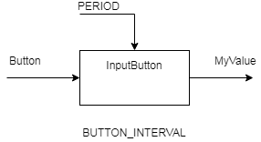
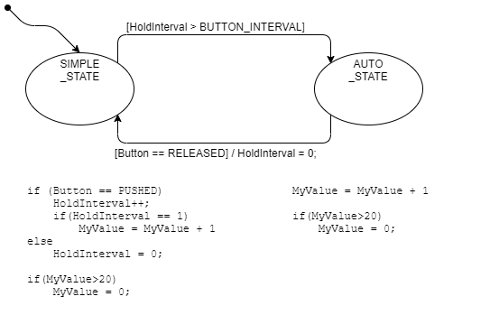

# State Machine Example(Auto Increment)

## [Exercise]

다음의 기능을 구현해 보세요.

* **단순증가 기능**: Button을 한번 누를 때 MyValue 값이 1씩 증가한다. 값이 최대값(20)이 되면 다시 최소값(0)이 되도록 한다. (roll over)
* **자동증가 기능**: Button을 계속 누르고 있으면 처음 1sec 동안은 1% 만 증가하고 변화하지 않다가, 1초가 지난 이후 부터는 자동으로 1/100msec 씩 증가시킨다. 


**[설계]**

* 입력과 출력을 고려하여 모듈의 이름을 결정합니다.
* 이 함수의 설정값(Configuration 정보)를 결정합니다.



* 이 기능의 State machine 을 설계 합니다.
    * 상태를 인식하고 결정합니다.
    * 상태 천이 조건을 결정합니다.
    * 상태/천이에 따르는 동작을 결정합니다.
    * 잘못된 부분은 없는지 확인합니다.



**[구현]**

* 일정 시간을 측정하기 위해서 주기적으로 InputButton() 함수를 호출하는 것을 전제로 합니다. (주기는 PERIOD로 정의되어 있습니다.)
* 다음의 프로그램을 완성해 보세요.

```c
/*
 * AutoIncrement.h
 */
#define PERIOD    100 // msec
#define BUTTON_INTERVAL 1000/PERIOD // msec 
#define PUSHED 0
#define RELEASED 1

enum AutoInc_tag{
	SIMPLE_STATE,
	AUTO_STATE
};

extern int32_t Button;
extern int32_t MyValue;

void InputButton(void);

/*
 * AutoIncrement.c
 */

#include "AutoIncrement.h"


int32_t Button;
int32_t MyValue;

void InputButton(void){

	static enum AutoInc_tag state = SIMPLE_STATE;
	static int32_t HoldInterval = 0;
	switch(state){

	case SIMPLE_STATE:


		break;

	case AUTO_STATE:


		break;
	}
}

```

**[시험]**

* 위의 기능을 시험할 수 있는 시험 조건을 설계해 보세요.


