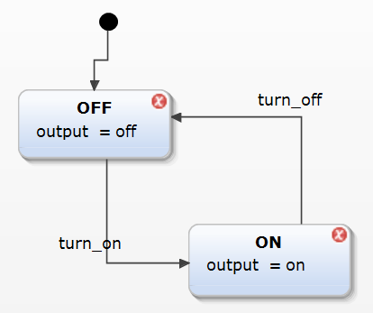
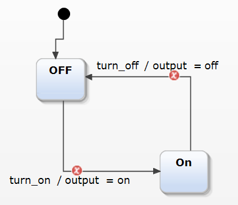
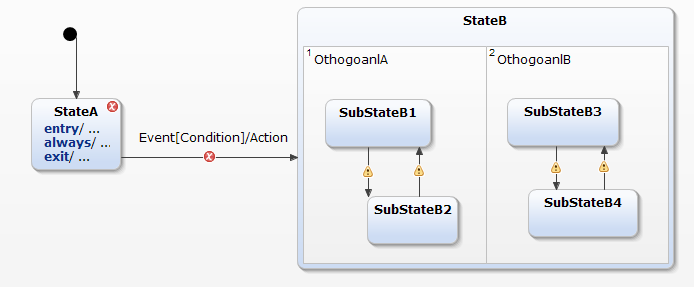
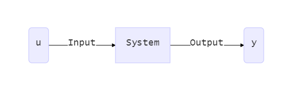
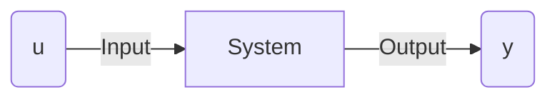
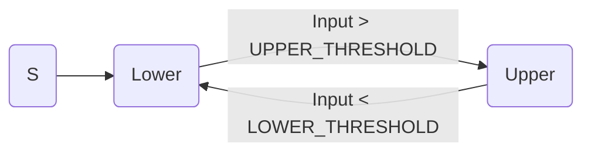
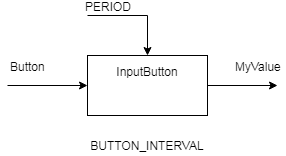
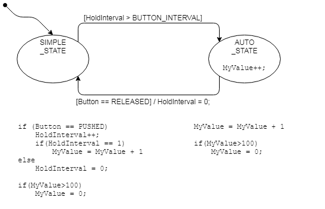

# State Machine Basic


## State Machine 이란

* **StateMachine(상태기계)**란 시스템을 추상화 해서 표현하는 수학적 모델링 방법의 하나이다.
    * 대부분의 경우에 유한한 개수의 상태를 갖는 시스템을 표현하게 되므로 Finite-state machine (FSM, 유한상태기계)를 대신해서 줄여서 State Machine이라 일반적으로 부른다.

* State Machine 으로 모델링 되는 시스템은 유한한 개수의 **State(상태)** 를 갖게 된다.

* 외부의 **Input(입력)** 에 따라서 이 State Machine 은 한 상태에서 다른 상태로 **Transition(천이)**하게 된다. 

    * Transition을 일으키는 입력은 처리하는 방법에 따라 Event 혹은 Condition이 된다.


## State Machine의 예

* State Machine은 외부 입력에 따라 시스템의 상태가 결정되고, 이 상태와 입력에 의해서 시스템의 동작이 결정되는 시스템이다.
* 현대 사회에 컴퓨터를 사용하는 시스템이 보편화 되면서 우리 일상생활 속에 State Machine의 예는 점점 늘어나고 있다.
    * 자판기: 투입한 동전(입력)의 총량(상태)에 따라서 뽑을 수 있는 물건의 종류(출력)이 바뀌게 된다.
    * 엘리베이터: 탑승자가 누른 버튼(입력)의 순서와 엘리베이터의 현재 위치(상태)에 따라서 움직이는 방향과 정지하는 층(출력)이 바뀌게 된다.
    * 교통 신호등, 비밀번호 패턴 등등

## State Machine의 표현 방법

### A. Moore Machine 

* Output은 현재 State에 의해서만 결정된다.

    * 즉 다시 말해서 Output의 개수, 혹은 그 이상의 State를 사용해서 표현한다.

    

### B. Mealy Machine

* Output은 State가 아니라 Transition 할 때 결정된다. 
    * 그러므로 Output의 개수와 무관하게 State를 결정할 수 있으므로, Moore Machine과 비교해서 더 간단하게 표현할 수 있는 경우들이 생긴다.  

    


### C. Harel statecharts (UML)

* Moore, Mealy Machine의 경우에는 State의 개수가 증가함에 따라 복잡도가 폭발적으로 증가하게 되어 실용성이 떨어지게 된다.
* 보다 유용하게 State Machine을 표현하기 위하여 David Harel 이 State Machine을 체계적으로 작성하는 방법을 제안하였다.
* 이 방법을 Statechart 라 부르고, UML(Unified Modeling Language)의 State Machine 표현 방법의 표준이 되었다.
* **Statechart = state-diagram + depth + orthogonality + broadcast communication**  이라 말할 수 있다.
    * **depth**: State가 내부적으로 substate 를 갖을 수 있다.  
        * 이렇게 함으로써 계층적인 상태도 표현이 가능해 졌다.
    * **orthogoality**: 독립적으로 동작하는 State Machine을 별도로 표시한다.
        * 이렇게 함으로써 무관한 상태들간의 조합을 피할 수 있다.
    * **broadcast**: state machine 간의 정보들을 주고 받을 수 있다.
        * 이렇게 함으로써 State Machine 간의 동작을 동기화 시킬 수 있다.
    * 그 외에도 조건을 사용한 표현방법, history state를 사용하는 방법, 상태 내에서 entry, exit 동작 등을 추가할 수 있도록 확대하였다.

* **[Statechart 표현 방법]**
    * 각 State는 내부에 entry, always, exit 에 해당하는 동작을 갖을 수 있다.
    * **Event[Condition]/Action**의 방법으로 Transition 조건을 표현한다.
    * State는 내부에 substate를 갖을 수 있다.  이 예에서는 SubstateB1, SubstateB2, SubstateB3, , SubstateB4 는 StateB의 Substate 이다.
    * 서로 무관한 State들은 Othogonal State 로 표현한다.  이 예에서는 (SubstateB1, SubstateB2)과 (SubstateB3, , SubstateB4) 는 서로 Othogonal 한 State들이다.



## System theory simplified

### System이란?

* 경계를 가지고 있고,
* 입력과 출력이 있으며,
* 입력에 대하여 출력을 결정하는 특별한 동작을 하는 것

    



### 특별한 동작이란

* 수학적으로 표현하면

    * 입력에 대한 출력의 대응 관계
* 이 관계를 표현하는 방법은 
    * 현재 입력값에 의해서만 출력이 결정되는 Static System 과
    * 과거의 모든 입력값과 현재 입력값에 의해서 결정되는 Dynamic System으로 구분되어 질 수 있다.  (과거의 입력값에 의해서 시스템의 현재 State를 결정한다)
* 입력값의 특성에 따라서 시스템을 표현하는 방법이 바뀔 수 있다.
    * 즉 연속 변수(Continuous Variable)이냐 
    * 이산 이벤트(Discrete Event) 이냐

* 위의 두가지 기준을 조합하면 다음의 테이블 처럼 정리할 수 있다.
    * Static System으로 모델링 되는 시스템은 예상하는 출력을 얻기 위하여 입력을 쉽게 결정할 수 있다.
    * 그러나, Dynamic System으로 모델링 되는 시스템은 현재의 입력값 만으로는 시스템의 출력을 결정할 수 없고 과거의 모든 입력으로 시스템의 State를 결정한 후 현재의 입력과 조합하여 원하는 출력을 얻을 수 있다.
    * 그러므로 Dynamic System을 제어하기 위해서는 보다 복잡한 수학적 방법이 필요하고, Continuous Variable Dynamic System을 대상으로 Control 관련 교과목을 배워야 한다.  Discrete Event Dynamic System의 경우에는 이보다는 직관적이므로 State Machine으로 모델링하고 설계하는 내용을 배우는 정도면 간단한 제어는 수행할 수 있다.  컴퓨터 공학 전공 과정에서는 UML, 혹은 Automata 이론 등이 있다.

|                | Continuous Variable   | Discrete Event |
| -------------- | --------------------- | -------------- |
| Static System  | Algebraic Equation    | Simple Mapping |
| Dynamic System | Differential Equation | State Machine  |

## [Activity]

* 다음과 같은 Hysteresis 를 갖는 함수를 구현해 보세요.


**[설계]**

* 입력과 출력을 고려하여 함수 원형을 결정합니다.

```
float MyHysteresis(float input);
```

* 이 함수의 설정값(Configuration 정보)를 결정합니다.

* 이 기능의 State machine 을 설계 합니다.
    * 상태를 인식하고 결정합니다.
    * 상태 천이 조건을 결정합니다.
    * 상태/천이에 따르는 동작을 결정합니다.
    * 잘못된 부분은 없는지 확인합니다.




**[구현]**

위의 설계에 따라 다음의 코드를 완성하세요.

```c
/*
 * Hysteresis.h
 */

float MyHysteresis(float input);

/*
 * Hysteresis.c
 */

#include "Hysteresis.h"

#define UPPER_THRESHOLD 3.0
#define UPPER_VALUE 5.0
#define LOWER_THRESHOLD 1.0
#define LOWER_VALUE 0.0

enum Hysteresis_tag{
	UPPER_STATE,
	LOWER_STATE
};


float MyHysteresis(float input){

	static enum Hysteresis_tag state = LOWER;

	float output = 0.0;
	switch(state){

	case LOWER:


		break;

	case UPPER:


		break;
	}
	return(output);
}


```


**[시험] ** 이 함수의 시험 조건을 설계합니다.

* 시험 Setup
    * LOWER_THRESHOLD = 1.0
    * LOWER_VALUE = 0.0
    * UPPER_THRESHOLD = 3.0
    * UPPER_VALUE = 5.0
    * Output의 초기값 = LOWER_VALUE

* Stimulus 입력 방법
    * Option1: Debugger를 통하여 단계별로 입력
    * Option2: uC/Probe를 사용하여 입력
* Test Input: 다음의 정보를 순차적으로 입력

| Step | Input | Exp. State | Meas. State | Exp. Output | Meas. Output |
| ---- | ----- | ---------- | ----------- | ----------- | ------------ |
| 0    | 0.0   | LOWER      |             | 0.0         |              |
| 1    | 2.0   | LOWER      |             | 0.0         |              |
| 2    | 2.9   | LOWER      |             | 0.0         |              |
| 3    | 3.1   | UPPER      |             | 5.0         |              |
| 4    | 4.0   | UPPER      |             | 5.0         |              |
| 5    | 2.0   | UPPER      |             | 5.0         |              |
| 6    | 0.9   | LOWER      |             | 0.0         |              |


## [Exercise]

다음의 기능을 구현해 보세요.

* **단순증가 기능**: Button을 한번 누를 때 MyValue 값이 1%씩 증가한다. 값이 최대값이 되면 다시 최소값이 되도록 한다. (roll over)
* **자동증가 기능**: Button을 계속 누르고 있으면 처음 1sec 동안은 1% 만 증가하고 변화하지 않다가, 1초가 지난 이후 부터는 자동으로 1%/100msec 씩 증가시킨다. 


**[설계]**

* 입력과 출력을 고려하여 모듈의 이름을 결정합니다.
* 이 함수의 설정값(Configuration 정보)를 결정합니다.
  
* 이 기능의 State machine 을 설계 합니다.
    * 상태를 인식하고 결정합니다.
    * 상태 천이 조건을 결정합니다.
    * 상태/천이에 따르는 동작을 결정합니다.
    * 잘못된 부분은 없는지 확인합니다.



**[구현]**

* 일정 시간을 측정하기 위해서 주기적으로 InputButton() 함수를 호출하는 것을 전제로 합니다. (주기는 PERIOD로 정의되어 있습니다.)
* 다음의 프로그램을 완성해 보세요.

```c
/*
 * AutoIncrement.h
 */
extern int32_t Button;
extern int32_t MyValue;

void InputButton(void);

/*
 * AutoIncrement.c
 */

#include "AutoIncrement.h"

#define PERIOD    100 // msec
#define BUTTON_INTERVAL 1000/PERIOD // msec 
#define PUSHED 0
#define RELEASED 1

enum AutoInc_tag{
	SIMPLE_STATE,
	AUTO_STATE
};

int32_t Button;
int32_t MyValue;

void InputButton(void){

	static enum AutoInc_tag state = SIMPLE_STATE;
	static int32_t HoldInterval = 0;
	switch(state){

	case SIMPLE_STATE:


		break;

	case AUTO_STATE:


		break;
	}
}

```

**[시험]**

* 위의 기능을 시험할 수 있는 시험 조건을 설계해 보세요.


