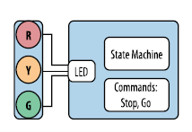
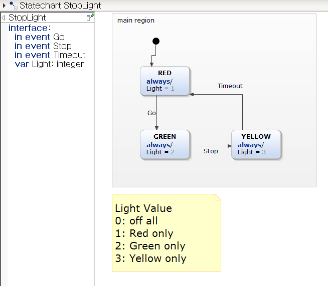
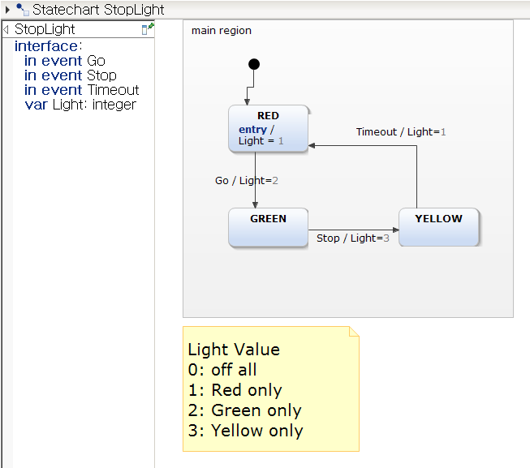
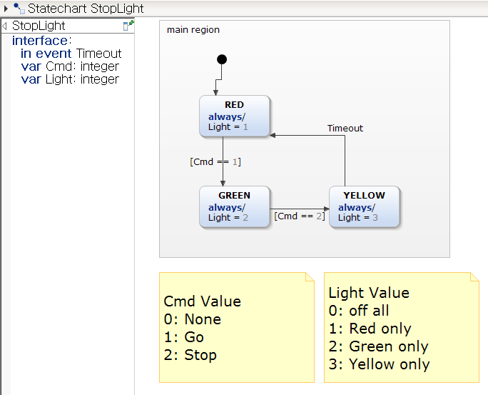

# State Machine Example (Stop Light)


## Objective

* 주어진 시스템을 Moore, Mealy, 그리고 Statechart로 표현하는 방법을 배운다.
* State Diagram을 위한 Programming Pattern을 이해하고 활용할 수 있다.


## 예제: 신호등(StopLight)

1. 신호등의 동작을 State Machine으로 표현해 보자
2. 이것을 소프트웨어로 구현하려면 어떤 방식으로 해야 할까?


### 신호등의 동작

* 빨강, 노랑, 초록 으로 구성된 신호등이 있다.
* 입력부에서 통신 혹은 스위치 입력으로 *STOP*, *GO* 명령을 받아서 동작한다.
* *GO* 명령이 들어오면 **초록** 등이 켜진다.
* *STOP* 명령이 들어오면 **노랑** 등이 켜진후 *일정시간* 후 **빨강** 불이 켜진다.



### FSM 표현 - Event

* Moore model



* Mealy model




* SW Pattern

```c
/**   StopLight.h    **/

/* PUBLIC TYPEDEFS AND STRUCTURES        */
typedef enum {
	STOPLIGHT_INIT = 0,
	STOPLIGHT_RED = 1,
	STOPLIGHT_GREEN = 2,
	STOPLIGHT_YELLOW = 3
} StopLightState_t;

typedef enum {
	LIGHT_OFF_ALL = 0,
	LIGHT_RED_ONLY = 1,
	LIGHT_GREEN_ONLY = 2,
	LIGHT_YELLOW_ONLY = 3
} Light_t;

/* PUBLIC VARIABLES        */
extern Light_t Light;
extern StopLightState_t StopLightState;

/* PUBLIC FUNCTIONS        */
void StopLight(void);
```

```c
/* StopLightEvent.c */

/* PUBLIC VARIABLES       */
Light_t Light;
StopLightState_t StopLightState = 0;

/* PRIVATE VARIABLES         */

/* Variables for test purpose  ***********/
bool evGo = false;
bool evStop = false;
bool evTimeout = false;

void StopLight()
{
    switch(StopLightState){
   
    case STOPLIGHT_INIT:
    	StopLightState = STOPLIGHT_RED;
    	break;

    case STOPLIGHT_RED:
    	Light = LIGHT_RED_ONLY;
    	if(evGo == true){
        	StopLightState = STOPLIGHT_GREEN;
    	}
    	break;

    case STOPLIGHT_GREEN:

    	break;

    case STOPLIGHT_YELLOW:

    	break;
    default :
    	;

    }
}
```


### FSM 표현 - Condition



```c

/* PUBLIC VARIABLES      */
Light_t Light;
StopLightState_t StopLightState = 0;

/* Variables for test purpose */
typedef enum {
	CMD_NONE = 0,
	CMD_GO = 1,
	CMD_STOP = 2
} Cmd_t;
Cmd_t Cmd = CMD_NONE;
bool evTimeout = false;


/* PUBLIC Function Implementation      */
void StopLight()
{
    switch(StopLightState){
   
    case STOPLIGHT_INIT:
    	StopLightState = STOPLIGHT_RED;
    	break;

    case STOPLIGHT_RED:
    	Light = LIGHT_RED_ONLY;
    	if(Cmd == CMD_GO){
        	StopLightState = STOPLIGHT_GREEN;
    	}
    	break;

    case STOPLIGHT_GREEN:

    	break;

    case STOPLIGHT_YELLOW:

    	break;
    default :
    	;

    }
}
```

### [Activity]

* 위의 두 코드 모두 일부만 완성되어 있다.  주어진 코드사용하여 나머지 부분을 모두 완성하여 보자.


