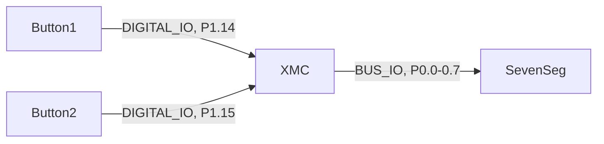
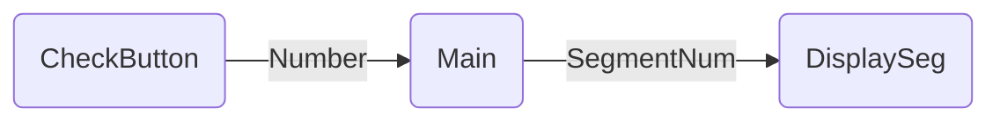
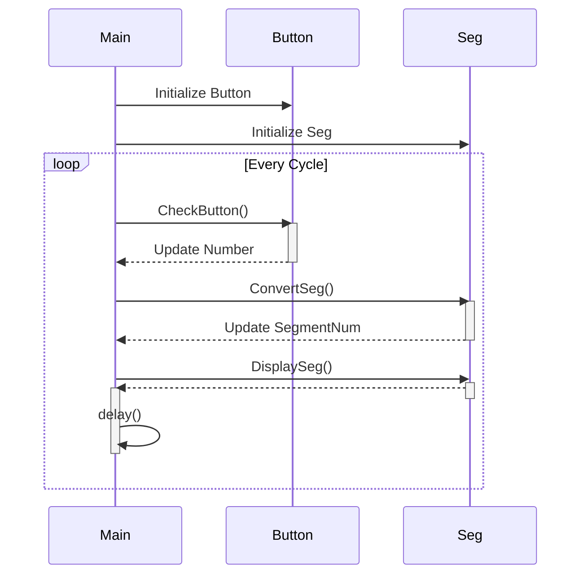

# Programming Techniques  - Module Design & Multiple files

## The Benefits of Considered Program Design and Structure

*   프로그램의 구조를 고민하고 설계할 때 얻어질 수 있는 장점들을 나열해 보세요.

.

.

.

.

### 

## Using Multiple Files in C/C++

*   왜 여러 파일을 사용해서 프로그래밍하는 방법을 배워야 하는가?

.

.

.

.

### Overview of C Program Compilation Process

*   컴파일 과정에서 라이브러리는 어느 단계에서 사용되게 되는가?

.

.

.

.

#### [Exercise] 

Dave Project 에서 Source file 과 Object file, 그리고 실행 file을 찾아보자.

 

### The C/C++ Preprocessor and Preprocessor Directives

*   C프로그램에서 전처리기(preprocessor)의 목적은 무엇인가?

.

.

.

.

### The *#ifndef* directive

.

.

.

### Using mbed objects Globally - SKIP

*   대신 수업 시간에 다음의 내용으로 설명하겠습니다.

*   cfile.h 에 "pears" 변수를 afile 과 bfile에서 접근하여 사용하려면 어떻게 해야 하는가?

.

.

.

### ​[Activity]

*   다음의 기능을 하는 프로그램의 flowchart 와 pseudocode 를 작성하여 보자.
    *   1초에 한번씩 다음의 루프를 반복한다.
    *   ADC에 연결되어 있는 온도 센서 값을 읽어들이고 
    *   2자리 SevenSegment 출력을 사용하여 현재의 온도를 출력한다.

## Modular Program Example - SKIP

*   대신 실습시간에 다음의 프로그램을 구성해 보도록 하겠습니다.
*   **src/SevenSegLab** 참고
    *   Example 6.1 과 같이 SevenSeg 를 출력한다. (0~9사이의 값)
    *   Button1을 누를 때 마다 SevenSeg 의 값이 1씩 증가한다.
    *   Button2를 누를 때 마다 SevenSeg 의 값이 1씩 감소한다.

*   주어진 코드에서 Segment 와 관련된 기능은 SegDisplay.h/.c  모듈로 만든다.
*   주어진 코드에서 Button 과 관련된 기능은 Button.h/.c 모듈로 만든다.
*   Main  함수에서는 위의 두 모듈의 기능을 사용하여 무한루프로 반복한다.

*   SevenSegLab 프로젝트는 

    *   1개의 main.c 파일에 위의 기능이 모두 프로그래밍 되어 있다.
    *   이제 모듈화를 수행하고자 한다.
    *   Button 과 과련된 기능과 변수는 Button.h/.c 파일로 옮기고,
    *   Segment 와 관련된 기능과 변수는 Seg.h/.c 파일로 옮기고자 한다.
    *   그렇게 변경되면 main.c 파일에서는 Button.h 파일과 Seg.h 파일을 include 하고 해당 기능을 사용하게 된다.
    *   여러분의 이해를 돕기 위하여 Button.h/.c 파일은 수정하여 놓았다.
    *   그러면 main.c 파일에 있는 해당 내용은 삭제하고 Button 모듈을 사용하기 위하여 약간수정하여야 한다. (해당 내용을 주석처리해 놓았습니다.   확인하고 삭제하시기 바랍니다.)

### [Activity]

*   Seg.h/.c 파일을 수정하고 이에 따라 main.c 파일도 수정하여 보아라.