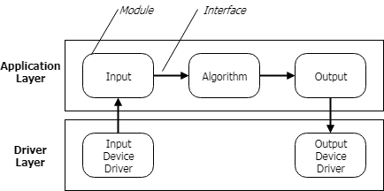
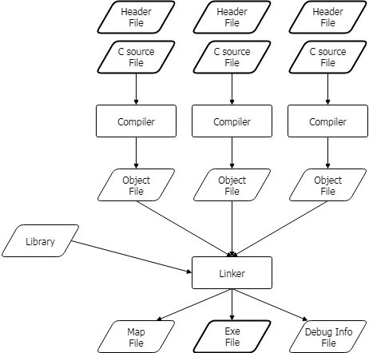
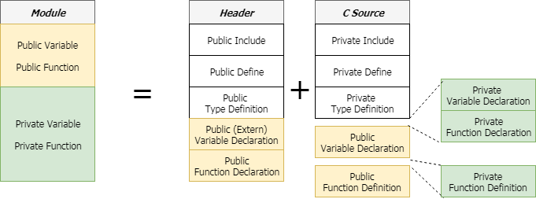
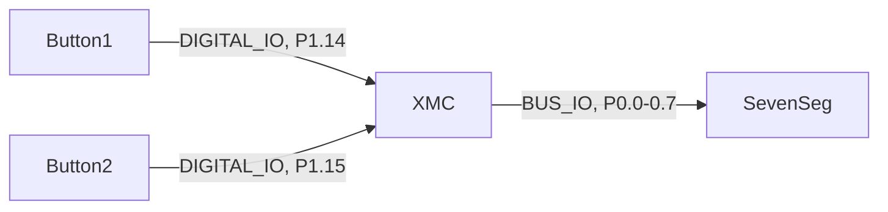
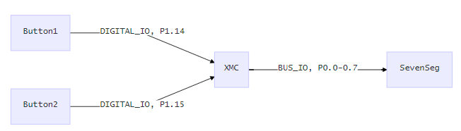
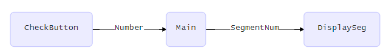
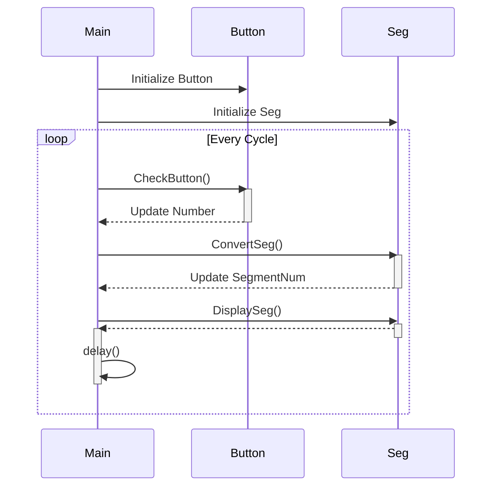
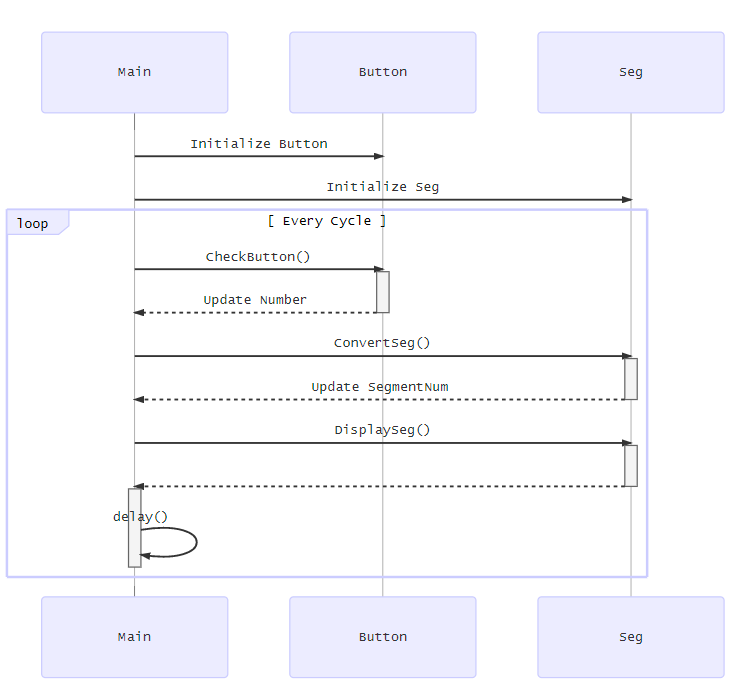

# Programming Techniques  - Module Design & Multiple files


## The Benefits of Architecture & Module

* 모듈(Module)이란?
  * 관련이 높은 부분을 모아 놓은 것
  * 경계가 있고, 외부와 연결할 수 있는 인터페이스가 정의 되어 있는 것
* 구조(Architecture)란?
  * 모듈을 연결하여 전체를 구성하는 방법
  * 모듈간의 상호 연관 관계를 맺어주는 것
  * 추상화의 정도에 따라 계층적인 구조(Layered Architecture)를 갖는 경우가 많음




* 프로그램의 구조를 고민하고 설계하고 모듈로 만들때 얻어질 수 있는 장점
  * 구조화되어 **읽고 이해**할 수 있는 코드
  * 모듈단위로 **시험**할 수 있는 코드
  * 기존의 코드를 **재사용**하여 시간을 단축하고 품질을 향상할 수 있는 코드
  * 하나의 프로젝트를 **여럿이 함께** 진행할 수 있게됨
  * 향후 효율적으로 기능을 개선(**유지, 보수**)해 갈 수 있게됨

* 구조적 설계와 모듈 구현을 위해서 알아야 하는 것들
  * 소프트웨어 구조를 그림으로 표현하는 방법
  * 여러 파일로 프로그래밍 하는 방법
    * C 와 Header 로 구분하는 방법
    * 모듈간 인터페이스 하는 방법
    * 전처리기를 사용하는 방법


## [기초] Using Multiple Files in C/C++

왜 여러 파일을 사용해서 프로그래밍하는 방법을 배워야 하는가?

* 여러명의 엔지니어가 동시에 프로그래밍을 해야하는 상황
* 관련된 코드를 별도의 파일로 관리
  * 예를 들어 LCD를 구동하는 코드와 모터를 구동하는 코드를 별도의 파일로 관리

! 이 방법을 알아야 모듈을 만들 수 있다.

### Overview of C Program Compilation Process

* 프로그래머가 인식하는 파일은 Header와 C Source 파일들이지만, 실제로는 여러 단계를 거쳐서 최종 실행파일이 만들어 진다.
* 개발의 편의를 위하여 메모리 사용관련 정보를 담고 있는 map 파일과 디버깅 정보를 담고 있는 파일을 만들기도 한다.




## Module Section

* 모듈은 관련된 변수(Variable)와 함수(Function)의 집합
* 모듈 외부에서 보이는 정보는 Public, 모듈 내부에서만 사용되는 정보는 Private



* **Header of Module**
```c
/******************************************************************************/
/**
 * file         _TempBasic.h
 *
 * brief        Header file for _TempBasic
 *
 * version      1.00
 * date         Feb/18/2010
 * warning
 * note
 * ---------------------------------------------------------------------------
 *               R E V I S I O N   H I S T O R Y
 * ---------------------------------------------------------------------------
 *   Date        Version  Author  Description
 *  ----------   -------  ------  --------------------------------------------
 *  2010-02-18   1.00             - Creation Release
 *
 */
/******************************************************************************/

#ifndef TEMPBASIC_H
#define TEMPBASIC_H

/******************************************************************************/
/* Include                                                                    */
/******************************************************************************/


/******************************************************************************/
/* PUBLIC DEFINITIONS AND MACROS                                              */
/******************************************************************************/


/******************************************************************************/
/* PUBLIC TYPEDEFS AND STRUCTURES                                             */
/******************************************************************************/


/******************************************************************************/
/* PUBLIC VARIABLES                                                           */
/******************************************************************************/
//extern int32_t MyCounter;

/******************************************************************************/
/* PUBLIC FUNCTIONS                                                           */
/******************************************************************************/

/***************************************************************************/
/**
brief      Initialization of the timer for scheduler
param[in]  pParam   Pointer to the parameters structure.
param[out] pState   Pointer to the state structure.
param[in,out] pi32InBuf Pointer to a buffer for storing input signal
return     void.

void Sche_InitTimer(const sScheTable_t * pParam,
                               eScheStatus_t * pState,
                               int32_t *pi32InBuf);
 */


#endif

/******************************************************************************/
/*                            EOF                                             */
/******************************************************************************/

```

* **C Source of Module**
```c
/******************************************************************************/
/**
 * file         _TempBasic.c
 *
 * brief        C file for _TempBasic
 *
 * version      1.00
 * date         Feb/18/2010
 * warning
 * note
 * ---------------------------------------------------------------------------
 *               R E V I S I O N   H I S T O R Y
 * ---------------------------------------------------------------------------
 *   Date        Version  Author  Description
 *  ----------   -------  ------  --------------------------------------------
 *  2010-02-18   1.00             - Creation Release
 *
 */
/******************************************************************************/

/******************************************************************************/
/* HEADER FILES                                                               */
/******************************************************************************/

#include "_TempBasic.h"


/******************************************************************************/
/* PRIVATE DEFINITIONS AND MACROS (scope: file)                               */
/******************************************************************************/


/******************************************************************************/
/* PRIVATE TYPEDEFS AND STRUCTURES (scope: file)                              */
/******************************************************************************/


/******************************************************************************/
/* PUBLIC VARIABLES                                                           */
/******************************************************************************/
//extern int32_t MyCounter;

/******************************************************************************/
/* PRIVATE VARIABLES                                                          */
/******************************************************************************/
//static int32_t MyPrivate;


/******************************************************************************/
/* PRIVATE Function Prototype (scope: file)                                   */
/******************************************************************************/


/******************************************************************************/
/* PRIVATE Function Implementation (scope: file)                              */
/******************************************************************************/


/******************************************************************************/
/* PUBLIC Function Implementation                                             */
/******************************************************************************/
/*
void Sche_InitTimer(const sScheTable_t * pParam,
                               eScheStatus_t * pState,
                               int32_t *pi32InBuf)
{
   
}
*/

/******************************************************************************/
/*                                                                            */
/*                            EOF                                             */
/*                                                                            */
/******************************************************************************/


```


## Modular Program Example 

*   다음의 프로그램을 모듈화 해보도록 하겠습니다.
*   **src/SevenSegLab** 참고
    *   Example 6.1 과 같이 SevenSeg 를 출력한다. (0~9사이의 값)
    *   Button1을 누를 때 마다 SevenSeg 의 값이 1씩 증가한다.
    *   Button2를 누를 때 마다 SevenSeg 의 값이 1씩 감소한다.






*   주어진 코드에서 Segment 와 관련된 기능은 Seg.h/.c  모듈로 만든다.
*   주어진 코드에서 Button 과 관련된 기능은 Button.h/.c 모듈로 만든다.
*   Main  함수에서는 위의 두 모듈의 기능을 사용하여 무한루프로 반복한다.









*   SevenSegLab 프로젝트는 

    *   1개의 main.c 파일에 위의 기능이 모두 프로그래밍 되어 있다.
    *   이제 모듈화를 수행하고자 한다.
    *   Button 과 과련된 기능과 변수는 Button.h/.c 파일로 옮기고,
    *   Segment 와 관련된 기능과 변수는 Seg.h/.c 파일로 옮기고자 한다.
    *   그렇게 변경되면 main.c 파일에서는 Button.h 파일과 Seg.h 파일을 include 하고 해당 기능을 사용하게 된다.
    *   여러분의 이해를 돕기 위하여 Button.h/.c 파일은 수정하여 놓았다.
    *   그러면 main.c 파일에 있는 해당 내용은 삭제하고 Button 모듈을 사용하기 위하여 약간수정하여야 한다. (해당 내용을 주석처리해 놓았습니다.   확인하고 삭제하시기 바랍니다.)

### [Activity]

*   Seg.h/.c 파일을 수정하고 이에 따라 main.c 파일도 수정하여 보아라.
*   Debugger 의 Expression 창에 Number, SegmentNum 를 등록하고 프로그램을 실행하여 본다.
    *   Break하여 Number 와 SegmentNum의 값을 확인한다.  초기값으로 맞게 업데이트 되었는가?
    *   다시 실행하여 Button1 과 Button2를 눌러보고 Break 하여 본다. Number 와 SegmentNum 는 예상대로 변경되었는가?