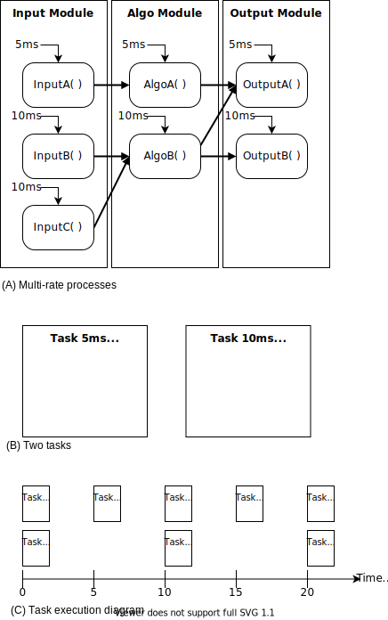
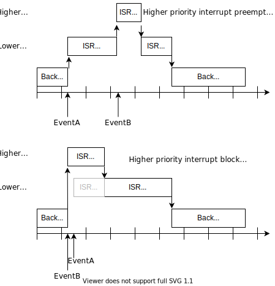
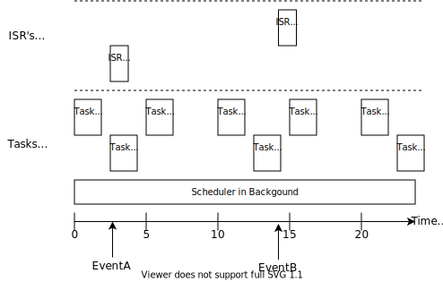

# SystemTimer & Multi-rate Scheduler

**[Pre-requisite] **

* Interrupt
* System Timer


## Task 와 Scheduler

* Task 란?
    * 트리거 조건(실행 조건)이 같은 기능들의 집합
    * Time triggered, Event triggered
    * C 언어의 경우 함수 형태로 구현하게 됨
    * Scheduler 에서 관리하는 특별한 함수
* Scheduler 란?
    * 실행 조건에 따라(주기, 오프셋 등) 해당하는 Task 를 실행하는 모듈
    * RTOS(Real-Time Operating System)의 핵심적인 부분
* Scheduling 이란?
    * 각 기능들을 Task 에 할당하고
    * 각 Task 들이 주기에 맞게 실행할 수 있도록 설계하는 과정

[EX] 다음의 그림과 같이 3개의 모듈에 각각의 기능이 있다.  

* 이것을 실행 조건에 맞추어서 태스크를 구성하고 
* 스케쥴링을 하여 보자.




* 각 모듈에서 해야하는 기능들을 실행 조건에 맞추어서 Task5ms 와 Task10ms 에 할당하여 준다.
* 스케쥴러에서 Task5ms 를 5ms 마다 호출하여 주도록하고, Task10ms 는 10ms 마다 호출하여 주도록 한다.
    * 이와 같이 실행주기가 다른 경우를 Multi-rate 실행이라고 한다.

**[참고]**

* Critical Instance(임계 순간)
    * 위의 예에서 0ms 와 10ms 순간에는 Task5ms와 Task10ms 가 동시에 실행되어야 한다.
    * 프로그래밍을 하는 방식에 따라 Task5ms 와 Task10ms 중 먼저 호출되는 것이 먼저 실행되게 된다.
    * 실행주기가 짧은 것은 먼저 끝나는 것이 바람직하다. (잘못하면 다음 실행주기 전까지 끝내지 못할 가능성이 높다)
* Offset 관리
    * Task10ms 를 0, 10, 20 되는 순간에 더 빠른 주기로 실행되는 Task5ms 와 동시에 호출하였기 때문에 Critical Instance 가 발생되었다.
    * Task10ms를 약간 밀어서 2, 12, 22, ... 순간에 호출하면 Critical Instance 를 피할 수 있다.
    * 이와 같은 방식을 Offset 관리 방법이라 부른다.


## Interrupt 와 Scheduler


* Interrupt priority and nested interrupts

    * 마이크로컨트롤러는 다수의 Interrupt를 갖고 있다.
    * 여러 Interrupt가 동시에 발생하였을 경우 어떤 Interrupt를 우선적으로 처리할 것인가를 결정하는 메카니즘을 가지고 있다.
    * 각 Interrupt마다 Priority(우선순위)를 부여하고 우선순위가 높은 Interrupt를 우선적으로 처리하도록 한다.
    * 우선순위가 낮은 ISR실행중 우선순위가 높은 Interrupt 가 발생하게 되면 이를 중단하고(Preemption) 우선순위 높은 일을 먼저 실행하게 된다.
    * 우선순위가 높은 ISR실행중 우선순위가 낮은 Interrupt가 발생하면, 우선순위 높은 ISR이 끝난 후에 낮은 Interrupt를 실행하게 된다.  (낮은 Interrupt는 이동안 Block 된다)
    * ISR 실행 중 다른 ISR를 실행할 수 있는 시스템은 Nested Interrupt 를 지원한다고 말한다.




* Interrupt와 Scheduler의 유사성
    * 특정 조건이 되었을 때 Interrupt를 발생시키고 해당하는 동작을 ISR로 구성해서 실행하도록 하는 것은
    * 특정 주기가 되었을 때 Task 를 호출하는 Scheduler와 매우 유사하다.
    * 특정 주기마다 실행해야 하는 기능을 ISR 에 프로그래밍 하여 활용하면 Scheduler 없이 프로그래밍이 가능하다.
* Interrupt는 Scheduler가 아니다.
    * Interrupt는 CPU의 일반적인 동작 중단 시키고, 해당 이벤트에 대하여 예외적으로 처리하는 메카니즘이다.
    * 주기적으로 실행해야 하는 기능들을 모두 Interrupt에서 실행하도록 설계한다면 CPU는 일반적인 동작은 하지 않고 모두 예외적인 동작으로 일을 처리하는 방식이 된다.
* **Interrupt와 Scheduler의 일반적인 활용 방법**
    * 주기적으로, 일반적으로 실행해야 하는 기능들은 Task로 관리하여 Scheduler에서 실행하도록 한다.
    * 특정 이벤트에 대하여 즉각적으로 반응을 보여 처리해야 하는 경우는 Interrupt를 활용한다.
    * 일반적으로 Interrupt 는 Scheduler 보다 우선적으로 실행하게 된다.



### Interrupt Service Routine 을 사용할 때 주의 사항

* Interrupt 는 외부 Event 에 대하여 즉각적인 반응을 보이게 만드는 embedded system의 필수적인 구성요소이다.
* Interrupt 가 여러개가 있는 경우에는 Interrupt 의 우선순위를 사용하여 중요한 Interrupt 가 우선적으로 처리될 수 있도록 설계하여야 한다.
* 기본적으로 Interrupt 는 일반 코드의 실행을 중단하고 실행시키는 예외적인 실행 메카니즘이다.  그러므로 이러한 Interrupt를 너무 적극적으로 사용하면 일반코드 실행에서 오동작을 일으킬 수 있다.
* **[Guideline]** 
    * ISR은 가능하면 짧게 구성하여 예외처리 상황이 적어지게 만든다.
    * Interrupt 와 관련된 동작이 길다면 꼭 필요한 부분만 ISR 내부에 남기고 나머지는 일반함수로 처리하도록 한다.
        * 자료의 복사와 플래그 처리와 같은 필수 동작은 ISR 내부에서 실행
        * 이 자료를 사용한 연산 등 시간이 오래 걸리는 동작은 외부 함수로 구성하고, 적절한 주기로 polling 하여 실행시킨다.


## Mini-Scheduler

### Infinite-loop을 활용한 실행 

**SevenSegLab ** 의 예제를 다시 살펴보자.

```
Initialize Button
Initialize Segment
Loop:
	Number <= Check Button status
	Convert Number to SegmentNum
	Display Segment
	Delay
End Loop
```


* main 함수에 있는 Infinite-loop 에서 필요한 실행 코드들을 순차적으로 무한반복으로 실행하도록 구성되어 있다. 
* 전체 실행 주기를 맞추기 위해서 delay()함수를 만들어 loop 의 끝부분에서 실행하도록 되어 있다.
* 이 예제에서 CPU는 다른 코드를 실행할 필요가 없으므로 문제가 없지만, 복잡한 다른 일을 실행해야 한다면 **귀중한 CPU의 시간을 낭비하는 delay() 함수 대신** 다른 방법을 강구해야 한다.


### Interrupt 활용한 주기적 실행


* SystemTimer App을 사용하여서 특정 함수(혹은 태스크)를 개별적인 주기마다 수행 시킬 수 있다.

* 그러나, SystemTimer App에 연결시키는 함수는 SystemTimer의 ISR 내에서 실행되게 된다.

* [다른 실행 주기의 예]

```c
    TaskId1ms = SYSTIMER_CreateTimer(1000, SYSTIMER_MODE_PERIODIC, Task1ms, NULL);
    TaskId10ms = SYSTIMER_CreateTimer(10000, SYSTIMER_MODE_PERIODIC, Task10ms, NULL);
```

* `Task1ms`와 `Task10ms`가 간단한 함수일 경우에는 문제가 없지만, 이 함수에서 복잡한 연산이나 반복등을 실행하게 된다면 다른 Interrupt의 실행을 방해할 수 있게 된다.

    


### 간단한 Scheduler 활용하기

* Scheduler 란 개발자가 원하는 조건(주기, 혹은 이벤트)에 따라서 해당하는 Task 를 실행시키는 프로그램이다.
* infinite-loop 와 SystemTimer를 조합하여 **프로그램의 실행을 흐트러트리지 않는 간단한 Scheduler** 를 만들 수 있다.

#### 사용자 측면

* Main 함수에서 
    * 초기화 함수 Scheduler_Init() 함수를 호출하고
    * Scheduler_Loop() 함수를 무한루프에서 호출한다.
* Scheduler_Init() 함수는 TaskInit() 함수를 호출한다.
    * 사용자는 **TaskInit() 함수에 필요한 초기화 동작**에 대한 프로그래밍을 한다.
* Scheduler_Loop() 함수는 설정된 주기 정보에 따라 Task 들을 호출한다.
    * 사용자는 **실행주기에 맞는 Task에 해당 동작**을 프로그래밍 한다.


#### Scheduler 구현

* SystemTimer 를 사용하여 가장 기본이 되는 주기신호를 발생시킨다.  일반적으로 이것을 Tick 이라 부른다.
    * 이 시스템 타이머를 사용하여 Tick Counter 변수를 기본 주기로 계속 증가시키고, 설정한 범위를 지나가면 다시 0이 되도록 동작시킨다.
* Scheduler_Loop() 함수에서는 Tick Counter 변수값을 참고하여 각 Task 의 주기를 관리하고 해당 주기에 따라 사용자의 Task 들을 호출한다.
* SystemTimer 와 Scheduler_Loop() 사이에는 Flag를 하나 사용하여 동기화 시킨다.
* 이와 같이 구현함으로써 ISR로 인한 실행 지연등을 최소화한 상태로 주기적인 사용자 Task 를 실행시킬 수 있게 된다.


```c
static uint32_t TickCounter = 0;
static bool Task1msFlag = false;
static bool Task10msFlag = false;

static void TaskInit(void);
static void TaskIdle(void);
static void Task1ms(void);
static void Task10ms(void);

void TickInterruptHandler(){   // CallBack1ms()
	TickCounter++;
	if(TickCounter == 10000){
		TickCounter = 0;
	}
	if(TickCounter%1 == 0){
		Task1msFlag = true;
	}
	if(TickCounter%10 == 1){
		Task10msFlag = true;
	}
	if(TickCounter%100 == 2){
		Task100msFlag = true;
	}
	if(TickCounter%1000 == 3){
		Task1000msFlag = true;
	}
}

void StaticScheduler_Init(void){
	TaskId1ms = SYSTIMER_CreateTimer(1000, SYSTIMER_MODE_PERIODIC, CallBack1ms, NULL);
	TaskInit();
	SYSTIMER_StartTimer(TaskId1ms);
}

void StaticScheduler_Loop(void){
	if(Task1msFlag == true){
		Task1ms();
		Task1msFlag = false;
	}

	if(Task10msFlag == true){
		Task10ms();
		Task10msFlag = false;
	}
	/* 중간생략 */
	TaskIdle();
}
```


#### 사용예 

*   간단한 Scheduler 를 사용하 SevenSegLab을 재구성하면 다음과 같다.


### Homework

* src/MyStaticScheduler.zip 파일을 import 하여 Scheduler 의 동작 코드를 이해한다. 향후 이 Scheduler 를 사용하여 스케쥴링 하게 됩니다. 
    * P1.0의 LED2 가 5Hz의 주기로 blinking 되는지 확인한다.
    * 이 프로젝트에는 uC/Probe code 가 삽입되어 있습니다. uCProbe를 연결하여 실행하면 TickCounter 변수가 0~1,000 까지 1초의 주기로 계속 증가하는 것을 확인할 수 있습니다.
    * Scheduler를 사용하여 P1.1의 LED1이 0.5Hz의 주기로 blinking 되도록 한다.

 

### In Lab

* 이전에 작업한 SevenSegLab 프로젝트와 MyStaticScheduler 프로젝트를 위의 설계와 같이 합쳐보도록 한다.
    * 여러분이 직접 모듈화 한 SevenSegLab 프로젝트를 사용하여서 진행합니다.
* uC-Probe 화면을 다음과 같이 구성하고 동작을 확인한다.
    * Number를 변경할 수 있도록 한다.
    * SegmentNum 를 출력하여 맞게 변환되었는지 확인한다.


