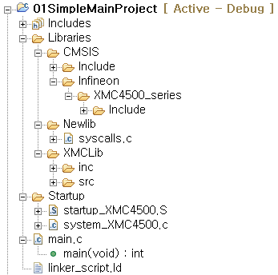
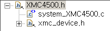
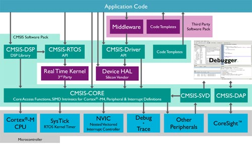
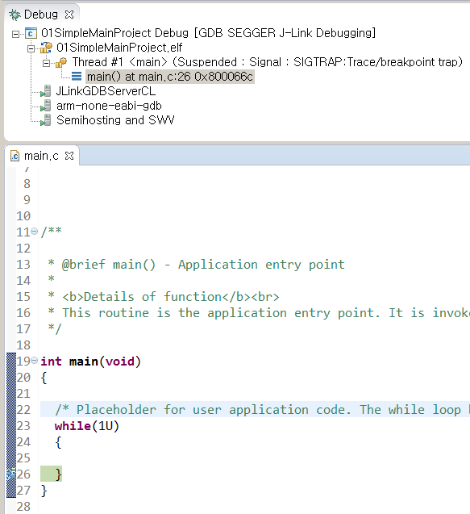
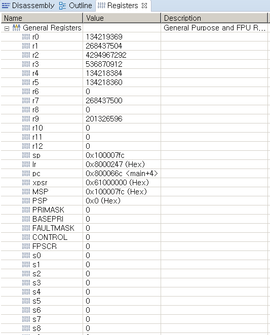
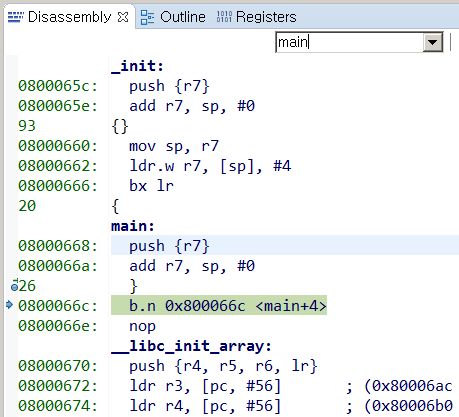
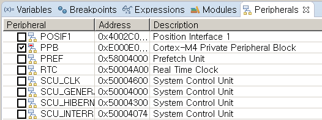
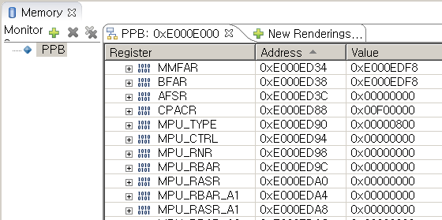

# Project Template

일반 프로그램을 개발할 경우에는 파일을 새로 생성하고 '#include <stdio.h>'과 'main()'을 입력하고 프로그래밍을 시작한다. 그러나 32bit 마이크로컨트롤러용 프로그램을 개발할 때 이와 같이 참고자료 없이 시작할 수는 없다. 마이크로컨트롤러 프로그래밍을 하기 위해서는 매우 복잡한 입출력 정보에 대하여 정확히 알고있어야 한다. 또한 전원을 인가한다 하더라도 바로 main 함수가 호출되어 실행되는 것이 아니라 매우 복잡한 전문적인 과정을 거쳐야 비로서 main 함수에 다다를 수 있게 된다.  
대부분의 마이크로컨트롤러 제조사들은 이러한 어려움을 덜어주기 위하여 개발자들이 활용할 수 있는 템플릿 형태의 예제들을 제공하고, 한걸음 나아가 프로젝트 생성기(보통 Project Wizard라 불리는)를 제공하여 간단한 설정으로 선택적으로 프로젝트템플릿을 구성할 수 있도록 도와주기도 한다. 이 단원에서는 Dave 가 제공하는 프로젝트 생성기의 예제 프로젝트 템플릿을 살펴보도록 한다. 이를 통하여 Cortex-M4를 위한 컴파일러, 링커의 설정에 대한 내용을 이해하여 활용할 수 있도록 한다.

추가적으로 **CpuSubsystem** 강좌에서 배운 CPU의 중요한 특징들이 어떻게 컴파일러와 링커에 반영되는지 확인한다. 아울러 프로젝트 템플릿을 활용하여 CPU의 기본 설정값들이 어떻게 설정되어 있는지 확인하도록 한다.

## 목적
* 프로젝트 템플릿을 분석하여 개발환경에 대한 이해도를 높인다.
  * 컴파일러와 링커의 설정을 분석한다.
  * 라이브러리의 구조를 파악한다.
* 프로젝트 템플릿과 개발환경을 활용하여 CPU의 특징을 파악한다.

## 참고자료
* Using the GNU Compiler Collection ver. 4.9.3 ([*DAVE_4*]\\eclipse\\ARM-GCC-49\\share\\doc\\gcc-arm-none-eabi\\pdf\\gcc\\gcc.pdf)
* The GNU linker ver. 2.24 ([*DAVE_4*]\\eclipse\\ARM-GCC-49\\share\\doc\\gcc-arm-none-eabi\\pdf\\ld.pdf)
* XMC Peripheral Library for XMC4000 Family (Dave Help)
* Newlib (https://en.wikipedia.org/wiki/Newlib)
* CMSIS - Cortex Microcontroller Software Interface Standard(http://www.arm.com/products/processors/cortex-m/cortex-microcontroller-software-interface-standard.php#)

## Project Template의 종류

새로운 프로젝트 생성 메뉴(File/New/DaveProject 선택)를 선택하면 다음의 그림과 같은 대화창이 나타나고 프로젝트의 성격을 선택하고 프로젝트 이름과 경로를 결정할 수 있도록 도와준다. 이 메뉴에서 다음의 4가지 프로젝트 템플릿중 사용자는 선택할 수 있다.
>  Simple Main Project  
>  Easy Start Project  
>  Dave CE Project  
>  Empty Project  


여기서 4번째 'Empty Project'의 경우는 관련 설정을 모두 사용자가 해야 하는 템플릿이므로 여기서 추가적인 설명은 제외하도록 하겠다. 각 프로젝트 템플릿의 중요한 특징을 살펴보면 다음과 같다.

* Simple Main Project  
    - 가장 기본적인 설정만 포함
    - 컴파일러, 링커의 설정
    - linker script
    - Start-up code
    - Libraries: CMSIS, Newlib, XMCLib
    - 비어있는 main.c 파일  

* Easy Start Project  
    - Simple Main Project 내용 + Libraries 를 활용하는 예제 코드 구성

* Dave CE Project  
    - Simple Main Project 내용 + Dave 생성 코드 포함

이 강좌에서는 **Simple Main Project** 를 중심으로 상세히 분석하고 살펴보고, 다른 템플릿들은 개략적인 특징만 살펴보도록 하겠다.

## Simple Main Project

프로젝트 생성기로 만들어진 **Simple Main Project** 를 살펴보면 여러개의 디렉토리와 파일들이 있다. 이것을 내용상으로 구분지어 보면 다음과 같다.

* 프로젝트 빌드와 관련된 정보들: 컴파일러 링커 설정과 Linker script
* C 프로그램을 사용할 수 있는 환경: Start-up, C library(Newlib), IO header
* 효율적인 개발을 위한 확장 library: CMSIS, XMCLib

### 디렉토리와 파일 구조
프로젝트 browser로 살펴본 디렉토리와 파일 구조이다.


* Includes: 프로젝트 헤더 파일들, gcc 헤더 파일들
* Libraries
    * CMSIS
        * Include: Cortex-M4 CMSIS 헤더 파일들
        * Infineon/XMC4500_series: XMC4500 헤더 파일들
    * Newlib: standard c library 사용을 위한 stub 코드
    * XMCLib: XMCLib C 파일과 헤더 파일
* Startup: Startup C 파일과 interrupt 처리용 S 파일
* *main.c* : 비어있는 main() 함수
* *linker_script.ld*: XMC4500용 linker 파일

### 컴파일러 링커 설정

프로그래밍하여 마이크로컨트롤러에 적합한 코드를 만들어 내기 위해서는 컴파일러, 어셈블러, 그리고 링커를
해당 마이크로컨트롤러에 적합하게 설정하여 주어야 한다. 이 정보들은 대부분 eclipse 에 기반을 둔 Dave의 프로젝트 설정 정보에서 관리를 하고 있다.  
메뉴 [Project/Propoerty] 를 선택하면 다음과 같은 대화창이 나타나고, 여기서 [C/C++ Build/Settings/] 를 선택하면 컴파일러, 어셈블러, 링커의 상세한 설정을 할 수 있다.

#### 컴파일러
컴파일러 설정 옵션을 메뉴를 통하여 모두 조정할 수 있다. 그러나 그 내용을 구체적으로 설명하기 위하여 명령창에 출력되는 option 을 기준으로 그 내용을 설명하도록 하겠다.

```
-DXMC4500_F144x1024
-I"D:\workspaces_DAVE\01SimpleMainProject\Libraries\XMCLib\inc"
-I"D:\workspaces_DAVE\01SimpleMainProject/Libraries/CMSIS/Include"
-I"D:\workspaces_DAVE\01SimpleMainProject/Libraries/CMSIS/Infineon/XMC4500_series/Include"
-I"D:\workspaces_DAVE\01SimpleMainProject"
-I"D:\workspaces_DAVE\01SimpleMainProject\Libraries"
-O0 -ffunction-sections -fdata-sections -Wall
-std=gnu99 -mfloat-abi=softfp -Wa,-adhlns="$@.lst"
-pipe -c -fmessage-length=0
-mcpu=cortex-m4 -mfpu=fpv4-sp-d16 -mthumb -g -gdwarf-2
```

`-DXMC4500_F144x1024`
  Preprocessor 에서 외부명령라인 `#define XMC4500_F144x1024`와 동등하다.

`-I"D:\workspaces_DAVE\...(중략)...\Libraries\XMCLib\inc"`  
  '-I"헤더파일이 있는 디렉토리 경로"'를 컴파일시 포함시켜 준다.

`-O0`  
  최적화 옵션으로 다음중에 선택 -O0(None), -O1(more), -O2(most), -Os(size), -Og(debugging)
`-ffunction-sections`  
`-fdata-sections`  
  함수와 data를 각각의 섹션으로 만들어 출력파일에 위치시킨다.

`-Wall`  
  All warning

`-std=gnu99`  ISO C99 with GNU Extention  

* 다음의 C 표준 중에 선택
    * ISO C90 (-ansi)
    * ISO C90 with GNU Extensions (Default)
    * ISO C99 (-std=c99)
    * ISO C99 with GNU Extensions (-sdt=gnu99)
    * ISO C11 (-std=c11)
    * ISO C11 with GNU Extensions (-sdt=gnu11)

`-mfloat-abi=softfp`  

* 다음의 실수연산 방식 중에 선택
    * mfloat-abi=soft : 소프트웨어 실수 연산을 사용하는 코드 생성
    * mfloat-abi=softfp : 하드웨어 실수 연산 명령 사용, 소프트웨어 실수 연산 호출 규칙 사용
    * mfloat-abi=hard : 하드웨어 실수 연산 명령 사용, FPU-specific 한 호출 규칙 사용

`-Wa,-adhlns="$@.lst"`  

* -Wa: Assembler 로 option 전달
* -adhlns="@.lst"

`-pipe`  
  컴파일 도중 임시파일을 생성하지 말고 pipe 를 사용

`-c`  
  자동으로 linker를 수행하지 않게 한다.

`-fmessage-length=0`  
  에러 메세지 출력시 허용하는 컬럼 글자수.
  이 글자를 넘으면 개행한다.
  0으로 설정하면 자동개행 없이 한 에러 메세지가 한줄에 표시된다.

`-mcpu=cortex-m4`  
  타겟 프로세서를 명시

`-mfpu=fpv4-sp-d16`  
  타겟에서 사용할 수 있는 FPU를 명시

`-mthumb`  
  -marm 과 -mthumb 중에 선택적으로 사용

`-g`  
  debugging 을 위한 정보 생성
`-gdwarf-2`  
  디버깅 정보의 포맷

* ABI(Application Binary Interface) 과 실수연산 관련 레지스터

#### 어셈블러

```
-x assembler-with-cpp -DXMC4500_F144x1024
-I"D:\workspaces_DAVE\01SimpleMainProject\Libraries\XMCLib\inc"
-I"D:\workspaces_DAVE\01SimpleMainProject"
-Wall -Wa,-adhlns="$@.lst"
-mfloat-abi=softfp -c -fmessage-length=0
-mcpu=cortex-m4 -mfpu=fpv4-sp-d16 -mthumb -g -gdwarf-2
```

`-x assembler-with-cpp`  
  파일 확장자에 근거하여 컴파일러의 종류를 선택하는 것이 아니라 구체적으로 입력파일의 종류를 명시 (ex c, c-header, objective-c, assembler-with-cpp, etc.)

#### 링커

```
-T"../linker_script.ld" -nostartfiles -Xlinker --gc-sections -specs=nano.specs
-specs=nosys.specs -Wl,-Map,"01SimpleMainProject.map" -mfloat-abi=softfp  
-mfpu=fpv4-sp-d16 -mcpu=cortex-m4 -mthumb -g -gdwarf-2  
```
`-T"../linker_script.ld"`
  링커 파일 명시

`-nostartfiles`
  표준 시작 파일 사용하지 않음

`-Xlinker` `--gc-sections`
  사용하지 않는 섹션을 삭제

`-specs=nano.specs`
`-specs=nosys.specs`
  specs=*filename* 은 filename 을 읽어들여 gcc의 설정을 override 하는 기능  
  nano.specs 은 Newlib-nano 를 사용하기 위한 설정  
  nosys.specs 은 gcc system lib를 사용하지 않는 설정

`-Wl,-Map,"01SimpleMainProject.map"`
  -Wl 은 링커로 다음에 오는 옵션을 전달  
  -Map,"filename" filename으로 map 파일 생성

### Linker script
(참고) linker, linker script, startup 관련 설명은 *Linker&Startup* 부분에서 별도 상세 설명  

* linker script 파일의 개요를 살펴보면 다음과 같다.  
  * .text 영역: code와 read-only 값이 들어가는 영역
  * .data 영역: 전역변수 영역
  * .bss 영역: 동적할당 변수 영역
  * Stack 영역: 스택 사용 영역


`linker_script.ld`

```
OUTPUT_FORMAT("elf32-littlearm")
OUTPUT_ARCH(arm)
ENTRY(Reset_Handler)

MEMORY
{
	FLASH_1_cached(RX) : ORIGIN = 0x08000000, LENGTH = 0x100000
	FLASH_1_uncached(RX) : ORIGIN = 0x0C000000, LENGTH = 0x100000
	PSRAM_1(!RX) : ORIGIN = 0x10000000, LENGTH = 0x10000
	DSRAM_1_system(!RX) : ORIGIN = 0x20000000, LENGTH = 0x10000
	DSRAM_2_comm(!RX) : ORIGIN = 0x30000000, LENGTH = 0x8000
}

stack_size = DEFINED(stack_size) ? stack_size : 2048;
no_init_size = 64;

SECTIONS
{
  .text :
  {
          ...(omitted)...
  } > FLASH_1_cached AT > FLASH_1_uncached
          ...(omitted)...
  /* DSRAM layout (Lowest to highest)*/
  Stack (NOLOAD) :
  {
          ...(omitted)...
  } > PSRAM_1

  .ram_code :
  {
          ...(omitted)...
  } > PSRAM_1 AT > FLASH_1_uncached

  PSRAM_DATA :
  {
          ...(omitted)...
  } > PSRAM_1 AT > FLASH_1_uncached

  PSRAM_BSS (NOLOAD) :
  {       ...(omitted)...
  } > PSRAM_1

  .data :
  {
          ...(omitted)...
  } > DSRAM_1_system AT > FLASH_1_uncached

  .bss (NOLOAD) :
  {
        ...(omitted)...
  } > DSRAM_1_system
        ...(omitted)...

  .no_init ORIGIN(DSRAM_1_system) + LENGTH(DSRAM_1_system) - no_init_size (NOLOAD) :
  {
          ...(omitted)...
  } > DSRAM_1_system

  DSRAM2_DATA :
  {
          ...(omitted)...
  } > DSRAM_2_comm AT > FLASH_1_uncached

  DSRAM2_BSS (NOLOAD) :
  {
          ...(omitted)...
  } > DSRAM_2_comm

}

```

### Start-up


* [startup_XMC4500.s]  
    - vector table 내용

```
.section .reset, "a", %progbits

.align 2
.globl  __Vectors
.type   __Vectors, %object
__Vectors:
.long   __initial_sp                /* Top of Stack                 */
.long   Reset_Handler               /* Reset Handler                */

Entry   NMI_Handler                 /* NMI Handler                  */
Entry   HardFault_Handler           /* Hard Fault Handler           */
  ...(이하생략)

```
* [system_XMC4500.c]
    - device 초기화
    - 프로그램 로딩
    - user application 호출

### IO header
* /Libraries/CMSIS/Infineon/XMC4500_series/Include/XMC4500.h
    * I/O Peripheral에 대한 register 수준의 정의
    * 다른 상위 라이브러리에서 이 파일을 참고하여 사용



### Library
XMC4500의 프로그래밍을 위하여 다음의 3개의 라이브러리를 제공한다.  

* Newlib
* CMSIS
* XMCLib

#### Newlib

* embedded system을 위한 C standard library
* 최초에 GNU cross-development 를 위한 개발환경의 일부로 개발되었다.
* 마이크로컨트롤러와 연관된 부분의 system call 파트는 mcu에 맞게 개별적으로 구현하여야 한다.
    * (/libraries/Newlib/syscalls.c)

#### CMSIS


* Cortex 마이크로컨트롤러의 소프트웨어 개발을 돕기위한 라이브러리
* CMSIS-CORE로 부터 시작하여 다양한 용도로 라이브러리가 확장되어 있음
* XMC4500 에서는 CORE 라이브러리만 기본으로 포함되어 있음

* /Libraries/CMSIS/Include/core_cm4.h  
    * CMSIS-CORE를 활용하기 위한 최상위 헤더파일
* core_cmInstr.h
    * Core instruction 접근을 위한 정의
    * ex) \_\_NOP(void), \_\_SEV(void), \_\_SSAT(ARG1, ARG2)
* core_cmFunc.h
    * Core Function 접근을 위한 정의
    * ex) \_\_enable_irq(void), \_\_disable_irq(void), \_\_get_MSP(void)
* core_cmSimd.h
    * Cimpiler specific SIMD Intrinsics 명령 정의

#### XMCLib
다음 절의 **Easy Start Project** 에서 상세히 설명

### CpuSubsystem에 대한 확인
SimpleMain Project 템플릿으로 생성된 프로젝트를 아무런 조작 없이 빌드 한 후 디버거로 연결하여 XMC 레지스터들과 CpuSubsystem의 설정 값을 확인해 보도록 하자.

1. Debug 연결

특별한 설정없이 디버거를 연결하여 프로젝트를 다운로드 시키면 다음과 같이 디버거 연결상태가 된다.



2. Register 값 확인

레지스터영역을 확인하면 다음과 같다.



* General-purpose Registers
    * r0~r12 까지 레지스터들: 0이 아닌 다른 값을 가지고 있다. 이것은 Startup code 가 실행되며 디바이스 초기화, 전역변수 초기화와 같은 동작을 수행하였기 때문이다.
* sp(r13): 0x100007fc 로 초기화 되어 있다. 이 번지는 PSRAM_1 섹션에 있다
* pc(r15): 0x0800066c 로 초기화 되어 있다. 이 번지는 main 함수 내부가 시작되는 번지 이다.
    * 아래 그림과 같이 Disassembly 창을 통하여 번지와 어셈블리코드를 확인할 수 있다.



* PRIMASK, BASEPRI, FAULTMASK, CONTROL Registers 는 모두 0으로 초기화 된다.

* FPSCR, s0~s31
    * 실수연산과 관련된 상태 레지스터와 연산 레지스터는 모두 0으로 초기화 된다.

* PPB(Private peripherals base) Registers
    * Peripherals 창에서 PPB를 선택하면 다음의 그림과 같이 메모리 창에서 해당 레지스터의 값을 출력하여 준다.






## Easy Start Project

이 템플릿에서는 Device 레지스터를 직접 조작하여 프로그래밍 하는 예를 제공한다.  

* 시스템 클락을 설정하고
* ADC를 초기화 하고
* Port를 통하여 LED를 토글한다.

직접 레지스터를 조작하는 함수를 만들고 이를 호출하여 동작시킨다.  기능이 간단한 DIO의 예를 살펴보면 다음과 같다.

```
...
#include "GPIO.h"
...
int main(void)
{
  ...
	/* Configure P3.9 (LED) */
	// P3.9 is used as GPIO for LED indication. Macros can be find in GPIO.h
	P3_9_set_mode(OUTPUT_PP_GP);
	P3_9_set_driver_strength(STRONG);
	P3_9_reset();
  ...
	/* Infinite loop */
	for(;;){
    ...
		P3_9_toggle();
                                       // toggle P3.9 (toggle LED) using GPIO.h macros
    ...
	}
	return 0;
}
```

GPIO.h 파이에 위의 함수들과 사용되는 매크로등이 정의 되어 있다.

```
#include <XMC4500.h>
...
#define INPUT_INV_PPS   0x38U
#define OUTPUT_PP_GP    0x80U
#define OUTPUT_PP_AF1   0x88U
...
#define WEAK            0x7UL
#define MEDIUM          0x4UL
#define STRONG          0x2UL
#define VERYSTRONG      0x0UL
...
__STATIC_INLINE void P3_9_set_mode(uint8_t mode){
    PORT3->IOCR8 &= ~0x0000f800UL;
    PORT3->IOCR8 |= mode << 8;
}

__STATIC_INLINE void P3_9_set_driver_strength(uint8_t strength){
    PORT3->PDR1 &= ~0x00000070UL;
    PORT3->PDR1 |= strength << 4;
}

__STATIC_INLINE void P3_9_set_hwsel(uint32_t config){...}

__STATIC_INLINE void P3_9_set(void){
    PORT3->OMR = 0x00000200UL;
}

__STATIC_INLINE void P3_9_reset(void){...}

__STATIC_INLINE void P3_9_toggle(void){
    PORT3->OMR = 0x02000200UL;
}
```

위의 코드에서 보는 바와 같이 레지스터를 직접 접근하여 프로그래밍 하는 방법은 레지스터의 정확한 정보와 정의를 하드웨어 매뉴얼을 직접 확인하고 디바이스의 헤더 파일을 직접 참고하여야 한다.  그러므로 정확한 하드웨어의 정보와 이해를 필요로 하므로 초보 혹은 중급 프로그래머에게는 적합하지 않은 방법이다.

## Dave CE Project
Getting Started 프로젝트에서 하였던 바와 같이 Dave APP을 적극적으로 활용할 경우 사용하는 템플릿이다.  이 템플릿을 사용할 경우 필요한 APP을 개발자가 직접 추가하고 이를 GUI를 통하여 설정하여 사용하도록 하고 있다. 이 방법을 사용하여 마이크로컨트롤러의 구체적인 정보를 추상화하여 이해하고 활용할 수 있다.  그러므로 XMC4000 패밀리의 마이크로컨트롤러를 처음 접하는 사용자에게 적합한 템플릿이라 할 수 있다.

Main.c 파일을 살펴보면 Dave를 사용하여 하드웨어를 초기화 한 후 사용자 프로그램이 위치할 수 있는 무한루프 영역이 다음의 코드와 같이 주어 진다.

```
#include <DAVE.h> //Declarations from DAVE Code Generation (includes SFR declaration)

int main(void)
{
  DAVE_STATUS_t status;
  status = DAVE_Init();           /* Initialization of DAVE APPs  */
  if(status != DAVE_STATUS_SUCCESS)
  {
    /* Placeholder for error handler code. The while loop below can be replaced with an user error handler. */
    XMC_DEBUG("DAVE APPs initialization failed\n");

    while(1U)
    {

    }
  }

  /* Placeholder for user application code. The while loop below can be replaced with user application code. */
  while(1U)
  {

  }
}

```


## 요약
