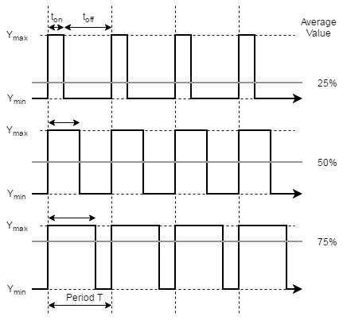
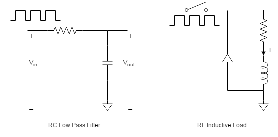
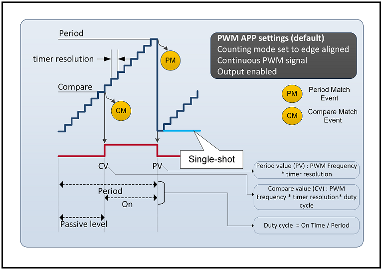
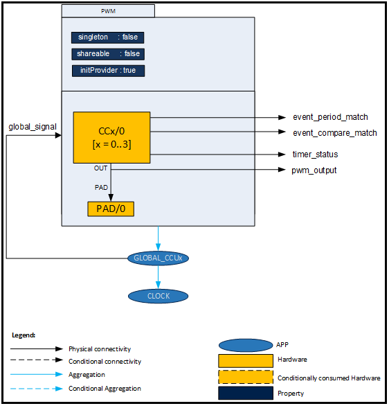
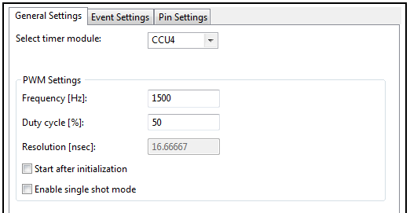
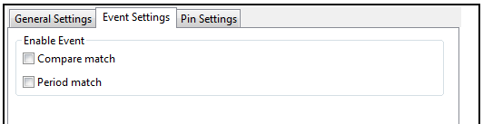
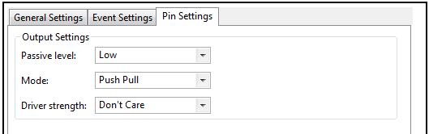

# Pwm Basic

## 목적
* PWM의 동작 원리를 이해하고 XMC4500의 PWM 기본 동작 방법을 습득한다.

## 참고자료

* [XMC4500 Reference Manual v1.5 2014-04]
    - xmc4500_rm_v1.5_2014_04.pdf
* [XMC4500 Data Sheet v1.4 2016-01]
    - Infineon-XMC4500-DS-v01.04-EN.pdf
* [PWM] (DAVE APP on-line help)

## PWM의 동작 원리

* PWM 이란?
  펄스 폭 변조 (PWM) 또는 펄스 지속 변조 (PDM)는 아날로그 값을 펄스 신호로 인코딩하는 데 사용되는 변조 기술이다. 이 변조 기술은 전송을 위해 정보를 인코딩하는 데 사용할 수 있다. 또한 전기 장치(특히 모터와 같은 관성 부하)에 공급되는 전원을 제어 하는 경우에도 일반적으로 사용할 수 있다. 전원과 부하 사이의 스위치를 빠른 속도로 켜고 끄면 부하에 공급되는 전압(및 전류)의 평균값을 제어할 수 있다. 오프 기간에 비해 온 기간이 길수록 부하에 공급되는 전압(및 전류)이 높아진다.

* 듀티 싸이클(Duty Cycle)
  듀티 사이클이라는 용어는 일정한 간격 또는 '기간'에 대한 '켜짐'시간의 비율을 나타낸다. 낮은 듀티 사이클은 대부분의 시간 동안 전원이 꺼져 있기 때문에 저전력에 해당한다. 일반적으로 듀티 사이클은 백분율로 표시하며, 100 %가 된다면 스위치가 완전해 켜져있는 경우를 의미한다. PWM 파형의 듀티 사이클에 따라 그림에 표시된 것처럼 평균값이 있다. on time, $$(t_{on})$$이 작으면 평균값이 낮고, 클 경우 평균값이 높아진다. 듀티 사이클, $$D$$을 제어함으로써이 평균값을 제어할 수 있게된다. PWM을 사용할 때 우리가 일반적으로 관심을 갖는 것은 이 평균이다.




$$
D = \frac{t_{on}}{T} \times 100% 
$$

펄스 파형 $$f(t)$$, 주기 $$T$$, 하한값 $$Y_{min}$$, 상한값 $$Y_{max}$$, 그리고 듀티싸이클 $$D$$라 하면, 파형의 평균값은 다음과 같이 된다.

$$
\bar{y}=\frac{1}{T}\int_{0}^{T}f(t)dt 
$$

$$f(t)$$ 파형이 $$0<t<D\times T$$ 동안 $$Y_{max}$$ 값을 유지하고, $$D\times T < t < T$$ 동안 $$Y_{min}$$  값을 유지하게 되므로 위의 평균값의 식은 다음과 같이 된다.

$$
\begin{aligned}
\bar{y} &=\frac{1}{T}\left \{  \int_{0}^{D \cdot T}Y_{max}dt+ \int_{D \cdot T}^{T}Y_{min}dt \right \} \\
&= \frac{1}{T}\left \{D\cdot T\cdot Y_{max}+(1-D)\cdot T\cdot Y_{min}\right \} \\
&= D \cdot Y_{max} + (1-D)\cdot Y_{min}
\end{aligned}
$$


만약 $$Y_{min} = 0$$ 라면 위의 평균값은

$$
\bar{y} = D \cdot Y_{max}
$$

로 간단하게 표현된다. 이 경우에는 신호의 평균값 $$\bar{y}$$ 이 듀티싸이클 $$D$$ 와 직접적으로 비례하는 관계를 갖게 된다.



* RC 저역통과 필터  
  PWM 스트림에서 여러 가지 방법 평균값을 추출 할 수 있다. 전기적으로, 저역 통과 필터, 예를 들면 저항-캐패시터 조합,을 사용할 수있다. 이 경우, PWM 주파수와 R 및 C의 값이 적절하게 선택하면, Vout은 아날로그 출력이되고, PWM 및 필터의 조합은 간단한 DAC와 같은 역할을 할 수있다.

* RL 인덕티브 부하  
  다른 예로, 유도 부하에 흐르는 전류를 PWM 방식으로 스위칭하면 인덕턴스에 흐르는 평균적인 전류양을 조정할 수 있다. 일반적인 모터의 권선은 이 예와 같이 인덕티브이기 때문에, PWM을 사용한 모터 제어 방법은 매우 중요하다. 실제의 경우에 PWM을 하는 스위치로는트랜지스터를 사용한다. 인덕티브 부하와 병렬로 연결되어 있는 다이오드는 Free-wheeling 다이오드라고 불리며, 스위치가 Off 되었을 때 전류의 경로를 만들어 줄 수 있게 하여 시스템을 보호하는 역할을 한다.  DC 모터의 제어는 로봇 공학에서 매우 필수적인 기술이다. DC 모터의 속도는인가 된 DC 전압에 비례한다. 기존의 DAC 출력을 사용하여 값 비싸고 부피가 큰 전력 증폭기를 통해 구동하고 앰프 출력을 사용하여 모터를 구동 할 수도 있다. 대안으로, 그림에서와 같이 PWM 신호를 사용하여 전력 트랜지스터를 직접 구동할 수 있다. 이 기술은 전력 전자 분야에서 일반적으로 많이 사용되고 있다.

* 일반적 물리 시스템과 필터링  
  실제로,이와같은 전기적 필터링이 항상 필요한 것은 아니다. 많은 물리적 시스템에는 내부적으로 관성이 있어, 실제로는 저역 통과 필터처럼 작동합니다. 예를 들면, PWM을 사용하여 기존 필라멘트 전구 혹은 LED 의 밝기를 조정할 수 있다.

* PWM 스위칭 주파수  
  PWM 스위칭 주파수는 부하(전원을 사용하는 장치)에 영향을주는 것보다 훨씬 높아야한다. 즉 부하에 의해 감지되는 결과 파형은 가능한 한 원활해야한다. 전원 공급 장치의 스위치를 전환하는 속도(또는 주파수)는 부하의 전기적인 특성과 응용 분야에 따라 크게 달라질 수 있습니다. 예를 들어 전기 스토브의 경우에는 1 분에 여러 번 스위칭해야 하고, 램프 조광기에서 120 Hz, 모터 드라이브의 경우 수 킬로 헤르츠 (kHz)에서 수십 kHz 의 범위에서 스위칭 해야한다. 오디오 증폭기 및 컴퓨터 전원 공급 장치의 수십 또는 수백 kHz에서 동작해야 한다.

* PWM의 장점 및 용도  
  PWM은 또한 온 / 오프 특성으로 인해 필요한 듀티 사이클을 쉽게 설정할 수있어 마이크로컨트롤러의 활용시 쉽게 활용할 수 있다.
  PWM의 주된 이점은 스위칭 장치의 전력 손실이 매우 낮다는 것이다. 스위치가 꺼져있을 때는 거의 전류가 흐르지 않고 켜져 있고 전력이 부하로 전달 될 때 스위치에 걸리는 전압 강하는 거의 없게된다. 따라서 전압과 전류의 곱인 전력 손실은 두 경우 모두 0에 가깝게 된다.
  PWM은 통신 채널을 통해 정보를 전달하기 위해 듀티 사이클이 사용 된 특정 통신 시스템에서도 사용된다.

## DAVE APP (DIGITAL_IO)

### XMC4500 의 중요 특징
XMC4500에는 CCU4(Capture Compare Unit 4)와 CCU8(Capture Compare Unit 8)라는 타이머 모듈이 있다. PWM을 사용할 때 이 두가지 모듈을 사용하는 것이다. 어떤 모듈을 선택하느냐에 따라서 정밀도와 포트핀의 위치 등이 바뀔 수 있으나 일반적인 PWM에서는 큰 성능의 차이는 없다.  CCU4와 CCU8의 상세한 기능은 별도의 자료를 통하여 상세히 설명하도록 하고, 여기서는 하드웨어적인 특징을 간략화하고 PWM의 활용에 대하여서만 설명하도록 하겠다.

### 개략(Overview)

PWM APP은 CCU4 와 CCU8 모듈을 사용하여 다음의 기능을 제공한다.

* PWM 주파수와 듀티싸이클을 설정할 수 있다.
* 최적의 PWM 분해능을 얻기 위하여 PWM에서 사용하는 타이머의 주기를 계산해 준다. 이 타이머는 내부적으로 prescaler를 가지고 있는 16비트 카운터이다.
* PWM은 프로그램 초기화시에 시작될 수도 있고, `PWM_Start()` 을 사용하여 사용자가 시작하게 할 수도 있다.
* PWM이 single-shot 모드로 1회만 동작하게 하거나 continuous 모드로 계속적으로 동작시킬 수 있다.
* PWM의 출력을 GPIO 로 연결할 수도 있고, 내부연결을 통하여 다른 모듈에 연결할 수도 있다.



CCU 모듈은  prescaler가 제공하는 클럭 펄스를 카운트하는 내부 카운터를 시작한다. 카운트가 비교 일치 값(CV, Compare Value)에 도달하면 PWM 출력 상태가 비활성 상태에서 활성 상태로 변경된다. 타이머는 여전히 비교일치(CM, Compare Match) 이벤트가 발생한 후에도 카운트를 계속한다. 카운트 값이 주기일치 값(PV, Period Value)에 도달하면 PWM 출력 상태는 비활성 상태로 되돌아갑니다. 따라서 PWM의 한 사이클을 완료합니다. Single-Shot 모드를 선택하지 않으면 이 사이클을 계속 반복한다. Single-Shot 모드가 선택되면 PWM은 비활성상태로 유지되고 타이머는 작동을 멈춘다.
  주기일치(PM) 값은 주파수에 따라 계산되고 비교일치(CM)는 듀티 사이클을 기반으로 계산한다. PWM 출력 상태는 주기일치와 비교일치에 따라서 변경된다.

**[Example]**

Clock = 120 MHz, Prescaler = 0, PWM frequency(F)=100KHz, Duty(D) = 30% 일때 주기 일치 값과 비교 일치 값을 구해보자.

$$
\begin{aligned}
PV &= \frac{Clock}{(1<<Prescaler) \times F}  \\
&= \frac{120M}{1 \times 100K} \\
&= 1200
\end{aligned}
$$

$$
\begin{aligned}
CV &= \frac{PV \cdot (100 - D)}{100}  \\
&= \frac{1200 \cdot (100 - 30)}{100}  \\
&= 840
\end{aligned}
$$

!(Note) 실제 Period 레지스터에 들어가는 값은 (PV - 1) 인 1999 이다.
### 아키텍쳐(Architecture)



그림은 PWM APP의 내부 소프트웨어 아키텍처를 보여준다. PWM APP 인스턴스는 그림과 같이 속성이 고정 된 DAVE ™ 프로젝트에 존재하며 PWM 신호를 생성하기 위해 CCU 주변 장치를 사용한다. 또한 GLOBAL_CCUx (x = 4, 8) 및 CLOCK APPS의 구성 및 작동에 의존적이다. PWM APP을 사용하여 주변 장치 연결을 위한 출력 신호를 만들어 낼 수도 있다.

인스턴스 생성 된 APP (코드 생성 후)는 GUI 구성을 사용하여 특정 데이터 구조를 생성한다. APP 인스턴스 레이블(예 : 기본 PWM_0에서 dh_PWM_0 등으로 레이블 변경)을 변경할 수 있습니다.

* Signals

| Signal Name         | Input/Output | Availability | Description                              |
| ------------------- | ------------ | ------------ | ---------------------------------------- |
| event_period_match  | Output       | Always       | INTERRUPT APP 에 연결하여 주기일치 이벤트가 발생할 때 인터럽트를 발생시킬 수 있다. |
| event_compare_match | Output       | Always       | INTERRUPT APP 에 연결하여 비교일치 이벤트가 발생할 때 인터럽트를 발생시킬 수 있다. |
| timer_status        | Output       | Always       | 타이머 상태 정보로서 다른 모듈의 트리거 정보로 연결할 수 있다.     |
| pwm_output          | Output       | Always       | 패드핀과 연결하여 외부 출력으로 사용할 수 있다.              |
| global_signal       | Input        | Always       | GLOBAL_CCUx APP 과 연결                     |

### 설정(Configuration)



* Select timer modules:
    * CCU4: CCU4의 슬라이스 한개를 사용한다.
    * CCU8: CCU8의 슬라이스 한개를 사용한다.
* PWM Settings: frequency
    * 사용자가 설정한 주파수를 맞추기 위하여 최적의 prescaler 값을 설정하고 주기일치값을 설정한다.
* PWM Settings: Duty Cycle
    * 사용자가 설정한 듀티싸이클을 맞추기 위하여 최적의 비교일치값을 설정한다.
    * [0.0 ~ 100.0]
* PWM Settings: Resolution[nsec]:
    * 타이머의 실제 최소 분해능
    * [8.33 ~ 273066.6]
* PWM Settings: Start after initialization
    * 시작과 함께 자동으로 PWM 수행 시작
* PWM Settings: Enable single shot mode
    * Enable 되었을 때 PWM이 한번만 동작하고 타이머가 멈추게 된다.



* Enable Event: Compare match
    * 비교 일치 이벤트 발생여부 설정
    * 선택되었을 때 이벤트가 발생하게 되면 Service Request를 통하여 인터럽트 펄스를 발생하게 된다.(NOTE) 이것을 사용하려면 INTERRUPT APP에 연결하여야 한다.
* Enable Event: Period match
    * 주기 일치 이벤트 발생여부 설정
    * 선택되었을 때 이벤트가 발생하게 되면 Service Request를 통하여 인터럽트 펄스를 발생하게 된다.(NOTE) 이것을 사용하려면 INTERRUPT APP에 연결하여야 한다.



* Output Settings: Passive level
    * LOW: 비교일치 이전까지 LOW 로 있다가 비교일치 이후에 HIGH로 출력
    * HIGH: 비교일치 이전까지 HIGH 로 있다가 비교일치 이후에 LOW로 출력
* Output Settings: Mode
    * Push Pull: 외부의 Pull-up/Pull-down 없이 LOW/HIGH 출력
    * Open Drain: 외부에 Pull-up 저항을 연결하여 사용
* Output Settings: Driver Strength
    * Weak Driver/Medium Driver/Strong Driver Soft Edge/String Driver Slow Edge/Strong Driver Sharp Edge/Strong Driver Medium Edge
    * *Digital IO 참고*

### 자료구조

PWM 관련 설정 정보를 관리하기 위하여 `PWM_HandleType` 구조체를 활용하여 `PWM_t` 자료형을 사용하고 있다.  이 구조체에는 PWM Configuration 과 관련된 정보들을 담고 있고, 의존성이 있는 CCU4 와 CCU8 의 연결 정보등을 담고 있다.

```
typedef struct PWM_HandleType
{
  XMC_GPIO_PORT_t		  *const  gpio_out_port;    /**< Holds the port number for the PWM output*/
  const XMC_GPIO_CONFIG_t *const  gpio_out_config;  /**< Holds the pin configuration for the PWM output*/
  uint32_t                compare_value; /**< Value that is pushed into the compare register*/
  uint32_t                period_value;  /**< Value that is pushed into the period register*/
  uint32_t                duty_cycle;    /**< Value of duty cycle that is scaled with a factor 100*/
  uint32_t                shadow_mask;    /**< Holds the required shadow mask.*/
  const PWM_TIMER_SLICE_t  timer_type;    /**< Type of CCU selected for the PWM generation */
  PWM_STATUS_t            state;         /**< The current state of the PWM App instance*/
  const uint8_t gpio_out_pin;         /**< Holds the pin number for the PWM output*/
  const uint8_t kernel_number;        /**< Indicates the CCUx kernel number*/
  const uint8_t slice_number;         /**< Indicates the CCUx slice number*/
  const bool    start_control;        /**<Enable/disable start of PWM after initialization*/
  const bool    period_match_enable;  /**< Enable/Disable Period match interrupt*/
  const bool    compare_match_enable; /**< Enable/Disable Compare match interrupt*/

	GLOBAL_CCU4_t *const global_ccu4_handle; /**< GLOBAL_CCU4 App handle */
	GLOBAL_CCU8_t *const global_ccu8_handle; /**< GLOBAL_CCU8 App handle*/
  XMC_CCU4_MODULE_t *const ccu4_kernel_ptr;  /**< Pointer to CCU4 kernel*/
  XMC_CCU8_MODULE_t *const ccu8_kernel_ptr;  /**< Pointer to CCU8 kernel*/
  XMC_CCU4_SLICE_t *const ccu4_slice_ptr;  /**< Pointer to CCU4 slice*/
  XMC_CCU8_SLICE_t *const ccu8_slice_ptr;  /**< Pointer to CCU8 slice*/
  const XMC_CCU4_SLICE_COMPARE_CONFIG_t *const ccu4_slice_config_ptr;   /**< Pointer to CCU4 configuration handle*/
  const XMC_CCU8_SLICE_COMPARE_CONFIG_t *const ccu8_slice_config_ptr;   /**< Pointer to CCU8 configuration handle*/
  const XMC_CCU4_SLICE_SR_ID_t           ccu4_slice_period_match_node;  /**< SR node line for period match */
  const XMC_CCU8_SLICE_SR_ID_t           ccu8_slice_period_match_node;  /**< SR node line for period match */
  const XMC_CCU4_SLICE_SR_ID_t           ccu4_slice_compare_match_node;  /**< SR node line for period match */
  const XMC_CCU8_SLICE_SR_ID_t           ccu8_slice_compare_match_node;  /**< SR node line for period match */

} PWM_t;
```

PWM 관련 동작을 프로그래밍 하기 위한 열거형 자료형들은 다음과 같다.
```
/** @brief The type identifies the timer interrupts. */
typedef enum PWM_INTERRUPT
{
  PWM_INTERRUPT_PERIODMATCH 	 = 0U,		/**< Period match interrupt while counting up */
  PWM_INTERRUPT_COMPAREMATCH	 = 2U    	/**< Compare match interrupt while counting up */
} PWM_INTERRUPT_t;

/** @brief The type identifies the timer interrupts. */
typedef enum PWM_OUTPUT_PASSIVE_LEVEL
{
  PWM_OUTPUT_PASSIVE_LEVEL_LOW  = 0, /**< Passive level = Low */
  PWM_OUTPUT_PASSIVE_LEVEL_HIGH    , /**< Passive level = High */
  PWM_OUTPUT_PASSIVE_LEVEL_MAX
} PWM_OUTPUT_PASSIVE_LEVEL_t;

/** @brief The type identifies App state. */
typedef enum PWM_STATUS
{
  PWM_STATUS_SUCCESS = 0,    /**< APP is initialized as per selected parameters */
  PWM_STATUS_FAILURE,   	     /**< APP initialization function failure */
  PWM_STATUS_UNINITIALIZED,      /**< default state after power on reset */
  PWM_STATUS_RUNNING,            /**< CCU slice is running in PWM mode */
  PWM_STATUS_STOPPED,            /**< CCU slice timer is stopped */
} PWM_STATUS_t;

/** @brief The type identifies the App Error Codes. */
typedef enum PWM_ERROR_CODES
{
  PWM_OPER_NOT_ALLOWED_ERROR = 1,  /**< if the current API operation is not possible in the given state */
  PWM_INVALID_PARAM_ERROR          /**< the parameters passed to an API are invalid */
} PWM_ERROR_CODES_t;
```

### 메쏘드(Method)

* PWM APP을 초기화하고, 현재의 동작상태를 검사하고, 시작/중지한다.

    `PWM_STATUS_t PWM_Init(PWM_t *const handle_ptr);`

    `void PWM_Start(PWM_t *const handle_ptr);`

    `void PWM_Stop(PWM_t *const handle_ptr);`

    `bool PWM_GetTimerStatus(PWM_t *const handle_ptr);`
    * 타이머가 동작중인지 대기상태(idle)인지 확인

* PWM의 주기와 듀티싸이클 값 등을 설정한다. 아울러 핀의 출력 상태 또한 설정한다.

    `PWM_STATUS_t PWM_SetFreq(PWM_t *const handle_ptr, uint32_t pwm_freq_hz);`

    `PWM_STATUS_t PWM_SetDutyCycle(PWM_t *const handle_ptr, uint32_t duty_cycle);`
    * duty_cycle [unit: 0.01%]

    `PWM_STATUS_t PWM_SetFreqAndDutyCycle(PWM_t *const handle_ptr, uint32_t pwm_freq_hz, uint32_t duty_cycle);`

    `PWM_STATUS_t PWM_SetPeriodMatchValue(PWM_t *const handle_ptr, uint32_t period_match_value);`
    * period_match_value: 주기일치 레지스터에 직접적으로 쓰는 값

    `void PWM_SetPassiveLevel(PWM_t *const handle_ptr, PWM_OUTPUT_PASSIVE_LEVEL_t pwm_output_passive_level);`
    * pwm_output_passive_level: PWM_OUTPUT_PASSIVE_LEVEL_HIGH/LOW

* Event와 관련된 상태를 읽고 Event 플래그를 초기화 한다.

    `void PWM_ClearEvent(PWM_t *const handle_ptr, PWM_INTERRUPT_t pwm_interrupt);`
    * PWM 관련 인터럽트 플래그를 clear 한다.
    * pwm_interrupt: PWM_INTERRUPT_PERIODMATCH or PWM_INTERRUPT_COMPAREMATCH

    `bool PWM_GetInterruptStatus(PWM_t *const handle_ptr, PWM_INTERRUPT_t pwm_interrupt);`

### 사용예

* PWM Output 설정
  DAVE 로 PWM APP 을 설정하면 PWM_t 자료 구조에 따라 레이블명으로 다음과 같은 구조체가 생성된다. 이 구조체에는 PWM의 클럭소스에 대한 설정(.shadow_mask), 주기일치값(.period_value), 비교일치값(.compare_value) 등의 값과 함께 CCU 관련된 자료 설정(.global_ccu_handle, .ccu4_kernel_ptr, .ccu4_slice_ptr)과 출력핀에 대한 설정(.gpio_out_port) 등의 정보도 가지고 있다.  타이머 동작에 대한 보다 상세한 설정을 관리하기 위하여 dhPWM_0_compare_config 구조체와 GPIO 핀에 대한 설정 정보를 가지고 있는 dhPWM_0_gpio_out_config 구조체도 함께 초기화 된다.

```
PWM_t dhPWM_0 =
{
  .global_ccu4_handle             = (GLOBAL_CCU4_t*)&GLOBAL_CCU4_0,
  .ccu4_kernel_ptr                = (XMC_CCU4_MODULE_t*) CCU40_BASE,
  .ccu4_slice_ptr                 = (XMC_CCU4_SLICE_t*)  CCU40_CC42,
  .ccu4_slice_config_ptr          = &dhPWM_0_compare_config,
  .gpio_out_port                  = XMC_GPIO_PORT1,
  .gpio_out_config                = &dhPWM_0_gpio_out_config,
  .compare_value                  = 23437U,
  .period_value                   = 46873U,
  .duty_cycle                     = 5000U,
  .shadow_mask                    = (uint32_t)((uint32_t)XMC_CCU4_SHADOW_TRANSFER_SLICE_2 |
                                               (uint32_t)XMC_CCU4_SHADOW_TRANSFER_PRESCALER_SLICE_2),
  .timer_type                     = PWM_TIMER_SLICE_CCU4,
  .state                          = PWM_STATUS_UNINITIALIZED,
  .ccu4_slice_period_match_node   = XMC_CCU4_SLICE_SR_ID_0,
  .ccu4_slice_compare_match_node  = XMC_CCU4_SLICE_SR_ID_0,
  .gpio_out_pin                   = (uint8_t) 1,
  .kernel_number		              = (uint8_t) 0U,
  .slice_number                   = (uint8_t) 2U,
  .start_control                  = true,
  .period_match_enable            = false,
  .compare_match_enable           = false,
};

/*
 * CCU4 Compare mode configuration
 */
const XMC_CCU4_SLICE_COMPARE_CONFIG_t dhPWM_0_compare_config =
{
  .timer_mode 		   = (uint32_t) XMC_CCU4_SLICE_TIMER_COUNT_MODE_EA,
  .monoshot   		   = (uint32_t) false,
  /* ... omitted ... */
};

/*
 * GPIO Related configuration for PWM output
 */
const XMC_GPIO_CONFIG_t  dhPWM_0_gpio_out_config	=
{
  .mode                = XMC_GPIO_MODE_OUTPUT_PUSH_PULL_ALT3,
  .output_level        = XMC_GPIO_OUTPUT_LEVEL_LOW,
  /* ... omitted ... */
};
```

* 설정값의 초기화
  사용자는 이와 같이 DAVE APP을 설정하고 사용하면 main.c 함수에서 DAVE_Init() 함수가 호출되어 개별적인 APP 을 초기화 하지 않고 사용할 수 있다.  이 과정을 좀 더 상세히 살펴보면 다음과 같다.  

    1. main 함수에서 DAVE_Init() 함수 호출
```
int main(void)
{
  DAVE_STATUS_t status;
  status = DAVE_Init();           /* Initialization of DAVE APPs  */
  ... 이하 생략 ...
```

    2. DAVE_Init() 함수에서 개별 APP 의 초기화 함수를 호출한다. PWM 정보만을 초기화(PWM_Init( )) 하는 것이 아니라, 의존성을 가지고 있는 클락입력에 대하여서도 초기화(CLOCK_XMC4_Init( )) 하고 출력핀에 대한 초기화(DIGITAL_IO_Init( ))도 이루어 진다. 이와 같이 초기화는 자동으로 이루어 진다. 그러나 사용자가 실행중에 포트핀의 설정값을 바꾸고자 한다면 APP의 초기화 함수(PWM_Init 함수)를 명시적으로 호출하여야 한다.
```   
DAVE_STATUS_t DAVE_Init(void)
{
  DAVE_STATUS_t init_status;

  init_status = DAVE_STATUS_SUCCESS;

  init_status = (DAVE_STATUS_t)CLOCK_XMC4_Init(&CLOCK_XMC4_0);

  if (init_status == DAVE_STATUS_SUCCESS)
  {
  	 /**  Initialization of PWM APP instance dhPWM_0 */
  	 init_status = (DAVE_STATUS_t)PWM_Init(&dhPWM_0);
   }
  if (init_status == DAVE_STATUS_SUCCESS)
  {
  	 /**  Initialization of DIGITAL_IO APP instance dhDIGITAL_IN_0 */
  	 init_status = (DAVE_STATUS_t)DIGITAL_IO_Init(&dhDIGITAL_IN_0);
   }
  return init_status;
} /**  End of function DAVE_Init */
```

* 시작과 중지
    * PWM_GetTimerStatus 함수를 사용하여 타이머가 동작하는 중인지 확인하고,
    * 만약에 동작중이면 PWM_Stop 함수를 호출하여 중지하고,
    * 그렇지 않으면 PWM_Start 함수를 호출하여 시작한다.

```
DAVE_Init();

if(PWM_GetTimerStatus(&PWM_0)){
  PWM_Stop(&PWM_0);
}
else{
  PWM_Start(&PWM_0);
}
```

* PWM 주파수와 듀티 싸이클 설정  
  PWM_SetFreq 함수를 사용하여 주파수를 설정하고 PWM_SetDutyCycle 함수로 듀티싸이클을 설정한다.
```
PWM_STATUS_t pwm_status;
pwm_status = PWM_SetFreq(&PWM_0,100000); // Change PWM frequency to 100kHz
pwm_status = PWM_SetDutyCycle(&PWM_0, 2000); // Change duty cycle value to 20%.
```

## 실습프로젝트

* Lab PwmBasic

## 요약
