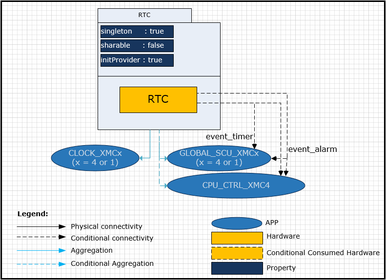
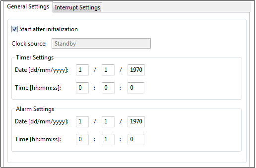
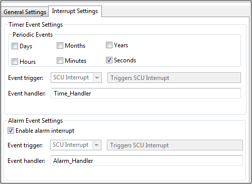

# Real-time Clock

## 목적
* Real-time Clock의 필요성과 용도를 이해하고 RTC App의 활용방법을 이해하자.

## 참고자료

* [XMC4500 Reference Manual v1.5 2014-04]
    - xmc4500_rm_v1.5_2014_04.pdf
* [XMC4500 Data Sheet v1.4 2016-01]
    - Infineon-XMC4500-DS-v01.04-EN.pdf
* [REAL-TIME CLOCK] (DAVE APP on-line help)

## 시작하며

실시간 클록 (RTC)은 현재 시간을 추적하는 컴퓨터 클럭 (대부분 집적 회로의 형태 임) 이다. RTC는  개인용 컴퓨터, 서버 및 임베디드 시스템에서 정확한 시간을 유지해야하는 거의 모든 전자 장치에 있다.
기본적인 클럭 신호를 사용하여 시간을 측정하는 일반적인 하드웨어 타이머(카운터)와 기본적인 구조와 동작은 같다. RTC은 인간이 쉽게 구별할 수 있는 시간단위(시,분,초 등등)로 시간을 측정할 수 있는 타이머를 말하여, 일반 타이머 혼동을 피하기 위해 사용되며 실시간 클럭이란 용어로 불린다. 실시간 클록은 약자가 같지만 의미는 상당히 다른 실시간 컴퓨팅(RTC: Real-Time Computing)과 혼동되어서는 안된다.

RTC 없이 일반 타이머(카운터)를 사용하여 시간을 관리할 수도 있지만 다음과 같은 이점이 있다.

* 시분초 단위의 시간을 더욱 효율적으로 관리 가능
* 더 급한 일을 수행하기 위하여 CPU의 시간관리 부담을 경감
* 저전력 소비

일반적인 하드웨어 타이머들은 클럭 소스로 usec 정밀도의 신호를 사용하고 있다. 예를 들어 1usec 주기의 신호로 클럭 소스를 사용하고, 타이머의 데이터 폭이 16비트라고 하면, 타이머가 Overflow 되는 때까지의 시간은
$$1\cdot 10^{-6}[sec]\times 65,536 \approx 65.5 [msec]$$
가 된다. 다시 말하여 65.5 msec 마다 overflow 인터럽트를 발생시켜야 연속적으로 시간을 관리할 수 있게 된다. 클럭소스의 속도를 늦춘다고 하더라도 상당히 빈번한 인터럽트가 발생하게 되고, 이것을 처리하기 위하여 쓸데없는 부가작업들이 많이 따르게 된다. 이 문제를 해결하기 위하여 초단위 정도의 정밀도를 가지고 상대적으로 긴 시간을 측정할 수 있는 타이머 서브시스템을 구성하게 되었고 이것이 바로 RTC 이다.  
RTC는 일반적으로 32.768KHz 의 클록 신호를 많이 사용한다. 이 클록 소스를 사용하면 32,768, 즉 15bit 의 자료형일 경우 1sec 마다 오버플로우를 발생하게 된다. 이것을 필요에 따라 프리스케일러로 클록 속도를 낮춰서 사용하면 인간에게 친숙한 단위의 초,분,시간을 쉽게 정수로 관리할 수 있게 된다.

RTC를 활용하여 시간을 관리하면 사람이 느끼는 시간을 빈번한 하드웨어 인터럽트 없이 관리할 수 있고, 필요시 해당 레지스터 데이타 값을 읽어서 시간을 확인할 수 있는 장점이 있다. 시간의 정밀도를 떨어뜨리지 않으면서 시간적으로 급하게 처리하여야 하는 일을 CPU가 처리할 수 있도록 하여준다.

최근 배터리 전원을 사용하는 시스템이 늘어나면서 메인 전원이 꺼져 있을 때에도 현재 시각을 저전력으로 관리하여야 하는 시스템이 더욱 필요하게 되었다. CPU의 동작은 저전력, 혹은 동면모드로 대기시켜 놓고 RTC 부분에만 전력을 공급하여 이러한 저전력 실시간 요구를 만족시킬 수 있게 된다.


## DAVE APP (RTC)

RTC 모듈은 시, 분, 초를 나타내는 레지스터를 사용하여 시간을 관리한다. 시간정보를 담고 있는  _달력 레지스터_ 는 날짜, 시간, 월 그리고 연 정보를 가지고 있다. RTC는 다음의 특징을 가진다.

* 주전원을 사용 할 수 없는 상황에서 보조전원을 사용하여 지속적으로 RTC를 사용 할 수 있다.
* 주기적인 타이머 이벤트와 프로그램 가능한 알람이벤트로 SCU 인터럽트 또는 NMI(Non Maskable Interrupt)를 발생 할 수 있다.
* 32.768 kHz 외부 크리스탈 클럭 또는 32.768 kHz 내부 고정밀 크리스탈 클럭을 사용하여 정확한 시간을 유지 할 수 있다.

### 아키텍쳐(Architecture)


위의 그림은 RTC APP의 소프트웨어 아키텍처를 표현한 것이다. RTC APP은 CLOBAL_SCU_XMC, CPU_CTRL_XMC4, CLOCK_XMC APP에 의존적이다. GLOBAL_SCU APP은 RTE APP 이벤트가 SCU 인터럽트를 트리거 할 때 사용된다. CPU_CTRL_XMC4 APP은 RTE APP 이벤트가 NMI 인터럽트를 트리거 할 때 사용된다.

* Signal

Signal Name | Input/Output | Availability | Description
------------|--------------|--------------|-------------------------
event_timer | Output       | Conditional  | RTC 타이머 인터럽트 신호
event_alarm | Output       | Conditional  | RTC 알람 인터럽트 신호

### 설정(Configuration)


* Start after initialization
    - 시작과 함께 자동으로 RTC 수행 시작
* Clock source
    - 사용 할 클럭 소스를 보여준다.(내부 크리스탈/외부 크리스탈)
    - 사용 할 클럭 소스는 CLOCK_XMC APP에서 설정
* Timer Settings: Date
    - 초기 날짜를 설정 할 수 있다.
    - 일(day)는 [1 ~ 31] 값으로 설정 가능하며 월마다 설정할 수 있는 최대값이 다르다.
    - 월(month)은 [1 ~ 12] 값으로 설정이 가능하다
    - 연(year)은 [1970 ~ 9999] 값으로 설정이 가능하다.
* Timer Settings: Time
    - 초기 시간을 설정 할 수 있다.
    - 시(hour)는 [0 ~ 23] 값으로 설정이 가능하다.
    - 분(minute)는 [0 ~ 59] 값으로 설정이 가능하다.
    - 초(second)는 [0 ~ 59] 값으로 설정이 가능하다.
* Alarm Settings: Date
    - event_alarm을 발생시키는 날짜를 설정 할 수 있다.
    - 일, 월, 연 값의 범위는 Timer Settings: Date와 같다.
* Alarm Settings: Time
    - event_alarm을 발생시키는 시간을 설정 할 수 있다.
    - 시, 분, 초 값의 범위는 Timer Settings: Time과 같다.



* Timer Event Settings: Periodic Events
    - 일, 월, 연, 시, 분, 초 주기로 타이머 이벤트를 발생 시킬 수 있다.
* Timer Event Settings: Event trigger
    - SCU Interrupt : 타이머 이벤트로 SCU 인터럽트를 트리거 할 수 있다.
    - NMI Interrupt : 타이머 이벤트로 NMI 인터럽트를 트리거 할 수 있다.
* Timer Event Settings: Event handler
    - SCU 인터럽트 선택 시 이벤트 핸들러의 이름을 이 곳에서 설정 할 수 있다. 이 함수는 사용자 코드에 정의 되어야 한다.
* Alarm Event Settings: Enable alarm interrupt
    - Enable시, 알람 인터럽트를 발생 시킬 수 있다.
* Alarm Event Settings: Event trigger
    - SCU Interrupt : 타이머 이벤트로 SCU 인터럽트를 트리거 할 수 있다.
    - NMI Interrupt : 타이머 이벤트로 NMI 인터럽트를 트리거 할 수 있다.
* Alarm Event Settings: Event handler
    - SCU 인터럽트 선택 시 이벤트 핸들러의 이름을 이 곳에서 설정 할 수 있다. 이 함수는 사용자 코드에 정의 되어야 한다.

### 자료구조
RTC 관련 설정 정보를 관리하기 위하여 RealTimeClock 구조체를 활용하여 RTC_t 자료형을 사용하고 있다. 이 구조체는 RTC의 초기 시간과 알람 시간 정보를 포함하는 자료형인 XMC_RTC_CONFIG_t와 RTC 관련 이벤트 설정 정보를 포함하는 RTC_CONFIG_t 자료형을 포함하고 있다.

```
typedef struct RealTimeClock
{
  const XMC_RTC_CONFIG_t *const time_alarm_config; /** Pointer to RTC LLD configuration data */
  const RTC_CONFIG_t *const config;                /** Pointer to configuration data */
  bool initialized;                                /** status for initialized or not */
} RTC_t;

typedef struct RTC_CONFIG
{
 RTC_START_t start;                           /**< rtc start */

 RTC_INT_t periodic_sec_intr;                 /**< periodic seconds interrupt */
 RTC_INT_t periodic_min_intr;                 /**< periodic minutes interrupt */
 RTC_INT_t periodic_hour_intr;                /**< periodic hours interrupt */
 RTC_INT_t periodic_day_intr;                 /**< periodic days interrupt */
 RTC_INT_t periodic_month_intr;               /**< periodic months interrupt */
 RTC_INT_t periodic_year_intr;                /**< periodic years interrupt */

 RTC_INT_t alarm_intr;                        /**< alarm interrupt */

 GLOBAL_SCU_XMC4_EVENT_HANDLER_t pi_listener;            /**< periodic interrupt listener */
 GLOBAL_SCU_XMC4_EVENT_HANDLER_t ai_listener;            /**< alarm interrupt listener */


 GLOBAL_SCU_XMC1_EVENT_HANDLER_t pi_listener;            /**< periodic interrupt listener */
 GLOBAL_SCU_XMC1_EVENT_HANDLER_t ai_listener;            /**< alarm interrupt listener */
} RTC_CONFIG_t;

typedef struct XMC_RTC_CONFIG
{
  XMC_RTC_TIME_t    time;
  XMC_RTC_ALARM_t   alarm;
  uint16_t          prescaler;
} XMC_RTC_CONFIG_t;
```
RTC 관련 동작을 프로그래밍 하기 위한 구조체 자료형들은 다음과 같다.
```
typedef struct XMC_RTC_TIME
{
  union
  {
    uint32_t raw0;
	  struct
	  {
	    uint32_t seconds  : 6; /**< Seconds time value (0-59: Above this causes this bitfield to be set with 0) */
	    uint32_t          : 2;
	    uint32_t minutes  : 6; /**< Minutes time value (0-59: Above this causes this bitfield to be set with 0) */
	    uint32_t          : 2;
	    uint32_t hours    : 5; /**< Hours time value   (0-23: Above this causes this bitfield to be set with 0) */
	    uint32_t          : 3;
	    uint32_t days     : 5; /**< Days time value (0-Actual days of month: Above this causes this bitfield to be set with 0)*/
	    uint32_t          : 3;
	  };
  };

  union
  {
    uint32_t raw1;
	  struct
	  {
	    uint32_t daysofweek  : 3; /**< Days of week time value (0-6: Above this causes this bitfield to be set with 0) */
	    uint32_t             : 5;
	    uint32_t month       : 4; /**< Month time value       (0-11: Above this causes this bitfield to be set with 0) */
	    uint32_t             : 4;
	    uint32_t year        : 16; /**< Year time value */
	 };
  };
} XMC_RTC_TIME_t;

typedef struct XMC_RTC_ALARM
{
  union
  {
	  uint32_t raw0;
	  struct
	  {
	    uint32_t seconds  : 6; /**< Alarm seconds compare value (0-59: Above this causes this bitfield to be set with 0)*/
	    uint32_t          : 2;
	    uint32_t minutes  : 6; /**< Alarm minutes compare value (0-59: Above this causes this bitfield to be set with 0)*/
	    uint32_t          : 2;
	    uint32_t hours    : 5; /**< Alarm hours compare value   (0-23: Above this causes this bitfield to be set with 0)*/
	    uint32_t          : 3;
	    uint32_t days     : 5; /**< Alarm days compare value (0-Actual days of month: Above this causes this bitfield to be set with 0)*/
	    uint32_t          : 3;
	  };
  };

  union
  {
    uint32_t raw1;
	  struct
	  {
	    uint32_t          : 8;
	    uint32_t month    : 4; /**< Alarm month compare value (0-11: Above this causes this bitfield to be set with 0) */
	    uint32_t          : 4;
	    uint32_t year     : 16; /**< Alarm year compare value */
	  };
  };
} XMC_RTC_ALARM_t;

struct tm
{
  int	tm_sec;
  int	tm_min;
  int	tm_hour;
  int	tm_mday;
  int	tm_mon;
  int	tm_year;
  int	tm_wday;
  int	tm_yday;
  int	tm_isdst;
}
```

RTC 관련 동작을 프로그래밍하기 위한 열거형 자료형들은 다음과 같다.
```
typedef enum RTC_STATUS
{
  RTC_STATUS_SUCCESS = 0U,    /**< APP initialization status success */
  RTC_STATUS_FAILURE = 1U     /**< APP initialization status failure */
} RTC_STATUS_t;

/**
 * This enumeration defines RTC Module Enable and Disable values.
 */

typedef enum RTC_START
{
  RTC_START_DISABLE = 0x0U, /**< Disable RTC start */
  RTC_START_ENABLE = 0x1U   /**< Enable RTC start */
} RTC_START_t;


/**
 * This enumeration defines RTC Module Interrupt Related Events Enable and
 * Disable values.
 */

typedef enum RTC_INT
{
  RTC_INT_PERIODIC_SEC_DISABLE = 0x0U,          /**< Timer Periodic Seconds Interrupt Disable */
  RTC_INT_PERIODIC_SEC_ENABLE = 0x1U,           /**< Timer Periodic Seconds Interrupt Enable */
  RTC_INT_PERIODIC_MIN_DISABLE = 0x0U,          /**< Timer Periodic Minutes Interrupt Disable */
  RTC_INT_PERIODIC_MIN_ENABLE = 0x1U,           /**< Timer Periodic Minutes Interrupt Enable */
  RTC_INT_PERIODIC_HOUR_DISABLE = 0x0U,         /**< Timer Periodic Hours Interrupt Disable */
  RTC_INT_PERIODIC_HOUR_ENABLE = 0x1U,          /**< Timer Periodic Hours Interrupt Enable */
  RTC_INT_PERIODIC_DAY_DISABLE = 0x0U,          /**< Timer Periodic Days Interrupt Disable */
  RTC_INT_PERIODIC_DAY_ENABLE = 0x1U,           /**< Timer Periodic Days Interrupt Enable */
  RTC_INT_PERIODIC_MONTH_DISABLE = 0x0U,        /**< Timer Periodic Month Interrupt Disable */
  RTC_INT_PERIODIC_MONTH_ENABLE = 0x1U,         /**< Timer Periodic Month Interrupt Enable */
  RTC_INT_PERIODIC_YEAR_DISABLE = 0x0U,         /**< Timer Periodic Years Interrupt Disable */
  RTC_INT_PERIODIC_YEAR_ENABLE = 0x1U,          /**< Timer Periodic Years Interrupt Enable */
  RTC_INT_ALARM_DISABLE = 0x0U,                 /**< Alarm Interrupt Disable */
  RTC_INT_ALARM_ENABLE = 0x1U                   /**< Alarm Interrupt Enable */
} RTC_INT_t;
```

### 메쏘드(Method)

* RTC APP을 초기화하고, 현재의 동작상태를 검사하고, 시작/중지한다.

`RTC_STATUS_t  RTC_Init (RTC_t *const handle);`

`__STATIC_INLINE void  RTC_Start (void);`

`__STATIC_INLINE void  RTC_Stop (void);`

* 시간과 알람을 설정 할 수 있다.

`RTC_STATUS_t  RTC_SetTime (XMC_RTC_TIME_t *time);`

`RTC_STATUS_t  RTC_SetStdTime (struct tm *stdtime);`

`RTC_STATUS_t  RTC_SetAlarmTime (XMC_RTC_ALARM_t *alarm);`

`RTC_STATUS_t  RTC_SetAlarmStdTime (struct tm *stdtime);`

* 시간, 알람 정보를 읽을 수 있다.

`RTC_STATUS_t  RTC_Time (time_t *time_value);`

`void  RTC_GetTime (XMC_RTC_TIME_t *time);`

`void  RTC_GetStdTime (struct tm *stdtime);`

`void  RTC_GetAlarmTime (XMC_RTC_ALARM_t *alarm);`

`void  RTC_GetAlarmStdTime (struct tm *stdtime);`

* 이벤트 플래그의 상태를 확인 할 수 있다.

`uint32_t  RTC_GetFlagStatus (void);`

### 사용예

* 초기화
설정 값의 초기화 사용자는 이와 같이 DAVE APP을 설정하고 사용하면 main.c 함수에서 DAVE_Init() 함수가 호출되어 개별적인 APP을 초기화 하지 않고 사용할 수 있다. 만약 이벤트 설정를 바꾸거나 사용할 하드웨어 모듈을 변경 시는 이와 같은 초기화 함수를 명시적으로 호출하여야 한다.

* 시작과 중지
    - RTC_Start 함수를 사용하여 RTC를 시작할 수 있다.
    - RTC_Stop 함수를 사용하여 RTC를 정지 시킬 수 있다.
```
RTC_Start();
RTC_Stop();
```

* XMC 구조체를 활용한 시간, 알람
    - RTC_SetTime 함수를 사용하여 RTC 시간을 설정 할 수 있다.
    - RTC_GetTime 함수를 사용하여 설정한 RTC 시간을 읽을 수 있다.
    - RTC_SetAlarmTime 함수를 사용하여 RTC 알람을 설정 할 수 있다.
    - RTC_GetAlarmTime 함수를 사용하여 설정한 RTC 알람을 읽을 수 있다.
```
XMC_RTC_TIME_t time_val =
{
	.seconds = 3U,
	.minutes = 2U,
	.hours = 1U,
	.days = 31U,
	.month = 12U,
	.year = 2016U
}; // 2016. 12. 31. 1시 2분 3초
XMC_RTC_TIME_t current_time;
RTC_STATUS_t rtc_status = RTC_STATUS_FAILURE;

rtc_status = RTC_SetTime(&time_val);
RTC_GetTime(&current_time);

XMC_RTC_ALARM_t alarm_val =
{
	.seconds = 3U,
	.minutes = 2U,
	.hours = 1U,
	.days = 31U,
	.month = 12U,
	.year = 2016U
}; // 2016. 12. 31. 1시 2분 3초
XMC_RTC_ALARM_t current_time;
RTC_STATUS_t rtc_status = RTC_STATUS_FAILURE;
rtc_status = RTC_SetAlarmTime(&alarm_val);
RTC_GetAlarmTime(&current_alarm);
```

* tm 구조체를 활용한 시간, 알람
    - RTC_SetStdTime 함수를 사용하여 RTC 시간을 설정 할 수 있다.
    - RTC_GetStdTime 함수를 사용하여 설정한 RTC 시간을 읽을 수 있다.
    - RTC_SetAlarmStdTime 함수를 사용하여 RTC 알람 시간을 설정 할 수 있다.
    - RTC_GetAlarmStdTime 함수를 사용하여 설정한 RTC 알람 시간을 읽을 수 있다.

```
struct tm std_time_val =
{
	.tm_sec = 3U,
	.tm_min = 2U,
	.tm_hour = 1U,
	.tm_mday = 31U,
	.tm_mon = 11U,
	.tm_year = 116U,
}; // 2016. 12. 31. 1시 2분 3초
struct tm std_current_time;
RTC_STATUS_t rtc_status = RTC_STATUS_FAILURE;
rtc_status = RTC_SetStdTime(&std_time_val);
RTC_GetStdTime(&std_current_time);

struct tm std_alarm_val =
{
	.tm_sec = 3U,
	.tm_min = 2U,
	.tm_hour = 1U,
	.tm_mday = 31U,
	.tm_mon = 11U,
	.tm_year = 116U,
};
struct tm std_current_alarm;
RTC_STATUS_t rtc_status = RTC_STATUS_FAILURE;
rtc_status = RTC_SetStdTime(&std_alarm_val);
RTC_GetStdTime(&std_current_alarm);
```

* [NOTE] _NMI 인터럽트 사용 시 이벤트 플래그를 리셋 해줘야 한다_
XMC_SCU_INTERRUPT_ClearEventStatus((XMC_SCU_INTERRUPT_EVENT_t)XMC_SCU_INTERRUPT_EVENT_RTC_PERIODIC);
XMC_SCU_INTERRUPT_EVENT_RTC_PERIODIC
XMC_SCU_INTERRUPT_EVENT_RTC_ALARM

## 실습프로젝트

* Lab Real-time Clock

## 요약
