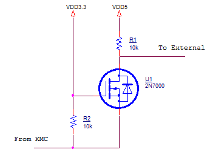
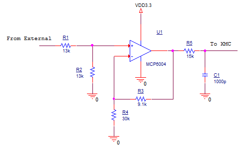
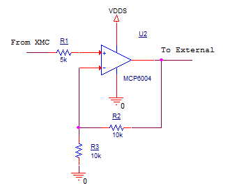

# Design of Signal Generator & Monitor

## Purpose and Scope

이 문서는 Signal Generator & Monitor디자인 관련 문서이다. 이 문서에는 다음과 같은 설계 사항을 다룬다.

* GUI
* Mechanical
* Electrical
* S/W

## System Design

### System Overview

* Signal Generator & Monitor는 신호를 모니터링하고 생성하는 디바이스이다.
* 3.3V/5V 디지털신호 또는 아날로그 신호와 인터페이스 할 수 있으며, 디지털 입출력 각각 2채널, 아날로그 입출력 각각 2채널, 총 8채널 사용 가능하다.
* XMC4500과 Signal Interface Shield로 구성되며, Signal Interface Shield는 XMC4500이 외부 디바이스와 인터페이스하기 위해 필요한 추가회로를 포함한다.
* PC를 통해서 신호들을 확인하고 발생시킬 수 있다.

### Internal Interfaces

#### XMC4500와 Signal Interface Shield와 연결

* XMC4500 X1, X2(핀헤더 수) - Signal Interface Shield(핀헤더 암)
* 실제 사용 시 장착/해제를 쉽게 하기 위해서 Signal Interface Shield 상에서 사용하는 핀만 핀헤더를 사용한다.
* 사용하는 핀은 다음과 같다.

| Pin Name | Pin Configuration | Description   |
| -------- | ----------------- | ------------- |
| X1 1     |                   | GND           |
| X1 10    | P14.0             | 아날로그 출력 채널 0번 |
| X1 12    | P14.2             | 아날로그 출력 채널 1번 |
| X1 14    | P14.8             | 아날로그 입력 채널 0번 |
| X1 16    | P14.9             | 아날로그 입력 채널 1번 |
| X1 11    | P14.1             | 기준전압 측정       |
| X1 38    |                   | VDD3.3        |
| X2 17    | P1.4              | 디지털 입력 채널 0번  |
| X2 16    | P1.5              | 디지털 입력 채널 1번  |
| X2 19    | P1.2              | 디지털 출력 채널 0번  |
| X2 18    | P1.3              | 디지털 출력 채널 1번  |

### External Interfaces

* 외부와 인터페이스 하기위해서 핀 헤더(수)를 사용

#### PC 연결(USB)

* PC USB - XMC4500 Micro USB

#### External Power

* 필요에 따라 외부에서 5V 전압을 입력
- 5V 외부 전원 1핀 - GND 1핀으로 구성

#### Digital Input 0 / Digital Input 1

* Power Selector 모드에 따라 전압 범위가 다르다.
  * 3.3V 선택 시 전압범위 : 0 ~ 3.3 [V]
  * 5V 선택 시 전압범위 : 0 ~ 5 [V]

#### Digital Output 0 / Digital Output 1

* Power Selector 모드에 따라 전압 범위가 다르다.
  - 3.3V 선택 시 전압범위 : 0 ~ 3.3 [V]
  - 5V 선택 시 전압범위 : 0 ~ 5 [V]

#### Analog Input 0 / Analog Input 1

* 전압 범위 : 0 ~ 5 V

#### Analog Output 0 / Analog Output 1

* Power Selector 모드에 따라 전압 범위가 다르다.
  - 3.3V 선택 시 전압범위 : 0.6 ~ 3.3 [V]
  - 5V 선택 시 전압범위 : 0.6 ~ 5 [V]

### Component Description

#### XMC4500

* KIT_XMC45_RELAX_LITE_V1 사용

#### Signal Interface Shield

* External Power로 외부에서 5V 파워소스를 입력

* Power Selector로 기준 전압(VDDS) 선택
    * 5V 또는 3.3V로 기준전압을 선택할 수 있다. 이 기준전압은 Signal Generator & Monitor가 인터페이스 할 디바이스 전압범위를 결정한다.
    * 5V는 External Power로부터 입력되는 파워소스이며, 3.3V는 PC USB로부터 XMC4500을 거쳐들어오는 파워소스이다.
    * 핀 헤더(수) 사용
    * 5V 핀 - 선택 핀 - 3.3V 핀으로 구성되며, 점퍼를 사용하여 선택 핀과 사용하고자 하는 전압 핀을 점퍼로 연결한다.
* 디지털 입력신호를 0 ~ 3.3V 전압으로 변환 뒤 XMC4500으로 전달.
* XMC4500의 디지털 출력 전압 범위를 0 ~ VDDS V로 변환 뒤 외부로 출력
* 아날로그 신호 입력 시, 신호의 전압 범위를 0 ~ 3.3 V로 변환하고 10 kHz 이상의 고주파 신호성분을 제거한다.
* XMC4500 아날로그 신호 출력 범위를 0.6 ~ 5 V로 변환한다.

### PC

* 신호를 모니터링하고 신호를 생성 할 수 있는 사용자 인터페이스

### PC GUI Design

#### Data screen

* Signal Generator & Monitor 인터페이스 신호 모니터링과 신호 생성이 가능한 GUI
* Micrium uC-Probe XMC로 GUI 구현
* Digital Input은 LED로 구현
* Digital Out은 custom switch 사용
* Analog Input 값은 Numeric Indicator 사용
* Analog Output 값은 Text box 사용
    * 변수 값을 실시간으로 변경
* Analog Output의 값이 범위를 초과시 다음의 동작을 한다.
    * 0.6 V보다 작은 값을 입력하면 0.6V로 입력된다.
    * 3.3V 모드 일 때, 3.3V 보다 높은 값을 입력하면 3.3V로 포화된다.
    * 5V 모드 일 때, 5V보다 높은 값을 입력하면 5V로 포화된다.

#### Oscilloscope

* 아날로그 입력 2 채널 신호 파형 출력
    * sampling rate : 1 [kHz]
    * display voltage range : 0 ~ 5 [V]

## Mechanical Design

## Electric Design

### Digital Input/Output

* XMC4500과 디지털 디바이스 간 인터페이스 하기 위한 회로
* 전압 범위 : 0 ~ VDDS [V]

### Analog Input

* 아날로그 신호를 입력받기 위한 회로이다. 전압 범위를 조정하기 전압분배회로, 전압증폭회로 그리고 고주파 신호를 차단하기위한 저역통과필터를 포함
* 전압 범위 : 0 ~ 5 [V]
* Op-amp Biasing Voltage : 3.3 [V]
  
    * XMC4500 ADC 전압 범위가 최대 3.3 [V]
* 아날로그 입력회로 이득 : 0.652
    * 전압분배회로 이득 :  $ \frac{1}{2}$
    
        $$ Gain = \frac{R2}{R1+R2} = \frac{13k}{13k+13k}=\frac{1}{2}$$
    
    * Op-amp 전압 증폭회로 이득 : 1.303
    
        $$ Gain = 1+\frac{R3}{R4} = 1+\frac{9.1k}{30k} = 1.303$$
        
    * 따라서, 총 이득은 
        $$ AI_{GAIN} = \frac{1}{2}\times 1.303 = 0.652 $$

* Cutoff Frequency : 10 [kHz]
  
    ​    $$ CutoffFrequency =  \frac{1}{2\pi R5C1} = \frac{1}{2\pi \times 15k \times 1000p} = 10610$$ [Hz]
* R2, R4 저항 값을 변경하여 사용자가 전압 이득 변경 가능
  
    * 핀 소켓 사용
* R5 저항 값을 변경하여 사용자가 Cutoff Frequency 변경가능
  
    * 핀 소켓 사용

### Analog Output

* 아날로그 신호를 출력하기 위한 회로이며, 전압 증폭회로로 구성
* 전압 범위 : 0.6 ~ VDDS [V]
* Op-amp 전압 증폭회로 이득 : 2
  
    $$ AO\_Gain =1+\frac{R2}{R3} = 1+\frac{10k}{10k} = 2$$
* R2 저항을 변경하여 이득 변경 가능
  
    * 핀 소켓 사용

## Software Design

### Software Description

* 모든 변수는 전역 변수로 사용
* 다음의 함수들은 하드웨어로 입출력되는 수치를 실제 물리값으로 변환

#### Sense_DI

- Digital Input 0 / Digital Input 1 상태를 읽고 u32DI0State/u32DI1State 변수에 상태 정보 저장

#### Sense_AI

- Analog Input 0 / Analog Input 1 신호 샘플링
- ADC 변환값을 실제 전압(f32AI0Vol/f32AI1Vol)으로 변환
    - $$ AI\_Vol = \frac{ADC\_Ch}{4095}\times3.3\times \frac{1}{AI\_GAIN} $$
    - $ AI\_Vol$는 실제 입력되는 아날로그 전압으로 f32AI0Vol/f32AI1Vol 변수가 이에 해당한다.
    - $ ADC\_Channel $는 ADC Ch0/Ch1의 변환값이다.
    - $ AI\_GAIN $ 값은 Electric Design-Analog Input 참고

#### Sense_Vdds

- Signal Interface Shield 기준전압 측정
- ADC 변환값에서 실제 전압으로 변환
  
    $$ f32Vdds = \frac{ADC\_Ch2}{4095}\times3.3\times \frac{1}{GAIN} $$
    
    - ADC_Ch2는 ADC Ch2의 ADC 변환값이다.
    - GAIN 값은 2이다. 관련된 정보는 도면 참고

#### Actuate_DO

- u32DO0State/u32DO1State 변수에 따른 디지털 신호 출력

#### Actuate_AO

- 출력 전압(f32AO0Vol/f32AO1Vol)을 만들기 위해서 DAC에 입력 할 값 연산 
  
    $$ DAC =  \frac{4095}{2.2}(AO\_Vol\times \frac{1}{AO\_GAIN}-0.3)$$
    
    - $ DAC $는 DAC 하드웨어에 써야 할 값이다.
    - $ AO\_ Vol $는 실제 출력되는 아날로그 전압으로 f32AO0Vol/f32AO1Vol 변수가 이에 해당한다.
    - $ AO\_ GAIN $ 값은 Electric Design-Analog Output 참고
- 출력전압에 해당하는 아날로그 신호 출력
- f32AO0Vol/f32AO1Vol 변수가 아날로그 출력 범위를 넘어설 경우 다음의 동작을 한다.
    - 0.6 V 미만의 전압이 입력 됐을 때, 0.6V로 변환
    - 3.3 V 모드 일 때, 3.3 V보다 높은 값이 입력 됐을 때, 3.3 V로 변환
    - 5V 모드 일 때, 5V보다 높은 값이 입력 됐을 때, 5V로 변환

### Hardware Configuration

* Pin mapping 정보는 System Internal Interfaces 항목 참고

#### dhADC_MEASUREMENT_0

* Number of measurements : 2
* Trigger edge selection : No External Trigger
* Enable continuous conversion : Enable
* Start conversion after initialization : Enable
* Conversion mode : 12 Bit Conversion
* Desired sample time [nsec] : 67

#### dhDIGITAL_IN_0/dhDIGITAL_IN\_1

* Pin direction : Input
* Mode : Tristate
* Positive True

#### dhDIGITAL_OUT_0/dhDIGITAL\_OUT\_1

* Pin direction : Input/Output
* Mode : Push Pull
* Initial output level : Low
* Positive True

#### dhDAC_0/dhDAC\_1

* Waveform selection : Single Value
* Sign selection : UnsignedValue
