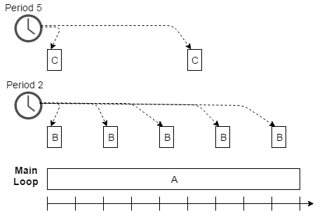

# SystemTimer

## 목적
* 임베디스 시스템의 Foreground/Background 스케쥴링 방법을 이해하고, SystemTimer APP의 활용방법을 이해하자.

## 참고자료

* [SYSTIMER] (DAVE APP on-line help)
* [MicroC/OS-II The Real-Time Kernel]


효과적으로 주기적인 이벤트를 발생하기 위해서 타이머라는 것을 사용하고, 이벤트를 효율적으로 처리하기 위해서 인터럽트를 활용한다.  


## Real-time system의 main loop

Real-time system의 프로그램을 구성하다 보면 자료중심의 일반 PC 프로그램과는 전혀 다른 구조의 main 함수를 구성하게 된다. 형태상으로 나타나는 가장 큰 차이는 프로그램의 종료가 없는 무한루프로 구성된다는 것이다. 전원이 공급되어 동작되어야 하는 상황에서는 외부 이벤트와 조건에 따라 계속적으로 동작하여야 하기 때문이다.

전형적인 main 루프와 관련된 프로그램의 구조를 살펴보면 다음과 같다.

* 시스템의 하드웨어와 소프트웨어와 관련된 초기화 동작을 먼저 수행한다.
    * 초기화를 수행할 때는 시스템의 하드웨어와 관련된 전문적인 지식이 필요하다. 마이크로컨트롤러의 복잡도가 높아지면서 설정하여야 하는 정보의 양도 많을 뿐더러 내부 장치들간의 상호 의존성이 높아져서 연관 관계 또한 정확히 파악하고 수행하여야 한다. 최근에는 마이크로컨트롤러 제조사에서 장치의 초기화를 도와주는 도구와 예제들을 함께 제공하고 있다.
    * 마이크로컨트롤러 뿐만아니라 이에 연결되는 외부 회로와 센서, 액츄애이터, 그리고 기구물의 상태또한 고려하여한다.

* 항상 동작하여야 하는 제어/계측 동작은 무한루프 내에 프로그래밍한다.
    * 제어시스템의 중요한 동작은 외부 입력에 대하여 적절한 동작을 수행하는 것이다. 그러므로 이러한 동작을 계속적으로 수행해야 함으로 제어/계측 동작을 무한루프 내에 프로그래밍하게 된다. 그러나 이와 같은 제어/계측 동작과 관련된 많은 내용들이 단순하게 반복수행되어야 하는 것도 있지만, 일정한 수행 주기를 가지고 동작하여야 하는 것도 있다.
    * 단순하게 main 루프를 구성할 경우에는 수행주기를 일정하게 맞추기가 매우 어렵게 된다.

* 외부 이벤트에 해당하는 동작은 관련 인터럽트 서비스 루틴에 프로그래밍 한다.
    * 외부 이벤트에 반응적으로 동작하는 부분은 인터럽트 서비스 루틴에 위치하게 된다. ISR은 일반 프로그램인 main 루프보다 우선순위가 높으므로 이벤트 발생시 main 루프의 실행을 중단하고 우선적으로 실행하게 된다. 또한 인터럽트들 간의 우선순위가 고려되는 시스템에서는 우선순위가 더 높은 인터럽트 서비스 루틴이 낮은 인터럽트 서비스 루틴보다 먼저 수행되게 된다.

```
void main(void)
{
  /* 프로그램의 실행에 필요한 초기화부 */

  while(1U)
  {
    /* 항상 계속 수행되어야 하는 동작부 */
  }
}

void interrupt_handler(void)
{
  /* 인터럽트 플래그 처리부 */

  /* 인터럽트 관련된 동작부 */
}
```

### Foreground/Background systems 혹은 super-loops

main 루프와 ISR 을 조합하여 스케쥴링하는 방식을 **Foreground/Background Scheduling** 혹은 **super-loop** 방식이라고 이야기 한다. 이러한 수행 방식을 실행시간 측면에서 살펴보면 다음의 그림과 같다.


main 루프에서는 원하는 동작을 시키기 위하여 각 동작에 해당하는 함수(A, B, C, D)를 호출하고 이 동작을 무한히 반복시킨다. 이것을 Background 라고 이야기 한다. 외부의 이벤트에 대하여 동작시키기 위하여 인터럽트 서비스 루틴에서는 해당하는 동작일 수행한다. 이것을 Foreground 라고 한다. Foreground 는 인터럽트 레벨(interrupt level)이라 부르고, Backgound 는 테스크 레벨 (task level)이라 부르기도 한다.

간단한 마이크로컨트롤러 기반의 임베디드 시스템은 이와 같은 Foreground/Background 스케쥴링 방법을 사용하여 구성하고 있다. 대부분의 시간은 대기하고 있는 상태로 있다가 외부의 특정 입력에 대하여 이벤트를 발생시켜 인터럽트 서비스 루틴에서 해당하는 동작을 수행시키는 것이다.

그러나 시스템의 복잡도가 높아지게 되면 이 방식또한 다음과 같은 문제점을 가지게 된다.  

외부 이벤트에 즉각적으로 반응을 해야 하는 중요한 동작은 ISR을 사용해서 수행해야만 한다. 그렇지 않을 경우에는 이벤트에 대한 반응 지연이 커져서 문제가 될 수도 있고, 경우에 따라서는 그 이벤트를 놓칠 수도 있기 때문이다. 그러므로 Foreground/Background 스케쥴링에서는 ISR 이 커지는 경향을 갖게 된다.

main 루프에 있는 동작은 main 루프가 한번 반복되어서 다시 자신이 수행될 때까지 기다려야 한다. 이것을 테스크 레벨 실행주기라 한다. 테스크 레벨 실행주기는 외부 인터럽트의 발생여부에 따라서, 또는 각 루프 동작의 실행코드의 내용에 따라서 상당히 크게 바뀌게 된다. 그러므로 실행주기가 매우 가변적이게 된다. 그러므로 일정한 주기를 가지고 수행해야 하는 일을 테스크 레벨에서 실행시키기가 어렵게 된다.

### 소프트웨어 타이머를 활용한 Multi-rate 스케쥴링

실행해야 하는 일들의 주기가 한가지 일때(single rate)는 main 루프에 주기적인 일들을 배치시기고 시간지연을 넣는 방식으로 구성을 할 수도 있다. 그러나 주기가 다른 여러가지 일들이 병렬적으로 동시에 실행되어야 하는 경우(multi rate)에는 main 루프 하나만 가지고 이것을 구현할 수 있는 방법이 없다. 이 경우에는 타이머 인터럽트 서비스 등을 활용하여 수행주기별로 개별적인 타이머를 설정하고 인터럽트 서비스 루틴을 구성하는 방법이다. 그러나 이러한 방식으로 수행하려면 수행주기별로 하드웨어 타이머를 할당해야 하므로 하드웨어 자원에 대한 낭비가 심하게 된다.



하드웨어 타이머를 사용하여 비교적 짧은 주기로 인터럽트를 발생(이것을 tick 이라 부른다) 시키고, 이 인터럽트 서비스 루틴을 활용하여 상대적으로 긴 주기의 일을 시키는 방식을 **소프트웨어 타이머** 라 말한다. tick 주기보다 짧은 시간을 관리할 수는 없지만 긴 시간을 관리할 때는 상당히 유효한 방법이다.
하나의 하드웨어 타이머를 사용하여 tick 인터럽트를 발생시키고 여러 수행주기를 관리하는 소프트웨어 타이머를 만들어 구성하는 방식으로 여러 수행주기의 일을 병행적으로 실행가능하다. 이 방식으로 구성하면 하드웨어 타이머의 낭비를 막을 수 있고, 추가적으로 수행주기 간의 시간차이(time offset) 또한 관리가 가능해 진다.


* tick 발생용 인터럽트는 어떤 timer 가 좋은가?

tick 인터럽트는 그 인터럽트 발생이 목적이라기 보다는 이차적으로 시간을 관리하기 위한 것이다. 그러므로 이 인터럽트의 발생은 원래 필요한 동작을 하기 위한 것이라기 보다는 부가적인 오버헤드(overhead) 이다. 그러므로 이 오버헤드가 적게 발생할 수 있는 타이머를 활용하는 것이 바람직하다.

* tick 주기 설정은 어떻게?

tick 인터럽트는 소프트웨어 타이머로 활용하는데 필요한 최소 주기로 발생하게 된다. 관리하고자 하는 시간주기들의 최소공배수로 tick 주기를 설정하는 것이 바람직하다. 즉 2msec 와 10msec의 주기를 관리하기 위한 것이라면 2msec 의 tick을 발생시키면 된다. 물론 이 최소 공배수보다 작은 값으로 발생시켜도 되지만 그렇게 되면 필요이상으로 빈번하게 인터럽트가 발생하게 되어 오버헤드가 증가하게 된다.

현재 마이크로컨트롤러의 클럭 속도 등을 고려하여 1 msec 의 tick을 발생시키고 이것을 활용하는 사례들도 많다. 일반적인 기계시스템의 제어에 있어서는 수~수십 msec 정도의 주기로 동작하면 되고, 최근의 마이크로컨트롤러는 100MHz 이상의 클럭으로 동작하므로 1msec 의 tick 인터럽트 발생 정도는 무시할 수 있는 정도의 오버헤드를 갖기 때문이다. 이와 같이 msec 수준의 tick 인터럽트를 가지는 시스템이라 하더라고 이보다 빠른 전기신호와 관련된 처리에 있어서는 개별의 타이머 혹은 인터럽트를 사용하여 처리하여야 한다.

## DAVE APP (SYSTIMER)

SYSTIMER APP은 사용자가 정의한 함수를 특정한 주기 또는 일정 시간 후에 호출 하기 위해 SysTick 인터럽트를 사용한다. SYSTIMER APP은 다음과 같은 특징을 지닌다.

* SYSTIMER APP은 하드웨어 SysTick 타이머를 사용하여 마이크로초 분해능을 가진 소프트웨어 타이머를 만든다.
* SYSTIMER APP은 one shot 모드와 periodic software timer 모드를 지원하며 소프트웨어 타이머를 최대 16개까지 만들 수 있다.
* 소프트웨어 타이머 콜백 함수는 인터럽트 문맥에서 실행된다.
* 모든 소프트웨어 타이머는 타이머 리스트를 통해 관리된다.

* 소프트타이머의 모드
    - One shot : 주어진 시간 구간을 한 번만 순환하고 타이머는 정지한다. 타이머가 한 번만 순환하기 때문에 콜백 함수도 한 번만 실행된다. 소프트웨어 타이머를 재시작하기 위해서는  API를 사용하여 직접 해야한다.
    

    - Periodic : 주어진 시간 구간을 연속해서 순환하는 모드이다. 일단 순환이 끝나면 콜백 함수가 실행되며 자동으로 재시작한다.
    

* Finite State Machine(FSM) for SYSTIMER States

SYSTIMER APP은 다음의 상태들을 가진다.


### 아키텍쳐(Architecture)


위의 그림은 SYSTIMER APP의 내부 소프트웨어 아키텍처를 나타낸 것이다. 이 APP은 CPU_CTRL_XMC4 APP과 CLOCK_XMC4 APP을 필요로 한다. CPU_CTRL_XMC4 APP은 SysTick 인터럽트의 선점 우선순위를 계산하기 위해 사용되며, CLOCK_XMC4 APP은 SysTick 구간 값을 계산하기 위해 사용된다.

### 설정(Configuration)


* SysTick timer period[us]
    - 소프트웨어 타이머의 분해능을 설정한다. 단위는 마이크로 초이다.
    - [1 ~ 139810]

* Number of software timers
    - 사용할 소프트웨어 타이머의 개수를 설정 할 수 있다.
    - [1 ~ 16]


* SysTick Interrupt Settings
    - SysTick 예외의 우선 순위를 설정한다.

### 자료구조
* SYSTIMER APP 관련 설정 정보들은 SYSTIMER 구조체의 SYSTIMER_t 자료형과 define 상수로 저장된다. 그리고 소프트웨어 타이머 설정은 SYSTIMER_OBJECT 구조체를 활용하여 SYSTIMER_OBJECT_t 자료형으로 사용하여 설정정보를 담고 있다.
```
typedef struct SYSTIMER
{
  bool init_status; /**< APP initialization status to ensure whether SYSTIMER_Init called or not */
} SYSTIMER_t;

#define SYSTIMER_SYSTICK_CLOCK   (120000000U)

/**< SysTick interval in seconds */
#define SYSTIMER_TICK_PERIOD  (0.001F)

/**< SysTick interval in microseconds */
#define SYSTIMER_TICK_PERIOD_US  (1000U)

/**< Maximum No of timer */
#define SYSTIMER_CFG_MAX_TMR  (8U)

#define SYSTIMER_PRIORITY  (63U)
#define SYSTIMER_SUBPRIORITY  (0U)

typedef struct SYSTIMER_OBJECT
{
  struct SYSTIMER_OBJECT *next; /**< pointer to next timer control block */
  struct SYSTIMER_OBJECT *prev; /**< Pointer to previous timer control block */
  SYSTIMER_CALLBACK_t callback; /**< Callback function pointer */
  SYSTIMER_MODE_t mode; /**< timer Type (single shot or periodic) */
  SYSTIMER_STATE_t state; /**< timer state */
  void *args; /**< Parameter to callback function */
  uint32_t id; /**< timer ID */
  uint32_t count; /**< timer count value */
  uint32_t reload; /**< timer Reload count value */
  bool delete_swtmr; /**< To delete the timer */
} SYSTIMER_OBJECT_t;
```
시스템 타이머 관련 동작을 프로그래밍 하기 위한 열거형 자료형들은 다음과 같다.
```
typedef enum SYSTIMER_STATUS
{
  SYSTIMER_STATUS_SUCCESS = 0U, /**< Status Success if initialization is successful */
  SYSTIMER_STATUS_FAILURE  /**< Status Failure if initialization is failed */
} SYSTIMER_STATUS_t;

/**
 * @brief This enumeration defines possible timer state
 */
typedef enum SYSTIMER_STATE
{
  SYSTIMER_STATE_NOT_INITIALIZED = 0U, /**< The timer is in uninitialized state */
  SYSTIMER_STATE_RUNNING, /**< The timer is in running state */
  SYSTIMER_STATE_STOPPED /**< The timer is in stop state */
} SYSTIMER_STATE_t;

/**
 * @brief Enumeration values which describes timer types
 */
typedef enum SYSTIMER_MODE
{
  SYSTIMER_MODE_ONE_SHOT = 0U, /**< timer type is one shot */
  SYSTIMER_MODE_PERIODIC /**< timer type is periodic */
} SYSTIMER_MODE_t;
```

### 메쏘드(Method)

* SYSTIMER APP을 초기화하고, 소프트웨어 타이머를 생성/삭제 및 상태를 확인 할 수 있다.

  `SYSTIMER_STATUS_t  SYSTIMER_Init (SYSTIMER_t *handle);`

  `uint32_t  SYSTIMER_CreateTimer (uint32_t period, SYSTIMER_MODE_t mode, SYSTIMER_CALLBACK_t callback, void *args);`

    - period[us] : 소프트타이머의
    - mode : SYSTIMER_MODE_ONE_SHOT / SYSTIMER_MODE_PERIODIC
    - callback : 소프트타이머의 콜백 함수
    - args : 콜백 함수의 파라미터
    - 출력으로는 소프트웨어 타이머의 id가 생성된다.

  `SYSTIMER_STATUS_t  SYSTIMER_DeleteTimer (uint32_t id);`

  `SYSTIMER_STATE_t  SYSTIMER_GetTimerState (uint32_t id);`

* 소프트웨어 타이머를 시작, 중지, 재시작 할 수 있다.

  `SYSTIMER_STATUS_t  SYSTIMER_StartTimer (uint32_t id);`

  `SYSTIMER_STATUS_t  SYSTIMER_StopTimer (uint32_t id);`

  `SYSTIMER_STATUS_t  SYSTIMER_RestartTimer (uint32_t id, uint32_t microsec);`

* 하드웨어 SysTick 시간을 마이크로 초 단위로 확인거나 SysTick 카운트를 확인할 수 있다.

  `uint32_t  SYSTIMER_GetTime (void);`

  `uint32_t  SYSTIMER_GetTickCount (void);`

### 사용예

* 설정 값의 초기화 사용자는 이와 같이 DAVE APP을 설정하고 사용하면 main.c 함수에서 DAVE_Init() 함수가 호출되어 개별적인 APP을 초기화 하지 않고 사용할 수 있다.


```c
#include <DAVE.h>
#define ONESEC 1000000U

void LED_Toggle_EverySec(void)
{
    // LED Toggle for every second
    DIGITAL_IO_ToggleOutput(&DIGITAL_IO_0);
}

int main(void)
{
    uint32_t TimerId,status;
    DAVE_Init(); // SYSTIMER APP Initialized during DAVE Initialization

    // Create Software Timer with one second time interval 
    //in order to generate software timer callback event at every second
    TimerId = SYSTIMER_CreateTimer(ONESEC,SYSTIMER_MODE_PERIODIC,(void*)LED_Toggle_EverySec,NULL);
    if(TimerId != 0U)
    {   //Timer is created successfully
        // Start/Run Software Timer
        status = SYSTIMER_StartTimer(TimerId);
        if(status == SYSTIMER_STATUS_SUCCESS){    // Timer is running
        }
        else{ // Error during software timer start operation
        }
    }
    else { // Timer ID Can not be zero
    }
     
    while(1)
    {

    }
    return (1);
}

```


## 실습프로젝트

* Lab SystemTimer

## 요약
