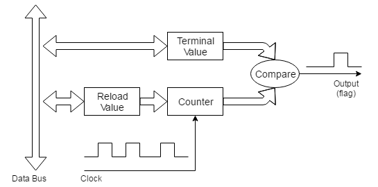
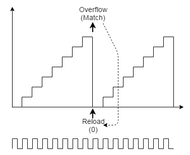
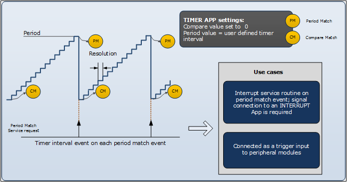
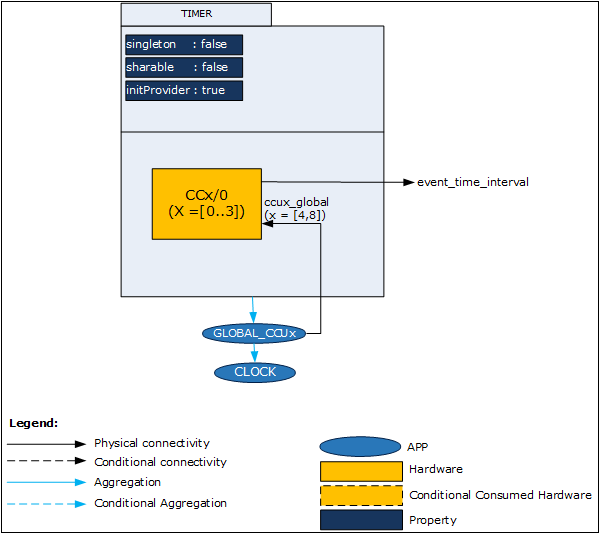
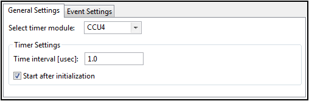
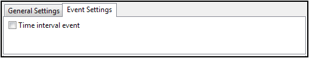

# Timer

## 목적
* Timer 동작을 이해하고 DAVE App 을 살펴보고 이해하자.

## 참고자료

* [XMC4500 Reference Manual v1.5 2014-04]
    - xmc4500_rm_v1.5_2014_04.pdf
* [XMC4500 Data Sheet v1.4 2016-01]
    - Infineon-XMC4500-DS-v01.04-EN.pdf
* [TIMER] (DAVE APP on-line help)

## Timer

타이머는 주기적인 클럭 신호를 카운터의 입력으로 활용한 것이다. 중요 활용 용도는 일정 시간 간격으로 주기적인 이벤트를 발생하는 것이다. 이 타이머와 외부 이벤트를 결합하여 외부 신호의 발생 시각을 알 수 있는 용도로 활용할 수도 있다. 이것을 일반적으로 input capture 라고 한다.

### Periodic Timer

자동 리로드 기능이 있는 타이머에는 프로세서에서 쓴 카운터 값을 유지하는 래치 레지스터가 있다. 프로세서가 래치 레지스터에 쓰면 카운트 레지스터도 함께 기록된다. 타이머가 나중에 오버플로되면, 먼저 출력 신호를 생성한다. 그런 다음 래치의 내용을 카운트 레지스터에 자동으로 다시로드한다. 래치는 여전히 프로세서에 의해 기록 된 값을 유지하므로 카운터는 동일한 초기 값에서 다시 카운트를 시작한다. 이러한 타이머는 입력 클럭과 동일한 정확도로 정규 출력을 생성한다. 이 출력은 실시간 운영 시스템 (RTOS) 타이머 틱과 같은 주기적인 인터럽트를 생성하거나, UART에 보드 속도 클럭을 제공하거나, 정기 펄스를 필요로하는 모든 장치를 구동하는 데 사용될 수 있다.


초기값을 사용한 주기적인 신호 생성을 다른 방법으로 할 수도 있다. 일부 타이머에서는 초기 카운트 값을 설정하기 보다는 보다는 최종 값(터미널 카운트 값)을 사용하기도 한다. 이 경우, 프로세서는 카운트 레지스터의 값과 지속적으로 비교되는 터미널 카운트 레지스터에 기록한다. 카운트 레지스터는 항상 0으로 재설정되고 증가 카운트 하게 된다. 터미널 카운트 레지스터의 값과 같으면 출력 신호가 생성된다. 그런 다음 카운트 레지스터가 0으로 재설정되고 프로세스가 반복되고 터미널 카운트 값은 동일하게 유지된다. 전반적인 효과는 오버 플로우 카운터와 동일하다. 이와 같은 방법으로 미리 결정된 길이의 주기 신호가 생성할 수도 있다.




타이머가 자동 재 로딩을 지원하면 종종 소프트웨어로 이 기능을 선택할 수 있게 되어 있다. 자동으로 반복되지 않는 카운트와 반복되는 카운트를 구별하기 위해, one-shot 또는 periodic 두 가지 모드 중 하나라고 한다. 일반적으로 타이머의 제어 레지스터에 있는 필드를 통하여 이 모드를 제어하게 된다.

### Input Capture

그림과 같은 Input Capture 타이머에는 타이머의 카운트 레지스터에 연결된 래치 레지스터가 있다. 타이머는 일정한 클럭 속도 (일반적으로 프로세서 클럭신호)로 실행되므로 카운트 레지스터가 지속적으로 증가하거나 감소한다 (업 다운 설정에 따라). 외부 신호에 따라 타이머의 값을 프로세서가 보이는 레지스터에 래치하고 출력 신호(일반적으로 인터럽트)를 생성한다.

입력 캡처 타이머의 한 가지 용도는 두 펄스의 엣지 사이의 시간을 측정하는 것이다. 현재 래치에있는 값을 읽고 이전 판독 값과 비교함으로써 소프트웨어는 두 펄스 사이에 경과 된 클럭 사이클 수를 결정할 수 있다. 경우에 따라 타이머의 카운트 레지스터가 값이 래치 된 후 자동으로 재설정 될 수 있다. 이런 경우에는 소프트웨어는 읽은 값을 경과 된 클록 틱의 수로 직접 해석 할 수도 있다. 입력 캡처 핀은 일반적으로 입력 신호의 상승 또는 하강 에지에서 캡처하도록 소프트웨어적으로 설정할 수 있다.


## DAVE APP (DIGITAL_IO)

TIMER APP은 CCU4 또는 CCU8 모듈의 슬라이스 한 개를 사용하여 정확한 하드웨어 타이머를 제공한다. 그리고 다음의 기능을 제공한다.

* 주어진 시간 간격으로 반복적인 이벤트 발생
* 하드웨어 타이머를 사용한 더 정확한 지연(delay) 발생
* 런타임 시 원하는 시간 간격 설정(마이크로초 단위)
* DAVE HW Signal Connections를 사용하여 타이머 이벤트를 다른 주변 장치의 트리거 소스나 인터럽트 발생을 위한 신호로 사용 가능



### 아키텍쳐(Architecture)


위의 그림은 TIMER APP의 내부 소프트웨어 아키텍처를 보여준다. TIMER APP의 각각의 인스턴스는 MCU에서 하나의 CCU 타이머 슬라이스를 사용한다. 이 APP은 GLOBAL_CCUx(x=[4, 8]) APP과 CLOCK 앱이 필요하다. TIMER APP은 또한 주변 장치들 간 연결을 위해 출력 신호를 제공한다.

* Signals

Signal Name         | Input/Output | Availability | Description
--------------------|--------------|--------------|--------------
event_time_interval | Output       | Conditional  | 타이머 이벤트

* APPS Consumed

APP Name    | Consumption            | Description
------------|------------------------|----------------------------------------
GLOBAL_CCU4 | Conditionally consumed | CCU4 프리스케일러(prescaler)를 시작한다
GLOBAL_CCU8 | Conditionally consumed | CCU8 프리스케일러(prescaler)를 시작한다

### 설정(Configuration)



* Select timer module
    - CCU4: CCU4의 슬라이스 한개를 사용한다.
    - CCU8: CCU8의 슬라이스 한개를 사용한다.
* Timer Settings:Time interval[usec]
    - 이벤트를 발생을 위한 시간 간격을 설정
    - [0.2 to 4294967200]
* Timer Settings:Start after initialization
    - 시작과 함께 자동으로 타이머를 수행시작



* Time interval event
    - 각 시간 간격마다 event_time_interval 이벤트를 출력한다.

### 자료구조
타이머 관련 설정 정보를 관리하기 위하여 TIMER 구조체를 활용하여 TIMER_t 자료형을 사용하고 있다. 이 구조체에는 TIMER Configuration과 관련된 정보들을 담고 있고, 의존성이 있는 CCU4와 CCU8의 연결 정보등을 담고 있다.
```
typedef struct TIMER
{
  uint32_t time_interval_value_us;  /**< Timer interval value for which event is being generated */
  const uint32_t timer_max_value_us;	/**< Maximum timer value in micro seconds for the available clock */
  const uint32_t timer_min_value_us;  /**< Minimum timer value in micro seconds for the available clock */
  const uint32_t shadow_mask;  /**< shadow transfer mask for the selected timer */
  GLOBAL_CCU4_t* const global_ccu4_handler; /**< Reference to CCU4GLOBAL APP handler */
  XMC_CCU4_SLICE_t* const ccu4_slice_ptr;  /**< Reference to CCU4-CC4 slice identifier data handler */
  const uint8_t ccu4_slice_number;  /* Timer being used */
  XMC_CCU4_SLICE_COMPARE_CONFIG_t* const ccu4_slice_config_ptr; /**< Reference to initialization data structure of the core timer functionality */
  XMC_CCU4_SLICE_SR_ID_t  const ccu4_period_match_node; /**< Service Request Id for period match event */
  GLOBAL_CCU8_t* const global_ccu8_handler; /**< Reference to CCU8GLOBAL APP handler */
  XMC_CCU8_SLICE_t* const ccu8_slice_ptr; /**< Reference to CCU8-CC8 slice identifier data handler */
  const uint8_t ccu8_slice_number;  /* Timer being used */
  XMC_CCU8_SLICE_COMPARE_CONFIG_t* const ccu8_slice_config_ptr; /**< Reference to initialization data structure of the core timer functionality */
  XMC_CCU8_SLICE_SR_ID_t const ccu8_period_match_node; /**< Service Request Id for period match event */
  TIMER_MODULE_t const timer_module; /**< Indicate which timer module is being used from CCU4 and CCU8 */
  uint16_t period_value; /**< Period value to be loaded into timer for the corresponding time tick */
  bool const start_control; /**< Indicate whether to start the APP during initialization itself */
  bool const period_match_enable; /**< Indicate the generation of period match event */
  bool initialized;  /* flag to indicate the initialization state of the APP instance */
} TIMER_t;
```
TIMER 관련 동작을 프로그래밍 하기 위한 열거형 자료형들은 다음과 같다.
```
typedef enum TIMER_MODULE
{
  TIMER_MODULE_CCU4 = 0U, /**< CCU4 is selected */
  TIMER_MODULE_CCU8       /**< CCU8 is selected */
} TIMER_MODULE_t;

/**
 * @brief status of the TIMER APP
 */
typedef enum TIMER_STATUS{
  TIMER_STATUS_SUCCESS = 0U, /**< Status success */
  TIMER_STATUS_FAILURE       /**< Status failure */
} TIMER_STATUS_t;
```
### 메쏘드(Method)

* TIMER APP을 초기화하고, 현재의 동작상태를 검사하고, 시작/중지한다.

  `TIMER_STATUS_t  TIMER_Init (TIMER_t *const handle_ptr);`

  `bool  TIMER_GetTimerStatus (TIMER_t *const handle_ptr);`

  `TIMER_STATUS_t  TIMER_Start (TIMER_t *const handle_ptr);`

  `TIMER_STATUS_t  TIMER_Stop (TIMER_t *const handle_ptr);`

* TIMER 값을 읽거나 TIMER 값을 초기화한다.

  `uint32_t  TIMER_GetTime (TIMER_t *const handle_ptr);`

  `TIMER_STATUS_t  TIMER_Clear (TIMER_t *const handle_ptr);`

* 이벤트를 생성을 위한 새로운 시간 간격을 설정한다.

  `TIMER_STATUS_t  TIMER_SetTimeInterval (TIMER_t *const handle_ptr, uint32_t time_interval);`
    - time_interval : 새로운 시간 간격 값이다. 단위는 마이크로초이다.

* 인터럽트 상태를 확인하거나 이벤트를 클리어한다.

`bool  TIMER_GetInterruptStatus (TIMER_t *const handle_ptr);`

`void  TIMER_ClearEvent (TIMER_t *const handle_ptr);`


### 사용예

* 초기화
설정 값의 초기화 사용자는 이와 같이 DAVE APP을 설정하고 사용하면 main.c 함수에서 DAVE_Init() 함수가 호출되어 개별적인 APP을 초기화 하지 않고 사용할 수 있다. 만약 이벤트 설정를 바꾸거나 사용할 하드웨어 모듈을 변경 시는 초기화 함수를 명시적으로 호출하여야 한다.

* 시작과 정지
    - TIMER_GetTimerStatus 함수를 사용하여 현재 타이머 상태를 확인한다.
    - 만약 타이머가 정지 상태라면 TIMER_Start 함수를 사용하여 타이머를 시작한다.
    - 만약 타이머가 동작 상태라면 TIMER_Stop 함수를 사용하여 타이머를 정지시킨다.

```
TIMER_STATUS_t timer_status;
if (TIMER_GetTimerStatus(&dhTIMER_0) == false)
{
  timer_status = TIMER_Start(&dhTIMER_0);
}
else
{
  timer_status = TIMER_Stop(&dhTIMER_0);
}
```

* 타이머 값 읽기
    - TIMER_GetTime 함수를 사용하여 현재 타이머 값을 읽을 수 있다. 단위는 마이크로초이다.
    - TIMER_Clear 함수를 사용하여 현재 타이머 값을 클리어 할 수 있다.

```
uint32_t timer_value;
TIMER_STATUS_t timer_status;
timer_value = TIMER_GetTime(&dhTIMER_0);
timer_status = TIMER_Clear(&dhTIMER_0);
```

* 타이머 시간 간격 설정
    - TIMER_SetTimeInterval 함수를 사용하여 타이머 시간 간격을 다시 설정할 수 있다.
    - 시간 간격 설정 시 타이머는 정지 상태여야 한다.

```
TIMER_STATUS_t timer_status;
TIMER_Stop(&dhTIMER_0);
timer_status = TIMER_SetTimeInterval(&dhTIMER_0, 1000000); // change to 1s
TIMER_Start(&dhTIMER_0);
```


## 실습프로젝트

* Lab Timer

## 요약
