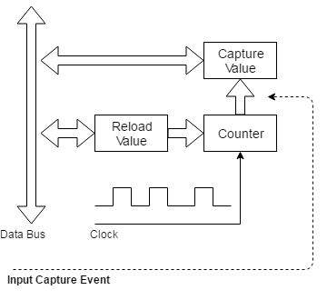
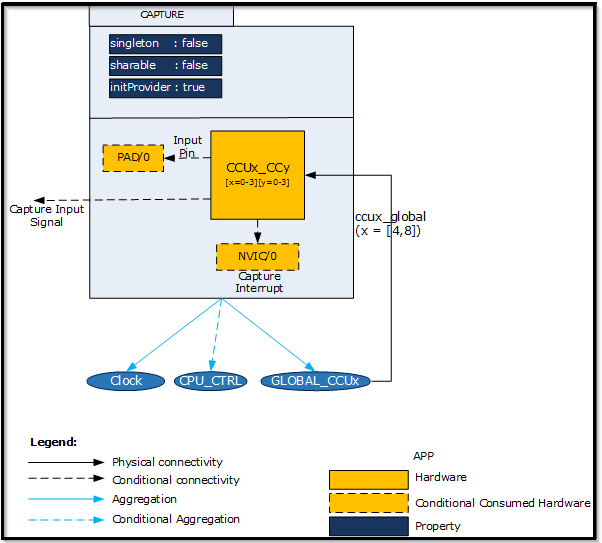
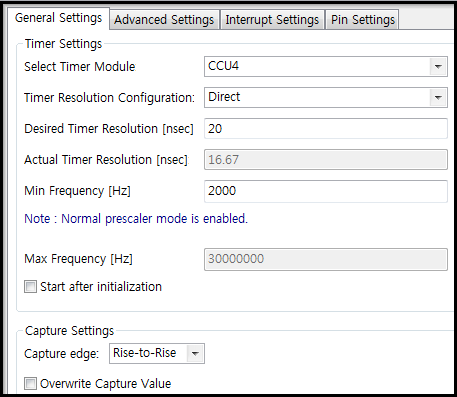
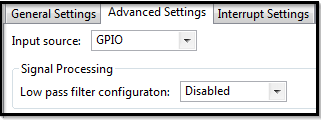
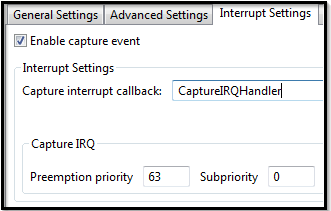
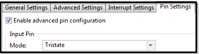

# Timer - Input Capture

## 목적
* Input Capture 동작을 이해하고 DAVE App 을 살펴보고 이해하자.

## 참고자료

* [Capture] (DAVE APP on-line help)

## Timer

타이머는 주기적인 클럭 신호를 카운터의 입력으로 활용한 것이다. 중요 활용 용도는 다음과 같다.

* 일정 시간 간격으로 주기적인 이벤트를 발생하는 것이다. (Periodic Timer)
* 일정 시간 간격, 혹은 시간 경과 후에 외부로 신호를 발생할 수 있다. (Output Compare)
* 외부 신호의 발생 시각을 알 수 있는 용도로 활용할 수도 있다. (Input Capture)

### Periodic Timer (Output Compare)

* *Timer 참고*

### Input Capture

Input Capture 타이머에는 **카운터 레지스터(Counter Register)**에 연결된 **캡쳐 레지스터(Capture Value Register)**가 있다. 카운터 레지스터의 값은 일정한 클럭 속도 (일반적으로 프로세서 클럭신호)로 지속적으로 증가한다. 외부 신호가 발생하는 순간 타이머의 값이 캡쳐 레지스터로 복사되고 이벤트를 생성한다.  CPU에서는 이 캡쳐 레지스터의 값을 확인하여 외부신호가 발생한 순간을 알수있게 되는 것이다.

Input Capture 타이머의 대표적인 용도는 두 펄스의 엣지 사이의 시간을 측정하는 것이다.  연속적으로 캡쳐된 카운터값을 사용하여 두 펄스 사이에 경과 된 카운터 값의 차이를 알 수 있다.  경우에 따라 타이머의 카운트 레지스터가 값이 래치 된 후 자동으로 재설정 될 수 있다. 입력 캡처 핀은 일반적으로 입력 신호의 상승 또는 하강 에지에서 캡처하도록 소프트웨어적으로 설정할 수 있다.



## DAVE APP (Capture APP)

CAPTURE APP은 CCU4 또는 CCU8 슬라이스 한 개를 사용하여 신호 분석 용으로 사용한다. 구체적으로는 다음과 같은 기능을 제공한다.

* 설정 가능 한 두 엣지 간 시간을 측정(예시, rising edge와 falling edge 간 시간 측정)
* 입력 신호의 듀티 싸이클과 주기를 측정
* CAPTURE APP에 사용되는 타이머의 분해능을 설정 할 수 있다.
* 캡처 할 신호의 주파수 범위를 설정 할 수 있다.
* 어떤 엣지 신호를 캡처 할지 선택 할 수 있다.
* 이미 측정 한 값을 읽기 전에 덮어 쓸 수 있다.
* 입력 신호로 GPIO 또는 MCU 내부 페리퍼럴 신호를 사용 할 수 있다.
* 저역통과필터를 사용하여 노이즈를 제거 할 수 있다.
* 신호 측정 후, 이벤트를 발생시킬 수 있다.
* 입력 신호를 받아 들이는 GPIO 핀 설정 가능

### 아키텍쳐(Architecture)



* Signals

Signal Name         | Input/Output | Availability | Description
--------------------|--------------|--------------|--------------
 capture_input | Input | Conditional | 다른 페리퍼럴과 연결 가능 

### 설정(Configuration)



* Timer Settings: Select Timer Module
    * CCU4: CCU4의 슬라이스 한개를 사용한다.
    * CCU8: CCU8의 슬라이스 한개를 사용한다.
* Timer Settings: Timer Resolution Configuration
    * 타이머 분해능 결정 방법 선택
    * Direct : Desired Timer Resolution 설정으로 분해능 결정
    * Calculated from Max Capture Frequency : Max Frequency 설정으로 분해능 결정
* Timer Settings: Desired Timer Resolution [nsec]
    * Timer Resolution Configuration 설정에서 Direct 선택 시, 설정 가능
    * [9 ~ 273064]
* Timer Settings: Actual Timer Resolution [nsec]
    * 실제 적용되는 타이머 분해능 표시
    * [8.33 ~ 273066.67]
* Timer Settings: Min Frequency [Hz]
    * 캡처 할 신호의 최소 주파수 설정
    * 이 설정으로 타이머 내부 프리스케일러 모드(normal mode 또는 floating mode)를 결정
    * [1 ~ Max Frequency]
* Timer Settings: Max Frequency [Hz]
    * 캡처 할 신호의 최대 주파수 설정
    * Timer Resolution Configuration 설정에서 Direct 선택 시, 현재 타이머 분해능 설정 하에서 캡처 할 수 있는 신호의 최대 주파수를 표시
    * Timer Resolution Configuration 설정에서 Calculated from Max Capture Frequency 선택 시, 타이머 분해능은 최대 주파수를 바탕으로 계산된다. 
    * [Min Frequency ~ fccu/2]
* Timer Settings: Start after initialization
    * Enable 시, 초기화 후 자동으로 신호 캡처 시작.
* Capture Settings: Capture edge
    * 캡처 할 엣지 신호를 선택
    * Rise-to-Rise/Rise-to-Fall/Fall-to-Rise/Fall-to-Fall 중 선택 가능
    * Rise-to-Rise/Fall-to-Fall 선택시, 신호의 주기, 듀티 싸이클을 계산 할 수 있다.
    * Rise-to-Fall/Fall-to-Rise 선택시, 신호의 주기, 듀티 싸이클을 계산 할 수 없다.
* Capture Settings: Overwrite Capture Value
    * Enable: 새로운 캡처 이벤트가 발생했을 때, 이전 캡처 결과값을 읽지 않았더라도 덮어쓴다.
    * Disable: 이전 캡처 결과값을 읽지 않았다면 덮어쓰지 않는다.



* Input Source
    * 캡처 할 신호 입력 방법 선택
    * GPIO : 사용 할 핀 선택, 관련 설정을 할 수 있다.
    * Internal Signal : 캡처 할 내부 페리퍼럴 신호를 선택 할 수 있다.
* Signal Processing: Low pass filter configuration
    * 입력 신호 노이즈를 걸러내기 위한 저역통과필터를 설정 할 수 있다.
    * 입력 신호가 변화 후 설정한 클럭 동안 같은 신호가 유지된다면 천이가 된다고 인식한다.
    * Disabled : Filter 기능을 사용하지 않는다.
    * 3 Clock Cycles/5 Clock Cycles/7 Clock Cycles 중 선택가능



* Enable capture event
    * 캡처 이벤트 후 실행 할 수 있는 user callback 함수를 활성화시킨다.
* Interrupt Settings: Capture interrupt callback
    * 인터럽트 callback 함수의 이름
* Capture IRQ
    * NVIC에서 설명



* Enable advanced pin configuration
    * 입력 핀 advanced settings을 활성화한다.
* Input Pin: Mode
    * Tristate/Pull Up/Pull Down/Continuous Sampling Mode/Inverted Tristate/Inverted Pull Up/Inverted Pull Down 중 선택
    * DigitalIos 문서 참조


### 자료구조

CAPTURE 관련 설정 정보를 관리하기 위하여 CAPTURE 구조체를 활용하여 CAPTURE_t 자료형을 사용하고 있다. 이 구조체에는 CAPTURE Configuration과 관련된 정보들을 담고 있고, 의존성이 있는 CCU4와 CCU8의 연결 정보등을 담고 있다.

```c
typedef struct CAPTURE
{
  uint32_t min_frequency; /**< minimum frequency that can be captured by the APP */
  uint32_t max_frequency; /**< maximum frequency that can be captured by the APP */
  const uint32_t shadow_mask;  /**< shadow transfer mask for the selected capture */
#ifdef  CAPTURE_CCU4_USED
  const XMC_CCU4_SLICE_EVENT_CONFIG_t *const ccu4_event0_ptr; /**< capture event 0 configuration */
  const XMC_CCU4_SLICE_EVENT_CONFIG_t *const ccu4_event1_ptr; /**< capture event 1 configuration */
  GLOBAL_CCU4_t *const global_ccu4_handler; /**< Reference to CCU4GLOBAL APP handler */
  XMC_CCU4_SLICE_t *const ccu4_slice_ptr;  /**< Reference to CCU4-CC4 slice identifier data handler */
  const XMC_CCU4_SLICE_CAPTURE_CONFIG_t *const ccu4_slice_config_ptr; /**< Reference to initialization data structure of
                                                                     the core capture functionality */
  const XMC_CCU4_SLICE_SR_ID_t ccu4_capture_event_node; /**< Service Request Id for period match event */
#endif
#ifdef  CAPTURE_CCU8_USED
  const XMC_CCU8_SLICE_EVENT_CONFIG_t *const ccu8_event0_ptr; /**< capture event 0 configuration */
  const XMC_CCU8_SLICE_EVENT_CONFIG_t *const ccu8_event1_ptr; /**< capture event 1 configuration */
  GLOBAL_CCU8_t *const global_ccu8_handler; /**< Reference to CCU8GLOBAL APP handler */
  XMC_CCU8_SLICE_t *const ccu8_slice_ptr; /**< Reference to CCU8-CC8 slice identifier data handler */
  const XMC_CCU8_SLICE_CAPTURE_CONFIG_t *const ccu8_slice_config_ptr; /**< Reference to initialization data structure of
                                                                     the core capture functionality */
  const XMC_CCU8_SLICE_SR_ID_t ccu8_capture_event_node; /**< Service Request Id for period match event */
#endif
#ifdef CAPTURE_GPIO_USED
  const CAPTURE_GPIO_t *const input; /**< capture input pin, if gpio is selected */
  const XMC_GPIO_CONFIG_t *const input_pin_config; /**< capture input pin configuration, if gpio is selected */
#endif
#ifdef  CAPTURE_INTERRUPT_ENABLED
  const XMC_SCU_INTERRUPT_EVENT_HANDLER_t irq_handler; /**< User defined capture interrupt handler */
  const IRQn_Type interrupt_node; /**< capture interrupt node */
  const uint32_t interrupt_priority; /**< capture interrupt preemption priority */
  const uint32_t interrupt_sub_priority; /**< capture interrupt sub-priority */
 #if (UC_SERIES == XMC14)
  const XMC_SCU_IRQCTRL_t interrupt_request_source; /**< capture interrupt request source */
 #endif
#endif
  const uint8_t ccu_slice_number;  /* Timer being used */
  const CAPTURE_MODULE_t capture_module; /**< Indicate which capture module is being used from CCU4 and CCU8 */
  CAPTURE_EDGE_t capture_edge_config; /**< capture edges, for which capturing is done */
  const bool start_control; /**< Indicate whether to start the APP during initialization itself */
  bool capture_event_enable; /**< Indicate the generation of period match event */
  bool initialized;  /* flag to indicate the initialization state of the APP instance */
} CAPTURE_t;
```
만약 Input Source를 GPIO로 설정한다면, 아래와 같이 GPIO 핀 설정을 위한 구조체 CAPTURE_GPIO가 사용된다.
```c
typedef struct CAPTURE_GPIO
{
  XMC_GPIO_PORT_t* port;  /**< Reference to the port configuration */
  uint8_t pin;  /**< Selected pin */
} CAPTURE_GPIO_t;


```
### 메쏘드(Method)

CAPTURE APP을 초기화하고, 시작/중지한다. 또한 CAPTURE APP에 사용된 타이머의 상태를 알 수 있다.

* ` CAPTURE_STATUS_t CAPTURE_Init(CAPTURE_t *const handler)`
* `CAPTURE_STATUS_t CAPTURE_Start(const CAPTURE_t *const handler)`
* `CAPTURE_STATUS_t CAPTURE_Stop(const CAPTURE_t *const handler)`
* `CAPTURE_STATUS_t CAPTURE_GetTimerStatus(const CAPTURE_t *const handler)`

캡처한 신호의 결과를 타이머 틱 개수로 알거나, nano 초 단위로 알 수 있다.

* `CAPTURE_STATUS_t CAPTURE_GetCapturedTime(const CAPTURE_t *const handler, uint32_t *const captured_time)`
* `CAPTURE_STATUS_t CAPTURE_GetCapturedTimeInNanoSec(const CAPTURE_t *const handler, uint32_t *const captured_time)`

캡처한 신호의 주기와 듀티싸이클을 알 수 있다.

* `CAPTURE_STATUS_t CAPTURE_GetDutyCycle(const CAPTURE_t *const handler, uint32_t *const signal_duty)`

* `CAPTURE_STATUS_t CAPTURE_GetPeriod(const CAPTURE_t *const handler, uint32_t *const signal_period)`

* `CAPTURE_STATUS_t CAPTURE_GetPeriodDutyCycle(const CAPTURE_t *const handler, uint32_t *const signal_period, uint32_t *const signal_duty)`
* `CAPTURE_STATUS_t CAPTURE_GetDutyCycleInPercentage(const CAPTURE_t *const handler, uint32_t *const signal_duty)`
* `CAPTURE_STATUS_t CAPTURE_GetPeriodInNanoSec(const CAPTURE_t *const handler, uint32_t *const signal_duty)`

* `CAPTURE_STATUS_t CAPTURE_GetPeriodInNanoSecDutyCycleInPercentage(const CAPTURE_t *const handler, uint32_t *const signal_period, uint32_t *const signal_duty) `


### 사용예

* 실습프로젝트


* Lab TimerCapture

## 요약

