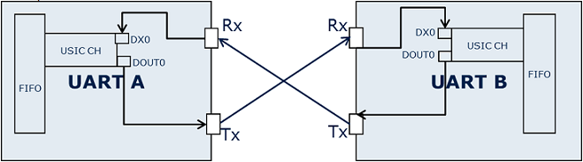
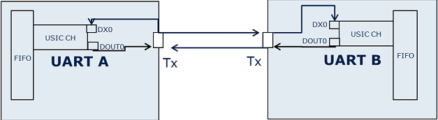
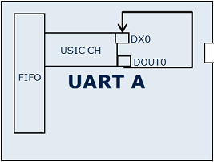
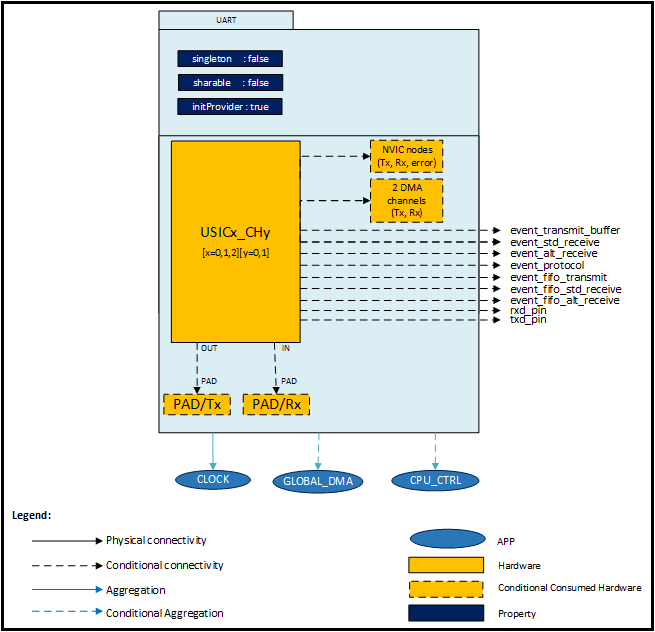
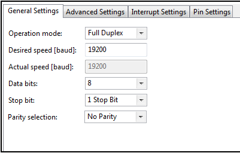
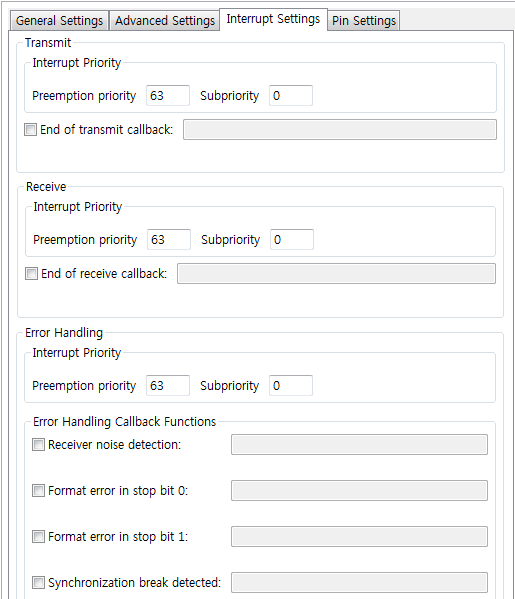
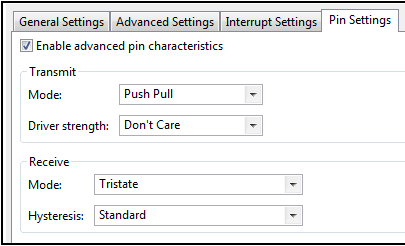

# UART

## 목적
* Universal Asynchronous Receiver/Transmitter 의 비동기 직렬 통신 방식을 이해하고 UART APP의 활용방법을 익힌다.

## 참고자료

* [XMC4500 Reference Manual v1.5 2014-04]
    - xmc4500_rm_v1.5_2014_04.pdf
* [XMC4500 Data Sheet v1.4 2016-01]
    - Infineon-XMC4500-DS-v01.04-EN.pdf
* [UART] (DAVE APP on-line help)

## 시작하며

## DAVE APP (UART)

### XMC4500 의 중요 특징

### 개략(Overview)
Universal Asynchronous Receiver/Transmitter는 비동기 시리얼 통신에 사용된다. UART APP은 XMC 마이크로컨트롤러에 있는 USIC 모듈을 비동기 시리얼 통신 모드로 사용하기 위한 설정을 한다.

UART APP은 USIC 모듈의 한 개 채널을 사용한다. APP UI를 통해 보드레이트, 데이터 길이, 정지 비트 개수, 패리티 관련 설정 등을 할 수 있다. UART APP은 설정한 보드레이트를 위해서 클럭 분주기, 카운터를 설정한다. 사용자는 수동적으로 송신(Tx)핀과 수신(Rx)핀을 선택 할 수 있으며 송수신 핀의 패드 설정도 할 수 있다.

UART APP은 설정과 데이터 교환을 위한 다양한 API를 제공하기 위한 코드파일을 생성한다. 이 APP은 데이터 송신, 수신, 상태 플래그 획득, 상태 플래그 클리어와 같은 API들을 제공한다. 데이터를 송수신 하는 API는 CPU사용을 최적화하기 위해 인터럽트를 사용하여 구현되어있다. 데이터를 송신하는 API를 사용할 때마다 데이터의 포인터, 데이터의 크기를 인자로 받고 송신 인터럽트를 트리거한다. 모든 데이터 송신 작업은 송신 인터럽트 서비스 루틴 내에서 이루어진다. 사용자는 콜백 함수를 사용하여 데이터 송신이 완료되면 알림을 받을지 설정 할 수 있다. 콜백 함수의 이름은 APP UI 내에서 지정 가능하다. 데이터 수신과 관련된 API또한 이와 비슷하게 구현되어 있다. 사용자가 지정한 크기의 데이터를 수신하면 콜백 함수가 실행된다. 콜백함수는 다른 프로토콜 이벤트 용으로도 사용 될 수도 있다. 예를들어, 수신 노이즈에서 에러가 발생하거나, 정지 비트 0번과 1번에서 포맷 에러가 발생, 동기화가 깨졌을 때 등 다양한 에러 상황에서 콜백 함수를 실행 시킬 수 있다. APP UI에서 해당 콜백 함수의 이름을 사용자가 지정 할 수 있다.

UART APP은 다음과 같은 모드를 사용 할 수 있다.

* Full Duplex : 송신과 수신을 동시에 할 수 있다. 이 모드에서 UART APP은 송신과 수신을 위해서 서로 다른 포트핀을 사용한다.



* Half Duplex : 한 개의 선을 사용하여 송신과 수신을 한다. 이 모드에서 UART APP은 송신과 수신을 위해 단일 포트핀을 사용한다.



* Loop Back : 이 모드에서는 USIC 채널에 할당 된 송신 블럭이 같은 채널 내부의 수신 블럭과 연결되어 있다. 전송 된 데이터는 마치 다른 장치에서 온 데이터처럼 수신된다. UART APP은 이 모드에서 포트핀을 사용하지 않는다.



### 아키텍쳐(Architecture)



위의 다이어그램은 UART APP 내부 소프트웨어 아키텍처를 나타낸 것이다. 각각의 UART APP 인스턴스는 USIC 모듈 한 개의 채널을 설정한다. 이 APP은 CLOCK APP을 필요로 하며 또한, 송신 모드 또는 수신 모드에 따라 CPU_CTRL APP이 필요하기도 하다.

UART APP 소프트웨어 아키텍처는 다음의 특징을 지닌다.

* 포트 패드는 Full Duplex와 Half Duplex 모드에서 사용된다.
* 송신과 수신 NVIC 노드는 UART 송신, 수신 때에 각각 인터럽트 모드에서 사용된다.
* 나머지 NVIC 노드는 프로토콜 에러 인터럽트로 사용된다.
* DMA 채널은 DMA를 사용하여 송신과 수신을 할 때 사용된다.
* UART APP은 CLOCK_XMC4 APP을 클럭 초기화 목적으로 사용한다.
* 송신 모드 또는 수신 모드가 인터럽트로 설정되어 있을 때, 이 APP이 사용하는 인터럽트의 우선순위 그룹 설정을 위해 CTRL_XMC4 APP을 사용한다.
* 송신 모드 또는 수신 모드가 DMA로 설정되어 있을 때, GLOBAL_DMA APP이 DMA 인터럽트 노드 설정을 위해 사용된다.
_* 만약 에러 콜백 체크박스가 선택되어 있지 않으면, event_protocol 신호가 보이게된다._
* 송신모드가 Direct이고 송신 FIFO가 비활성화 되어 있을 경우, event_transmit_buffer를 사용할 수 있다.
* 수신 모드가 Direct이고 수신 FIFO가 비활성화 되어 있을 경우, event_std_receive와 event_alt_receive를 사용할 수 있다.
* 각각의 FIFO가 활성화하고, 송수신이 Direct mode일 때 FIFO와 관련된 신호를 사용 할 수 있다.

### 설정(Configuration)


* Operation mode
    - Full Duplex : UART를 Full Duplex 모드로 사용한다.
    - Half Duplex : UART를 Half Duplex 모드로 사용한다.
    - Loop Back : UART를 Loop Back 모드로 사용한다.
* Desired speed[baud]
    - 사용자가 원하는 보드레이트를 지정 할 수 있다.
    - [200 ~ 7492675]
* Actual speed[baud]
    - 실제로 적용되는 보드레이트를 나타낸다.
    - [200 ~ 7492675]
* Data bits
    - UART로 송수신 할 데이터의 길이를 설정한다.
    - [5 6 7 8] 비트 중 선택 할 수 있다.
* Stop bit
    - 1 Stop Bit : UART 정지 비트의 개수를 1bit로 설정한다.
    - 2 Stop Bits : UART 정지 비트의 개수를 2bit로 설정한다.
* Parity selection
    - No Parity : 패러티 기능을 사용하지 않는다.
    - Even Parity : 데이터에서 logic 1의 개수가 짝수이면 데이터의 끝단에 logic 1인 비트가 한 개 추가된다.
    - Odd Parity : 데이터에서 logic 1의 개수가 홀수이면 데이터의 끝단에 logic 1인 비트가 한 개 추가된다.



* Transmit: Interrupt Priority
    - 송신 인터럽트의 우선순위를 설정 할 수 있다.
    - Priority의 값은 [0 ~ 63] 값 중에 선택 할 수 있다.
    - Subpriority의 값은 [0 ~ 0] 값 중에 선택 할 수 있다.
* Transmit: End of transmit callback
    - UART 모듈을 통한 송신 작업이 완료되면 인터럽트를 트리거한다.
* Receive: Interrupt Priority
    - 수신 인터럽트의 우선순위를 설정 할 수 있다.
    - Priority의 값은 [0 ~ 63] 값 중에 선택 할 수 있다.
    - Subpriority의 값은 [0 ~ 0] 값 중에 선택 할 수 있다.
* Receive: End of transmit callback
    - UART 모듈을 통한 수신 작업이 완료되면 인터럽트를 트리거한다.



* Enable advanced pin characteristics
    - Enable시, 송수신 핀 설정을 UI 설정에 맞춰서 설정한다
    - Disable시, 송수신 핀 설정을 기본 값으로 설정한다. 기본 값은 APP 설명을 참조
* Transmit: Mode
    - Push Pull: Push-pull 증폭단을 통하여 출력, 외부에 pull 디바이스 연결 없이 Low와 High를 구동할 수 있다.
    - Open drain: 외부에 Pull up 장치를 연결하여 사용, 외부 회로가 없는 상태에서는 Low 전압 구동만 가능하다.
* Transmit: Driver strength : 출력의 전기적인 특성 설정한다.(전력소모, 노이즈특성, 크로스토크 등등을 고려)
    - Don’t Care: 특별한 고려사항이 없는 경우
    - Weak Driver: Class A1 패드 사용
    - Medium Driver: Class A1 패드 사용
    - Strong Driver Soft Edge: Class A1+, A2 패드 사용
    - Strong Driver Slow Edge: Clss A1+, A2 패드 사용
    - Strong Driver Sharp Edge: Class A2 패드 사용
    - Strong Driver Medium Edge: Class A2 패드 사용
* Receive: Mode
    - Tristate: 내부적인 Pull 디바이스 장치와 연결하지 않음
    - Pull Up: 내부적인 Pull Up 디바이스 활성화
    - Pull Down: 내부적인 Pull Down 디바이스 활성화
    - Continuous Sammpling Mode: 내부적인 Pull 디바이스를 활성화 하지 않은 상태에서 핀의 출력값을 연속적으로 샘플링
    - Inverted Tristate: Tristate 와 동작은 같고, 입력값이 inverted 됨
    - Inverted Pull Up: Pull Up 과 동작은 같고, 입력값이 inverted 됨
    - Inverted Pull Down: Pull Down 과 동작은 같고, 입력값이 inverted 됨
    - Inverted Continuous Sampling Mode: Continuous Sampling Mode와 동작은 같고, 입력값이 inverted 됨

### 자료구조
UART 관련 정보를 관리하기 위하여 UART 구조체를 활용하여 UART_t 자료형을 사용하고 있다. UART 구조체에서는 UART 관련 채널정보를 담고 있는 자료형인 XMC_USIC_CH_t와 UART 설정 정보를 담고 있는 UART_CONFIG_t 자료형을 포함하고 있다. 또한 런타임 시 변경 될 수 있는 정보를 UART_RUNTIME_t 자료형을 사용하여 UART 구조체 내에서 관리하고 있다.

```
typedef struct UART
{
  XMC_USIC_CH_t * const channel;              /**< USIC channel*/
  const UART_CONFIG_t * const config;         /**< UART configuration structure pointer*/
  UART_RUNTIME_t * const runtime;             /**< Pointer to the structure holding all variables, that can change at runtime*/
} UART_t;

typedef struct XMC_USIC_CH
{
  __I  uint32_t  RESERVED0;
  __I  uint32_t  CCFG;			/**< Channel configuration register*/
  __I  uint32_t  RESERVED1;
  __IO uint32_t  KSCFG;			/**< Kernel state configuration register*/
  __IO uint32_t  FDR;			/**< Fractional divider configuration register*/
  __IO uint32_t  BRG;			/**< Baud rate generator register*/
  __IO uint32_t  INPR;			/**< Interrupt node pointer register*/
  __IO uint32_t  DXCR[6];		/**< Input control registers DX0 to DX5.*/
  __IO uint32_t  SCTR;			/**< Shift control register*/
  __IO uint32_t  TCSR;

  union {
    __IO uint32_t  PCR_IICMode;	/**< I2C protocol configuration register*/
    __IO uint32_t  PCR_IISMode; /**< I2S protocol configuration register*/
    __IO uint32_t  PCR_SSCMode;	/**< SPI protocol configuration register*/
    __IO uint32_t  PCR;			/**< Protocol configuration register*/
    __IO uint32_t  PCR_ASCMode;	/**< UART protocol configuration register*/
  };
  __IO uint32_t  CCR;			/**< Channel control register*/
  __IO uint32_t  CMTR;			/**< Capture mode timer register*/

  union {
    __IO uint32_t  PSR_IICMode;	/**< I2C protocol status register*/
    __IO uint32_t  PSR_IISMode;	/**< I2S protocol status register*/
    __IO uint32_t  PSR_SSCMode;	/**< SPI protocol status register*/
    __IO uint32_t  PSR;			/**< Protocol status register*/
    __IO uint32_t  PSR_ASCMode;	/**< UART protocol status register*/
  };
  __O  uint32_t  PSCR;			/**< Protocol status clear register*/
  __I  uint32_t  RBUFSR;		/**< Receive buffer status register*/
  __I  uint32_t  RBUF;			/**< Receive buffer register*/
  __I  uint32_t  RBUFD;			/**< Debug mode receive buffer register*/
  __I  uint32_t  RBUF0;			/**< Receive buffer 0*/
  __I  uint32_t  RBUF1;			/**< Receive buffer 1*/
  __I  uint32_t  RBUF01SR;		/**< Receive buffer status register*/
  __O  uint32_t  FMR;			/**< Flag modification register*/
  __I  uint32_t  RESERVED2[5];
  __IO uint32_t  TBUF[32];		/**< Tranmsit buffer registers*/
  __IO uint32_t  BYP;			/**< FIFO bypass register*/
  __IO uint32_t  BYPCR;			/**< FIFO bypass control register*/
  __IO uint32_t  TBCTR;			/**< Transmit FIFO control register*/
  __IO uint32_t  RBCTR;			/**< Receive FIFO control register*/
  __I  uint32_t  TRBPTR;		/**< Transmit/recive buffer pointer register*/
  __IO uint32_t  TRBSR;			/**< Transmit/receive buffer status register*/
  __O  uint32_t  TRBSCR;		/**< Transmit/receive buffer status clear register*/
  __I  uint32_t  OUTR;			/**< Receive FIFO output register*/
  __I  uint32_t  OUTDR;			/**< Receive FIFO debug output register*/
  __I  uint32_t  RESERVED3[23];
  __O  uint32_t  IN[32];		/**< Transmit FIFO input register*/
} XMC_USIC_CH_t;

typedef struct UART_CONFIG
{
  const XMC_UART_CH_CONFIG_t * const channel_config;   /**< Basic UART configuration from the GUI with baud,data bits,
                                                            frame length, stop bits and parity */
  const UART_DMA_CONFIG_t * const transmit_dma_config; /**< Pointer to the DMA channel configuration used for data transmission.*/
  const UART_DMA_CONFIG_t * const receive_dma_config;  /**< Pointer to the DMA channel configuration used for data reception.*/
  UART_init_handler fptr_uart_config;                  /**< Function pointer to configure the MUX values */
  UART_cbhandler tx_cbhandler;                         /**< Function pointer to hold the callback function pointer,
                                                            called when the transmission is complete */
  UART_cbhandler rx_cbhandler;                         /**< Function pointer to hold the callback function pointer,
                                                            called when the reception is complete */
  UART_cbhandler sync_error_cbhandler;                 /**< Function pointer to hold the callback function pointer,
                                                            called when synchronization break detected.*/
  UART_cbhandler rx_noise_error_cbhandler;             /**< Function pointer to hold the callback function pointer,
                                                            called when receiver noise is detected*/
  UART_cbhandler format_error_bit0_cbhandler;          /**< Function pointer to hold the callback function pointer,
                                                            called when format error with stop bit 0 is detected.*/
  UART_cbhandler format_error_bit1_cbhandler;          /**< Function pointer to hold the callback function pointer,
                                                            called when format error with stop bit 1 is detected.*/
  UART_cbhandler collision_error_cbhandler;            /**< Function pointer to hold the callback function pointer,
                                                            called when collision error is detected*/
  const UART_TX_CONFIG_t * tx_pin_config;              /**< Transmit pin configuration to be used during initialization
                                                            and while changing baudrate. */
  UART_MODE_t mode;                                    /**< UART operation mode */
  UART_TRANSFER_MODE_t transmit_mode;                  /**< Mode used for transmitting data. Data can be transmitted using
                                                            interrupt, DMA or direct(using polling or external APP connection.)*/
  UART_TRANSFER_MODE_t receive_mode;                   /**< Mode used for receiving data. Data can be received using
                                                            interrupt, DMA or direct(using polling or external APP connection.)*/
  XMC_USIC_CH_FIFO_SIZE_t tx_fifo_size;                /**< Transmit FIFO size configuration */
  XMC_USIC_CH_FIFO_SIZE_t rx_fifo_size;                /**< Receive FIFO size configuration */
  uint8_t tx_sr;                                       /**< Service request number assigned to transmit interrupt */
} UART_CONFIG_t;

typedef struct UART_RUNTIME
{
  uint8_t * tx_data;            /**< Pointer to the transmit data buffer*/
  uint8_t * rx_data;            /**< Pointer to the receive data buffer*/
  uint32_t tx_data_count;       /**< Number of bytes of data to be transmitted*/
  uint32_t tx_data_index;       /**< Index to the byte to be transmitted next in the tx_data buffer*/
  uint32_t rx_data_count;       /**< Number of bytes of data to be received*/
  uint32_t rx_data_index;       /**< Indicates the number of bytes currently available in the rx_data buffer*/
  volatile bool tx_busy;        /**< Status flag to indicate busy when a transmission is assigned*/
  volatile bool rx_busy;        /**< Status flag to indicate busy when a reception is assigned*/
} UART_RUNTIME_t;

```

UART 관련 동작을 프로그래밍 하기 위한 열겨형 자료형들은 다음과 같다.
```
typedef enum UART_STATUS
{
  UART_STATUS_SUCCESS,        /**< Indicates App initialization state successful */

  UART_STATUS_FAILURE,        /**< Unknown error */

  UART_STATUS_BUSY,           /**< UART Busy */

  UART_STATUS_BUFFER_INVALID, /**< Buffer provided or the buffer size is invalid*/

  UART_STATUS_MODE_MISMATCH   /**< API invoked by a handle configured with different mode.
                                   e.g, If UART_StartTransmitDMA is invoked for an instance
                                   which has transmit mode configured as "Interrupt", will
                                   return this status.*/

} UART_STATUS_t;

typedef enum XMC_CH_UART_EVENT
{
  XMC_UART_CH_EVENT_RECEIVE_START       = USIC_CH_CCR_RSIEN_Msk,  /**< Receive start event */
  XMC_UART_CH_EVENT_DATA_LOST           = USIC_CH_CCR_DLIEN_Msk,  /**< Data lost event */
  XMC_UART_CH_EVENT_TRANSMIT_SHIFT      = USIC_CH_CCR_TSIEN_Msk,  /**< Transmit shift event */
  XMC_UART_CH_EVENT_TRANSMIT_BUFFER     = USIC_CH_CCR_TBIEN_Msk,  /**< Transmit buffer event */
  XMC_UART_CH_EVENT_STANDARD_RECEIVE    = USIC_CH_CCR_RIEN_Msk,   /**< Receive event */
  XMC_UART_CH_EVENT_ALTERNATIVE_RECEIVE = USIC_CH_CCR_AIEN_Msk,   /**< Alternate receive event */
  XMC_UART_CH_EVENT_BAUD_RATE_GENERATOR = USIC_CH_CCR_BRGIEN_Msk, /**< Baudrate generator event */

  XMC_UART_CH_EVENT_SYNCHRONIZATION_BREAK = USIC_CH_PCR_ASCMode_SBIEN_Msk, /**< Event synchronization break */
  XMC_UART_CH_EVENT_COLLISION = USIC_CH_PCR_ASCMode_CDEN_Msk,              /**< Event collision */
  XMC_UART_CH_EVENT_RECEIVER_NOISE = USIC_CH_PCR_ASCMode_RNIEN_Msk,        /**< Event receiver noise */
  XMC_UART_CH_EVENT_FORMAT_ERROR = USIC_CH_PCR_ASCMode_FEIEN_Msk,          /**< Event format error */
  XMC_UART_CH_EVENT_FRAME_FINISHED = USIC_CH_PCR_ASCMode_FFIEN_Msk         /**< Event frame finished */
} XMC_UART_CH_EVENT_t;

typedef enum XMC_UART_CH_STATUS_FLAG
{
  XMC_UART_CH_STATUS_FLAG_TRANSMISSION_IDLE = USIC_CH_PSR_ASCMode_TXIDLE_Msk,                 /**< UART Protocol Status transmit IDLE*/
  XMC_UART_CH_STATUS_FLAG_RECEPTION_IDLE = USIC_CH_PSR_ASCMode_RXIDLE_Msk,                    /**< UART Protocol Status receive IDLE*/
  XMC_UART_CH_STATUS_FLAG_SYNCHRONIZATION_BREAK_DETECTED = USIC_CH_PSR_ASCMode_SBD_Msk,       /**< UART Protocol Status synchronization break detected*/
  XMC_UART_CH_STATUS_FLAG_COLLISION_DETECTED = USIC_CH_PSR_ASCMode_COL_Msk,                   /**< UART Protocol Status collision detected*/
  XMC_UART_CH_STATUS_FLAG_RECEIVER_NOISE_DETECTED = USIC_CH_PSR_ASCMode_RNS_Msk,              /**< UART Protocol Status receiver noise detected */
  XMC_UART_CH_STATUS_FLAG_FORMAT_ERROR_IN_STOP_BIT_0 = USIC_CH_PSR_ASCMode_FER0_Msk,          /**< UART Protocol Status format error in stop bit 0 */
  XMC_UART_CH_STATUS_FLAG_FORMAT_ERROR_IN_STOP_BIT_1 = USIC_CH_PSR_ASCMode_FER1_Msk,          /**< UART Protocol Status format error in stop bit 1 */
  XMC_UART_CH_STATUS_FLAG_RECEIVE_FRAME_FINISHED = USIC_CH_PSR_ASCMode_RFF_Msk,               /**< UART Protocol Status receive frame finished */
  XMC_UART_CH_STATUS_FLAG_TRANSMITTER_FRAME_FINISHED = USIC_CH_PSR_ASCMode_TFF_Msk,           /**< UART Protocol Status transmit frame finished */
  XMC_UART_CH_STATUS_FLAG_TRANSFER_STATUS_BUSY = USIC_CH_PSR_ASCMode_BUSY_Msk,                /**< UART Protocol Status transfer status busy */
  XMC_UART_CH_STATUS_FLAG_RECEIVER_START_INDICATION = USIC_CH_PSR_ASCMode_RSIF_Msk,           /**< UART Protocol Status receive start indication flag*/
  XMC_UART_CH_STATUS_FLAG_DATA_LOST_INDICATION = USIC_CH_PSR_ASCMode_DLIF_Msk,                /**< UART Protocol Status data lost indication flag*/
  XMC_UART_CH_STATUS_FLAG_TRANSMIT_SHIFT_INDICATION = USIC_CH_PSR_ASCMode_TSIF_Msk,           /**< UART Protocol Status transmit shift indication flag*/
  XMC_UART_CH_STATUS_FLAG_TRANSMIT_BUFFER_INDICATION = USIC_CH_PSR_ASCMode_TBIF_Msk,          /**< UART Protocol Status transmit buffer indication flag*/
  XMC_UART_CH_STATUS_FLAG_RECEIVE_INDICATION = USIC_CH_PSR_ASCMode_RIF_Msk,                   /**< UART Protocol Status receive indication flag*/
  XMC_UART_CH_STATUS_FLAG_ALTERNATIVE_RECEIVE_INDICATION = USIC_CH_PSR_ASCMode_AIF_Msk,       /**< UART Protocol Status alternative receive  indication flag*/
  XMC_UART_CH_STATUS_FLAG_BAUD_RATE_GENERATOR_INDICATION = USIC_CH_PSR_ASCMode_BRGIF_Msk      /**< UART Protocol Status baudrate generator indication flag*/
} XMC_UART_CH_STATUS_FLAG_t;
```

### 메쏘드(Method)
* UART APP을 초기화하고 보드레이트를 설정 할 수 있다.

  `UART_STATUS_t  UART_Init (const UART_t *const handle);`

  `UART_STATUS_t  UART_SetBaudrate (const UART_t *handle, uint32_t baud, uint32_t oversampling);`
    - baud : 새로운 보드레이트 값
    - oversampling : _각각의 심볼에 대한 샘플의 개수_. 16이 표준 값이다.

* 1 워드 씩 데이터를 송수신하거나, 다수의 워드를 한 번에 데이터를 송수신 할 수 있다.

  `__STATIC_INLINE void  UART_TransmitWord (const UART_t *const handle, uint8_t data);`
    - data : 전송 할 데이터

  `__STATIC_INLINE uint8_t  UART_GetReceivedWord (const UART_t *const handle);`

  `UART_STATUS_t  UART_Transmit (const UART_t *const handle, uint8_t *data_ptr, uint32_t count);`
    - data_ptr : 송신 할 데이터의 주소
    - count : 송신 할 데이터의 총 워드 개수

  `UART_STATUS_t  UART_Receive (const UART_t *const handle, uint8_t *data_ptr, uint32_t count);`
    - data_ptr : 수신 할 데이터의 주소
    - count : 수신 할 데이터의 총 워드 개수

* UART 모듈이 현재 송신 중인지 수신 중인지 상태를 확인 할 수 있으며, 송신 FIFO가 가득 찼는지 수신 FIFO가 비었는지 확인도 할 수 있다.

  `__STATIC_INLINE bool  UART_IsTxBusy (const UART_t *const handle);`

  `__STATIC_INLINE bool  UART_IsRxBusy (const UART_t *const handle);`

  `__STATIC_INLINE bool  UART_IsTXFIFOFull (const UART_t *const handle);`

  `__STATIC_INLINE bool  UART_IsRXFIFOEmpty (const UART_t *const handle);`

* 이벤트를 활성화/비활성화 할 수 있으며 또한, 이벤트 플래그 상태를 클리어 할 수 있다.

  `__STATIC_INLINE void  UART_EnableEvent (const UART_t *const handle, uint32_t events);`

  `__STATIC_INLINE void  UART_DisableEvent (const UART_t *const handle, uint32_t events);`
  - events : 프로토콜 이벤트. XMC_UART_CH_EVENT_t 열거형을 사용한다.

  `__STATIC_INLINE uint32_t  UART_GetFlagStatus (const UART_t *const handle, uint32_t protocol_status);`

  `__STATIC_INLINE void  UART_ClearFlag (const UART_t *const handle, const uint32_t protocol_status);`
  - protocol_status : 상태를 읽을 이벤트를 선택한다. XMC_UART_CH_STATUS_FLAG_t 열거형을 사용한다.

### 사용예

## 실습프로젝트

## 요약
