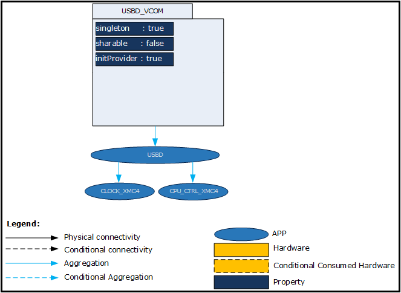
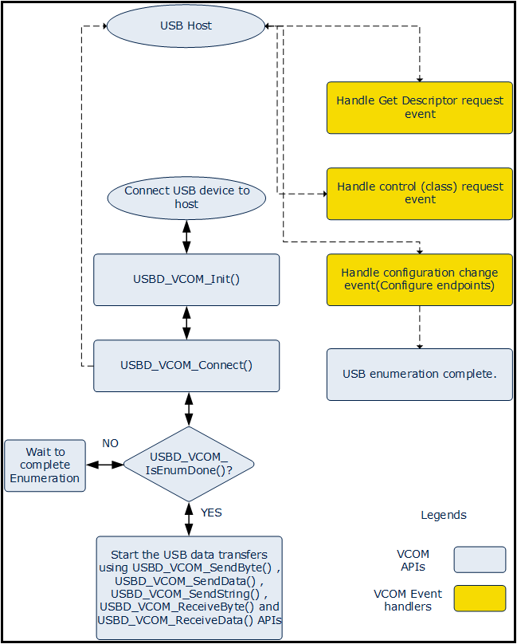

# USBD VCOM

## 목적
* 직렬통신 방식인 USB에 대하여 이해하고 USBD_VCOM APP의 활용방법을 익힌다.

## 참고자료

* [XMC4500 Reference Manual v1.5 2014-04]
    - xmc4500_rm_v1.5_2014_04.pdf
* [XMC4500 Data Sheet v1.4 2016-01]
    - Infineon-XMC4500-DS-v01.04-EN.pdf
* [USBD_VCOM] (DAVE APP on-line help)

## 시작하며

## DAVE APP (USBD_VCOM)

### XMC4500 의 중요 특징

### 개략(Overview)
USBD_VCOM APP은 USB 가상 컴포트 드라이버이다. 이 APP은 USB를 통해 컴포트와 인터페이스한다. 이 모듈은 USB CDC-ACM 클래스 가상 시리얼 포트가 내부적으로 구현되어 있다. 로우레벨 LUFA API를 사용하여 CDC 클래스를 수동적으로 구현하지 않고 사용자 어플리케이션에서 클래스 드라이버를 사용할 수 있다.

USBD_VCOM APP은 USBD APP을 필요로하며 다음의 절차에 따라 사용된다.

1. USB 연결, 연결해제, _디스크립터 얻기_, 설정, 요청 신호 제어와 이벤트 리셋을 위한 USB 이벤트 콜백을 등록한다.
2. USB 디바이스 드라이버를 초기화한다.
3. USB 디바이스와 호스트 PC를 연결한다.
4. VCOM USB 호스트와 통신하기위해 USB _앤드포인트_ 를 설정한다.
5. 호스트로부터 받은 클래스/벤더 관련 요청 작업을 한다.
6. USB CDC 디바이스 상태를 확인한다.
7. USB 호스트와 데이터를 송수신한다.

USBD_VCOM APP은 XMC4000과 VCOM 호스트 드라이버 간의 일반적인 USB 인터페이스가 될 수 있다. _사용자는 XMC4000과 통신하기 위해서 윈도우에 USB 호스트 클래스/기능 드라이버를 사용 할 필요가 없다._ 일단 USBD_VCOM 장치가 윈도우 USB 호스트와 연결되면, 'usbser.sys' 드라이버가 자동으로 설치된다.(처음 사용 시 infineon VCOM 드라이버 파일을 지정해야 한다.)

USBD_VCOM APP은 데이터 전송을 위해서 DMA 모드 또는 FIFO 모드를 사용할 수 있다. 이러한 설정은 USBD APP UI에서 할 수 있다.

USBD_VCOM APP은 USB 로우레벨 드라이버와 통신하고 USB 컨트롤러를 초기화하기위해 USBD(USB 프로토콜 계층) APP을 사용한다.

### 아키텍쳐(Architecture)

위의 그림은 USBD_VCOM APP 내부 소프트웨어 아키텍처를 나타낸 것이다. 이 APP은 XMC_USBD LLD를 통해 USB0와 인터페이스하기 위해 USBD APP을 사용한다. USBD APP은 USB 인터럽트, 클럭 설정과 기능을 위해서 CPU_CTRL_XMC4와 CLOCK_XMC4 APP을 사용한다.

* Functional Flow

아래 그림은 USBD_VCOM APP 기능의 플로우 다이어그램을 나타낸다.

USBD_VCOM_Init() 메쏘드는 USBD APP에 USB 이벤트를 등록하고, USB 호스트와 연결을 위한 디바이스 준비상태로 만들기 위해서 USB 디바이스 핵심 계층을 초기화한다.
USBD_VCOM_Connect() 메쏘드는 VCOM 디바이스와 USB CDC 호스트와 연결한다. 이는 Enumeration process를 트리거한다. USB 호스트가 표준 및 클래스 요청을 시작한다. USBD_VCOM APP은 다음의 요청을 처리한다.

* 디바이스 디스크립터, 설정 디스크립터, 문자열 디스크립터를 위한 디스크립터 요청을 가져온다.
* CDC 클래스 관련 요청을 처리한다.
* 설정 요청들을 처리한다. 이러한 요청을 받으면 XMC 디바이스 앤드포인트를 설정한다.
  일단 디바이스가 앤드포인트를 설정하고 USB 호스트에게 상태를 리턴하면, Enumeration process가 완료된다. 사용자는 데이터를 송수신하기 전에 USBD_VCOM_IsEnumDone() 메쏘드를 사용하여 Enumeration process가 완료 되었는지 확인한다.

### 메쏘드(Method)

* 디바이스를 USB 호스트와 연결을 위한 준비상태로 만들기 위해 USB 핵심 레이어를 초기화 할 수 있다.

  `USBD_VCOM_STATUS_t  USBD_VCOM_Init (USBD_VCOM_t *vcom_handle);`

* XMC USB VCOM 디바이스와 USB 호스트와 연결하거나 연결을 해제 할 수 있다.

`USBD_VCOM_STATUS_t  USBD_VCOM_Connect (void);`

`USBD_VCOM_STATUS_t  USBD_VCOM_Disconnect (void);`

* Enumeration process 작업이 완료되었는지 상태를 확인할 수 있다.

`uint32_t  USBD_VCOM_IsEnumDone (void);`

* USB 호스트로부터 수신한 데이터의 크기를 바이트 단위로 알 수 있다.

`uint16_t  USBD_VCOM_BytesReceived (void);`

* USB 호스트로 1바이트 데이터를 송신하거나 수신 할 수 있다.

`USBD_VCOM_STATUS_t  USBD_VCOM_SendByte (const uint8_t data_byte);`

`USBD_VCOM_STATUS_t  USBD_VCOM_ReceiveByte (int8_t *data_byte);`

* 주어진 CDC 클래스 인터페이스 관리 태스크를 빈번하게 호출해야 한다.

`void CDC_Device_USBTask  ( USB_ClassInfo_CDC_Device_t *const  CDCInterfaceInfo );`

### 사용예

## 실습프로젝트

* ​

## 요약
