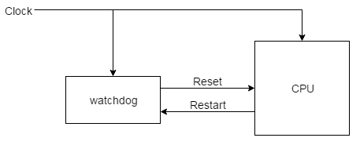
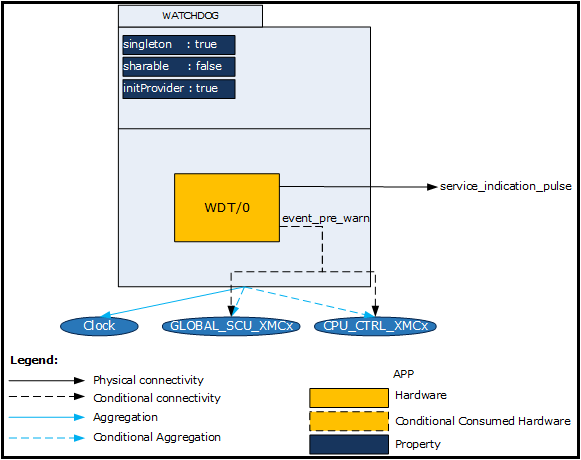
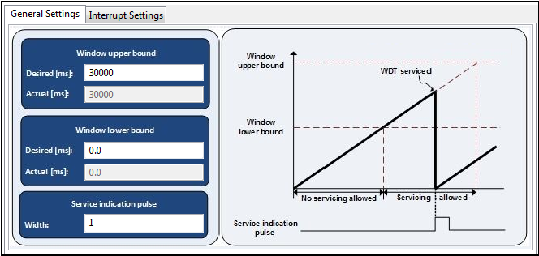
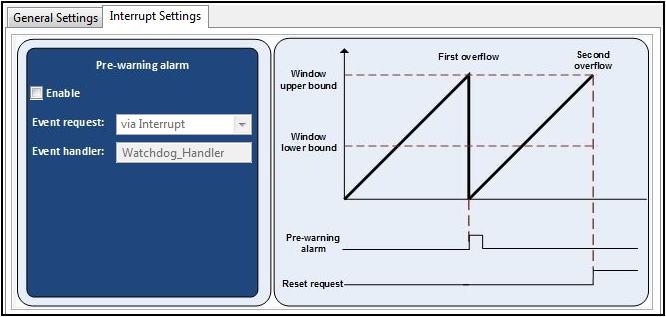

# Watchdog

## 목적
* 오류발생 복구 방법으로 기본적으로 사용하는 watchdog 의 개념을 이해하고 DAVE App의 구성을 이해한다.

## 참고자료

* [XMC4500 Reference Manual v1.5 2014-04]
    - xmc4500_rm_v1.5_2014_04.pdf
* [XMC4500 Data Sheet v1.4 2016-01]
    - Infineon-XMC4500-DS-v01.04-EN.pdf
* [WATCHDOG] (DAVE APP on-line help)

## Watchdog 이란

Watchdog 타이머 (혹은 Computer Operting Properly:COP 타이머, 또는 줄여서 watchdog 이라고도 함)는 컴퓨터 오작동을 감지하고 복구하는 데 사용되는 타이머이다. 정상 작동 중에는 컴퓨터가 정기적으로 watchdog 타이머를 리셋하여 경과 시간이 지나지 않게, 즉 "시간 초과(time out)"하지 않게 하여야 한다. 하드웨어 오류 또는 프로그램 오류로 인해 컴퓨터가 watchdog을 재설정하지 못하면 타이머가 경과되고 시간 초과 신호가 생성된다. time-out 신호의 발생은 컴퓨터의 루프가 정상적으로 동작하고 있지 못함을 나타는 신호라고 할 수 있고, 이 신호가 발생한다면 오류상황에 대한 시정 조치가 취해져야 한다. 시정 조치에는 일반적으로 컴퓨터 시스템을 안전한 상태로두고 정상적인 시스템 작동을 복원하는 것 등이다.

watchdog 타이머는 일반적으로 임베디드 시스템 및 기타 컴퓨터 제어 장비에서 찾아 볼 수 있다. watchdog를 사용하여 사람이 장비에 쉽게 액세스 할 수 없거나 적시에 결함에 대응할 수 없는 경우에 효과적으로 활용할 수 있다. 그런 시스템에서는 컴퓨터가 멈추면 재부팅 할 수 없다. 예를 들어, 우주 탐사선과 같은 원격 임베디드 시스템은 인간 조작자가 물리적으로 접근 할 수 없다. 장애로부터 자율적으로 복구 할 수없는 경우 잘못하면 이 시스템을 영구적으로 사용할 수 없게 될 수 있다. watchdog 타이머는 일반적으로 이와 같은 경우에 사용된다.

워치 독 타이머를 다시 시작하는 행위는 일반적으로 "개 걷어차기, Kicking the dog"또는 다른 유사한 용어로 부른다. 일반적으로는 watchdog 제어 포트의 특정값을 쓰는 것이다.또는 통합 워치 독 타이머가있는 마이크로 컨트롤러에서 특별한 기계 언어 명령어를 실행하여 워치 독을 실행할 수도 있다. 

운영 체제를 사용하는 컴퓨터에서는 이와 같은 저수준의 동작을 장치 드라이버를 호출하는 방식으로 하게된다. 예를 들어 Linux 운영 체제에서 사용자 프로그램은 일반적으로 / dev / watchdog에 0 문자를 쓰는 방식으로 watchdog 장치 드라이버와 상호 작용하여 watchdog을 강제 종료하게 된다.

### 임베디드 시스템에서 watchdog

watch 타이머는 소프트웨어 이상을 자동으로 감지하고 프로세서가 리셋되면 자동으로 재설정하는 데 사용할 수있는 하드웨어이다. 일반적으로 watchdog 타이머는 초기 값에서 0으로 카운트 다운하는 카운터를 기반으로한다. 임베디드 소프트웨어는 카운터의 초기 값을 선택하고 주기적으로이를 다시 시작한다. 소프트웨어가 소프트웨어를 재시작하기 전에 카운터가 영 (0)에 도달하면 소프트웨어는 오작동하는 것으로 추측되며 프로세서의 리셋 신호가 assertion 된다. 휴먼 오퍼레이터가 전원을 다시 껐다가 키는 것처럼 프로세서 (및 실행중인 소프트웨어)가 다시 시작된다.

그림은 일반적인 watchdog 의 활용 구조이다. 도시 된 바와 같이, watchdog 타이머는 프로세서 외부의 칩이다. 그러나 CPU와 동일한 칩에 포함될 수도 있다. 두 경우 모두 워치 독 타이머의 출력은 프로세서의 리셋 신호에 직접 연결된다.



### "개 걷어차기, Kicking the dog"
watchdog 타이머 카운터를 다시 시작하는 과정을 때때로 "개 걷어차기"라고 한다. 이것은 사나운 개가 사람과 대치하고 있는 상황을 상상해 보면 된다. 사람이 개가 무섭거나 귀챦다고 방치하고 있는 상태가 되면 일정 시간이 지난 후에 그 개는 사람을 가볍게 보고 달려들어 물게 된다. 그러나 계속 긴장하고 있는 상태에서 그 개를 주기적으로 걷어차 주면 그 개는 사람에게 순응적으로 길들여 지게 된다. 사람(소프트웨어)이 정신을 바짝 차린상태에서 주기적으로 watchdog를 걷어차(reset watchdog) 주어야 한다. 만약 한동안 그 watchdog를 걷어차 주지 않으면(time-out) 그 개가 사람을 공격하여 달려든다(system reset).

다음은 간단한 예제코드 이다. 여기에는 시스템의 전체 동작을 제어하는 무한 루프가 하나있다. main () + ISR이라고하는이 소프트웨어 아키텍처는 단일 임베디드 시스템을 기반으로하는 저렴한 마이크로 컨트롤러 및 동작을 사용하는 많은 임베디드 시스템의 구조이다. 이 watchdog의 하드웨어 구현은 카운터 값이 메모리 매핑 I/O로 액세스 할 수있는 제어 레지스터를 통해 설정할 수 있는 예이다.
만약 for 루프의 실행시간이 최대 5msec 이내이고, 5msec에 해당하는 watchdog 카운터의 값이 10000 이라고 가정해 보자. 만약 이 프로그램이 정상적으로 동작한다면 5msec 이내에, 즉 watchdog 카운터의 값이 감소해서 0이 되기 이전에 항상 10000 의 값으로 새롭게 갱신될 것이다. 만약 반대로 프로그램의 동작에 문제가 있어서 실행시간이 5msec 이상이 된다면 watchdog 의 값을 갱신하기 전에 0이 되어서 watchdog 이벤트를 발생하게 된다. watchdog 이벤트 핸들러에서는 이러한 상황에 대한 대응 방안이 프로그래밍 되어 있어야 한다.

```
uint16_t volatile * pWatchdog = (uint16_t volatile *) 0xFFFF00;

main(void)
{
    hwinit();

    for (;;)
    {
        *pWatchdog = 10000;
        read_sensors();
        calc_control_algorithm();
        write_actuator();
    }
}
```

### 검출할 수 있는 잠재적인 오류 상황들

watchdog 타이머는 많은 위험한 상황에서 시스템을 복구 시키는 용도로 사용할 수 있다. 효과적으로 watchdog를 사용하고자 한다면 전체적인 소프트웨어의 실행 루프 내에서 동작하도록 하여야 한다. 소프트웨어 설계자는 잠정적으로 발생할 수 있는 오동작에 대한 시나리오를 가지고 이것에 대응하는 방식으로 watchdog 타이머를 사용하여야 한다.

시스템은 여러가지 이유로 정지하게 된다. 대표적으로 흔히 말하는 무한루프에 빠지게 되는 것이 가장 간단한 예이다. 이런 상황이 위의 코드에서 read_sensors() 함수 호출에서 발생했다고 가정해 보자. 인터럽트와 연관된 부분은 for 루프와 관계없이 동작하게 되겠지만, calc_control_algorithm(), write_actuator() 함수등은 다시 실행될 수 없는 상황이 되는 것이다.

또다른 가능성은 루프가 수행되는 동안 예상치 못했던 다수개의 인터럽트가 발생하여 루프의 수행시간을 지연시키는 것이다. 인터럽트 서비스 루틴들은 일반 함수 보다 우선순위가 높으므로 다수의 인터럽트가 발생하게 된다면 루프의 수행이 지연되어 경우에 따라 시간초과 상황이 되는 것이다.

멀티 태스킹 커널을 사용할 때 교착 상태(deadlock)가 발생할 수 있다. 보다 상세한 내용은 실시간운영제계를 참고하도록 하자

이러한 오류가 일시적인 경우에는 watchdog이 시스템을 재설정 하게 되면 이전과 같이 정상적인 상태로 완벽하게 복귀할 수 있다. 그러나 하드웨어 고장으로 인한 watchdog 상황이라면 시스템이 계속 리셋 될 수 있다. 이러한 이유 때문에 watchdog에 의한 재설정 횟수를 세는 것이 현명 할 수 있으며 일정한 실패 횟수 후에 시도를 포기하는 것이 좋다.

### 마이크로컨트롤러 적용시 고려사항들

watchdog를 가지고 있는 마이크로컨트롤러라도 기본값(default)로 watchdog 는 비활성화 되어 있다. watchdog를 활용하려면 하드웨어 초기화 단계에서 반드시 활성화 해주어야 한다. 그리고 대부분의 경우에는 일단 watchdog 가 활성화 되면 소프트웨어적으로 비활성화 할 수 없도록 되어 있다. 이것은 소프트웨어의 오류로 인하여 watchdog가 비활성화 되어 기능을 수행할 수 없도록 되는 것을 방지하기 위한 것이다.

watchdog는 시스템의 초기화단계와 같이 정상적인 동작이지만 오랜 시간이 걸리는 경우에는 사용하면 안된다. 시간이 오래 걸리는 서비스등, 메모리 검사, 큰 자료의 복사 등과 같이 오랜 시간동안 중단 없이 동작하는 경우에는 watchdog 서비스를 비활성화 시켜야 한다. 이와 같은 과도상태가 지난 후 예측가능하고 반복적인 동작을 수행해야 하는 때가 되었을 때 watchdog 를 활성화 시켜야 한다.

watchdog 서비스는 시스템이 불안한 개발초기에는 일반적으로 비활성화 한 상태로 사용한다. 개발초기에는 하드웨어적으로 예상치 못한 인터럽트 등의 예외 상황들이 발생할 수도 있고, 소프트웨어 또한 상당히 불안한 상태이다. 이 경우에는 어느 원인에 의해서 무한루프가 발생되고, 인터럽트가 발생되었는지를 찾는 것이 우선적으로 중요한 때이다. 설계에 따라 각 기능들이 모두 다 구현된 후, 시스템의 안정성을 더욱 높이기 위하여 watchdog 를 활성화하는 것이 바람직하다.

## DAVE APP (WATCHDOG)

WATCHDOG APP은 시스템이 정지 또는 교착상태라서 시스템이 응답하지 않을 때, 시스템을 정상화하는 역할을 한다. 이 APP은 다음의 기능을 제공한다.

* 와치독 서비스 윈도우 범위를 설정할 수 있다.
* 윈도우 주기 내에서 와치독 서비스가 실패 했을 때, 사전 위험 알람 이벤트를 만들 수 있다.
* 위험 알람 이벤트로 NMI를 트리거 할 수 있다.
* 서비스 알림 펄스 신호의 펄스폭을 조정 할 수 있다.

### 아키텍쳐(Architecture)



위 그림은 WATCHDOG APP의 내부 소프트웨어 아키텍처를 표현한 것이다. WATCHDOG APP은 MCU 내부의 와치독 모듈을 설정한다. 게다가, 이 앱을 사용하기 위해서는 CLOCK APP을 필요로한다.

* Signals

| Signal Name              | Input/Output | Availability | Description      |
|--------------------------|--------------|--------------|------------------|
| service_indication_pulse | output       | Always       | 서비스 알림 신호 |

* APPS consumed

| APP name        | Consumption         | Description                                           |
|-----------------|---------------------|-------------------------------------------------------|
| CLOCK_XMC4      | Always              | 클럭 설정을 초기화한다.                               |
| GLOBAL_SCU_XMC4 | SCU 인터럽트 사용시 | 콜백함수를 설정하고 위험 알람신호 이벤트 때 실행한다. |
| CPU_CTRL_XMC4   | NMI 인터럽트 사용시 | 사전 위험 알림신호 이벤트 시 NMI 핸들러를 실행한다.   |

### 설정(Configuration)



* Window upper bound: Desired[ms]
    - 와치독 윈도우의 최대값
    - [0 ~ 178956.97]
* Window upper bound: Actual[ms]
    - 실제로 적용 된 윈도우 상한 범위
    - [0 ~ 178956.97]
* Window lower bound: Desired[ms]
    - 와치독 윈도우의 최소값
    - [0 ~ 178956.97]
* Window lower bound: Actual[ms]
    - 실제로 적용된 윈도우 하한 범위
    - [0 ~ 178956.97]
* Service indication pulse: Width
    - 서비스 알림 펄스 신호의 펄스 개수 설정
    - [1 ~ 256]



* Pre-warning alarm: Enable
    - Enable시, 상한 범위 값을 처음 지날 때 알람 신호를 트리거한다.
* Pre-warning alarm: Event request
    - Via Interrupt : 이벤트로 인터럽트를 트리거한다.
    - Via NMI : 이벤트로 NMI를 트리거한다.
* Pre-warning alarm: Event handler
    - 인터럽트 핸들러의 이름을 설정 할 수 있다. 단, NMI는 NMI_Handler() 루틴을 써야한다.

### 자료구조
WATCHDOG APP관련 설정 정보를 관리하기 위하여 WATCHDOG 구조체를 활용하여 WATCHDOG_t 자료형을 사용하고 있다. WATCHDOG_t 자료형은 와치독의 윈도우 상한 범위, 하한 범위 등의 설정정보를 관리하기 위해 XMC_WDT_CONFIG_t 자료형을 포함하고 있다.

```c
typedef struct WATCHDOG
{
  const XMC_WDT_CONFIG_t* const config; /**< Configuration of WDT */
  GLOBAL_SCU_XMC4_t* const scu_global_handler; /**< pointer to SCU_GLOBAL APP instance*/
  GLOBAL_SCU_XMC4_EVENT_HANDLER_t callback_func_ptr; /**< Callback function pointer */
  bool  initialized; /**< Holds the initialization status */
} WATCHDOG_t;

typedef struct XMC_WDT_CONFIG
{
  uint32_t window_upper_bound; /**< Upper bound for service window (WUB). Reset request is generated up on overflow of
                                    timer. ALways upper bound value has to be more than lower bound value. If it is set
                                    lower than WLB, triggers a system reset after timer crossed upper bound value.\n
                                    Range: [0H to FFFFFFFFH] */
  uint32_t window_lower_bound; /**< Lower bound for servicing window (WLB). Setting the lower bound to 0H disables the
                                    window mechanism.\n
                                    Range: [0H to FFFFFFFFH] */
  union
  {
    struct
    {
      uint32_t : 1;
      uint32_t prewarn_mode : 1;        /**< Pre-warning mode (PRE). This accepts boolean values as input. */
      uint32_t : 2;
      uint32_t run_in_debug_mode : 1;   /**< Watchdog timer behaviour during debug (DSP). This accepts boolean values as input. */
      uint32_t : 3;
      uint32_t service_pulse_width : 8; /**< Service Indication Pulse Width (SPW). Generated Pulse width is of (SPW+1),
                                             in fwdt cycles.\n
                                             Range: [0H to FFH] */
      uint32_t : 16;
    };
    uint32_t wdt_ctr; /* Value of operation mode control register (CTR). It’s bit fields are represented by above
                           union members. */
  };
} XMC_WDT_CONFIG_t;
```
와치독 관련 동작을 프로그래밍 하기 위한 열거형 자료형들은 다음과 같다.

```c
typedef enum WATCHDOG_EVENT_MODE
{
    WATCHDOG_EVENT_MODE_INTERRUPT   = 0U, /**< Regular Interrupt */
    WATCHDOG_EVENT_MODE_NMI_REQUEST = 1U /**< Promoted to NMI */
} WATCHDOG_EVENT_MODE_t;

/**
 *  @brief Initialization status.
 */
typedef enum WATCHDOG_STATUS
{
  WATCHDOG_STATUS_SUCCESS = 0U, /**< Status success */
  WATCHDOG_STATUS_FAILURE, /**< Status failure */
} WATCHDOG_STATUS_t;
```

### 메쏘드(Method)

* WATCHDOG APP을 초기화, 와치독을 시작/정지 할 수 있다.

`WATCHDOG_STATUS_t  WATCHDOG_Init (WATCHDOG_t *handle);`

`__STATIC_INLINE void  WATCHDOG_Start (void);`

`__STATIC_INLINE void  WATCHDOG_Stop (void);`

* 와치독을 서비스 할 수 있다.

`__STATIC_INLINE void  WATCHDOG_Service (void);`

* 와치독의 카운터 값을 읽을 수 있다.

`__STATIC_INLINE uint32_t  WATCHDOG_GetCounter (void);`

* 와치독 알람 이벤트 플래그를 클리어 할 수 있다.

`__STATIC_INLINE void  WATCHDOG_ClearAlarm (void);`

### 사용예

## 실습프로젝트

* Lab Watchdog

## 요약
